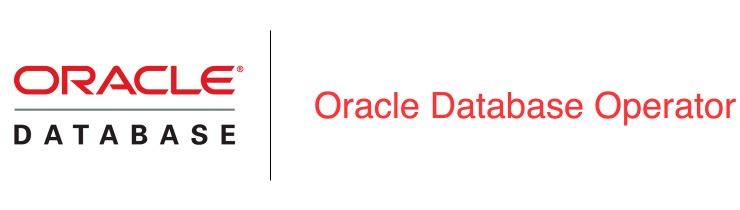

> # ⚠️ **Development Branch** ⚠️
>
> This branch contains active development for the following controllers:
>
> * **OrdsSrvs**
> * **Observability**
> * **Multitenant**
>
> **Not for production use.**
>
> * [OrdsSrvs Controller](./docs/ordsservices/README.md)
> * [Observability Controller](./docs/observability/README.md)
> * [Multitenant Controller](./docs/multitenant/README.md)


<div align="center">
<h1 align="center">
  <br>
  
</h1>
</div>

<div align="center">
<p align="center">
    <a href="https://github.com/oracle/oracle-database-operator">
    
    </a>
    <a href="https://www.oracle.com/database/kubernetes-for-container-database">
    
    </a>
</p>
</div>

<div align="center">
<p align="center">
    <a href="https://github.com/oracle/oracle-database-operator/commits/main/">
    
    </a>
    <a href="https://github.com/oracle/oracle-database-operator/issues">
    
    </a>
    <a href="https://github.com/oracle/oracle-database-operator/pulls">
    
    </a>
</p>
</div>

# Oracle Database Operator for Kubernetes

The Oracle Database Operator extends the Kubernetes API by introducing custom resources and controllers that enable the provisioning, management, and lifecycle automation of Oracle Database workloads and associated services on Kubernetes.

It simplifies database operations by leveraging Kubernetes-native constructs, allowing teams to manage Oracle databases using declarative configurations and standard tooling. This approach improves consistency, scalability, and operational efficiency across environments.

Use this repository to install and validate the operator, ensure it is running correctly, and then navigate to the relevant guides for managing specific controllers or database workloads. It also provides examples, configuration references, and best practices to help you get started quickly and operate reliably in production environments.

## Contents

- [What's New](#whats-new)
- [Platform Compatibility](#platform-compatibility)
- [Prerequisites](#prerequisites)
- [Quick Start](#quick-start)
- [Install the Operator](#install-the-operator)
- [Verify Installation](#verify-installation)
- [Choose Your Guide](#choose-your-guide)
- [Uninstall the Operator](#uninstall-the-operator)
- [Contributing](#contributing)
- [Help](#help)
- [Security](#security)
- [Troubleshooting](#troubleshooting)
- [License](#license)

## What's New

### v2.2.0

Version 2.2 introduces expanded database lifecycle automation, stronger reconciliation, new networking capabilities, and improved operator security and observability.

| Controller / area | Highlights |
| --- | --- |
| **AutonomousDatabase** | • OCI lifecycle reconciliation, finalizers, wallet validation and rotation<br>• Backup-resource synchronization and cleanup |
| **AutonomousContainerDatabase** | • OCI lifecycle-state validation and finalizer-based cleanup<br>• Kubernetes-to-OCI state synchronization |
| **AutonomousDatabaseBackup / Restore** | • Target validation and owner references<br>• Point-in-time restore and OCI work-request integration |
| **Multitenant controllers (LREST / LRPDB)** | • Internal comunication protocol improvement and cofiguration simplification - No need to specify https password <br>  • Creating application users on pdb using k8s secrets  <br> • Monitor pdb init parameters with reconciliation loop <br>  • Code optimization  <br> • Reset bitmask status simplification <br> • Load tnsname.ora topology |
| **OracleRestart** | • Phased reconciliation for validation, storage, workload, and finalization<br>• ASM disk lifecycle with static/dynamic PV/PVC handling |
| **ORDS Services (OrdsSrvs)** | • HTTP-only edge deployments, HTTP access-log forwarding/persistence, and Instance API bootstrap<br>• Configurable resource limits, metadata, and JVM options |
| **RacDatabase** | • Expanded RAC and ASM storage lifecycle<br>• Disk/PVC provisioning, and validation |
| **ShardingDatabase** | • Oracle GDD topology lifecycle and scaling<br>• Catalog/shard management, and status validation |
| **SingleInstanceDatabase** | • Service endpoints, TCPS, TrueCache, Data Guard prerequisites, clone/restore, and external PVCs<br>• Improved pod security, resource handling, recreation checks, and connection status |
| **DataguardBroker** | • Topology runtime, authentication wallets, validation/provisioning, FSFO observer management, and operation tracking<br>• Idempotent manual switchover support |
| **DatabaseObserver** | • Safer child-resource ownership and Server-Side Apply<br>• Improved deployment readiness and status handling |
| **PrivateAI** | • Phased dependency/workload reconciliation and update-lock status<br>• TLS secret lifecycle, support for vLLM and GPU, and rollout tracking |
| **TrafficManager** *(new)* *(preview mode)*| • Oracle Connection Manager (CMAN) endpoints<br>• generated rules, `cman.ora` file mode, and endpoint status |
| **Operator platform** | • New `network.oracle.com/v4` API and TrafficManager CRD<br>• Secure HTTPS metrics, hardened manager security context, expanded RBAC/webhooks, compatibility webhooks, network policy, samples, and test coverage |

## Platform Compatibility

This production release has been installed and tested on the following platforms:

| Platform | Version |
| --- | --- |
| [Oracle Container Engine for Kubernetes (OKE)](https://www.oracle.com/cloud-native/container-engine-kubernetes/) | Kubernetes 1.33 or later |
| [Red Hat OpenShift](https://www.redhat.com/en/technologies/cloud-computing/openshift) | 4.19 or later |
| [Oracle Linux Cloud Native Environment (OLCNE)](https://docs.oracle.com/en/operating-systems/olcne/) | 1.9 or later |
| [Google Kubernetes Engine](https://cloud.google.com/kubernetes-engine/docs) | Supported |
| [Azure Kubernetes Service](https://azure.microsoft.com/en-us/services/kubernetes-service/) | Supported |
| [Amazon Elastic Kubernetes Service](https://aws.amazon.com/eks/) | Supported |
| [Red Hat OKD](https://www.okd.io/) | Supported |
| [Minikube](https://minikube.sigs.k8s.io/docs/) | 1.29.0 or later |

## Prerequisites

Oracle strongly recommends reviewing [PREREQUISITES.md](./PREREQUISITES.md) before installation.

### Install cert-manager

The operator uses webhooks for validating user input before persisting it in `etcd`. Webhooks require TLS certificates that are generated and managed by a certificate manager.

> **OCNE note:** Before installing cert-manager on an OCNE cluster, review the [cert-manager supported releases](https://cert-manager.io/docs/releases/) and choose a cert-manager version that supports the Kubernetes version provided by your OCNE release. OCNE 1.9 uses Kubernetes 1.29, so replace the cert-manager version in the example below with a Kubernetes 1.29-compatible release.

```sh
kubectl apply -f https://github.com/cert-manager/cert-manager/releases/download/v1.20.2/cert-manager.yaml
```

### Choose Deployment Scope

The operator supports two deployment models. In both models, apply the base RBAC manifest first so the operator namespace, service account, and packaged manager roles exist before the controller starts. Choose how much namespace access the operator should have:

- `Cluster-scoped`: the operator watches all namespaces in the cluster. Use this when the operator should manage database resources across the cluster.
- `Namespace-scoped`: the operator watches only selected namespaces. Use this when you want tighter access boundaries.

#### Cluster-scoped deployment

Grant cluster-wide access by binding the operator service account to the packaged manager `ClusterRole`:

```sh
kubectl apply -f rbac/cluster-role-binding.yaml
```

#### Namespace-scoped deployment

For namespace-scoped deployment, generate the operator manifests from a single namespace list. The generated system manifest sets `WATCH_NAMESPACE`, and the generated RBAC manifest adds one manager `RoleBinding` for each watched namespace.

Example:

```sh
scripts/generate-namespace-install.sh oracle-database-operator-system,shns
```

Then apply the generated manifests:

```sh
kubectl apply -f dist/install/oracle-database-operator-rbac.yaml
kubectl apply -f dist/install/oracle-database-operator-system.yaml
```

The script keeps the operator service account in `oracle-database-operator-system` and grants access only in the namespaces listed in `WATCH_NAMESPACE`. This avoids manually editing `oracle-database-operator-system.yaml`, `oracle-database-operator-rbac.yaml`, and namespace role binding files separately.

The generated deployment contains the same namespace list:

```yaml
- name: WATCH_NAMESPACE
  value: "oracle-database-operator-system,shns"
```

Before applying the operator system manifest, verify that the service account can list resources in each watched namespace. For example:

```sh
kubectl auth can-i list lrpdbs.database.oracle.com \
  --as=system:serviceaccount:oracle-database-operator-system:oracle-database-operator-controller-manager \
  -n pdbnamespace
```

### Optional Cluster-Scoped RBAC

Namespace-scoped deployment controls which namespaces the operator watches and where namespace `RoleBinding` objects are created. It does not grant access to cluster-scoped Kubernetes resources such as `PersistentVolume`, `StorageClass`, or `Node`.

Apply the following optional RBAC manifests only when the selected controller feature requires them:

| Feature | Cluster-scoped resource | Apply |
| --- | --- | --- |
| NodePort service connect strings | `nodes` | `kubectl apply -f rbac/node-rbac.yaml` |
| Storage expansion for block volumes | `storageclasses.storage.k8s.io` | `kubectl apply -f rbac/storage-class-rbac.yaml` |
| SIDB custom scripts with existing PersistentVolumes | `persistentvolumes` read access | `kubectl apply -f rbac/persistent-volume-rbac.yaml` |
| RAC ASM PersistentVolume lifecycle | `persistentvolumes` create/delete access | `kubectl apply -f docs/rac/rbac/pv-rbac.yaml` |

For example, if you plan to expose services using `NodePort`, apply:

```sh
kubectl apply -f rbac/node-rbac.yaml
```

These optional manifests are cluster-scoped. Review them before applying, and avoid granting cluster-scoped PV access unless the workload needs that specific capability.

## Quick Start

Before using this quick start, complete the [prerequisites](#prerequisites): install [cert-manager](#install-cert-manager), choose a [deployment scope](#choose-deployment-scope), and apply the required RBAC. For namespace-scoped deployment, use `scripts/generate-namespace-install.sh` so RBAC and `WATCH_NAMESPACE` are generated from the same namespace list.

1. Verify the operator service account permissions in each watched namespace:

   ```sh
   kubectl auth can-i list lrpdbs.database.oracle.com \
     --as=system:serviceaccount:oracle-database-operator-system:oracle-database-operator-controller-manager \
     -n <watched-namespace>
   ```

2. Apply the operator system manifest:

   ```sh
   kubectl apply -f oracle-database-operator-system.yaml
   ```

3. Verify the operator pods are healthy:

   ```sh
   kubectl get pods -n oracle-database-operator-system
   ```

4. Apply the custom resource for the controller you want to use.

If you want a more detailed installation walkthrough, see [docs/installation/OPERATOR_INSTALLATION_README.md](./docs/installation/OPERATOR_INSTALLATION_README.md).

### Apply a Controller Resource

The operator deployment starts the controllers. To use a specific controller, apply a custom resource for that controller in a namespace the operator watches. Use the guide in the [Supported Controllers](#supported-controllers) table to choose the correct sample and prerequisites.

For example, after completing the Single Instance Database prerequisites and granting access to the target namespace, apply a Single Instance Database resource:

```sh
kubectl apply -f config/samples/sidb/singleinstancedatabase.yaml
```

Then watch the resource status in that namespace:

```sh
kubectl get singleinstancedatabase -n <watched-namespace>
```

## Install The Operator

The Oracle Database Operator can be installed in several ways, depending on your platform and operational model. If you already installed the operator by applying the YAML files in the [Quick Start](#quick-start), you can continue directly to [Supported Controllers](#supported-controllers).

### Install from YAML Manifests

Use the YAML manifests when you want a direct Kubernetes installation from this repository or from the pre-built manifests published in the Oracle Database Operator GitHub repository.

For new installations from this checkout, apply RBAC first and then apply the operator system manifest:

```sh
kubectl apply -f oracle-database-operator-rbac.yaml
kubectl apply -f oracle-database-operator-system.yaml
```

For namespace-scoped deployment, generate the install manifests first so `WATCH_NAMESPACE` and namespace RoleBindings stay aligned:

```sh
scripts/generate-namespace-install.sh oracle-database-operator-system,shns
kubectl apply -f dist/install/oracle-database-operator-rbac.yaml
kubectl apply -f dist/install/oracle-database-operator-system.yaml
```

The combined [`oracle-database-operator.yaml`](./oracle-database-operator.yaml) is still generated for compatibility. For new installations, prefer applying `oracle-database-operator-rbac.yaml` first and `oracle-database-operator-system.yaml` second.

#### Optional UID pinning for non-OpenShift clusters

The operator manifests do not pin the manager container to a fixed UID so that OpenShift Security Context Constraints can assign a namespace-valid UID automatically. On non-OpenShift Kubernetes clusters, if your security policy requires the manager container to run as UID/GID `1002`, use one of these options.

Before first deployment, add `runAsUser` and `runAsGroup` to the manager container security context in the operator YAML you plan to apply:

```yaml
securityContext:
  allowPrivilegeEscalation: false
  capabilities:
    drop:
    - ALL
  runAsNonRoot: true
  runAsUser: 1002
  runAsGroup: 1002
```

If the operator is already deployed, apply the same setting with a patch:

```sh
kubectl -n oracle-database-operator-system patch deployment oracle-database-operator-controller-manager \
  --type='json' \
  -p='[
    {"op":"add","path":"/spec/template/spec/containers/0/securityContext/runAsUser","value":1002},
    {"op":"add","path":"/spec/template/spec/containers/0/securityContext/runAsGroup","value":1002}
  ]'
```

Do not apply this UID patch on OpenShift. OpenShift assigns a valid UID from the namespace range when `runAsUser` is omitted.

The upstream project and pre-built manifest artifacts are available at [oracle/oracle-database-operator](https://github.com/oracle/oracle-database-operator).

### Install as an OKE Add-on

On Oracle Container Engine for Kubernetes (OKE), you can install and manage the Oracle Database Operator as an OKE add-on from the OCI Console or compatible automation flows. This is the recommended path when you want OKE to manage the add-on lifecycle and configuration.

For OKE add-on configuration options, see [Oracle Database Operator for Kubernetes add-on configuration](https://docs.oracle.com/en-us/iaas/Content/ContEng/Tasks/configuration-arguments-db-operator-for-k8s.htm).

### Install from OperatorHub.io

You can also install the operator from [OperatorHub.io](https://operatorhub.io/operator/oracle-database-operator).

1. Open the [Oracle Database Operator page](https://operatorhub.io/operator/oracle-database-operator).
2. Follow the installation instructions for your Kubernetes platform.

### Install on Red Hat OpenShift

For Red Hat OpenShift environments, use the partner-validated Oracle Database Operator listing and follow the platform-specific guidance for your cluster. This path is useful when you want to install through the Red Hat catalog and align with OpenShift validation and lifecycle practices.

For the partner-validated listing, see [Oracle Database Operator on Red Hat Ecosystem Catalog](https://catalog.redhat.com/en/software/container-stacks/detail/68c4502d45d3fc6d301a9980).

After installation, continue to [Verify Installation](#verify-installation). For OKE add-on, OperatorHub, or OpenShift catalog installations, also review any status and lifecycle checks recommended by that installation channel.

## Verify Installation

Check that the operator pods are running:

```sh
kubectl get pods -n oracle-database-operator-system
```

Example output:

```sh
NAME                                                                 READY   STATUS    RESTARTS   AGE
oracle-database-operator-controller-manager-78666fdddb-s4xcm         1/1     Running   0          11d
oracle-database-operator-controller-manager-78666fdddb-5k6n4         1/1     Running   0          11d
oracle-database-operator-controller-manager-78666fdddb-t6bzb         1/1     Running   0          11d
```

For more details, see [docs/installation/OPERATOR_INSTALLATION_README.md](./docs/installation/OPERATOR_INSTALLATION_README.md).

## Choose Your Guide

After the operator is installed, continue with the guide for your workload:

### Supported Controllers

| Controller | Primary use case | Common operations | Guide |
| --- | --- | --- | --- |
| Autonomous Database | Manage Oracle Autonomous Database resources on OCI | provision, bind, start, stop, scale, backup, restore, failover | [docs/adb/README.md](./docs/adb/README.md) |
| Autonomous Container Database | Manage the Autonomous Container Database infrastructure | provision, bind, restart, terminate | [docs/adb/ACD.md](./docs/adb/ACD.md) |
| Single Instance Database and Data Guard | Manage containerized Oracle single instance databases | provision, patch, clone, Data Guard, standby role conversion, ORDS, PDB operations | [docs/sidb/README.md](./docs/sidb/README.md) |
| Oracle GDD | Manage Oracle globally distributed  databases | provision topology, add shards, remove shards, Raft replication | [docs/sharding/README.md](./docs/sharding/README.md) |
| Multitenant | Manage CDB/PDB lifecycle | create, plug, unplug, clone, open, close, delete | [docs/multitenant/README.md](./docs/multitenant/README.md) |
| Oracle Base Database Service | Manage Oracle Base Database Service resources on OCI | provision, scale, clone, backup, restore, patch, Data Guard | [docs/dbcs/README.md](./docs/dbcs/README.md) |
| ORDS Services | Manage ORDS service deployments | provision, update, delete | [docs/ordsservices/README.md](./docs/ordsservices/README.md) |
| Oracle RAC | Manage Oracle Real Application Clusters | provision, scale, add or remove ASM disks | [docs/rac/README.md](./docs/rac/README.md) |
| Oracle Restart | Manage Oracle Restart deployments | provision, ASM disk operations, load balancer support | [docs/oraclerestart/README.md](./docs/oraclerestart/README.md) |
| Private AI | Manage Oracle Private AI Services Container | deploy, scale, configure networking, manage runtime updates | [docs/privateai/README.md](./docs/privateai/README.md) |
| Traffic Manager (CMAN) | Route database listener traffic | CMAN for Oracle listener connectivity | [docs/trafficmanager/README.md](./docs/trafficmanager/README.md) |

Traffic Manager (CMAN) works with Single Instance Database or Oracle RAC for CMAN-based listener access. See the [Traffic Manager guide](./docs/trafficmanager/README.md) for CMAN generated and file-mode configuration, and example manifests under [`docs/trafficmanager/samples/`](./docs/trafficmanager/samples/).

### Supporting Services

- [Oracle Database Observability](./docs/observability/README.md)
- [Oracle Database Operator Metrics](./docs/operator-metrics/README.md)

## Uninstall the Operator

Uninstall the operator in the reverse order of installation. Before removing the operator deployment or CRDs, decide whether you want to keep or delete the database custom resources that the operator manages.

### 1. Delete Custom Resources

Delete custom resources before deleting the operator deployment or CRDs. This allows the operator to run finalizers and clean up Kubernetes resources that it created.

To review Oracle Database Operator resources in a namespace:

```sh
kubectl api-resources --verbs=list --namespaced -o name \
  | grep -E 'database.oracle.com|observability.oracle.com|privateai.oracle.com|network.oracle.com'
```

Then delete the custom resources you no longer need in each namespace:

```sh
kubectl delete <resource-name> --all -n <namespace>
```

If you installed the operator in namespace-scoped mode, repeat this step for every namespace listed in `WATCH_NAMESPACE`.

### 2. Remove the Operator Installation

Use the uninstall method that matches how you installed the operator.

For YAML manifest installations, remove the system manifest first and then remove RBAC:

```sh
kubectl delete -f oracle-database-operator-system.yaml --ignore-not-found=true
kubectl delete -f oracle-database-operator-rbac.yaml --ignore-not-found=true
```

If you installed with the combined compatibility manifest, use:

```sh
kubectl delete -f oracle-database-operator.yaml --ignore-not-found=true
```

For OKE add-on, OperatorHub, or OpenShift catalog installations, uninstall the operator using the same channel you used to install it. Follow that platform's guidance to remove subscriptions, add-ons, or catalog-managed resources.

### 3. Remove CRDs Only When Appropriate

Removing CRDs deletes the API definitions for all Oracle Database Operator custom resources. Do this only after all custom resources have been deleted or intentionally preserved elsewhere.

To list Oracle Database Operator CRDs:

```sh
kubectl get crd | grep -E 'database.oracle.com|observability.oracle.com|privateai.oracle.com|network.oracle.com'
```

If you are certain the CRDs should be removed, delete them explicitly:

```sh
kubectl get crd -o name \
  | grep -E 'database.oracle.com|observability.oracle.com|privateai.oracle.com|network.oracle.com' \
  | xargs --no-run-if-empty kubectl delete
```

## Documentation for the Supported Oracle Database configurations

- [Oracle Autonomous Database](https://docs.oracle.com/en-us/iaas/Content/Database/Concepts/adboverview.htm)
- [Components of Dedicated Autonomous Database](https://docs.oracle.com/en-us/iaas/autonomous-database/doc/components.html)
- [Oracle Database Single Instance](https://docs.oracle.com/en/database/oracle/oracle-database/)
- [Oracle Globally Distributed Database](https://docs.oracle.com/en/database/oracle/oracle-database/21/shard/index.html)
- [Oracle Database Cloud Service](https://docs.oracle.com/en/database/database-cloud-services.html)

## Contributing

This project welcomes contributions from the community. Before submitting a pull request, please [review our contribution guide](./CONTRIBUTING.md)

## Help

You can submit a GitHub issue, or submit an issue and then file an [Oracle Support service](https://support.oracle.com/portal/) request. To file an issue or a service request, use the following product ID: 14430.

## Security

For information about responsible security vulnerability disclosure, see [Reporting security vulnerabilities](./docs/security/SECURITY.md).

For operator identity, ServiceAccount, RBAC, token, and pod security posture guidance, see [Oracle Database Operator Security Posture](./docs/security/operator-security-posture.md).

## Troubleshooting

For common Oracle Database Operator troubleshooting commands, including pod health, logs, webhook, certificate, RBAC, role binding, CRD, and event checks, see [TROUBLESHOOTING.md](./TROUBLESHOOTING.md).

## License

Copyright (c) 2022, 2026 Oracle and/or its affiliates.
Released under the Universal Permissive License v1.0 as shown at [https://oss.oracle.com/licenses/upl/](https://oss.oracle.com/licenses/upl/)
