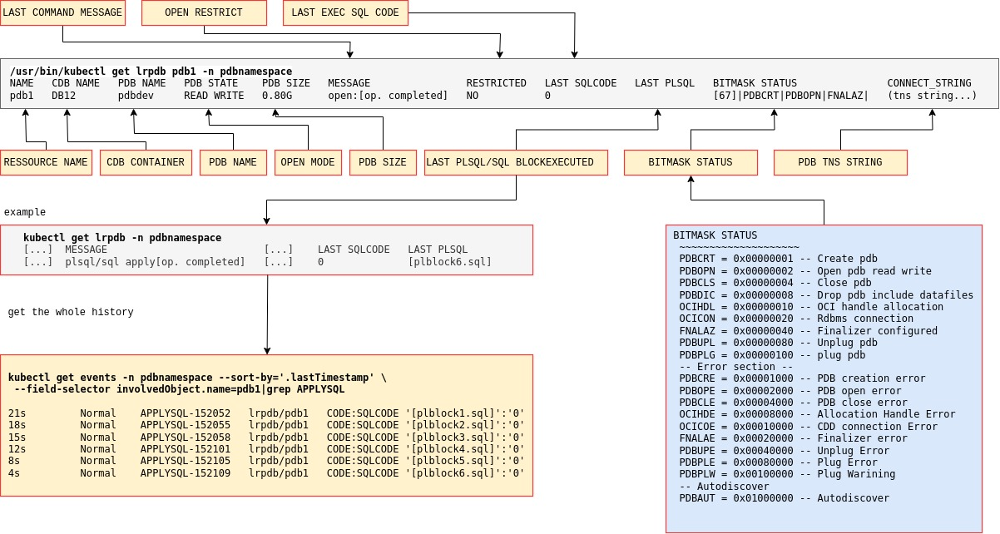
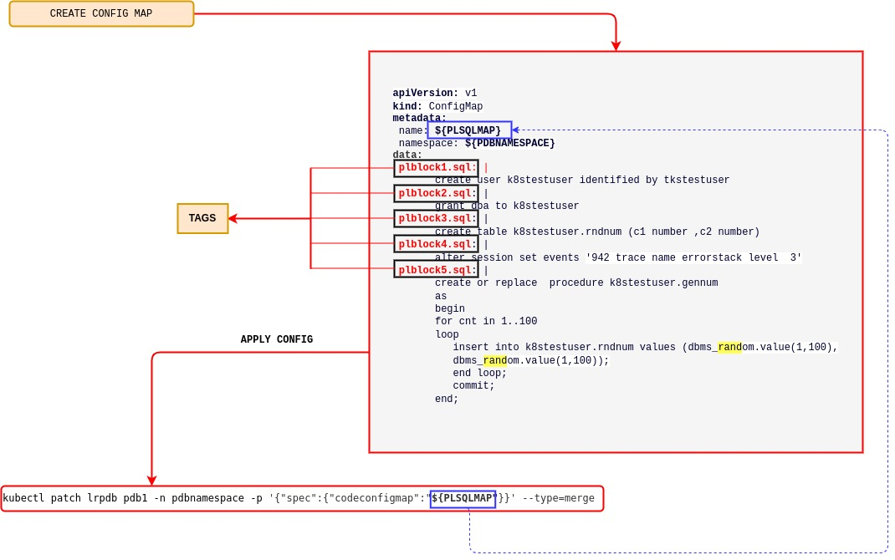

<span style="font-family:Liberation mono; font-size:0.9em; line-height: 1.1em">


# LREST BASED MULTITENANT CONTROLLERS FOR PDB LIFE CYCLE MANAGEMENT 
<!-- TOC -->

- [LREST BASED MULTITENANT CONTROLLERS FOR PDB LIFE CYCLE MANAGEMENT](#lrest-based-multitenant-controllers-for-pdb-life-cycle-management)
    - [WHAT'S NEW](#whats-new)
        - [Kubectl get lrpdb format](#kubectl-get-lrpdb-format)
        - [Pdb status table](#pdb-status-table)
    - [STEP BY STEP CONFIGURATION](#step-by-step-configuration)
        - [Multiple namespace setup](#multiple-namespace-setup)
        - [Create the operator](#create-the-operator)
        - [Container database setup](#container-database-setup)
        - [Apply rolebinding](#apply-rolebinding)
        - [Certificate and credentials](#certificate-and-credentials)
            - [Private key 🔑](#private-key-)
            - [Public Key 🔑](#public-key-)
            - [Certificates](#certificates)
        - [Create secrets for certificate and keys](#create-secrets-for-certificate-and-keys)
        - [Create secrets with encrypted password](#create-secrets-with-encrypted-password)
        - [Create lrest pod](#create-lrest-pod)
        - [Openshift configuration](#openshift-configuration)
        - [Create PDB](#create-pdb)
            - [pdb config map](#pdb-config-map)
        - [Open PDB](#open-pdb)
        - [Close PDB](#close-pdb)
        - [Clone PDB](#clone-pdb)
        - [Unplug PDB](#unplug-pdb)
        - [Plug PDB](#plug-pdb)
        - [Delete PDB](#delete-pdb)
    - [SQL/PLSQL SCRIPT EXECUTION](#sqlplsql-script-execution)
        - [Apply plsql configmap](#apply-plsql-configmap)
        - [Limitation](#limitation)
    - [TROUBLESHOOTING](#troubleshooting)
        - [Get rid of error status](#get-rid-of-error-status)
    - [UPGRADE EXISTING INSTALLATION](#upgrade-existing-installation)
    - [KNOWN ISSUE](#known-issue)

<!-- /TOC -->


**Lrpdb** and **lrest** are two controllers for PDB lifecycle management (**PDBLCM**). They rely on a dedicated REST server (Lite Rest Server) Container image to run. The `lrest` controller is available on the Oracle Container Registry (OCR). The container database can be anywhere (on-premises or in the Cloud). 


## WHAT'S NEW

- Version 2.0 introduces the semplification requested by the [issue 170](https://github.com/oracle/oracle-database-operator/issues/170). The **action** fileds no longer exists. This change brings a big semplification in terms of code and symplifies the life cycle command  execution. The *kubectl get lrpdb*  commands exposes the status of CRD which is reppresented by a bitmask.      



- **Map** command is no longer available; start the lrest using the **autodoscovery** option. If a pluggable database is created manually via command line then the lrest  detects the new pdb and automatically creates the CRD.

- [sql/plsql sript execution](#sqlplsql-script-execution) this functionality enables the capability of sql/plsql code execution. 

### Kubectl get lrpdb format
| Name          | Description                                             | 
|---------------|---------------------------------------------------------|
| NAME          | The name of the **CRD**                                 |     
| CDB NAME      | The name of the container DB                            |
| PDB NAME      | The name of the **Pluggable database**                  |
| PDB STATE     | The pdb open mode                                       |
| PDB SIZE      | Size of the Pluggable database                          | 
| MESSAGE       | Message to verify the progress of the current request   |
| RESTRICED     | Bool variable: database open in restricted mode         |
| LAST SQLCODE  | Sqlcode of the last command (see [OCIErrorGet](https://docs.oracle.com/en/database/oracle/oracle-database/19/lnoci/miscellaneous-functions.html#GUID-4B99087C-74F6-498A-8310-D6645172390A)) |
| LAST PLSQL    | Sqlcode of the last plsql execution                     |
| BITMASK STATUS| The status of pdb represented using a bitmask           | 
| CONNECT_STRING| The tns string for pdb connection                       |

### Pdb status table 

| Name    | Value     | Description                                       |
|---------|-----------|---------------------------------------------------|
|  PDBCRT |0x00000001 | Create PDB                                        |
|  PDBOPN |0x00000002 | Open pdb read write                               |
|  PDBCLS |0x00000004 | Close pdb                                         |
|  PDBDIC |0x00000008 | Drop pdb include datafiles                        |
|  OCIHDL |0x00000010 | OCI handle allocation (**for future use**)        |
|  OCICON |0x00000020 | Rdbms connection (**for future use**)             |
|  FNALAZ |0x00000040 | Finalizer configured                              |
| **ERROR CODES**                                                         |
| PDBCRE  |0x00001000 | PDB creation error                                |
| PDBOPE  |0x00002000 | PDB open error                                    |
| PDBCLE  |0x00004000 | PDB close error                                   |
| OCIHDE  |0x00008000 | Allocation Handle Error (**for future use**)      |
| OCICOE  |0x00010000 | CDB connection Error (**for future use**)         |
| PDBPLE  |0x00080000 | Plug Error                                        |
| **OTHER INFO**                                                          |
| PDBAUT | 0x01000000 | Autodisover                                       |

> Note that in case of error codes the reconciliation loop does  not take any action see 
[Get rid of error status](#get-rid-of-error-status); human action is required.

## STEP BY STEP CONFIGURATION
Complete each of these steps in the order given. 

### Multiple namespace setup

Before proceeding with controllers setup, ensure that the Oracle Database Operator (operator) is configured to work with multiple namespaces, as specified in the [README](../../../README.md).
In this document, each controller is running in a dedicated namespace: lrest controller is running in **cdbnamespace** , lrpdb controller is running in **pdbnamespace**. The [usecase directory](./usecase/README.md) contains all the files reported in this document.

Configure the **WACTH_NAMESPACE** list of the operator `yaml` file 

```bash 
sed -i 's/value: ""/value: "oracle-database-operator-system,pdbnamespace,cdbnamespace"/g' oracle-database-operator.yaml
```

### Create the operator
Run the following command:

```bash
kubectl apply -f oracle-database-operator.yaml
```
Check the controller:
```bash
kubectl get pods -n oracle-database-operator-system
NAME                                                           READY   STATUS    RESTARTS   AGE
oracle-database-operator-controller-manager-796c9b87df-6xn7c   1/1     Running   0          22m
oracle-database-operator-controller-manager-796c9b87df-sckf2   1/1     Running   0          22m
oracle-database-operator-controller-manager-796c9b87df-t4qns   1/1     Running   0          22m
```
### Container database setup

On the container database, use the following commands to configure the account for PDB administration: 

```sql
alter session set "_oracle_script"=true;
create user <ADMINUSERNAME> identified by <PASSWORD>;
grant create session to <ADMINUSERNAME> container=all;
grant sysdba to <ADMINUSERNAME> container=all;
```

### Apply rolebinding 


Apply the following files : [`pdbnamespace_binding.yaml`](./usecase/pdbnamespace_binding.yaml) [`cdbnamespace_binding.yaml`](./usecase/cdbnamespace_binding.yaml)
```bash
kubectl apply -f pdbnamespace_binding.yaml
kubectl apply -f cdbnamespace_binding.yaml
```

### Certificate and credentials
You must create the public key, private key, certificates and Kubernetes Secrets for the security configuration. 

#### Private key 🔑
> Note: Only private key **PCKS8**  format is supported by LREST controllers. Before you start configuration, ensure that you can use it. If you are using [`openssl3`](https://docs.openssl.org/master/) then `pcks8` is generated by default. If it is not already generated, then use the following command to create a `pcks8` private key

```bash
openssl genpkey -algorithm RSA  -pkeyopt rsa_keygen_bits:2048 -pkeyopt rsa_keygen_pubexp:65537 -out private.key
```
#### Public Key 🔑
Create the public key. 

```bash
/usr/bin/openssl rsa -in private.key -outform PEM  -pubout -out public.pem
```
#### Certificates
Create certificates. 
```bash
openssl req -new -x509 -days 365 -key private.key -subj "/C=CN/ST=GD/L=SZ/O=oracle, Inc./CN=oracle Root CA" -out ca.crt
```
```bash
openssl req -newkey rsa:2048 -nodes -keyout tls.key -subj "/C=CN/ST=GD/L=SZ/O=oracle, Inc./CN=cdb-dev-lrest.cdbnamespace" -out server.csr
```
```bash
/usr/bin/echo "subjectAltName=DNS:cdb-dev-lrest.cdbnamespace,DNS:www.example.com" > extfile.txt
```
```bash
/usr/bin/openssl x509 -req -extfile extfile.txt -days 365 -in server.csr -CA ca.crt -CAkey private.key -CAcreateserial -out tls.crt
```

### Create secrets for certificate and keys
Create the Kubernetes Secrets. 

```bash 
kubectl create secret tls db-tls --key="tls.key" --cert="tls.crt"  -n oracle-database-operator-system 
kubectl create secret generic db-ca --from-file="ca.crt" -n oracle-database-operator-system 
kubectl create secret tls db-tls --key="tls.key" --cert="tls.crt"  -n cdbnamespace 
kubectl create secret generic db-ca --from-file="ca.crt" -n cdbnamespace 
kubectl create secret tls db-tls --key="tls.key" --cert="tls.crt"  -n pdbnamespace 
kubectl create secret generic db-ca --from-file="ca.crt" -n pdbnamespace 
```

```bash
kubectl create secret tls prvkey --key="private.key" --cert=ca.crt  -n cdbnamespace 
kubectl create secret generic pubkey --from-file=publicKey=public.pem -n cdbnamespace 
kubectl create secret generic prvkey --from-file=privateKey="private.key" -n pdbnamespace
```

### Create secrets with encrypted password 

In this example, we create the Secrets for each credential (username and password)

| secret usr | secrets pwd | credential description                                    |
| -----------|-------------|-----------------------------------------------------------|
| **dbuser** |**dbpass**   | the administrative user created on the container database |
| **wbuser** |**wbpass**   | the user for https authentication                         |
| **pdbusr** |**pdbpwd**   | the administrative user of the pdbs                       |


```bash
echo "[ADMINUSERNAME]"           > dbuser.txt 
echo "[ADMINUSERNAME PASSWORD]"  > dbpass.txt 
echo "[WEBUSER]"                 > wbuser.txt 
echo "[WEBUSER PASSWORD]"        > wbpass.txt 
echo "[PDBUSERNAME]"             > pdbusr.txt 
echo "[PDBUSERNAME PASSWORD]"    > pdbpwd.txt 

## Encrypt the credentials
openssl rsautl -encrypt -pubin -inkey public.pem -in dbuser.txt |base64 > e_dbuser.txt 
openssl rsautl -encrypt -pubin -inkey public.pem -in dbpass.txt |base64 > e_dbpass.txt 
openssl rsautl -encrypt -pubin -inkey public.pem -in wbuser.txt |base64 > e_wbuser.txt 
openssl rsautl -encrypt -pubin -inkey public.pem -in wbpass.txt |base64 > e_wbpass.txt 
openssl rsautl -encrypt -pubin -inkey public.pem -in pdbusr.txt |base64 > e_pdbusr.txt 
openssl rsautl -encrypt -pubin -inkey public.pem -in pdbpwd.txt |base64 > e_pdbpwd.txt 

kubectl create secret generic dbuser --from-file=e_dbuser.txt -n  cdbnamespace 
kubectl create secret generic dbpass --from-file=e_dbpass.txt -n  cdbnamespace 
kubectl create secret generic wbuser --from-file=e_wbuser.txt -n  cdbnamespace 
kubectl create secret generic wbpass --from-file=e_wbpass.txt -n  cdbnamespace 
kubectl create secret generic wbuser --from-file=e_wbuser.txt -n  pdbnamespace 
kubectl create secret generic wbpass --from-file=e_wbpass.txt -n  pdbnamespace 
kubectl create secret generic pdbusr --from-file=e_pdbusr.txt -n  pdbnamespace 
kubectl create secret generic pdbpwd --from-file=e_pdbpwd.txt -n  pdbnamespace 

rm  dbuser.txt dbpass.txt wbuser.txt wbpass.txt pdbusr.txt pdbpwd.txt \
    e_dbuser.txt e_dbpass.txt e_wbuser.txt e_wbpass.txt e_pdbusr.txt e_pdbpwd.txt
```

### Create lrest pod

To create the REST pod and monitor its processing, use the `yaml` file [`create_lrest_pod.yaml`](./usecase/create_lrest_pod.yaml) 

Ensure that you update the **lrestImage** with the latest version available on the [Oracle Container Registry (OCR)](https://container-registry.oracle.com/ords/f?p=113:4:104288359787984:::4:P4_REPOSITORY,AI_REPOSITORY,AI_REPOSITORY_NAME,P4_REPOSITORY_NAME,P4_EULA_ID,P4_BUSINESS_AREA_ID:1283,1283,This%20image%20is%20part%20of%20and%20for%20use%20with%20the%20Oracle%20Database%20Operator%20for%20Kubernetes,This%20image%20is%20part%20of%20and%20for%20use%20with%20the%20Oracle%20Database%20Operator%20for%20Kubernetes,1,0&cs=3076h-hg1qX3eJANBcUHBNBCmYWjMvxLkZyTAhDn2e8VR8Gxb_a-I8jZLhf9j6gmnimHwlP_a0OQjX6vjBfSAqQ) 

```bash
--> for amd64
lrestImage: container-registry.oracle.com/database/operator:lrest-241210-amd64

--> for arm64
lrestImage: container-registry.oracle.com/database/operator:lrest-241210-arm64
```

```bash 
kubectl apply -f create_lrest_pod.yaml
```

monitor the file processing:

```bash 
kubectl get pods -n cdbnamespace --watch
NAME                     READY   STATUS    RESTARTS   AGE
cdb-dev-lrest-rs-9gvx2   0/1     Pending   0          0s
cdb-dev-lrest-rs-9gvx2   0/1     Pending   0          0s
cdb-dev-lrest-rs-9gvx2   0/1     ContainerCreating   0          0s
cdb-dev-lrest-rs-9gvx2   1/1     Running             0          2s

kubectl get lrest -n cdbnamespace
NAME CDB NAME   DB SERVER   DB PORT   TNS STRING  REPLICAS   STATUS   MESSAGE
cdb-dev   DB12                             (DESCRIPTION=(CONNECT_TIMEOUT=90)(RETRY_COUNT=30)(RETRY_DELAY=10)(TRANSPORT_CONNECT_TIMEOUT=70)(LOAD_BALLANCE=ON)(ADDRESS=(PROTOCOL=TCP)(HOST=scan12.testrac.com)(PORT=1521)(IP=V4_ONLY))(LOAD_BALLANCE=ON)(ADDRESS=(PROTOCOL=TCP)(HOST=scan34.testrac.com)(PORT=1521)(IP=V4_ONLY))(CONNECT_DATA=(SERVER=DEDICATED)(SERVICE_NAME=TESTORDS)))   1          Ready
```

Check the Pod logs: 

```bash 
/usr/local/go/bin/kubectl logs -f `/usr/local/go/bin/kubectl get pods -n cdbnamespace|grep lrest|cut -d ' ' -f 1` -n cdbnamespace
```

Output example:

```text
...
...
2024/09/05 12:44:09 wallet file /opt/oracle/lrest/walletfile exists completed
2024/09/05 12:44:09 call: C.ReadWallet
LENCHECK: 7 11 7 8
2024/09/05 12:44:09 ===== DUMP INFO ====
00000000  28 44 45 53 43 52 49 50  54 49 4f 4e 3d 28 43 4f  |(DESCRIPTION=(CO|
00000010  4e 4e 45 43 54 5f 54 49  4d 45 4f 55 54 3d 39 30  |NNECT_TIMEOUT=90|
00000020  29 28 52 45 54 52 59 5f  43 4f 55 4e 54 3d 33 30  |)(RETRY_COUNT=30|
00000030  29 28 52 45 54 52 59 5f  44 45 4c 41 59 3d 31 30  |)(RETRY_DELAY=10|
00000040  29 28 54 52 41 4e 53 50  4f 52 54 5f 43 4f 4e 4e  |)(TRANSPORT_CONN|
00000050  45 43 54 5f 54 49 4d 45  4f 55 54 3d 37 30 29 28  |ECT_TIMEOUT=70)(|
00000060  4c 4f 41 44 5f 42 41 4c  4c 41 4e 43 45 3d 4f 4e  |LOAD_BALLANCE=ON|
00000070  29 28 41 44 44 52 45 53  53 3d 28 50 52 4f 54 4f  |)(ADDRESS=(PROTO|
00000080  43 4f 4c 3d 54 43 50 29  28 48 4f 53 54 3d 73 63  |COL=TCP)(HOST=sc|
00000090  61 6e 31 32 2e 74 65 73  74 72 61 63 2e 63 6f 6d  |an12.testrac.com|
000000a0  29 28 50 4f 52 54 3d 31  35 32 31 29 28 49 50 3d  |)(PORT=1521)(IP=|
000000b0  56 34 5f 4f 4e 4c 59 29  29 28 4c 4f 41 44 5f 42  |V4_ONLY))(LOAD_B|
000000c0  41 4c 4c 41 4e 43 45 3d  4f 4e 29 28 41 44 44 52  |ALLANCE=ON)(ADDR|
000000d0  45 53 53 3d 28 50 52 4f  54 4f 43 4f 4c 3d 54 43  |ESS=(PROTOCOL=TC|
000000e0  50 29 28 48 4f 53 54 3d  73 63 61 6e 33 34 2e 74  |P)(HOST=scan34.t|
000000f0  65 73 74 72 61 63 2e 63  6f 6d 29 28 50 4f 52 54  |estrac.com)(PORT|
00000100  3d 31 35 32 31 29 28 49  50 3d 56 34 5f 4f 4e 4c  |=1521)(IP=V4_ONL|
00000110  59 29 29 28 43 4f 4e 4e  45 43 54 5f 44 41 54 41  |Y))(CONNECT_DATA|
00000120  3d 28 53 45 52 56 45 52  3d 44 45 44 49 43 41 54  |=(SERVER=DEDICAT|
00000130  45 44 29 28 53 45 52 56  49 43 45 5f 4e 41 4d 45  |ED)(SERVICE_NAME|
00000140  3d 54 45 53 54 4f 52 44  53 29 29 29              |=TESTORDS)))|
00000000  2f 6f 70 74 2f 6f 72 61  63 6c 65 2f 6c 72 65 73  |/opt/oracle/lres|
00000010  74 2f 77 61 6c 6c 65 74  66 69 6c 65              |t/walletfile|
2024/09/05 12:44:09 Get credential from wallet
7
8
2024/09/05 12:44:09 dbuser: restdba webuser :welcome
2024/09/05 12:44:09 Connections Handle
2024/09/05 12:44:09 Working Session Aarry dbhanlde=0x1944120
2024/09/05 12:44:09 Monitor Session Array dbhanlde=0x1a4af70
2024/09/05 12:44:09 Open cursors
Parsing sqltext=select inst_id,con_id,open_mode,nvl(restricted,'NONE'),total_size from gv$pdbs where inst_id = SYS_CONTEXT('USERENV','INSTANCE') and name =upper(:b1)
Parsing sqltext=select count(*) from pdb_plug_in_violations where name =:b1
2024/09/05 12:44:11 Protocol=https
2024/09/05 12:44:11 starting HTTPS/SSL server
2024/09/05 12:44:11 ==== TLS CONFIGURATION ===
2024/09/05 12:44:11 srv=0xc000106000
2024/09/05 12:44:11 cfg=0xc0000a2058
2024/09/05 12:44:11 mux=0xc0000a2050
2024/09/05 12:44:11 tls.minversion=771
2024/09/05 12:44:11 CipherSuites=[49200 49172 157 53]
2024/09/05 12:44:11 cer=/opt/oracle/lrest/certificates/tls.crt
2024/09/05 12:44:11 key=/opt/oracle/lrest/certificates/tls.key
2024/09/05 12:44:11 ==========================
2024/09/05 12:44:11 HTTPS: Listening port=8888
2024/09/05 12:44:23 call BasicAuth Succeded
2024/09/05 12:44:23 HTTP: [1:0] Invalid credential <-- This message can be ignored

```

**lrest Pod creation** - parameters list
|  Name                   | Dcription                                                                     |
--------------------------|-------------------------------------------------------------------------------|
|cdbName                  | Name of the container database (db)                                           |
|lrestImage (DO NOT EDIT) | **container-registry.oracle.com/database/lrest-dboper:latest** use the latest label availble on OCR |
|dbTnsurl                 | The string of the tns alias to connect to cdb. Attention: remove all white space from string  |
|deletePdbCascade         | Delete all of the PDBs associated to a CDB resource when the CDB resource is dropped using [imperative approach](https://kubernetes.io/docs/tasks/manage-kubernetes-objects/imperative-command/)  |
|autodiscover             | boolean parameter: enable the capability of automatic CRD/LRPDB creation if a PDB is manually created via CLI | 
|cdbAdminUser             | Secret: the administrative (admin) user             |
|cdbAdminPwd              | Secret: the admin user password                     |
|webServerUser            | Secret: the HTTPS user                              |
|webServerPwd             | Secret: the HTTPS user password                     |
|cdbTlsCrt                | Secret: the `tls.crt `                              |
|cdbPubKey                | Secret: the public key                              |
|cdbPrvKey                | Secret: the private key                             |
|loadBalancer             | Expose lrest pod ip                                 |
|clusterip                | Assigne a cluster ip                                |
|trace_level_client       | Turn on the sqlnet **trace_level_client**           |

### Openshift configuration 

For the open shift installation you need to do the following
- Before lrest pod creation; create a security context by appling the following yaml file [security_context.yaml](./usecase/security_context.yaml) mind to specify the correnct namespace and the service name account.

```yaml 
[...]
apiVersion: v1
kind: ServiceAccount
metadata:
  name: lrest-sa
  namespace: cdbnamespace
[...]
```

- Specify  `serviceAccountName` parameter  in the lrest server yaml file 

```yaml
[...]
   serviceAccountName: lrest-sa
[...]
```


### Create PDB  

To create a pluggable database, apply the yaml file [`create_pdb1_resource.yaml`](./usecase/create_pdb1_resource.yaml)  

```bash
kubectl apply -f create_pdb1_resource.yaml
```
Check the status of the resource and the PDB existence on the container db: 

```bash 
kubectl get lrpdb -n pdbnamespace
NAME CONNECT_STRING CDB NAME   LRPDB NAME   LRPDB STATE   LRPDB SIZE   STATUS   MESSAGE   LAST SQLCODE
lrpdb1   (DESCRIPTION=(CONNECT_TIMEOUT=90)(RETRY_COUNT=30)(RETRY_DELAY=10)(TRANSPORT_CONNECT_TIMEOUT=70)(LOAD_BALLANCE=ON)(ADDRESS=(PROTOCOL=TCP)(HOST=scan12.testrac.com)(PORT=1521)(IP=V4_ONLY))(LOAD_BALLANCE=ON)(ADDRESS=(PROTOCOL=TCP)(HOST=scan34.testrac.com)(PORT=1521)(IP=V4_ONLY))(CONNECT_DATA=(SERVER=DEDICATED)(SERVICE_NAME=pdbdev))) DB12  pdbdev  MOUNTED  2G  Ready  Success 
```

```bash 
SQL> show pdbs

    CON_ID CON_NAME                       OPEN MODE  RESTRICTED
---------- ------------------------------ ---------- ----------
         2 PDB$SEED                       READ ONLY  NO
         3 PDBDEV                         MOUNTED
SQL> 
```
``Note that after creation, the PDB is not open. You must explicitly open it using a dedicated `yaml` file.

**pdb creation** - parameters list

|  Name                   | Dcription                                                                     |
|-------------------------|-------------------------------------------------------------------------------|
|cdbResName               | REST server resource name                                                     |
|cdbNamespace             | Namespace of the REST server                                                  |
|cdbName                  | Name of the container database                                                |
|pdbName                  | Name of the PDB that you want to create                                       |
|assertiveLrpdbDeletion   | Boolean: Turn on the imperative approach on PDB resource deletion             |
|adminpdbUser             | Secret: PDB admin user                                                        |
|adminpdbPass             | Secret: password of PDB admin user                                            |
|lrpdbTlsKey              | Secret: `tls.key  `                                                           |
|lrpdbTlsCrt              | Secret: `tls.crt`                                                             |
|lrpdbTlsCat              | Secret: `ca.crt`                                                              |
|webServerUser            | Secret: the HTTPS user                                                        |
|webServerPwd             | Secret: the HTTPS user password                                               |
|cdbPrvKey                | Secret: private key                                                           |
|cdbPubKey                | Secret: public key                                                            |
|pdbconfigmap             | kubernetes config map that contains the PDB initialization (init) parameters  |

> NOTE: **assertiveLrpdbDeletion** must be specified for the following PDB actions **CLONE** **CREATE** **PLUG** **MAP**.  

🔥 **assertiveLrpdbDeletion** drops pluggable database using **INCLUDE DATAFILES** option

All of the parameters **adminpdbUser** **adminpdbPass** **lrpdbTlsKey** **lrpdbTlsCrt** **lrpdbTlsCat** **webServerUser** **webServerPwd** **cdbPrvKey** **cdbPubKey** must be specified in all PDB lifecycle management `yaml` files. To simplify presentation of requirements, we will not include them in the subsequent tables.


#### pdb config map 

By using **pdbconfigmap** it is possible to specify a kubernetes `configmap` with init PDB parameters. The config map payload has the following format:


```
<parameter name1>;<parameter value1>;<scope:system|spfile|both>
<parameter name2>;<parameter value2>;<scope:system|spfile|both>
<parameter name3>;<parameter value3>;<scope:system|spfile|both>
....
....
<parameter nameN>;<parameter valueN>;<scope:system|spfile|both>
```

Example of `configmap` creation:

```bash
cat <<EOF > parameters.txt
session_cached_cursors;100;spfile      
open_cursors;100;spfile                 
db_file_multiblock_read_count;16;spfile  
EOF

kubectl create  configmap config-map-pdb -n pdbnamespace --from-file=./parameters.txt

kubectl describe configmap config-map-pdb -n pdbnamespace
Name:         config-map-pdb
Namespace:    pdbnamespace
Labels:       <none>
Annotations:  <none>

Data
====
parameters.txt:
----
session_cached_cursors;100;spfile
open_cursors;100;spfile
db_file_multiblock_read_count;16;spfile
test_invalid_parameter;16;spfile
```

- If specified, the `configmap` is applied during PDB **cloning**, **opening** and **plugging**
- The `configmap` is not monitored by the reconciliation loop; this feature will be available in future releases. This means that if someone decides to manually alter an init parameter, then the operator does not take any actions to syncronize PDB configuration with the `configmap`.
- **Alter system parameter feature** will be available in future releases. 
- An application error with the `configmap` (for whatever reason) does not stop processes from completing. A warning with the associated SQL code is reported in the log file.

- **PDB configmap bitmap** status is not reported by the *kubectl get lrpdb* command; in order to verifiy configmap status you need to describe the resource. 

| Name    | Value     | Description                                       |
|---------|-----------|---------------------------------------------------|
| MPAPPL  | 0x00000001|The map config has been applyed                    |
| MPSYNC  | 0x00000002|The map config is in sync with v$parameters where is default=flase (**not yet available**)|
| MPEMPT  | 0x00000004| The map is empty - not specify                    |
| MPWARN  | 0x00000008| Map applied with warnings                         |
| MPINIT  | 0x00000010| Config map init


### Open PDB

To open the PDB, use the file [`open_pdb1_resource.yaml`](./usecase/open_pdb1_resource.yaml):

```bash
kubectl apply -f open_pdb1_resource.yaml
```
 
 **pdb opening** - parameters list
 
|  Name                   | Description/Value                                                      |
|-------------------------|------------------------------------------------------------------------|
|cdbResName               | REST server resource name                                              |
|cdbNamespace             | Namespace of the REST server                                           |
|cdbName                  | Name of the container database (CDB)                                   |
|pdbName                  | Name of the pluggable database (PDB) that you are creating             |
|pdbState                 | Use `OPEN`  to open the PDB                                          |
|modifyOption             | Use **READ WRITE** to open the PDB                                     |
|modifyOprion2            | Default is NONE, set to **RESTRICT** to open the pdb in restrited mode | 

**Imperative command:**

```bash
kubectl patch lrpdb [lrpdb_resource_name] -n [ppdb_namespace] -p \
                '{"spec":{"pdbState":"OPEN","modifyOption":"READ WRITE","modifyOption2":"NONE"}}' --type=merge
```

### Close PDB

To close the PDB, use the file [`close_pdb1_resource.yaml`](./usecase/close_pdb1_resource.yaml): 

```bash
kubectl apply -f close_pdb1_resource.yaml
```
**pdb closing** - parameters list 
|  Name                   | Description/Value                                                             |
|-------------------------|-------------------------------------------------------------------------------|
|cdbResName               | REST server resource name                                                     |
|cdbNamespace             | Namespace of the REST server                                                  |
|cdbName                  | Name of the container database (CDB)                                          |
|pdbName                  | Name of the pluggable database (PDB) that you want to create                  |
|pdbState                 | Use `CLOSE`  to close the PDB                                               |
|modifyOption             | Use **IMMEDIATE** to close the PDB                                            |


**Imperative command:**

```bash
kubectl patch lrpdb [lrpdb_resource_name] -n [ppdb_namespace] -p \
           '{"spec":{"pdbState":"CLOSE","modifyOption":"IMMEDIATE"}}' --type=merge
```

### Clone PDB ### 

To clone the PDB, use the file [`clone_pdb1_resource.yaml`](./usecase/clone_pdb1_resource.yaml): 

```bash
kubeclt apply -f clone_pdb1_resource.yaml
```
**pdb cloning** - parameters list 
|  Name                   | Description/Value                                                             |
|-------------------------|-------------------------------------------------------------------------------|
|cdbResName               | REST server resource name                                                     |
|cdbNamespace             | Namespace of the REST server                                                  |
|cdbName                  | Name of the container database (CDB)                                          |
|pdbName                  | The name of the new pluggable database (PDB)                                  |
|`srcPdbName`               | The name of the source PDB                                                  |
|fileNameConversions      | File name convert pattern  **("path1","path2")** or **NONE**                  | 
|totalSize                | Set **unlimited** for cloning                                                 |
|tempSize                 | Set **unlimited** for cloning                                                 |
|pdbconfigmap             | kubernetes **configmap** which contains the PDB init parameters                 |


### Unplug PDB

To unplug the PDB, use the file [`unplug_pdb1_resource.yaml`](./usecase/unplug_pdb1_resource.yaml):

**pdb unplugging** 
|  Name                   | Description/Value                                                             |
|-------------------------|-------------------------------------------------------------------------------|
|cdbResName               | REST server resource name                                                     |
|cdbNamespace             | Namespace of the REST server                                                  |
|cdbName                  | Name of the container database (CDB)                                          |
|pdbName                  | Name of the pluggable database (PDB)                                          |
|xmlFileName              | Unplug xmlfile path                                                            |
|pdbState                 | `UNPLUG` 

### Plug PDB 

To plug in the PDB, use the file [`plug_pdb1_resource.yaml`](./usecase/plug_pdb1_resource.yaml). In this example, we plug in the PDB that was unpluged in the previous step:

**pdb plugging** 
|  Name                   | Description/Value                                                             |
|-------------------------|-------------------------------------------------------------------------------|
|cdbResName               | REST server resource name                                                     |
|cdbNamespace             | Namespace of the REST  server                                                 |
|cdbName                  | Name of the container database (CDB)|                                         |
|pdbName                  | Name of the pluggable database (PDB)                                          |
|**xmlFileName**          | XML file path                                                                 |
|fileNameConversions      | File name convert pattern  **("path1","path2")** or **NONE**                  | 
|sourceFileNameConversion | See parameter [SOURCE_FILE_NAME_CONVERT](https://docs.oracle.com/en/database/oracle/oracle-database/23/sqlrf/CREATE-PLUGGABLE-DATABASE.html#GUID-F2DBA8DD-EEA8-4BB7-A07F-78DC04DB1FFC__CCHEJFID) documentation         |
|pdbconfigmap             | Kubernetes  `configmap` that contains the PDB init parameters                 |
|pdbState                 | `PLUG` 

### Delete PDB

To delete the PDB, use the file [`delete_pdb1_resource.yaml`](./usecase/delete_pdb1_resource.yaml)

**pdb deletion** 

|  Name                   | Dcription/Value                                                               |
|-------------------------|-------------------------------------------------------------------------------|
|cdbResName               | REST server resource name                                                     |
|cdbNamespace             | Namespace of the REST server                                                  |
|cdbName                  | Name of the container database (CDB)                                          |
|pdbState                 | `DELETE`                                                                      |
|dropAction               | **INCLUDING** - Including datafiles or **NONE**                               |

**Imperative command**

```bash
kubectl delete lrpdb <pdbname> -n <namespace>
```
## SQL/PLSQL SCRIPT EXECUTION


Plsql and sql script can be stored in a kubernetes configmap, each block can be tagged with a label as describe in the following example. 

```yaml 

## PLSQL / SQL Block config schema

apiVersion 
kind CofigMap
  name: <config_map_name>
  namespace: <namespace>
data:
<tag#1>:|
    <code block #1> 
<tag#2>:|
    <code block #2>
[...]
<tag#N> 
    <code block #N>
```



The sql and plsqlcode must be indented using tab (makefile stile). The code blocks will be executed following the alphabetic tag order. 

### Apply plsql configmap 

```bash
kubectl patch lrpdb pdb1 -n pdbnamespace -p '{"spec":{"codeconfigmap":"<config_map_name>"}}' --type=merge
```

The **kubectl get** commands shows only the return code of the last plsql code executed. 
If you need to see the overall status of the whole config map execution  check the events history as reported in the following example 

```bash
/usr/bin/kubectl patch lrpdb pdb1 -n pdbnamespace -p \
       '{"spec":{"codeconfigmap":"sql-map-example1"}}' --type=merge
lrpdb.database.oracle.com/pdb1 patched


/usr/bin/kubectl get events --sort-by='.lastTimestamp' -n pdbnamespace
LAST SEEN   TYPE      REASON            OBJECT       MESSAGE
66s         Normal    Created           lrpdb/pdb1   LRPDB 'pdbdev' created successfully
66s         Normal    Created           lrpdb/pdb1   PDB 'pdbdev' imperative pdb deletion turned on
57s         Normal    Modify            lrpdb/pdb1   Info:'pdbdev OPEN '
50s         Normal    Modified          lrpdb/pdb1   'pdbdev' modified successfully 'OPEN'
38s         Warning   lrpdbinfo         lrpdb/pdb1   pdb=pdbdev:test_invalid_parameter:16:spfile:2065
11s         Normal    APPLYSQL-143002   lrpdb/pdb1   CODE:SQLCODE '[plblock1.sql]':'0'
8s          Normal    APPLYSQL-143005   lrpdb/pdb1   CODE:SQLCODE '[plblock2.sql]':'0'
5s          Normal    APPLYSQL-143008   lrpdb/pdb1   CODE:SQLCODE '[plblock3.sql]':'0'
2s          Normal    APPLYSQL-143011   lrpdb/pdb1   CODE:SQLCODE '[plblock4.sql]':'0'
```
The message format for the **APPLYSQL** is `CODE:SQLCODE '[<tagname>]':'<PLSQL RETURN CODE>'`

### Limitation 

- All the objects in the plsql confgmap must be rapresented in the form `<onwer>.<object_name>`. Due to this constraint it's not possible to rename table 

```bash
+----------------------------------------------------------------------+
| plblock1.sql: |                                                      |
|       rename plsqltestuser.k8splsqltab to plsqltestuser.tablerename  |--------------+
+----------------------------------------------------------------------+              |
                                                                                      |
                                                                                      +
3m55s       Warning   APPLYSQL-100536   lrpdb/pdb1   CODE:SQLCODE '[plblock1.sql]':'1765'

```

- The nummber of code lines is limited the configmap capability. To workaround this limitation you can use mode configmap. 

## TROUBLESHOOTING 

### Get rid of error status

If for some reason you get an operation failure it's possible to manually fix the problem and then rest the bitmask status to re-execute the operation. Consider the following example: the unplug command does not complete successfully because xmlfile already exists ; **ORA-65170** and **PDBUPE** flag is on. You can remove the file and then rest the bitmask status in order to retry the operation. 

```text 
RESOURCE STATUS:
~~~~~~~~~~~~~~~~
kubectl get lrpdb -n pdbnamespace 
NAME   CDB NAME   PDB NAME   PDB STATE   PDB SIZE   MESSAGE             RESTRICTED   LAST SQLCODE   LAST PLSQL   BITMASK STATUS                          CONNECT_STRING 
pdb1   DB12       pdbdev     MOUNTED     0.80G      close:[ORA-65170]   NONE         65170                       [262213]|PDBCRT|PDBCLS|FNALAZ|PDBUPE|   (DESCRIPTION=(CONNECT_TIMEOUT....

FIX THE PROBLEM:                                                                                                                   
~~~~~~~~~~~~~~~~                                                                                                                                           
RM THE XMLFILE  

UPDATE THE BITMASK STATUS: 
~~~~~~~~~~~~~~~~~~~~~~~~~
Calculate the bitmask status without the PDBUPE flag  and patch the resource 
[262213]|PDBCRT|PDBCLS|FNALAZ|PDBUPE| -> [69]|PDBCRT|PDBCLS|FNALAZ| = 0x00000001 | 0x00000004 | 0x00000040
                             +------+
kubectl patch lrpdb pdb1 -n pdbnamespace -p \ 
               '{"spec":{"pdbState":"RESET","reststate":69}}' --type=merge

kubectl get lrpdb -n pdbnamespace  
NAME   CDB NAME   PDB NAME   PDB STATE   PDB SIZE   MESSAGE              RESTRICTED   LAST SQLCODE   LAST PLSQL   BITMASK STATUS               CONNECT_STRING 
pdb1   DB12       pdbdev     MOUNTED     0.80G      close:[ORA-65170]    NONE         65170                       [69]|PDBCRT|PDBCLS|FNALAZ|   (DESCRIPTION=(CONNECT_TIMEOUT....
                                                                                                                  ^^^^^^^^^^^^^^^^^^^^^^^^^^
                                                                                                                  [READY TO BE UNPLUGGED]
```
## UPGRADE EXISTING INSTALLATION 

## KNOWN ISSUE 

- Error message `ORA-01005` is not reported in the lrest database login phase if password is mistakenly null. Trace log shows the message ORA-1012.

</span>