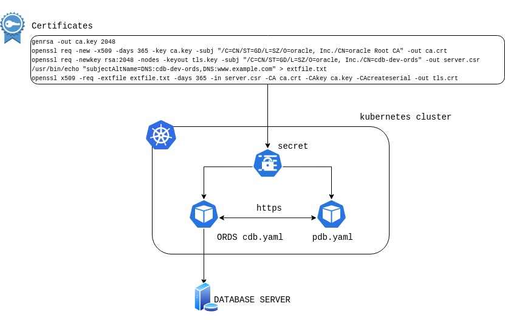

<span style="font-family:Liberation mono; font-size:0.8em; line-height: 1.2em">

# Oracle Multitenant Database Controllers 

The Oracle Database Operator for kubernetes uses two controllers to manage [Pluggable Database life cycle][oradocpdb]

- CDB controller
- PDB controller

By usigng CDB/PDB controllers you can perform the following actions **CREATE**,**MODIFY(OPEN/COSE)**,**DELETE**,**CLONE**,**PLUG** and **UNPLUG** 

This file examplains how to setup CDB and PDB controllers, additional details can be found in the README files under usecases directories..

- [Usecase01][uc01] pdb crd and cdb pod are running in the same namesaoce 
- [Usecase02][uc02] unplug and plug operation examples  
- [Usecase03][uc03] multiple namespace example cdb pod ,pdb crd and pod operator are running in different namespaces.

> **NOTE** that there is no controller for Container Database Operations

## Macro steps for setup

- Deply the Oracle Database Operator 
- Create Ords based image for CDB pod  
- Container DB user creation
- Create secrets for credentials 
- Create certificates for https connection 
- Create CDB pod

## Oracle DB Operator Multitenant Database Controller Deployment

To deploy OraOperator, use this [Oracle Database Operator for Kubernetes](https://github.com/oracle/oracle-database-operator/blob/main/README.md) step-by-step procedure.

After the Oracle Database Operator is deployed, you can see the DB Operator Pods running in the Kubernetes Cluster. As part of the `OraOperator` deployment, the multitenant Database Controller is deployed. You can see the CRDs (Custom Resource Definition) for the CDB and PDBs in the list of CRDs. The following output is an example of such a deployment:

```bash
[root@test-server oracle-database-operator]# kubectl get ns
NAME                              STATUS   AGE
cert-manager                      Active   32h
default                           Active   245d
kube-node-lease                   Active   245d
kube-public                       Active   245d
kube-system                       Active   245d
oracle-database-operator-system   Active   24h    <<<< namespace to deploy the Oracle Database Operator

[root@test-server oracle-database-operator]# kubectl get all -n  oracle-database-operator-system
NAME                                                               READY   STATUS    RESTARTS   AGE
pod/oracle-database-operator-controller-manager-665874bd57-dlhls   1/1     Running   0          28s
pod/oracle-database-operator-controller-manager-665874bd57-g2cgw   1/1     Running   0          28s
pod/oracle-database-operator-controller-manager-665874bd57-q42f8   1/1     Running   0          28s

NAME                                                                  TYPE        CLUSTER-IP      EXTERNAL-IP   PORT(S)    AGE
service/oracle-database-operator-controller-manager-metrics-service   ClusterIP   10.96.130.124   <none>        8443/TCP   29s
service/oracle-database-operator-webhook-service                      ClusterIP   10.96.4.104     <none>        443/TCP    29s

NAME                                                          READY   UP-TO-DATE   AVAILABLE   AGE
deployment.apps/oracle-database-operator-controller-manager   3/3     3            3           29s

NAME                                                                     DESIRED   CURRENT   READY   AGE
replicaset.apps/oracle-database-operator-controller-manager-665874bd57   3         3         3       29s
[root@docker-test-server oracle-database-operator]# 

[root@test-server oracle-database-operator]# kubectl get crd
NAME                                               CREATED AT
autonomouscontainerdatabases.database.oracle.com   2022-06-22T01:21:36Z
autonomousdatabasebackups.database.oracle.com      2022-06-22T01:21:36Z
autonomousdatabaserestores.database.oracle.com     2022-06-22T01:21:37Z
autonomousdatabases.database.oracle.com            2022-06-22T01:21:37Z
cdbs.database.oracle.com                           2022-06-22T01:21:37Z <<<<
certificaterequests.cert-manager.io                2022-06-21T17:03:46Z
certificates.cert-manager.io                       2022-06-21T17:03:47Z
challenges.acme.cert-manager.io                    2022-06-21T17:03:47Z
clusterissuers.cert-manager.io                     2022-06-21T17:03:48Z
dbcssystems.database.oracle.com                    2022-06-22T01:21:38Z
issuers.cert-manager.io                            2022-06-21T17:03:49Z
oraclerestdataservices.database.oracle.com         2022-06-22T01:21:38Z
orders.acme.cert-manager.io                        2022-06-21T17:03:49Z 
pdbs.database.oracle.com                           2022-06-22T01:21:39Z <<<<
shardingdatabases.database.oracle.com              2022-06-22T01:21:39Z
singleinstancedatabases.database.oracle.com        2022-06-22T01:21:40Z
```


## Prerequsites to manage PDB Life Cycle using Oracle DB Operator Multitenant Database Controller

* [Prepare the container database for PDB Lifecycle Management or PDB-LM](#prepare-cdb-for-pdb-lifecycle-management-pdb-lm)
* [Oracle REST Data Service or ORDS Image](#oracle-rest-data-service-ords-image)
* [Kubernetes Secrets](#kubernetes-secrets)
* [Kubernetes CRD for CDB](#kubernetes-crd-for-cdb)
* [Kubernetes CRD for PDB](#kubernetes-crd-for-pdb)

## Prepare the container database for PDB Lifecycle Management (PDB-LM)

Pluggable Database (PDB) management operations are performed in the Container Database (CDB). These operations include create, clone, plug, unplug, delete, modify and map pdb.

You cannot have an ORDS-enabled schema in the container database. To perform the PDB lifecycle management operations, you must first use the following steps to define the default CDB administrator credentials on target CDBs:

Create the CDB administrator user, and grant the required privileges. In this example, the user is `C##DBAPI_CDB_ADMIN`. However, any suitable common user name can be used.

```SQL
SQL> conn /as sysdba
 
-- Create following users at the database level:

ALTER SESSION SET "_oracle_script"=true;
DROP USER  C##DBAPI_CDB_ADMIN cascade;
CREATE USER C##DBAPI_CDB_ADMIN IDENTIFIED BY <Password> CONTAINER=ALL ACCOUNT UNLOCK;
GRANT SYSOPER TO C##DBAPI_CDB_ADMIN CONTAINER = ALL;
GRANT SYSDBA TO C##DBAPI_CDB_ADMIN CONTAINER = ALL;
GRANT CREATE SESSION TO C##DBAPI_CDB_ADMIN CONTAINER = ALL;


-- Verify the account status of the following usernames. They should not be in locked status:

col username        for a30
col account_status  for a30
select username, account_status from dba_users where username in ('ORDS_PUBLIC_USER','C##DBAPI_CDB_ADMIN','APEX_PUBLIC_USER','APEX_REST_PUBLIC_USER');
```

## OCI OKE(Kubernetes Cluster) 

You can use an [OKE in Oracle Cloud Infrastructure][okelink] to configure the operator for PDB lifecycle management. **Note that there is no restriction about container database location; it can be anywhere (on cloud or premises , on any supported platform).** 
To quickly create an OKE cluster in your OCI cloud environment you can use the following [link](./provisioning/quickOKEcreation.md).
In this setup example [provisioning example setup](./provisioning/example_setup_using_oci_oke_cluster.md), the Container database is running on a OCI Exadata Database Cluster.

 
## Oracle REST Data Service (ORDS) Image

  The PDB Database controllers require a pod running a dedicated rest server image based on [ORDS][ordsdoc]. Read the following [link](./provisioning/ords_image.md) to build the ords images.
  

## Kubernetes Secrets

  Multitenant Controllers use Kubernetes Secrets to store the required credential. The https certificates are stored in Kubernetes Secrets as well. 

  **Note** <span style="color:red"> In multi namespace enviroment you have to create specific secrets for each namespaces </span>

  **Note** <span style="color:red"> In multi namespace enviroment you have to create specific secrets for each namespaces </span>

### Secrets for CDB CRD

  Create a secret file as shown here: [config/samples/multitenant/cdb_secret.yaml](../multitenant/provisioning/singlenamespace/cdb_create.yaml). Modify this file with the `base64` encoded values of the required passwords for CDB, and use this file to create the required secrets.

  ```bash
  kubectl apply -f cdb_secret.yaml
  ```
  
  **Note:** To obtain the `base64` encoded value for a password, use the following command:

  ```bash
  echo -n "<password to be encoded using base64>" | base64
  ```

  **Note:** <span style="color:red">  After successful creation of the CDB Resource, the CDB secrets are deleted from the Kubernetes system </span> .

### Secrets for PDB CRD

  Create a secret file as shown here: [pdb_secret.yaml](../multitenant/provisioning/singlenamespace/pdb_secret.yaml). Edit the file using your base64 credential and apply it. 

  ```bash
  kubectl apply -f pdb_secret.yaml
  ```
  
  **NOTE:** <span style="color:red"> Don't leave plaintext files containing sensitive data on disk. After loading the Secret, remove the plaintext file or move it to secure storage. </span>
  
### Secrets for CERTIFICATES

Create the certificates and key on your local host, and use them to create the Kubernetes secret.

```bash 
openssl genrsa -out ca.key 2048
openssl req -new -x509 -days 365 -key ca.key -subj "/C=US/ST=California/L=SanFrancisco/O=oracle /CN=cdb-dev-ords /CN=localhost  Root CA " -out ca.crt
openssl req -newkey rsa:2048 -nodes -keyout tls.key -subj "/C=US/ST=California/L=SanFrancisco/O=oracle /CN=cdb-dev-ords /CN=localhost" -out server.csr
echo "subjectAltName=DNS:cdb-dev-ords,DNS:www.example.com" > extfile.txt
openssl x509 -req -extfile extfile.txt -days 365 -in server.csr -CA ca.crt -CAkey ca.key -CAcreateserial -out tls.crt
```

```bash
kubectl create secret tls db-tls --key="tls.key" --cert="tls.crt"  -n oracle-database-operator-system
kubectl create secret generic db-ca --from-file=ca.crt -n oracle-database-operator-system
```



**Note:** <span style="color:red">  On successful creation of the certificates secret creation remove files or move to secure storage </span> .

## Kubernetes CRD for CDB

The Oracle Database Operator Multitenant Controller creates the CDB kind as a custom resource that models a target CDB as a native Kubernetes object. This kind is used only to create Pods to connect to the target CDB to perform PDB-LM operations.  Each CDB resource follows the CDB CRD as defined here: [config/crd/bases/database.oracle.com_cdbs.yaml](../../config/crd/bases/database.oracle.com_cdbs.yaml)

To create a CDB CRD, see this example `.yaml` file: [cdb_create.yaml](../multitenant/provisioning/singlenamespace/cdb_create.yaml)

**Note:** The password and username fields in this *cdb.yaml* Yaml are the Kubernetes Secrets created earlier in this procedure. For more information, see the section [Kubernetes Secrets](https://kubernetes.io/docs/concepts/configuration/secret/). To understand more about creating secrets for pulling images from a Docker private registry, see [Kubernetes Private Registry Documenation]( https://kubernetes.io/docs/tasks/configure-pod-container/pull-image-private-registry/).

Create a CDB CRD Resource example

```bash 
kubectl apply -f cdb_create.yaml 
```

see [usecase01][uc01] and usecase03[uc03] for more information about file configuration

## Kubernetes CRD for PDB

The Oracle Database Operator Multitenant Controller creates the PDB kind as a custom resource that models a PDB as a native Kubernetes object. There is a one-to-one mapping between the actual PDB and the Kubernetes PDB Custom Resource. You cannot have more than one Kubernetes resource for a target PDB. This PDB resource can be used to perform PDB-LM operations by specifying the action attribute in the PDB Specs. Each PDB resource follows the PDB CRD as defined here: [config/crd/bases/database.oracle.com_pdbs.yaml](../../../config/crd/bases/database.oracle.com_pdbs.yaml)

To create a PDB CRD Resource, a sample .yaml file is available here: [pdb_create.yaml](../multitenant/provisioning/singlenamespace/pdb_create.yaml)

```bash 
kubectl apply -f cdb_create.yaml 
```

## Usecases files list 

### Single Namespace

1. [Create CDB](./provisioning/singlenamespace/cdb_create.yaml)
2. [Create PDB](./provisioning/singlenamespace/pdb_create.yaml)
3. [Clone PDB](./provisioning/singlenamespace/pdb_clone.yaml)
4. [Open PDB](./provisioning/singlenamespace/pdb_open.yaml)
4. [Close PDB](./provisioning/singlenamespace/pdb_close.yaml)
5. [Delete PDB](./provisioning/singlenamespace/pdb_delete.yaml)
6. [Unplug PDB](./provisioning/singlenamespace/pdb_unplug.yaml)
7. [Plug PDB](./provisioning/singlenamespace/pdb_plug.yaml)

### Multiple namespace (cdbnamespace,dbnamespace)

1. [Create CDB](./provisioning/multinamespace/cdb_create.yaml)
2. [Create PDB](./provisioning/multinamespace/pdb_create.yaml)
3. [Clone PDB](./provisioning/multinamespace/pdb_clone.yaml)
4. [Open PDB](./provisioning/multinamespace/pdb_open.yaml)
4. [Close PDB](./provisioning/multinamespace/pdb_close.yaml)
5. [Delete PDB](./provisioning/multinamespace/pdb_delete.yaml)
6. [Unplug PDB](./provisioning/multinamespace/pdb_unplug.yaml)

## Known issues

 - Ords installatian failure if pluaggable databases in the container db are not opened

 - Version 1.1.0: encoded password for https authentication may include carriege return as consequence the https request fails with http 404 error. W/A generate encoded password using **printf** instead of **echo**.  

 - pdb controller authentication suddenly failes without any system change. Check the certificate expiration date **openssl .... -days 365**

 - Nothing happens after cdb yaml file applying: Make sure to have properly configure the WHATCH_NAMESPACE list in the operator yaml file 

 [okelink]:https://docs.oracle.com/en-us/iaas/Content/ContEng/Concepts/contengoverview.htm
 [ordsdoc]:https://docs.oracle.com/en/database/oracle/oracle-rest-data-services/23.1/index.html
 [uc01]:../multitenant/usecase01/README.md
 [uc02]:../multitenant/usecase02/README.md
 [uc03]:../multitenant/usecase03/README.md
 [oradocpdb]:https://docs.oracle.com/en/database/oracle/oracle-database/21/multi/introduction-to-the-multitenant-architecture.html#GUID-AB84D6C9-4BBE-4D36-992F-2BB85739329F

 </span>