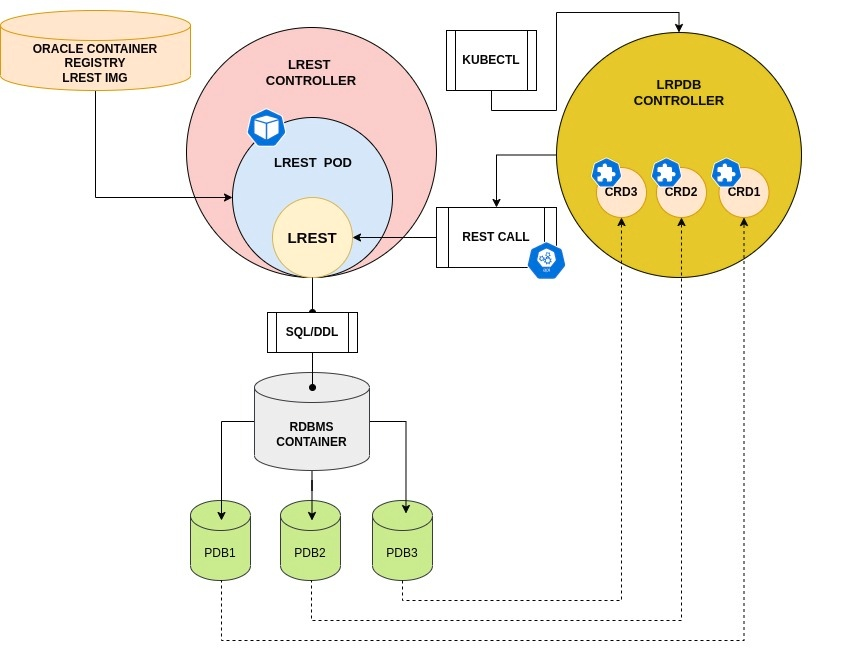
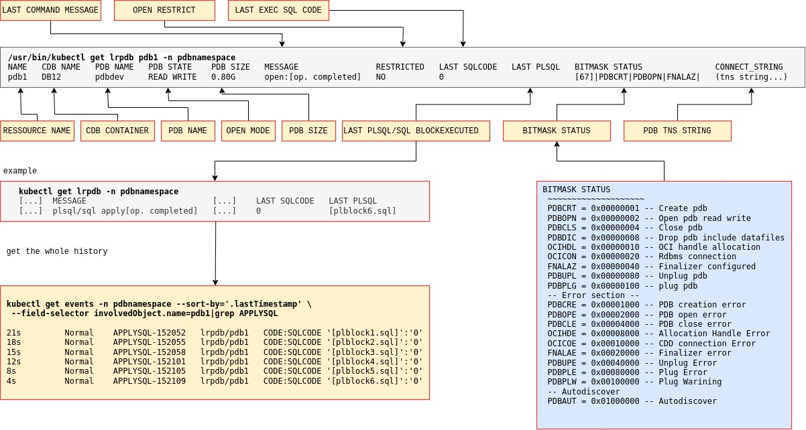
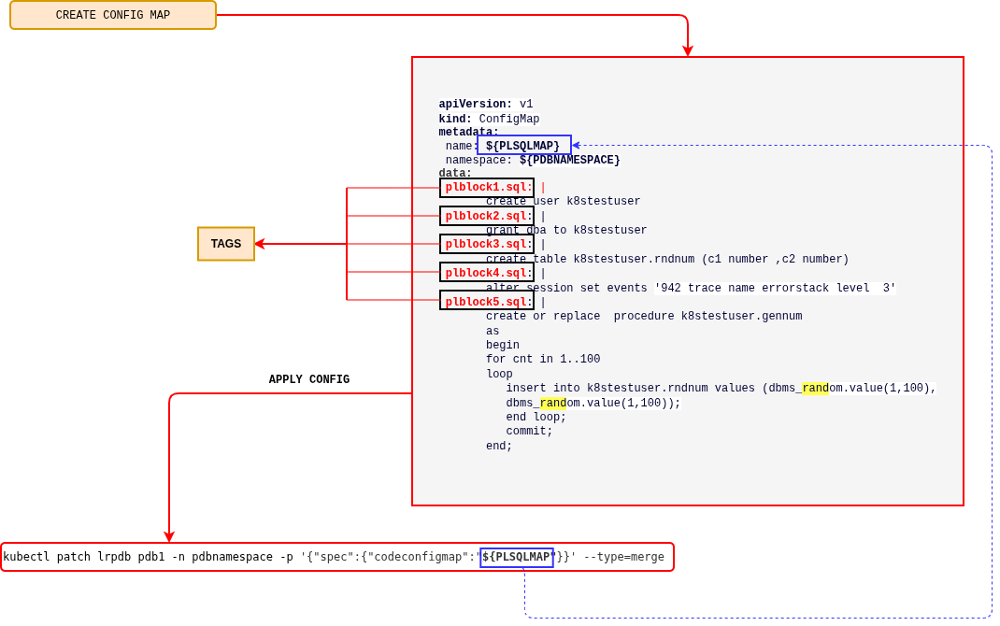

<!-- vscode-markdown-toc -->
* 1. [WHAT'S NEW](#WHATSNEW)
  * 1.1. [KUBECTL GET LRPDB FORMAT](#KUBECTLGETLRPDBFORMAT)
  * 1.2. [KUBECTL GET LREST FORMAT](#KUBECTLGETLRESTFORMAT)
* 1. [STEP BY STEP CONFIGURATION](#STEPBYSTEPCONFIGURATION)
  * 2.1. [MULTIPLE NAMESPACE SETUP](#MULTIPLENAMESPACESETUP)
  * 2.2. [APPLY ROLE BINDING](#APPLYROLEBINDING)
  * 2.3. [CREATE THE OPERATOR](#CREATETHEOPERATOR)
  * 2.4. [CLUSTERROLE AND CLUSTERROLEBINDING FOR NODEPORT SERVICES](#CLUSTERROLEANDCLUSTERROLEBINDINGFORNODEPORTSERVICES)
  * 2.5. [CONTAINER DATABASE SETUP](#CONTAINERDATABASESETUP)
  * 2.6. [CDB CONNECTION](#CDBCONNECTION)
    * 2.6.1. [TNS STRING SPECIFICATION](#TNSSTRINGSPECIFICATION)
    * 2.6.2. [TNSNAMES.ORA TOPOLOGY](#TNSNAMES.ORATOPOLOGY)
  * 2.7. [HOST:PORT](#HOST:PORT)
  * 2.8. [CDB CREDENTIALS](#CDBCREDENTIALS)
  * 2.9. [OPENSSL3 EXAMPLE](#OPENSSL3EXAMPLE)
    * 2.9.1. [NATIVE EXAMPLE](#NATIVEEXAMPLE)
    * 2.9.2. [ORAPKI EXAMPLE](#ORAPKIEXAMPLE)
  * 2.10. [CREATE LREST POD](#CREATELRESTPOD)
  * 2.11. [OPENSHIFT CONFIGURATION](#OPENSHIFTCONFIGURATION)
  * 2.12. [CREATE PDB](#CREATEPDB)
    * 2.12.1. [PDB CONFIG MAP](#PDBCONFIGMAP)
  * 2.13. [OPEN PDB](#OPENPDB)
  * 2.14. [CLOSE PDB](#CLOSEPDB)
  * 2.15. [CLONE PDB](#CLONEPDB)
  * 2.16. [UNPLUG PDB](#UNPLUGPDB)
  * 2.17. [PLUG PDB](#PLUGPDB)
  * 2.18. [DELETE PDB](#DELETEPDB)
* 1. [PDB APPLICATION USER CREATION](#PDBAPPLICATIONUSERCREATION)
* 1. [SQL/PLSQL SCRIPT EXECUTION](#SQLPLSQLSCRIPTEXECUTION)
  * 4.1. [APPLY PL/SQL CONFIG MAP](#APPLYPLSQLCONFIGMAP)
  * 4.2. [LIMITATIONS](#LIMITATIONS)
* 1. [TROUBLESHOOTING](#TROUBLESHOOTING)
  * 5.1. [Get Rid of Error Status](#GetRidofErrorStatus)
  * 5.2. [TRACE LEVEL](#TRACELEVEL)
* 1. [UPGRADE EXISTING INSTALLATION](#UPGRADEEXISTINGINSTALLATION)
* 1. [DEPLOY MULTITENANT CONTROLLERS ON A CDB WITH EXISTING PDBS](#DEPLOYMULTITENANTCONTROLLERSONACDBWITHEXISTINGPDBS)
* 1. [KNOWN ISSUES](#KNOWNISSUES)

<!-- vscode-markdown-toc-config
	numbering=true
	autoSave=true
	/vscode-markdown-toc-config -->
<!-- /vscode-markdown-toc --><span style="font-family:Liberation mono; font-size:0.9em; line-height: 1.1em">

# PDB LIFECYCLE MANAGEMENT CONTROLLERS



The multitenant controllers enable the capability of PDB lifecycle  management. For each physical PDB, there is one CRD instance running in the Kubernetes cluster. The LREST controller manages comunication between the PDB/CRD (LRPDB) and the Container Database leveraging a dedicated REST server. The Container Database can be anywhere.

See also the [Quick Start](./usecase/README.md) for the shortest `lrest lrpdb` setup using a reachable Oracle database.

## 1. <a name='WHATSNEW'></a>WHAT'S NEW



* **VERSION 2.1**

* The **Map** action is replaced by the **autodiscovery** option. If you create a pluggable database manually from the command line, then `lrest` detects the new PDB and automatically creates the CRD.

* Fine-grained trace levels

* Oracle Wallet secret (`orapki`)

* [SQL/PLSQL script execution](#sqlplsql-script-execution) using Kubernetes ConfigMaps.

* **VERSION 2.2**

* Web user credentials and certificate creation for internal communication between LRPDB and LREST are now managed internally using operator-managed secrets.

* Use secrets to create PDB application users.

* Generate a bitmap that contains a `tnsnames.ora` file with your database network topology.

* Monitor PDB init parameters with reconciliation loop.

* Reset bitmask status simplification.

### 1.1. <a name='KUBECTLGETLRPDBFORMAT'></a>KUBECTL GET LRPDB FORMAT

| Name          | Description                                             |
|---------------|---------------------------------------------------------|
| NAME          | The name of the **CRD**                                 |
| CDB NAME      | The name of the container DB                            |
| PDB NAME      | The name of the **pluggable database**                  |
| PDB STATE     | The PDB open mode                                       |
| PDB SIZE      | Size of the PDB                                         |
| MESSAGE       | Status/progress message for the current request         |
| RESTRICTED    | Boolean variable: database opened in restricted mode    |
| LAST SQLCODE  | SQLCODE of the last command (see [OCIErrorGet](https://docs.oracle.com/en/database/oracle/oracle-database/19/lnoci/miscellaneous-functions.html#GUID-4B99087C-74F6-498A-8310-D6645172390A)) |
| LAST PLSQL    | SQLCODE of the last PL/SQL execution                    |
| BITMASK STATUS| The status (bitmask) of the PDB                         |
| CONNECT_STRING| The TNS string for PDB connection                       |

> Note **CDB NAME** is a label used in the PDB resource specification, not necessarily the name of the actual Container Database.

| NAME          | The name of the **CRD**                                 |

|  Name   | Value     | Description                                       |
|---------|-----------|---------------------------------------------------|
|  PDBCRT |0x00000001 | Create PDB                                        |
|  PDBOPN |0x00000002 | Open PDB read/write                               |
|  PDBCLS |0x00000004 | Close PDB                                         |
|  PDBDIC |0x00000008 | Drop PDB including data files                     |
|  OCIHDL |0x00000010 | OCI handle allocation (**for future use**)        |
|  OCICON |0x00000020 | RDBMS connection (**for future use**)             |
|  FNALAZ |0x00000040 | Finalizer configured                              |
|  PDBUPL |0x00000080 | Unplug PDB                                        |
|  PDBPLG |0x00000100 | Plug PDB                                          |
|  APPUSR |0x00000200 | Application user created                          |
| **ERROR CODES**                                                         |
| PDBCRE  |0x00001000 | PDB creation error                                |
| PDBOPE  |0x00002000 | PDB open error                                    |
| PDBCLE  |0x00004000 | PDB close error                                   |
| OCIHDE  |0x00008000 | Handle allocation error (**for future use**)      |
| OCICOE  |0x00010000 | CDB connection error (**for future use**)         |
| FNALAE  |0x00020000 | Finalizer error                                   |
| PDBUPE  |0x00040000 | Unplug error                                      |
| PDBPLE  |0x00080000 | Plug error                                        |
| PDBPLW  |0x00100000 | Plug warning                                      |
| PDBCNE  |0x00200000 | Call error                                        |
| APPERR  |0x00400000 | Create application user error                     |
| **OTHER INFO**                                                          |
| PDBAUT | 0x01000000 | Autodiscover                                      |

> If an error code occurs, the reconciliation loop does not take any action. You must manually reset the status. See
[Get rid of error status](#get-rid-of-error-status).

### 1.2. <a name='KUBECTLGETLRESTFORMAT'></a>KUBECTL GET LREST FORMAT

| Name          | Description                                             |
|---------------|---------------------------------------------------------|
| NAME          | The name of **CRD** (service name = <NAME>-lrest)       |
| CDB NAME      | CDB name                                                |
| STATUS        | Resource status (target status = Ready)                 |
| MESSAGE       | Messages from the pod                                   |
| AUTODISCOVER  | Boolean status of the autodiscovery feature             |
| PDB:CRD       | Number of PDB and CRD (target config #PDB=#CRD)         |
| TNS STRING    | CDB TNS string                                          |

## 2. <a name='STEPBYSTEPCONFIGURATION'></a>STEP BY STEP CONFIGURATION

Prepare the environment and deploy the Oracle Database Operator and supporting infrastructure for the PDB lifecycle.

Complete the following steps in order:

### 2.1. <a name='MULTIPLENAMESPACESETUP'></a>MULTIPLE NAMESPACE SETUP

Before configuring the controllers, ensure that the Oracle Database Operator (operator) is configured to work with multiple namespaces, as specified in the [README](../../../README.md).
In this document, each controller is running in a dedicated namespace:

* The `lrest` controller is running in **cdbnamespace**.
* The `lrpdb` controller is running in **pdbnamespace**.
* The [usecase directory](./usecase/README.md) contains example files and additional scripts for YAML file customization.

Configure the **WATCH_NAMESPACE** list in the operator YAML file:

```bash
sed -i 's/value: ""/value: "oracle-database-operator-system,pdbnamespace,cdbnamespace"/g' oracle-database-operator.yaml
```

### 2.2. <a name='APPLYROLEBINDING'></a>APPLY ROLE BINDING

Apply the following files: [`pdbnamespace_binding.yaml`](./usecase/pdbnamespace_binding.yaml) [`cdbnamespace_binding.yaml`](./usecase/cdbnamespace_binding.yaml)

```bash
kubectl apply -f pdbnamespace_binding.yaml
kubectl apply -f cdbnamespace_binding.yaml
```

### 2.3. <a name='CREATETHEOPERATOR'></a>CREATE THE OPERATOR

Run the following command:

```bash
kubectl apply -f oracle-database-operator.yaml
```

Check the controller:

```bash
kubectl get pods -n oracle-database-operator-system
```

Example output:

```text
NAME                                                           READY   STATUS    RESTARTS   AGE
oracle-database-operator-controller-manager-796c9b87df-6xn7c   1/1     Running   0          22m
oracle-database-operator-controller-manager-796c9b87df-sckf2   1/1     Running   0          22m
oracle-database-operator-controller-manager-796c9b87df-t4qns   1/1     Running   0          22m
```

### 2.4. <a name='CLUSTERROLEANDCLUSTERROLEBINDINGFORNODEPORTSERVICES'></a>CLUSTERROLE AND CLUSTERROLEBINDING FOR NODEPORT SERVICES

To expose services on each node's IP and port (the NodePort), apply `node-rbac.yaml`. Note that this step is not required for LoadBalancer services.

```bash
kubectl apply -f rbac/node-rbac.yaml
```

### 2.5. <a name='CONTAINERDATABASESETUP'></a>CONTAINER DATABASE SETUP

On the container database, use the following commands to configure the account for PDB administration:

```sql
alter session set "_oracle_script"=true;
create user <ADMINUSERNAME> identified by <PASSWORD>;
grant create session to <ADMINUSERNAME> container=all;
grant sysdba to <ADMINUSERNAME> container=all;
```

### 2.6. <a name='CDBCONNECTION'></a>CDB CONNECTION

This section explains how to specify the CDB connection in the YAML file. There are two ways to identify and configure the target CDB.

#### 2.6.1. <a name='TNSSTRINGSPECIFICATION'></a>TNS STRING SPECIFICATION

In this approach, you specify the TNS connection string directly in the LREST creation YAML file. This is the simplest option when the connection details are known and managed explicitly within the deployment configuration.

#### 2.6.2. <a name='TNSNAMES.ORATOPOLOGY'></a>TNSNAMES.ORA TOPOLOGY

Alternatively, you can create a ConfigMap containing the contents of the tnsnames.ora file. After the ConfigMap is created, the connection can be configured in the YAML file by referencing the appropriate TNS alias defined in tnsnames.ora.

```bash
kubectl  create configmap tnscfgmp --from-file=tnsnames.ora   -n cdbnamespace
```

```yaml
[...]
  tnsNames: tnscfgmp
  tnsAlias: test
[...]
```

### 2.7. <a name='HOST:PORT'></a>HOST:PORT

CDB connections based on host and port coordinates are no longer supported.

### 2.8. <a name='CDBCREDENTIALS'></a>CDB CREDENTIALS

**ADMINUSERNAME** credentials are stored in Kubernetes Secrets. You can choose one of the following approaches to protect secrets containing database passwords:

* Store credentials in an Opaque Secret (generic secret) and rely on a third-party wallet or external mechanism for data encryption.
* Encrypt credentials with OpenSSL before storing them in a generic secret.
* Store credentials in an Oracle Wallet using [orapki](https://docs.oracle.com/en/database/oracle/oracle-database/26/dbseg/using-the-orapki-utility-to-manage-pki-elements.html), then load the wallet into a Kubernetes Secret.

You can select one of these options by setting the **passwordProtection** attribute in the lrest and lrpdb YAML files.

Supported values are:

* **NATIVE** — use generic Kubernetes Secrets.
* **OPENSSL3** — use user-encrypted secrets with OpenSSL.
* **ORAPKI** — use passwords stored in an Oracle Wallet.

Specify the attribute **passwordProtection** on `lrest` and `lrpdb` resources as follows:

| LREST    | LRPDB   |
|----------|---------|
|NATIVE    |NATIVE   |
|OPENSSL3  |OPENSSL3 |
|ORAPKI    | empty   |

| secret user | secret password | credential description                                 |
| -----------|-------------|-----------------------------------------------------------|
| **dbuser** |**dbpass**   | the administrative user created on the container database |
| **pdbusr** |**pdbpwd**   | the administrative user of the PDBs                       |

> NOTE: The `pdbusr` credential can only be stored in a standard or OpenSSL3-encrypted Secret, because the LRPDB CRD does not own any pod. Because this information is not necessary for PDB lifecycle management, Oracle recommends that you delete the Secret.

### 2.9. <a name='OPENSSL3EXAMPLE'></a>OPENSSL3 EXAMPLE

This approach creates a key pair for encryption, as described in the following steps. Note that
LREST controllers support only private keys in PKCS#8 format. After creation, the keys must be stored as Secrets. The CDB namespace contains both the private and public keys; PDB namespaces contain only the private key.

```bash
openssl genpkey -algorithm RSA  -pkeyopt rsa_keygen_bits:2048 -pkeyopt rsa_keygen_pubexp:65537 -out private.key
```

```bash
/usr/bin/openssl rsa -in private.key -outform PEM  -pubout -out public.pem
```

```bash
/usr/local/go/bin/kubectl create secret generic pubkey --from-file=publicKey=public.pem -n cdbnamespace
```

Example output:

```text
/usr/local/go/bin/kubectl create secret generic prvkey --from-file=privateKey=private.key  -n cdbnamespace
/usr/local/go/bin/kubectl create secret generic prvkey --from-file=privateKey=private.key -n pdbnamespace
```

After key setup, you can encrypt credentials and save them as Secrets as shown in the following steps:

```bash
echo "[ADMINUSERNAME]"           > dbuser.txt 
echo "[ADMINUSERNAME PASSWORD]"  > dbpass.txt 
echo "[PDBUSERNAME]"             > pdbusr.txt 
echo "[PDBUSERNAME PASSWORD]"    > pdbpwd.txt 

##  ENCRYPT THE CREDENTIALS

openssl pkeyutl -encrypt -pubin -inkey public.pem -in dbuser.txt \
   -pkeyopt rsa_padding_mode:oaep -pkeyopt rsa_oaep_md:sha256 |base64 > e_dbuser.txt 
openssl pkeyutl -encrypt -pubin -inkey public.pem -in dbpass.txt \
    -pkeyopt rsa_padding_mode:oaep -pkeyopt rsa_oaep_md:sha256 |base64 > e_dbpass.txt 
openssl pkeyutl -encrypt -pubin -inkey public.pem -in pdbusr.txt \
    -pkeyopt rsa_padding_mode:oaep -pkeyopt rsa_oaep_md:sha256 |base64 > e_pdbusr.txt 
openssl pkeyutl -encrypt -pubin -inkey public.pem -in pdbpwd.txt \
     -pkeyopt rsa_padding_mode:oaep -pkeyopt rsa_oaep_md:sha256 |base64 > e_pdbpwd.txt 

kubectl create secret generic dbuser --from-file=e_dbuser.txt -n  cdbnamespace 
kubectl create secret generic dbpass --from-file=e_dbpass.txt -n  cdbnamespace 
kubectl create secret generic pdbusr --from-file=e_pdbusr.txt -n  pdbnamespace 
kubectl create secret generic pdbpwd --from-file=e_pdbpwd.txt -n  pdbnamespace 
```

* **LREST YAML file attributes**

**passwordProtection** **cdbAdminUsr** **cdbAdminPwd** **cdbPubKey** **cdbPrvKey**

```yaml
[...]
passwordProtection: OPENSSL3
[...]
  cdbAdminUser:
    secret:
      secretName: "dbuser"
      key: "e_dbuser.txt"
  cdbAdminPwd:
    secret:
      secretName: "dbpass"
      key: "e_dbpass.txt"
  cdbPubKey:
    secret:
      secretName: "pubkey"
      key: "publicKey"
  cdbPrvKey:
    secret:
      secretName: "prvkey"
      key: "privateKey"
```

* **LRPDB YAML file attributes**

 **passwordProtection** **cdbPrvKey**

```yaml
[...]
passwordProtection: OPENSSL3
[...]
  cdbPrvKey:
    secret:
      secretName: "prvkey"
      key: "privateKey"
```

#### 2.9.1. <a name='NATIVEEXAMPLE'></a>NATIVE EXAMPLE

In this case, setting **passwordProtection** to **NATIVE** is enough. No other action is required; just create Secrets for the CDB admin user in the CDB namespace and for the PDB admin credentials in the PDB namespace.

```bash
kubectl create secret generic dbuser --from-literal=e_dbuser.txt=[ADMINUSERNAME] -n  cdbnamespace
kubectl create secret generic dbpass --from-literal=e_dbpass.txt=[ADMINUSERNAME PASSWORD] -n  cdbnamespace
kubectl create secret generic pdbusr --from-literal=e_pdbusr.txt=[PDBUSERNAME ] -n  pdbnamespace
kubectl create secret generic pdbpwd --from-literal=e_pdbpwd.txt=[PDBUSERNAME PASSWORD] -n  pdbnamespace
```

#### 2.9.2. <a name='ORAPKIEXAMPLE'></a>ORAPKI EXAMPLE

To use **Oracle Wallet**, make sure that the **orapki** software is available on your client, set **passwordProtection** to **ORAPKI**, and then execute the steps in the following section.

Examples:

```bash
orapki --version
mkdir orapkidir
orapki  wallet create -wallet ./orapkidir   -pwd [WLPASSWD] -auto_login
orapki secretstore create_credential -wallet ./orapkidir  -connect_string orapkitag -username [ADMINUSER] 
kubectl create secret generic orawallet --from-file=./orapkidir -n [LRESTNAMESPACE]
kubectl describe secrets orawallet -n cdbnamespace 
```

Example output:

```text
Oracle PKI Tool Release 23.0.0.0.0 - Production

Name:         orawallet
Namespace:    cdbnamespace
Labels:       <none>
Annotations:  <none>

Type:  Opaque

Data
====
ewallet.p12:      606 bytes
ewallet.p12.lck:  0 bytes
cwallet.sso:      651 bytes
cwallet.sso.lck:  0 bytes
```

```bash
orapki version
mkdir orapkidir
orapki  wallet create -wallet ./orapkidir   -pwd [WLPASSWD] -auto_login
orapki secretstore create_credential -wallet ./orapkidir -pwd [WLPASSWD]  -connect_string orapkitag -username [ADMINUSER] -password [ADMIMUSERPASSWD]
kubectl create secret generic orawallet --from-file=./orapkidir -n [LRESTNAMESPACE]
kubectl describe secrets orawallet -n cdbnamespace 
```

Example output:

```text
Oracle PKI Tool Release 23.0.0.0.0 - Production

Name:         orawallet
Namespace:    cdbnamespace
Labels:       <none>
Annotations:  <none>

Type:  Opaque

Data
====
cwallet.sso:      651 bytes
cwallet.sso.lck:  0 bytes
ewallet.p12:      606 bytes
ewallet.p12.lck:  0 bytes
```

* **LREST YAML file attributes**

**orapki**

```yaml

[...]
passwordProtection: ORAPKI
[...]
  orapki:
      secretName: "orawallet"
```

### 2.10. <a name='CREATELRESTPOD'></a>CREATE LREST POD

To create the REST pod and monitor its processing, use the `yaml` file [`create_lrest_pod.yaml`](./usecase/create_lrest_pod.yaml)

Ensure that you update the **lrestImage** with the latest version available on the [Oracle Container Registry (OCR)](https://container-registry.oracle.com/ords/f?p=113:4:104288359787984:::4:P4_REPOSITORY,AI_REPOSITORY,AI_REPOSITORY_NAME,P4_REPOSITORY_NAME,P4_EULA_ID,P4_BUSINESS_AREA_ID:1283,1283,This%20image%20is%20part%20of%20and%20for%20use%20with%20the%20Oracle%20Database%20Operator%20for%20Kubernetes,This%20image%20is%20part%20of%20and%20for%20use%20with%20the%20Oracle%20Database%20Operator%20for%20Kubernetes,1,0&cs=3076h-hg1qX3eJANBcUHBNBCmYWjMvxLkZyTAhDn2e8VR8Gxb_a-I8jZLhf9j6gmnimHwlP_a0OQjX6vjBfSAqQ)

```bash
--> for amd64
```

Example output:

```text
lrestImage: container-registry.oracle.com/database/operator:lrest-241210-amd64

--> for arm64
lrestImage: container-registry.oracle.com/database/operator:lrest-241210-arm64
```

```bash
kubectl apply -f create_lrest_pod.yaml
```

Monitor the file processing:

```bash
kubectl get pods -n cdbnamespace --watch
```

Example output:

```text
NAME                     READY   STATUS    RESTARTS   AGE
cdb-dev-lrest-rs-9gvx2   0/1     Pending   0          0s
cdb-dev-lrest-rs-9gvx2   0/1     Pending   0          0s
cdb-dev-lrest-rs-9gvx2   0/1     ContainerCreating   0          0s
cdb-dev-lrest-rs-9gvx2   1/1     Running             0          2s

/usr/bin/kubectl get lrest -n  cdbnamespace
NAME      CDB NAME   STATUS   MESSAGE   AUTODISCOVER   PDB:CRD   TNS STRING
cdb-dev   DB12       Ready              true                     (DESCRIPTION=(ADDRESS=(PROTOCOL=TCP)(HOST=scan12.testrac.com)(PORT=1521)(IP=V4_ONLY))(CONNECT_DATA=(SERVER=DEDICATED)(SERVICE_NAME=TESTORDS)))
```

The PDB:CRD field shows the number of physical databases and the number of CRDs associated with them. If autodiscover is turned on, these two numbers should be equal. The controller automatically creates a new CRD/LRPDB instance if a new PDB is created manually through SQL*Plus.

Check the Pod logs:

```bash
/usr/local/go/bin/kubectl logs -f `/usr/local/go/bin/kubectl get pods -n cdbnamespace|grep lrest|cut -d ' ' -f 1` -n cdbnamespace
```

Output example:

```text
...
...
2024/09/05 12:44:09 wallet file /opt/oracle/lrest/walletfile exists completed
2024/09/05 12:44:09 call: C.ReadWallet
LENCHECK: 7 11 7 8
2024/09/05 12:44:09 ===== DUMP INFO ====
00000000  28 44 45 53 43 52 49 50  54 49 4f 4e 3d 28 43 4f  |(DESCRIPTION=(CO|
00000010  4e 4e 45 43 54 5f 54 49  4d 45 4f 55 54 3d 39 30  |NNECT_TIMEOUT=90|
00000020  29 28 52 45 54 52 59 5f  43 4f 55 4e 54 3d 33 30  |)(RETRY_COUNT=30|
00000030  29 28 52 45 54 52 59 5f  44 45 4c 41 59 3d 31 30  |)(RETRY_DELAY=10|
00000040  29 28 54 52 41 4e 53 50  4f 52 54 5f 43 4f 4e 4e  |)(TRANSPORT_CONN|
00000050  45 43 54 5f 54 49 4d 45  4f 55 54 3d 37 30 29 28  |ECT_TIMEOUT=70)(|
00000060  4c 4f 41 44 5f 42 41 4c  4c 41 4e 43 45 3d 4f 4e  |LOAD_BALLANCE=ON|
00000070  29 28 41 44 44 52 45 53  53 3d 28 50 52 4f 54 4f  |)(ADDRESS=(PROTO|
00000080  43 4f 4c 3d 54 43 50 29  28 48 4f 53 54 3d 73 63  |COL=TCP)(HOST=sc|
00000090  61 6e 31 32 2e 74 65 73  74 72 61 63 2e 63 6f 6d  |an12.testrac.com|
000000a0  29 28 50 4f 52 54 3d 31  35 32 31 29 28 49 50 3d  |)(PORT=1521)(IP=|
000000b0  56 34 5f 4f 4e 4c 59 29  29 28 4c 4f 41 44 5f 42  |V4_ONLY))(LOAD_B|
000000c0  41 4c 4c 41 4e 43 45 3d  4f 4e 29 28 41 44 44 52  |ALLANCE=ON)(ADDR|
000000d0  45 53 53 3d 28 50 52 4f  54 4f 43 4f 4c 3d 54 43  |ESS=(PROTOCOL=TC|
000000e0  50 29 28 48 4f 53 54 3d  73 63 61 6e 33 34 2e 74  |P)(HOST=scan34.t|
000000f0  65 73 74 72 61 63 2e 63  6f 6d 29 28 50 4f 52 54  |estrac.com)(PORT|
00000100  3d 31 35 32 31 29 28 49  50 3d 56 34 5f 4f 4e 4c  |=1521)(IP=V4_ONL|
00000110  59 29 29 28 43 4f 4e 4e  45 43 54 5f 44 41 54 41  |Y))(CONNECT_DATA|
00000120  3d 28 53 45 52 56 45 52  3d 44 45 44 49 43 41 54  |=(SERVER=DEDICAT|
00000130  45 44 29 28 53 45 52 56  49 43 45 5f 4e 41 4d 45  |ED)(SERVICE_NAME|
00000140  3d 54 45 53 54 4f 52 44  53 29 29 29              |=TESTORDS)))|
00000000  2f 6f 70 74 2f 6f 72 61  63 6c 65 2f 6c 72 65 73  |/opt/oracle/lres|
00000010  74 2f 77 61 6c 6c 65 74  66 69 6c 65              |t/walletfile|
2024/09/05 12:44:09 Get credential from wallet
7
8
2024/09/05 12:44:09 dbuser: restdba webuser :welcome
2024/09/05 12:44:09 Connections Handle
2024/09/05 12:44:09 Working Session Aarry dbhanlde=0x1944120
2024/09/05 12:44:09 Monitor Session Array dbhanlde=0x1a4af70
2024/09/05 12:44:09 Open cursors
Parsing sqltext=select inst_id,con_id,open_mode,nvl(restricted,'NONE'),total_size from gv$pdbs where inst_id = SYS_CONTEXT('USERENV','INSTANCE') and name =upper(:b1)
Parsing sqltext=select count(*) from pdb_plug_in_violations where name =:b1
2024/09/05 12:44:11 Protocol=https
2024/09/05 12:44:11 starting HTTPS/SSL server
2024/09/05 12:44:11 ==== TLS CONFIGURATION ===
2024/09/05 12:44:11 srv=0xc000106000
2024/09/05 12:44:11 cfg=0xc0000a2058
2024/09/05 12:44:11 mux=0xc0000a2050
2024/09/05 12:44:11 tls.minversion=771
2024/09/05 12:44:11 CipherSuites=[49200 49172 157 53]
2024/09/05 12:44:11 cer=/opt/oracle/lrest/certificates/tls.crt
2024/09/05 12:44:11 key=/opt/oracle/lrest/certificates/tls.key
2024/09/05 12:44:11 ==========================
2024/09/05 12:44:11 HTTPS: Listening port=8888
2024/09/05 12:44:23 call BasicAuth Succeded
2024/09/05 12:44:23 HTTP: [1:0] Invalid credential <-- This message can be ignored

```

**Create LREST Pod**
Parameter list

|  Name                   | Description                                                                   |
|-------------------------|-------------------------------------------------------------------------------|
|cdbName                  | Name of the container database (db)                                           |
|lrestImage (DO NOT EDIT) | **container-registry.oracle.com/database/lrest-dboper:latest** use the latest label available on OCR |
|dbTnsurl                 | The TNS alias string used to connect to the CDB. Remove all whitespace from the string  |
|deletePdbCascade         | Delete all PDBs associated with a CDB resource when the CDB resource is dropped   |
|autodiscover             | Boolean parameter: enable automatic CRD/LRPDB creation if a PDB is manually created through the CLI |
|namespaceAutoDiscover    | Namespace name used by autodiscovery                 |
|cdbAdminUser             | Secret: the administrative (admin) user             |
|cdbAdminPwd              | Secret: the admin user password                     |
|loadBalancer             | Expose the LREST pod IP                             |
|clusterip                | Assign a cluster IP                                 |
|trace_level_client       | Turn on the SQL*Net **trace_level_client**          |

### 2.11. <a name='OPENSHIFTCONFIGURATION'></a>OPENSHIFT CONFIGURATION

Deploy on OpenShift with the proper security context.

For OpenShift installations, complete the following steps:

* Before `lrest` pod creation: Create a security context by applying the YAML file [security_context.yaml](./usecase/security_context.yaml). Be sure to specify the correct **namespace** and **service account**.

```yaml
[...]
apiVersion: v1
kind: ServiceAccount
metadata:
  name: lrest-sa
  namespace: cdbnamespace
[...]
```

* Specify the `serviceAccountName` parameter in the `lrest` server YAML file.

```yaml
[...]
   serviceAccountName: lrest-sa
[...]
```

### 2.12. <a name='CREATEPDB'></a>CREATE PDB  

To create a pluggable database, apply the YAML file [`create_pdb1_resource.yaml`](./usecase/create_pdb1_resource.yaml).

```bash
kubectl apply -f create_pdb1_resource.yaml
```

Check the status of the resource and whether the PDB exists on the container database:

```bash
kubectl get lrpdb -n pdbnamespace
```

Example output:

```text
NAME CONNECT_STRING CDB NAME   LRPDB NAME   LRPDB STATE   LRPDB SIZE   STATUS   MESSAGE   LAST SQLCODE
lrpdb1   (DESCRIPTION=(CONNECT_TIMEOUT=90)(RETRY_COUNT=30)(RETRY_DELAY=10)(TRANSPORT_CONNECT_TIMEOUT=70)(LOAD_BALLANCE=ON)(ADDRESS=(PROTOCOL=TCP)(HOST=scan12.testrac.com)(PORT=1521)(IP=V4_ONLY))(LOAD_BALLANCE=ON)(ADDRESS=(PROTOCOL=TCP)(HOST=scan34.testrac.com)(PORT=1521)(IP=V4_ONLY))(CONNECT_DATA=(SERVER=DEDICATED)(SERVICE_NAME=pdbdev))) DB12  pdbdev  MOUNTED  2G  Ready  Success 
```

```bash
SQL> show pdbs

    CON_ID CON_NAME                       OPEN MODE  RESTRICTED
---------- ------------------------------ ---------- ----------
         2 PDB$SEED                       READ ONLY  NO
         3 PDBDEV                         MOUNTED
SQL> 
```

> Note that after creation, the PDB is not open. You must explicitly open it using a dedicated YAML file.

**PDB creation** - parameter list

|  Name                   | Description                                                                   |
|-------------------------|-------------------------------------------------------------------------------|
|cdbResName               | REST server resource name                                                     |
|cdbNamespace             | Namespace of the REST server                                                  |
|cdbName                  | Name of the container database                                                |
|pdbName                  | Name of the PDB that you want to create                                       |
|assertiveLrpdbDeletion   | Boolean: true - both the CRD and PDB are deleted; false - only the CRD is deleted |
|adminpdbUser             | Secret: PDB admin user                                                        |
|adminpdbPass             | Secret: password of PDB admin user                                            |
|pdbconfigmap             | Kubernetes ConfigMap that contains the PDB initialization (init) parameters   |
|pdbappuse                | Secret name containing PDB user credentials and privileges                    |
|passwordProtection       | NATIVE/OPENSSL3                                                               |
|cdbPrvKey                | If passwordProtection = OPENSSL3: Secret containing the private key           |

> NOTE: **assertiveLrpdbDeletion** must be explicitly set for PDB **CLONE**, **CREATE**, and **PLUG** operations.

> If passwordProtection is OPENSSL3, then you need to specify the private key in all declarative YAML files for PDB operations.

🔥 **assertiveLrpdbDeletion** drops the pluggable database using the **INCLUDE DATAFILES** option.

> NOTE:  
>
#### 2.12.1. <a name='PDBCONFIGMAP'></a>PDB CONFIG MAP

The **pdbconfigmap** parameter specifies a Kubernetes `ConfigMap` with init PDB parameters. The ConfigMap payload has the following format:

```text
<parameter name1>;<parameter value1>;<scope:system|spfile|both>
<parameter name2>;<parameter value2>;<scope:system|spfile|both>
<parameter name3>;<parameter value3>;<scope:system|spfile|both>
....
....
<parameter nameN>;<parameter valueN>;<scope:system|spfile|both>
```

Example `ConfigMap` creation:

```bash
cat <<EOF > parameters.txt
session_cached_cursors;100;spfile      
open_cursors;100;spfile                 
db_file_multiblock_read_count;16;spfile  
EOF

kubectl create  configmap config-map-pdb -n pdbnamespace --from-file=./parameters.txt

kubectl describe configmap config-map-pdb -n pdbnamespace
```

Example output:

```text
Name:         config-map-pdb
Namespace:    pdbnamespace
Labels:       <none>
Annotations:  <none>

Data
====
parameters.txt:
----
session_cached_cursors;100;spfile
open_cursors;100;spfile
db_file_multiblock_read_count;16;spfile
test_invalid_parameter;16;spfile
```

* If specified, the `ConfigMap` is applied during PDB **cloning**, **opening**, and **plugging**.
* The `ConfigMap` is not monitored by the reconciliation loop; this feature will be available in future releases. This means that if someone manually alters an init parameter, then the operator does not take any action to synchronize PDB configuration with the `ConfigMap`.
* The **Alter system parameter** feature will be available in future releases.
* A `ConfigMap` misconfiguration (typo, invalid parameter, invalid value) does not stop the operation. A warning with the associated SQL code is written in the log file.

* **PDB ConfigMap bitmap** status is not reported by the *kubectl get lrpdb* command; you can describe the resource to verify the bitmap status (*kubectl describe lrpdb ....*).

| Name    | Value     | Description                                       |
|---------|-----------|---------------------------------------------------|
| MPAPPL  | 0x00000001|The map config has been applied                    |
| MPSYNC  | 0x00000002|The map config is in sync with v$parameters where is_default=false (**not yet available**)|
| MPEMPT  | 0x00000004| The map is empty - not specified                  |
| MPWARN  | 0x00000008| Map applied with warnings                         |
| MPINIT  | 0x00000010| ConfigMap init                                    |

### 2.13. <a name='OPENPDB'></a>OPEN PDB

To open the PDB, use the file [`open_pdb1_resource.yaml`](./usecase/open_pdb1_resource.yaml):

```bash
kubectl apply -f open_pdb1_resource.yaml
```

 **PDB opening** - parameter list

|  Name                   | Description/Value                                                      |
|-------------------------|------------------------------------------------------------------------|
|cdbResName               | REST server resource name                                              |
|cdbNamespace             | Namespace of the REST server                                           |
|cdbName                  | Name of the container database (CDB)                                   |
|pdbName                  | Name of the pluggable database (PDB) that you are opening              |
|pdbState                 | Use `OPEN` to open the PDB                                           |
|modifyOption             | Use **READ WRITE** to open the PDB                                     |
|modifyOption2            | Default is NONE; set to **RESTRICT** to open the PDB in restricted mode |
|passwordProtection       | NATIVE/OPENSSL3                                                               |
|cdbPrvKey                | If passwordProtection = OPENSSL3: Secret containing the private key           |

**Imperative command:**

```bash
kubectl patch lrpdb [lrpdb_resource_name] -n [ppdb_namespace] -p \
                '{"spec":{"pdbState":"OPEN","modifyOption":"READ WRITE","modifyOption2":"NONE"}}' --type=merge
```

### 2.14. <a name='CLOSEPDB'></a>CLOSE PDB

To close the PDB, use the file [`close_pdb1_resource.yaml`](./usecase/close_pdb1_resource.yaml):

```bash
kubectl apply -f close_pdb1_resource.yaml
```

**PDB closing** - parameter list

|  Name                   | Description/Value                                                             |
|-------------------------|-------------------------------------------------------------------------------|
|cdbResName               | REST server resource name                                                     |
|cdbNamespace             | Namespace of the REST server                                                  |
|cdbName                  | Name of the container database (CDB)                                          |
|pdbName                  | Name of the pluggable database (PDB) that you want to close                   |
|pdbState                 | Use `CLOSE` to close the PDB                                                |
|modifyOption             | Use **IMMEDIATE** to close the PDB                                            |
|passwordProtection       | NATIVE/OPENSSL3                                                               |
|cdbPrvKey                | If passwordProtection = OPENSSL3: Secret containing the private key           |

**Imperative command:**

```bash
kubectl patch lrpdb [lrpdb_resource_name] -n [ppdb_namespace] -p \
           '{"spec":{"pdbState":"CLOSE","modifyOption":"IMMEDIATE"}}' --type=merge
```

### 2.15. <a name='CLONEPDB'></a>CLONE PDB

To clone the PDB, use the file [`clone_pdb1_resource.yaml`](./usecase/clone_pdb1_resource.yaml):

```bash
kubectl apply -f clone_pdb1_resource.yaml
```

**PDB cloning** - parameter list

|  Name                   | Description/Value                                                             |
|-------------------------|-------------------------------------------------------------------------------|
|cdbResName               | REST server resource name                                                     |
|cdbNamespace             | Namespace of the REST server                                                  |
|cdbName                  | Name of the container database (CDB)                                          |
|pdbName                  | The name of the new pluggable database (PDB)                                  |
|`srcPdbName`               | The name of the source PDB                                                  |
|fileNameConversions      | File name conversion pattern **("path1","path2")** or **NONE**                |
|totalSize                | Set **unlimited** for cloning                                                 |
|tempSize                 | Set **unlimited** for cloning                                                 |
|pdbconfigmap             | Kubernetes **ConfigMap** that contains the PDB init parameters                 |
|passwordProtection       | NATIVE/OPENSSL3                                                               |
|cdbPrvKey                | If passwordProtection = OPENSSL3: Secret containing the private key           |

### 2.16. <a name='UNPLUGPDB'></a>UNPLUG PDB

To unplug the PDB, use the file [`unplug_pdb1_resource.yaml`](./usecase/unplug_pdb1_resource.yaml):

**PDB unplugging**

|  Name                   | Description/Value                                                             |
|-------------------------|-------------------------------------------------------------------------------|
|cdbResName               | REST server resource name                                                     |
|cdbNamespace             | Namespace of the REST server                                                  |
|cdbName                  | Name of the container database (CDB)                                          |
|pdbName                  | Name of the pluggable database (PDB)                                          |
|xmlFileName              | Unplug XML file path                                                          |
|pdbState                 | `UNPLUG`                                                                      |
|passwordProtection       | NATIVE/OPENSSL3                                                               |
|cdbPrvKey                | If passwordProtection = OPENSSL3: Secret containing the private key           |

### 2.17. <a name='PLUGPDB'></a>PLUG PDB

To plug in the PDB, use the file [`plug_pdb1_resource.yaml`](./usecase/plug_pdb1_resource.yaml). In this example, we plug in the PDB that was unplugged in the previous step:

**PDB plugging**

|  Name                   | Description/Value                                                             |
|-------------------------|-------------------------------------------------------------------------------|
|cdbResName               | REST server resource name                                                     |
|cdbNamespace             | Namespace of the REST server                                                  |
|cdbName                  | Name of the container database (CDB)                                          |
|pdbName                  | Name of the pluggable database (PDB)                                          |
|**xmlFileName**          | XML file path                                                                 |
|fileNameConversions      | File name conversion pattern **("path1","path2")** or **NONE**                |
|sourceFileNameConversion | See parameter [SOURCE_FILE_NAME_CONVERT](https://docs.oracle.com/en/database/oracle/oracle-database/23/sqlrf/CREATE-PLUGGABLE-DATABASE.html#GUID-F2DBA8DD-EEA8-4BB7-A07F-78DC04DB1FFC__CCHEJFID) documentation         |
|pdbconfigmap             | Kubernetes `ConfigMap` that contains the PDB init parameters                  |
|pdbState                 | `PLUG`                                                                        |
|passwordProtection       | NATIVE/OPENSSL3                                                               |
|cdbPrvKey                | If passwordProtection = OPENSSL3: Secret containing the private key           |

### 2.18. <a name='DELETEPDB'></a>DELETE PDB

To delete the PDB, use the file [`delete_pdb1_resource.yaml`](./usecase/delete_pdb1_resource.yaml).

**PDB deletion**

|  Name                   | Description/Value                                                             |
|-------------------------|-------------------------------------------------------------------------------|
|cdbResName               | REST server resource name                                                     |
|cdbNamespace             | Namespace of the REST server                                                  |
|cdbName                  | Name of the container database (CDB)                                          |
|pdbState                 | `DELETE`                                                                      |
|dropAction               | Include data files with **INCLUDING**, or use **NONE**                        |
|imperativeLrpdbDeletion  | Boolean: if true, the PDB and Kubernetes resource are deleted; if false, only the resource is deleted |
|passwordProtection       | NATIVE/OPENSSL3                                                               |
|cdbPrvKey                | If passwordProtection = OPENSSL3: Secret containing the private key           |

To delete the CRD and PDBs using a YAML file, **imperativeLrpdbDeletion: true** must be specified in the YAML. **If the parameter is not specified, the PDB will not be deleted, regardless of the setting used during creation**. The imperative command (`kubectl delete lrpdb <resname>`) acts according to the imperativeLrpdbDeletion setting. You can check the imperativeLrpdbDeletion setting using:

**Imperative command**

```bash
kubectl delete lrpdb <pdbname> -n <namespace>
```

**Check the imperativeLrpdbDeletion setting**

```bash
/usr/bin/kubectl get lrpdb -n pdbnamespace \
        -o jsonpath='{range .items[*]}{.metadata.name}{" "}{.spec.pdbName}{" "}{.status.openMode}{" "}{.spec.imperativeLrpdbDeletion}{" "}{"\t\t"}{"\n"}{end}'| sed 's/READ WRITE/READ_WRITE/g' |awk ' BEGIN { printf( "%-20s %-10s %-10s %10s\n","CRD","PDB NAME","OPEN MODE","IMPERATIVELRPDBDELETION"); \
         printf( "%-20s %-10s %-10s %-23s\n","--------------------","----------","----------","-----------------------");\
         } { printf("%-20s %-10s %-10s %-23s\n",$1,$2,$3,$4) }'

CRD                  PDB NAME   OPEN MODE  IMPERATIVELRPDBDELETION
-------------------- ---------- ---------- -----------------------
pdb1                 pdbdev     READ_WRITE true                  
pdb2                 pdbprd     MOUNTED    true  
```

## 3. <a name='PDBAPPLICATIONUSERCREATION'></a>PDB APPLICATION USER CREATION

Application PDB users must be created using secrets to protect credentials. Once the users are created, the secret is automatically deleted. The secret used to create users on the PDB follows the schema below.

```bash
kubectl create secret generic <secretname> \
        --from-literal=usr01='<username>' \
        --from-literal=pwd01='<password>' \
        --from-literal=grt01='<grant>' \
        --from-literal=usr02='<username>' \
        --from-literal=pwd02='<password>' \
        --from-literal=grt02='<grant>' \
        --from-literal=usr03='<username>' \
        --from-literal=pwd03='<password>' \
        --from-literal=grt03='<grant>' \
        ....
        --from-literal=usr{n}='<username>' \
        --from-literal=pwd{n}='<password>' \
        --from-literal=grt{n}='<grant>' \
        -n <pdbnamespace>
```

* For each user, there must be three entries: the first with the prefix ```usr```, the second with the prefix ```pwd```, and the last with the prefix ```grt```.
* Each user must use a unique numeric suffix.
* The `grt` tag is a comma-separated list of Oracle privileges and roles.
* If you need to create a user with no grants, set grt{n} =NULL, for example:

```bash
....
        --from-literal=usr10='scott' \
        --from-literal=pwd10='scott_pwd' \
        --from-literal=grt10='NULL'
```

The Secret can be specified in the YAML file during PDB creation or applied later by patching the resource.

```bash
  kubectl create secret generic appusersecret \
        --from-literal=usr01='appamin' \
        --from-literal=pwd01='write_here_your_pwd' \
        --from-literal=grt01='select_catalog_role,connect' \
        --from-literal=usr02='appuser' \
        --from-literal=pwd02='write_here_your_pwd' \
        --from-literal=grt02='resource,connect' \
        -n pdbnamespace

  kubectl patch lrpdb pdb1  -n pdbnamespace -p \
                '{"spec":{"pdbappuser":"appusersecret"}}' --type=merge

```

> Note that error  on creation is a non stopping event, get the error details in the operator logfiles and in the event history

## 4. <a name='SQLPLSQLSCRIPTEXECUTION'></a>SQL/PLSQL SCRIPT EXECUTION

PL/SQL and SQL scripts can be stored in a Kubernetes ConfigMap. Each block can be tagged with a label, as described in the example.

```yaml

##  PLSQL / SQL BLOCK CONFIG SCHEMA

apiVersion:
kind: ConfigMap
  name: <config_map_name>
  namespace: <namespace>
data:
<tag#1>:|
    <code block #1> 
<tag#2>:|
    <code block #2>
[...]
<tag#N> 
    <code block #N>
```



The SQL and PL/SQL code must be indented using tabs (Makefile style). The code blocks are executed in alphabetical tag order.

### 4.1. <a name='APPLYPLSQLCONFIGMAP'></a>APPLY PL/SQL CONFIG MAP

```bash
kubectl patch lrpdb pdb1 -n pdbnamespace -p '{"spec":{"codeconfigmap":"<config_map_name>"}}' --type=merge
```

The **kubectl get** commands show only the return code of the last PL/SQL code executed. Describe the resource if you need to verify the overall status of the whole ConfigMap execution; see the event history in the example.

```bash
/usr/bin/kubectl patch lrpdb pdb1 -n pdbnamespace -p \
       '{"spec":{"codeconfigmap":"sql-map-example1"}}' --type=merge
lrpdb.database.oracle.com/pdb1 patched


/usr/bin/kubectl get events --sort-by='.lastTimestamp' -n pdbnamespace
LAST SEEN   TYPE      REASON            OBJECT       MESSAGE
66s         Normal    Created           lrpdb/pdb1   LRPDB 'pdbdev' created successfully
66s         Normal    Created           lrpdb/pdb1   PDB 'pdbdev' imperative pdb deletion turned on
57s         Normal    Modify            lrpdb/pdb1   Info:'pdbdev OPEN '
50s         Normal    Modified          lrpdb/pdb1   'pdbdev' modified successfully 'OPEN'
38s         Warning   lrpdbinfo         lrpdb/pdb1   pdb=pdbdev:test_invalid_parameter:16:spfile:2065
11s         Normal    APPLYSQL-143002   lrpdb/pdb1   CODE:SQLCODE '[plblock1.sql]':'0'
8s          Normal    APPLYSQL-143005   lrpdb/pdb1   CODE:SQLCODE '[plblock2.sql]':'0'
5s          Normal    APPLYSQL-143008   lrpdb/pdb1   CODE:SQLCODE '[plblock3.sql]':'0'
2s          Normal    APPLYSQL-143011   lrpdb/pdb1   CODE:SQLCODE '[plblock4.sql]':'0'
```

The message format for **APPLYSQL** is `CODE:SQLCODE '[<tagname>]':'<PLSQL RETURN CODE>'`.

> Do not use this capability to create PDB users; ConfigMaps are not intended to protect sensitive data in the same way that Secrets are.

### 4.2. <a name='LIMITATIONS'></a>LIMITATIONS

* All objects in the PL/SQL configuration map must be represented in the form `<owner>.<object_name>`. Due to this constraint, it is not possible to rename the table.

```bash
+----------------------------------------------------------------------+
```

Example output:

```text
| plblock1.sql: |                                                      |
|       rename plsqltestuser.k8splsqltab to plsqltestuser.tablerename  |--------------+
+----------------------------------------------------------------------+              |
                                                                                      |
                                                                                      +
3m55s       Warning   APPLYSQL-100536   lrpdb/pdb1   CODE:SQLCODE '[plblock1.sql]':'1765'
```

* The number of code lines is limited by the `ConfigMap` capability. To work around this limitation, you can use more configuration maps.

## 5. <a name='TROUBLESHOOTING'></a>TROUBLESHOOTING

### 5.1. <a name='GetRidofErrorStatus'></a>Get Rid of Error Status

If an operation fails, you can manually resolve the issue and then reset the bitmask status to rerun the operation. For example, the unplug command may fail because the XML file already exists. In this case, the unplug operation returns ORA-65170 and PDBUPE errors. After manually removing the file, you can reset the bitmask status and retry the operation.

```text
RESOURCE STATUS:
~~~~~~~~~~~~~~~~
kubectl get lrpdb -n pdbnamespace 
NAME   CDB NAME   PDB NAME   PDB STATE   PDB SIZE   MESSAGE             RESTRICTED   LAST SQLCODE   LAST PLSQL   BITMASK STATUS                          CONNECT_STRING 
pdb1   DB12       pdbdev     MOUNTED     0.80G      close:[ORA-65170]   NONE         65170                       [262213]|PDBCRT|PDBCLS|FNALAZ|PDBUPE|   (DESCRIPTION=(CONNECT_TIMEOUT....

FIX THE PROBLEM:                                                                                                                   
~~~~~~~~~~~~~~~~                                                                                                                                           
RM THE XMLFILE  

UPDATE THE BITMASK STATUS: 
~~~~~~~~~~~~~~~~~~~~~~~~~
Calculate the bitmask status without the PDBUPE flag  and patch the resource 
[262213]|PDBCRT|PDBCLS|FNALAZ|PDBUPE| -> [69]|PDBCRT|PDBCLS|FNALAZ| = 0x00000001 | 0x00000004 | 0x00000040
                             +------+
kubectl patch lrpdb pdb1 -n pdbnamespace -p \ 
               '{"spec":{"pdbState":"RESET","reststate":69}}' --type=merge

kubectl get lrpdb -n pdbnamespace  
NAME   CDB NAME   PDB NAME   PDB STATE   PDB SIZE   MESSAGE              RESTRICTED   LAST SQLCODE   LAST PLSQL   BITMASK STATUS               CONNECT_STRING 
pdb1   DB12       pdbdev     MOUNTED     0.80G      close:[ORA-65170]    NONE         65170                       [69]|PDBCRT|PDBCLS|FNALAZ|   (DESCRIPTION=(CONNECT_TIMEOUT....
                                                                                                                  ^^^^^^^^^^^^^^^^^^^^^^^^^^
                                                                                                                  [READY TO BE UNPLUGGED]
```

> **Resetting bitmask status using the string table**: To simplify the reset status operation, you can use the symbol string directly instead of the number, as shown in the following example.

```bash
/usr/bin/kubectl patch lrpdb pdb1 -n pdbnamespace -p '{"spec":{"pdbState":"RESET","resetstrstate":"|PDBCRT|PDBOPN|FNALAZ|SPRCZL"}}'  --type=merge
```

### 5.2. <a name='TRACELEVEL'></a>TRACE LEVEL

You can enable **fine-grained trace** using the bitmask parameter ``tracelevel``.

| CODE   | VALUE      | DESCRIPTION                                 |
|--------|------------|---------------------------------------------|
| TRCAPI | 0x00000001 |  Call **NewcallApi**                        |
| TRCGLR | 0x00000002 |  Call **r.getLRESTResource**                |
| TRCSEC | 0x00000004 |  Call **getGenericSecret3**                 |
| TRCCRT | 0x00000008 |  Call PDB creation                          |
| TRCOPN | 0x00000010 |  Open PDB                                   |
| TRCCLS | 0x00000020 |  Close PDB                                  |
| TRCCFM | 0x00000040 |  ConfigMap                                  |
| TRCSQL | 0x00000080 |  Get SQL code and PL/SQL-related functions  |
| TRCCLN | 0x00000100 |  Clone PDB                                  |
| TRCPSQ | 0x00000200 |  PL/SQL execution                           |
| TRCPLG | 0x00000400 |  Plug PDB                                   |
| TRCUPL | 0x00000800 |  Unplug                                     |
| TRCAUT | 0x00001000 |  Autodiscovery                              |
| TRCSTK | 0x00002000 |  Print backtrace                            |
| TRCWEB | 0x00004000 |  Enable webhook messages in the log plane   |
| TRCSTA | 0x00008000 |  Call **getLRPDBState**                     |
| TRCTNS | 0x00010000 |  Parse TNS alias - call parseTnsAlias       |
| TRCDEL | 0x00020000 |  Delete PDB (WIP)                           |
| TRCUSR | 0x00040000 |  Trace user creation                        |

You can set the parameter at the YAML level or with `kubectl patch`. Suppose you need to trace NewcallApi with the backtrace for each call; the `tracelevel` value is **0x00000001 | 0x00002000 = 0x2001= 8193**.

```bash
 kubectl patch lrpdb pdb1 -n pdbnamespace -p '{"spec":{"tracelevel":8193}}' --type=merge
```

## 6. <a name='UPGRADEEXISTINGINSTALLATION'></a>UPGRADE EXISTING INSTALLATION

Upgrade your environment to the latest controller version using the autodiscover feature.

To migrate an existing installation to the new controller version, you can use the autodiscover installation. Patch all your `lrpdb` resources by setting **assertiveLrpdbDeletion** to false. After that, you can delete the `lrest` resource and delete all `lrpdb` files. Upgrade the operator, and then create the `lrest` server with **autodiscover** and **namespaceAutoDiscover** configured.

* For each CRD/LRPDB, turn off **assertiveLrpdbDeletion**

```bash
kubectl patch lrpdb <resourcename> -n <namespace> -p '{"spec":{"imperativeLrpdbDeletion":false}}' --type=merge

kubectl wait --for jsonpath='{.spec.imperativeLrpdbDeletion'}=false lrpdb <resourcename> -n <namespace>  --timeout=3m

```

* Delete **LRPDB** resource

```bash
kubectl delete lrpdb <resourcename> -n <namespace>  
```

* Delete **LREST** resource

```bash
kubectl delete rest <ressourcename> -n <namespace>
```

* Upgrade the operator

```bash
kubectl replace -f oracle-database-database.yaml 
```

* (**A**) deploy **LREST** controller

```bash
kubectl apply -f create_lrest_pod.yaml
```

* Turn on **autodiscover**

```bash
kubectl patch lrest <lrestresname> -n <lrestnamespace> -p '{"spec":{"autodiscover":true}}' --type=merge
kubectl patch lrest <lrestresname> -n <lrestnamespace> -p '{"spec":{"namespaceAutoDiscover":"<namespace>}}' --type=merge
```

Check that the `lrpdb` resource exists.

* Turn off **autodiscover**

```bash
kubectl patch lrest cdb-dev -n <lrestresname> -p '{"spec":{"autodiscover":false}}' --type=merge
```

## 7. <a name='DEPLOYMULTITENANTCONTROLLERSONACDBWITHEXISTINGPDBS'></a>DEPLOY MULTITENANT CONTROLLERS ON A CDB WITH EXISTING PDBS

* To deploy multitenant controllers on a container database with existing PDBs, start the previous procedure at step (**A**).

## 8. <a name='KNOWNISSUES'></a>KNOWN ISSUES

* Error message `ORA-01005` is not reported in the `lrest` database login phase if the password is mistakenly set to null. The trace log shows the message ORA-1012.

</span>
