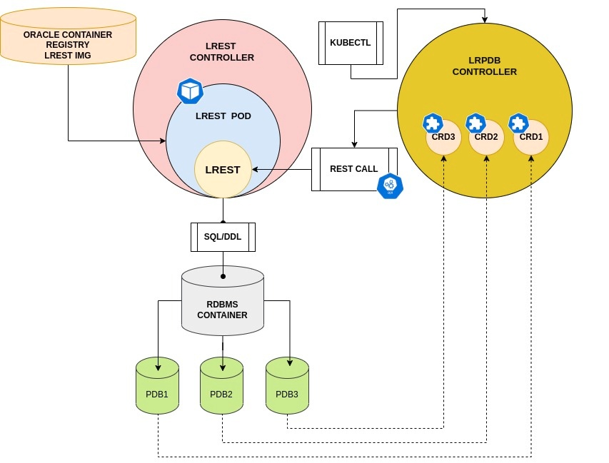

<span style="font-family:Liberation mono; font-size:0.9em; line-height: 1.1em">


# LREST BASED MULTITENANT CONTROLLERS FOR PDB LIFE CYCLE MANAGEMENT 
<!-- TOC -->

- [LREST BASED MULTITENANT CONTROLLERS FOR PDB LIFE CYCLE MANAGEMENT](#lrest-based-multitenant-controllers-for-pdb-life-cycle-management)
  - [STEP BY STEP CONFIGURATION](#step-by-step-configuration)
    - [Multiple namespace setup](#multiple-namespace-setup)
    - [Create the operator](#create-the-operator)
    - [Container database setup](#container-database-setup)
    - [Apply rolebinding](#apply-rolebinding)
    - [Certificate and credentials](#certificate-and-credentials)
      - [Private key 🔑](#private-key-)
      - [Public Key 🔑](#public-key-)
      - [Certificates](#certificates)
    - [Create secrets for certificate and keys](#create-secrets-for-certificate-and-keys)
    - [Create secrets with encrypted password](#create-secrets-with-encrypted-password)
    - [Create lrest pod](#create-lrest-pod)
    - [Create PDB](#create-pdb)
      - [pdb config map ](#pdb-config-map)
    - [Open PDB](#open-pdb)
    - [Close PDB](#close-pdb)
    - [Clone PDB](#clone-pdb)
    - [Unplug PDB](#unplug-pdb)
    - [Plug PDB](#plug-pdb)
    - [Delete PDB](#delete-pdb)
    - [Map PDB](#map-pdb)

<!-- /TOC -->


**Lrpdb** and **lrest** are two controllers for the PDBs life cycle management (**PDBLCM**), they relie on a dedicated rest server (Lite Rest Server). 
Container image to run lrest controller is available on OCR. The container database can be anywhere (on prem and in cloud). 



## STEP BY STEP CONFIGURATION

### Multiple namespace setup

Before proceeding with controllers setup make sure that the operator is configured to work with multiple namespaces as specified in the [README](../../../README.md).
In this document each controller is running in a dedicated namespace: lrest controller is running in **cdbnamespace** , lrpdb controller is running in **pdbnamespace**. The [usecase directory](./usecase/README.md) contains all the files reported in this document.

Configure the **WACTH_NAMESPACE** list of the operator yaml file 

```bash 
sed -i 's/value: ""/value: "oracle-database-operator-system,pdbnamespace,cdbnamespace"/g' oracle-database-operator.yaml
```

### Create the operator

```bash
kubectl apply -f oracle-database-operator.yaml
```
Check controller 
```bash
kubectl get pods -n oracle-database-operator-system
NAME                                                           READY   STATUS    RESTARTS   AGE
oracle-database-operator-controller-manager-796c9b87df-6xn7c   1/1     Running   0          22m
oracle-database-operator-controller-manager-796c9b87df-sckf2   1/1     Running   0          22m
oracle-database-operator-controller-manager-796c9b87df-t4qns   1/1     Running   0          22m
```
### Container database setup

On the container database configure the following account for pdb administration 

```sql
alter session set "_oracle_script"=true;
create user <ADMINUSERNAME> identified by <PASSWORD>;
grant create session to <ADMINUSERNAME> container=all;
grant sysdba to <ADMINUSERNAME> container=all;
```


### Apply rolebinding 


Apply the following files : [pdbnamespace_binding.yaml](./usecase/pdbnamespace_binding.yaml) [cdbnamespace_binding.yaml](./usecase/cdbnamespace_binding.yaml)
```bash
kubectl apply -f pdbnamespace_binding.yaml
kubectl apply -f cdbnamespace_binding.yaml
```

### Certificate and credentials

#### Private key 🔑
> Before starting keys and certificate generation note that only private key **PCKS8**  format is supported by LREST controllers. If you are using [openssl3](https://docs.openssl.org/master/) then pcks8 is generated by default, otherwise use the following command to create a pcks8 private key

```bash
openssl genpkey -algorithm RSA  -pkeyopt rsa_keygen_bits:2048 -pkeyopt rsa_keygen_pubexp:65537 -out private.key
```
#### Public Key 🔑

```bash
/usr/bin/openssl rsa -in private.key -outform PEM  -pubout -out public.pem
```
#### Certificates
```bash
openssl req -new -x509 -days 365 -key private.key -subj "/C=CN/ST=GD/L=SZ/O=oracle, Inc./CN=oracle Root CA" -out ca.crt
```
```bash
openssl req -newkey rsa:2048 -nodes -keyout tls.key -subj "/C=CN/ST=GD/L=SZ/O=oracle, Inc./CN=cdb-dev-lrest.cdbnamespace" -out server.csr
```
```bash
/usr/bin/echo "subjectAltName=DNS:cdb-dev-lrest.cdbnamespace,DNS:www.example.com" > extfile.txt
```
```bash
/usr/bin/openssl x509 -req -extfile extfile.txt -days 365 -in server.csr -CA ca.crt -CAkey private.key -CAcreateserial -out tls.crt
```

### Create secrets for certificate and keys

```bash 
kubectl create secret tls db-tls --key="tls.key" --cert="tls.crt"  -n oracle-database-operator-system 
kubectl create secret generic db-ca --from-file="ca.crt" -n oracle-database-operator-system 
kubectl create secret tls db-tls --key="tls.key" --cert="tls.crt"  -n cdbnamespace 
kubectl create secret generic db-ca --from-file="ca.crt" -n cdbnamespace 
kubectl create secret tls db-tls --key="tls.key" --cert="tls.crt"  -n pdbnamespace 
kubectl create secret generic db-ca --from-file="ca.crt" -n pdbnamespace 
```

```bash
kubectl create secret tls prvkey --key="private.key" --cert=ca.crt  -n cdbnamespace 
kubectl create secret generic pubkey --from-file=publicKey=public.pem -n cdbnamespace 
kubectl create secret generic prvkey --from-file=privateKey="private.key" -n pdbnamespace
```

### Create secrets with encrypted password 

We create secrets for each credential (username and password)

| secret usr | secrets pwd | credential description                                    |
| -----------|-------------|-----------------------------------------------------------|
| **dbuser** |**dbpass**   | the administrative user created on the container database |
| **wbuser** |**wbpass**   | the user for https authentication                         |
| **pdbusr** |**pdbpwd**   | the administrative user of the pdbs                       |


```bash
echo "[ADMINUSERNAME]"           > dbuser.txt 
echo "[ADMINUSERNAME PASSWORD]"  > dbpass.txt 
echo "[WEBUSER]"                 > wbuser.txt 
echo "[WEBUSER PASSWORD]"        > wbpass.txt 
echo "[PDBUSERNAME]"             > pdbusr.txt 
echo "[PDBUSERNAME PASSWORD]"    > pdbpwd.txt 

## Encrypt the credentials
openssl rsautl -encrypt -pubin -inkey public.pem -in dbuser.txt |base64 > e_dbuser.txt 
openssl rsautl -encrypt -pubin -inkey public.pem -in dbpass.txt |base64 > e_dbpass.txt 
openssl rsautl -encrypt -pubin -inkey public.pem -in wbuser.txt |base64 > e_wbuser.txt 
openssl rsautl -encrypt -pubin -inkey public.pem -in wbpass.txt |base64 > e_wbpass.txt 
openssl rsautl -encrypt -pubin -inkey public.pem -in pdbusr.txt |base64 > e_pdbusr.txt 
openssl rsautl -encrypt -pubin -inkey public.pem -in pdbpwd.txt |base64 > e_pdbpwd.txt 

kubectl create secret generic dbuser --from-file=e_dbuser.txt -n  cdbnamespace 
kubectl create secret generic dbpass --from-file=e_dbpass.txt -n  cdbnamespace 
kubectl create secret generic wbuser --from-file=e_wbuser.txt -n  cdbnamespace 
kubectl create secret generic wbpass --from-file=e_wbpass.txt -n  cdbnamespace 
kubectl create secret generic wbuser --from-file=e_wbuser.txt -n  pdbnamespace 
kubectl create secret generic wbpass --from-file=e_wbpass.txt -n  pdbnamespace 
kubectl create secret generic pdbusr --from-file=e_pdbusr.txt -n  pdbnamespace 
kubectl create secret generic pdbpwd --from-file=e_pdbpwd.txt -n  pdbnamespace 

rm  dbuser.txt dbpass.txt wbuser.txt wbpass.txt pdbusr.txt pdbpwd.txt \
    e_dbuser.txt e_dbpass.txt e_wbuser.txt e_wbpass.txt e_pdbusr.txt e_pdbpwd.txt
```

### Create lrest pod

Use yaml file [create_lrest_pod.yaml](./usecase/create_lrest_pod.yaml) to create the rest pod and monitor the execution.

Be sure to update the **lrestImage** with latest version available on the [Oracle Container Registry](https://container-registry.oracle.com/ords/f?p=113:4:104288359787984:::4:P4_REPOSITORY,AI_REPOSITORY,AI_REPOSITORY_NAME,P4_REPOSITORY_NAME,P4_EULA_ID,P4_BUSINESS_AREA_ID:1283,1283,This%20image%20is%20part%20of%20and%20for%20use%20with%20the%20Oracle%20Database%20Operator%20for%20Kubernetes,This%20image%20is%20part%20of%20and%20for%20use%20with%20the%20Oracle%20Database%20Operator%20for%20Kubernetes,1,0&cs=3076h-hg1qX3eJANBcUHBNBCmYWjMvxLkZyTAhDn2e8VR8Gxb_a-I8jZLhf9j6gmnimHwlP_a0OQjX6vjBfSAqQ) 

```bash
--> for amd64
lrestImage: container-registry.oracle.com/database/operator:lrest-241210-amd64

--> for arm64
lrestImage: container-registry.oracle.com/database/operator:lrest-241210-arm64
```

```bash 
kubectl apply -f create_lrest_pod.yaml
```

monitor the execution:

```bash 
kubectl get pods -n cdbnamespace --watch
NAME                     READY   STATUS    RESTARTS   AGE
cdb-dev-lrest-rs-9gvx2   0/1     Pending   0          0s
cdb-dev-lrest-rs-9gvx2   0/1     Pending   0          0s
cdb-dev-lrest-rs-9gvx2   0/1     ContainerCreating   0          0s
cdb-dev-lrest-rs-9gvx2   1/1     Running             0          2s

kubectl get lrest -n cdbnamespace
NAME CDB NAME   DB SERVER   DB PORT   TNS STRING  REPLICAS   STATUS   MESSAGE
cdb-dev   DB12                             (DESCRIPTION=(CONNECT_TIMEOUT=90)(RETRY_COUNT=30)(RETRY_DELAY=10)(TRANSPORT_CONNECT_TIMEOUT=70)(LOAD_BALLANCE=ON)(ADDRESS=(PROTOCOL=TCP)(HOST=scan12.testrac.com)(PORT=1521)(IP=V4_ONLY))(LOAD_BALLANCE=ON)(ADDRESS=(PROTOCOL=TCP)(HOST=scan34.testrac.com)(PORT=1521)(IP=V4_ONLY))(CONNECT_DATA=(SERVER=DEDICATED)(SERVICE_NAME=TESTORDS)))   1          Ready
```

Check pod logs: 

```bash 
/usr/local/go/bin/kubectl logs -f `/usr/local/go/bin/kubectl get pods -n cdbnamespace|grep lrest|cut -d ' ' -f 1` -n cdbnamespace
```

Output example:

```text
...
...
2024/09/05 12:44:09 wallet file /opt/oracle/lrest/walletfile exists completed
2024/09/05 12:44:09 call: C.ReadWallet
LENCHECK: 7 11 7 8
2024/09/05 12:44:09 ===== DUMP INFO ====
00000000  28 44 45 53 43 52 49 50  54 49 4f 4e 3d 28 43 4f  |(DESCRIPTION=(CO|
00000010  4e 4e 45 43 54 5f 54 49  4d 45 4f 55 54 3d 39 30  |NNECT_TIMEOUT=90|
00000020  29 28 52 45 54 52 59 5f  43 4f 55 4e 54 3d 33 30  |)(RETRY_COUNT=30|
00000030  29 28 52 45 54 52 59 5f  44 45 4c 41 59 3d 31 30  |)(RETRY_DELAY=10|
00000040  29 28 54 52 41 4e 53 50  4f 52 54 5f 43 4f 4e 4e  |)(TRANSPORT_CONN|
00000050  45 43 54 5f 54 49 4d 45  4f 55 54 3d 37 30 29 28  |ECT_TIMEOUT=70)(|
00000060  4c 4f 41 44 5f 42 41 4c  4c 41 4e 43 45 3d 4f 4e  |LOAD_BALLANCE=ON|
00000070  29 28 41 44 44 52 45 53  53 3d 28 50 52 4f 54 4f  |)(ADDRESS=(PROTO|
00000080  43 4f 4c 3d 54 43 50 29  28 48 4f 53 54 3d 73 63  |COL=TCP)(HOST=sc|
00000090  61 6e 31 32 2e 74 65 73  74 72 61 63 2e 63 6f 6d  |an12.testrac.com|
000000a0  29 28 50 4f 52 54 3d 31  35 32 31 29 28 49 50 3d  |)(PORT=1521)(IP=|
000000b0  56 34 5f 4f 4e 4c 59 29  29 28 4c 4f 41 44 5f 42  |V4_ONLY))(LOAD_B|
000000c0  41 4c 4c 41 4e 43 45 3d  4f 4e 29 28 41 44 44 52  |ALLANCE=ON)(ADDR|
000000d0  45 53 53 3d 28 50 52 4f  54 4f 43 4f 4c 3d 54 43  |ESS=(PROTOCOL=TC|
000000e0  50 29 28 48 4f 53 54 3d  73 63 61 6e 33 34 2e 74  |P)(HOST=scan34.t|
000000f0  65 73 74 72 61 63 2e 63  6f 6d 29 28 50 4f 52 54  |estrac.com)(PORT|
00000100  3d 31 35 32 31 29 28 49  50 3d 56 34 5f 4f 4e 4c  |=1521)(IP=V4_ONL|
00000110  59 29 29 28 43 4f 4e 4e  45 43 54 5f 44 41 54 41  |Y))(CONNECT_DATA|
00000120  3d 28 53 45 52 56 45 52  3d 44 45 44 49 43 41 54  |=(SERVER=DEDICAT|
00000130  45 44 29 28 53 45 52 56  49 43 45 5f 4e 41 4d 45  |ED)(SERVICE_NAME|
00000140  3d 54 45 53 54 4f 52 44  53 29 29 29              |=TESTORDS)))|
00000000  2f 6f 70 74 2f 6f 72 61  63 6c 65 2f 6c 72 65 73  |/opt/oracle/lres|
00000010  74 2f 77 61 6c 6c 65 74  66 69 6c 65              |t/walletfile|
2024/09/05 12:44:09 Get credential from wallet
7
8
2024/09/05 12:44:09 dbuser: restdba webuser :welcome
2024/09/05 12:44:09 Connections Handle
2024/09/05 12:44:09 Working Session Aarry dbhanlde=0x1944120
2024/09/05 12:44:09 Monitor Session Array dbhanlde=0x1a4af70
2024/09/05 12:44:09 Open cursors
Parsing sqltext=select inst_id,con_id,open_mode,nvl(restricted,'NONE'),total_size from gv$pdbs where inst_id = SYS_CONTEXT('USERENV','INSTANCE') and name =upper(:b1)
Parsing sqltext=select count(*) from pdb_plug_in_violations where name =:b1
2024/09/05 12:44:11 Protocol=https
2024/09/05 12:44:11 starting HTTPS/SSL server
2024/09/05 12:44:11 ==== TLS CONFIGURATION ===
2024/09/05 12:44:11 srv=0xc000106000
2024/09/05 12:44:11 cfg=0xc0000a2058
2024/09/05 12:44:11 mux=0xc0000a2050
2024/09/05 12:44:11 tls.minversion=771
2024/09/05 12:44:11 CipherSuites=[49200 49172 157 53]
2024/09/05 12:44:11 cer=/opt/oracle/lrest/certificates/tls.crt
2024/09/05 12:44:11 key=/opt/oracle/lrest/certificates/tls.key
2024/09/05 12:44:11 ==========================
2024/09/05 12:44:11 HTTPS: Listening port=8888
2024/09/05 12:44:23 call BasicAuth Succeded
2024/09/05 12:44:23 HTTP: [1:0] Invalid credential <-- This message can be ignored

```

**lrest pod creation** - parameters list
|  Name                   | Dcription                                                                     |
--------------------------|-------------------------------------------------------------------------------|
|cdbName                  | Name of the container db                                                      |
|lrestImage (DO NOT EDIT) | **container-registry.oracle.com/database/lrest-dboper:latest**                |
|dbTnsurl                 | Tns alias of the container db                                                 |
|deletePdbCascade         | Delete all the pdbs associated to cdb resource when cdb resource it is dropped using [imperative approach](https://kubernetes.io/docs/tasks/manage-kubernetes-objects/imperative-command/)  |
|cdbAdminUser             | Secret: the admin user                                                     |
|cdbAdminPwd              | Secret: the admin user password                                            |
|webServerUser            | Secret: the https user                                                     |
|webServerPwd             | Secret: the https user password                                            |
|cdbTlsCrt                | Secret: the tls.crt                                                        |
|cdbPubKey                | Secret: the public key                                                     |
|cdbPrvKey                | Secret: the private key                                                    |


### Create PDB  

Apply yaml file [create_lrpdb1_resource.yaml](./usecase/clone_lrpdb1_resource.yaml) to create a pluggable database 

```bash
kubectl apply -f create_lrpdb1_resource.yaml
```
Check the status of the resource and the pdb existence on the container db 

```bash 
kubectl get lrpdb -n pdbnamespace
NAME CONNECT_STRING CDB NAME   LRPDB NAME   LRPDB STATE   LRPDB SIZE   STATUS   MESSAGE   LAST SQLCODE
lrpdb1   (DESCRIPTION=(CONNECT_TIMEOUT=90)(RETRY_COUNT=30)(RETRY_DELAY=10)(TRANSPORT_CONNECT_TIMEOUT=70)(LOAD_BALLANCE=ON)(ADDRESS=(PROTOCOL=TCP)(HOST=scan12.testrac.com)(PORT=1521)(IP=V4_ONLY))(LOAD_BALLANCE=ON)(ADDRESS=(PROTOCOL=TCP)(HOST=scan34.testrac.com)(PORT=1521)(IP=V4_ONLY))(CONNECT_DATA=(SERVER=DEDICATED)(SERVICE_NAME=pdbdev))) DB12  pdbdev  MOUNTED  2G  Ready  Success 
```

```bash 
SQL> show pdbs

    CON_ID CON_NAME                       OPEN MODE  RESTRICTED
---------- ------------------------------ ---------- ----------
         2 PDB$SEED                       READ ONLY  NO
         3 PDBDEV                         MOUNTED
SQL> 
```
Note that after creation the pdb is not open you need to explicitly open it using dedicated yaml file.

**pdb creation** - parameters list

|  Name                   | Dcription                                                                     |
|-------------------------|-------------------------------------------------------------------------------|
|cdbResName               | Rest server resource name                                                     |
|cdbNamespace             | Namespace of the rest server                                                  |
|cdbName                  | Name of the container database                                                |
|pdbName                  | Name of the pluggable database to be created                                  |
|assertiveLrpdbDeletion   | Boolean: turn on the imperative approach on pdb resource deletion             |
|adminpdbUser             | Secret: pluggable database administrative user                                |
|adminpdbPass             | Secret: password of pluggable database admin user                             |
|lrpdbTlsKey              | Secret: tls.key                                                               |
|lrpdbTlsCrt              | Secret: tls.crt                                                               |
|lrpdbTlsCat              | Secret: ca.crt                                                                |
|webServerUser            | Secret: the https user                                                        |
|webServerPwd             | Secret: the https user password                                               |
|cdbPrvKey                | Secret: private key                                                           |
|cdbPubKey                | Secret: public key                                                            |
|pdbconfigmap             | kubernet config map which contains pdb init parameters                        |

> NOTE: **assertiveLrpdbDeletion** needs to be specified for the following pdb actions **CLONE** **CREATE** **PLUG** **MAP**.  

🔥 **assertiveLrpdbDeletion** drops pluggable database using **INCLUDE DATAFILES** option

All these parameters **adminpdbUser** **adminpdbPass** **lrpdbTlsKey** **lrpdbTlsCrt** **lrpdbTlsCat** **webServerUser** **webServerPwd** **cdbPrvKey** **cdbPubKey** need to be specified in all pdb life cycle management yaml files; for the sake of simplicity, they won't be exposed in the subsequent tables.


#### pdb config map 

Using **pdbconfigmap** it's possible to specify a kubernetes configmap with  init pdb parameters. The config map payload has the following scaffold:


```
<parameter name1>;<parameter value1>;<scope:system|spfile|both>
<parameter name2>;<parameter value2>;<scope:system|spfile|both>
<parameter name3>;<parameter value3>;<scope:system|spfile|both>
....
....
<parameter nameN>;<parameter valueN>;<scope:system|spfile|both>
```

example of configmap creation:

```bash
cat <<EOF > parameters.txt
session_cached_cursors;100;spfile      
open_cursors;100;spfile                 
db_file_multiblock_read_count;16;spfile  
EOF

kubectl create  configmap config-map-pdb -n pdbnamespace --from-file=./parameters.txt

kubectl describe configmap config-map-pdb -n pdbnamespace
Name:         config-map-pdb
Namespace:    pdbnamespace
Labels:       <none>
Annotations:  <none>

Data
====
parameters.txt:
----
session_cached_cursors;100;spfile
open_cursors;100;spfile
db_file_multiblock_read_count;16;spfile
test_invalid_parameter;16;spfile
```

- Configmap, if specified, is applied during pdb **cloning**, **opening** and **plugging**
- Configmap is not monitored by the reconciliation loop; this feature will be available in feature releases. This means that  if someone decides to manually alter an init parameter the operator does not take any actions to syncronize pdb configuration with config map.
- **Alter system parameter feature** will be available in future releases. 
- A ConfigMap application error (whatever reason) does not stop the execution of the process. A warning with sqlcode is reported in the logfile.


### Open PDB

Use file [open_lrpdb1_resource.yaml](./usecase/open_lrpdb1_resource.yaml) to open pdb. 

```bash
kubectl apply -f open_lrpdb1_resource.yaml
```
 
 **pdb opening** - parameters list
 
|  Name                   | Dcription/Value                                                               |
|-------------------------|-------------------------------------------------------------------------------|
|cdbResName               | Rest server resource name                                                     |
|cdbNamespace             | Namespace of the rest server                                                  |
|cdbName                  | Name of the container database                                                |
|pdbName                  | Name of the pluggable database to be created                                  |
|action                   | Use **Modify** to open PDB                                                    |
|pdbState                 | Use **OPEN**  to open PDB                                                     |
|modifyOption             | Use **READ WRITE** to open PDB                                                |

### Close PDB

Use file [close_lrpdb1_resource.yaml](./usecase/close_lrpdb1_resource.yaml) to close pdb. 

```bash
kubectl apply -f close_lrpdb1_resource.yaml
```
**pdb closing** - parameters list 
|  Name                   | Dcription/Value                                                               |
|-------------------------|-------------------------------------------------------------------------------|
|cdbResName               | Rest server resource name                                                     |
|cdbNamespace             | Namespace of the rest server                                                  |
|cdbName                  | Name of the container database                                                |
|pdbName                  | Name of the pluggable database to be created                                  |
|action                   | Use **Modify** to close PDB                                                   |
|pdbState                 | Use **CLOSE**  to close PDB                                                   |
|modifyOption             | Use **IMMEDIATE** to close PDB                                                |

### Clone PDB ### 

Use file [clone_lrpdb1_resource.yaml](./usecase/clone_lrpdb1_resource.yaml) to clone pdb. 

```bash
kubeclt apply -f clone_lrpdb1_resource.yaml
```
**pdb cloning** - parameters list 
|  Name                   | Dcription/Value                                                               |
|-------------------------|-------------------------------------------------------------------------------|
|cdbResName               | Rest server resource name                                                     |
|cdbNamespace             | Namespace of the rest server                                                  |
|cdbName                  | Name of the container database                                                |
|pdbName                  | The name of the new pdb                                                       |
|srcPdbName               | The name of source pdb                                                        |
|fileNameConversions      | File name convert pattern  **("path1","path2")** or **NONE**                  | 
|totalSize                | Set **unlimited** for cloning                                                 |
|tempSize                 | Set **unlimited** for cloning                                                 |
|pdbconfigmap             | kubernet config map which contains pdb init parameters                        |
|action                   | Use **clone** to clone  PDB                                                   |

### Unplug PDB

Use file [unplug_lrpdb1_resource.yaml](./usecase/unplug_lrpdb1_resource.yaml) to unplug PDB 

**pdb unplugging** 
|  Name                   | Dcription/Value                                                               |
|-------------------------|-------------------------------------------------------------------------------|
|cdbResName               | Rest server resource name                                                     |
|cdbNamespace             | Namespace of the rest server                                                  |
|cdbName                  | Name of the container database                                                |
|pdbName                  | The name of the pdb                                                           |
|**xmlFileName**          | Path of the xml file                                                          |
|action                   | **Unplug**                                                                    |

### Plug PDB 

Use file [plug_lrpdb1_resource.yaml](./usecase/plug_lrpdb1_resource.yaml) to plug PDB (in this example we plug the pdb unpluged in the previous step)

**pdb plugging** 
|  Name                   | Dcription/Value                                                               |
|-------------------------|-------------------------------------------------------------------------------|
|cdbResName               | Rest server resource name                                                     |
|cdbNamespace             | Namespace of the rest server                                                  |
|cdbName                  | Name of the container database                                                |
|pdbName                  | The name of the pdb                                                           |
|**xmlFileName**          | Path of the xml file                                                          |
|action                   | **plug**                                                                      |
|fileNameConversions      | File name convert pattern  **("path1","path2")** or **NONE**                  | 
|sourceFileNameConversion | See parameter [SOURCE_FILE_NAME_CONVERT](https://docs.oracle.com/en/database/oracle/oracle-database/23/sqlrf/CREATE-PLUGGABLE-DATABASE.html#GUID-F2DBA8DD-EEA8-4BB7-A07F-78DC04DB1FFC__CCHEJFID) documentation                          |
|pdbconfigmap             | kubernet config map which contains pdb init parameters                        |

### Delete PDB

Use file [delete_lrpdb1_resource.yaml](./usecase/delete_lrpdb1_resource.yaml)

**pdb deletion** 

|  Name                   | Dcription/Value                                                               |
|-------------------------|-------------------------------------------------------------------------------|
|cdbResName               | Rest server resource name                                                     |
|cdbNamespace             | Namespace of the rest server                                                  |
|cdbName                  | Name of the container database                                                |
|action                   | **Delete**                                                                    |
|dropAction               | **INCLUDING** - Including datafiles or **NONE**                               |


### Map PDB

If you need to create a CRD for an existing PDB you can use the map option by applying the file [map_lrpdb1_resource.yaml](./usecase/map_lrpdb1_resource.yaml)


</span>
