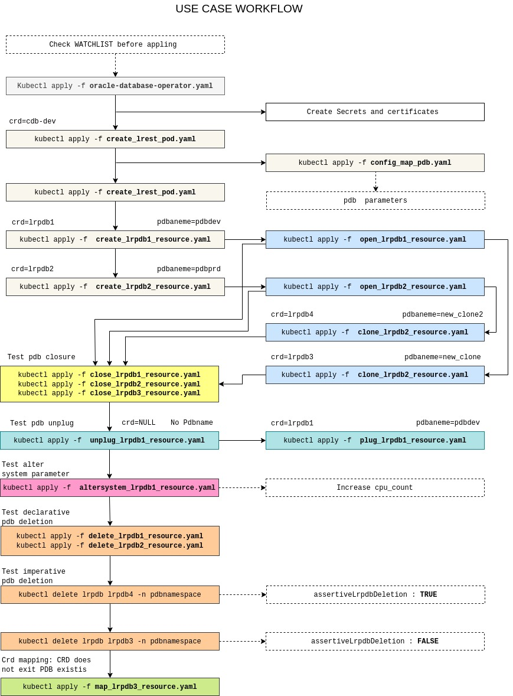

<span style="font-family:Liberation mono; font-size:0.9em; line-height: 1.1em">


# Use case directory 

The use case directory contains the yaml files to test the multitenant controller functionalities: create lrest pod and pdb operation  *create / open / close / unplug / plug / delete / clone /map / parameter session*  

## Makefile helper

Customizing yaml files (tns alias / credential / namespaces name etc...) is a long procedure prone to human error. A simple [makefile](../usecase/makefile) is available to quickly and safely configure yaml files with your system environment information. Just edit the [parameter file](../usecase/parameters.txt)  before proceding. 

```text 
TNSALIAS...............:[Tnsalias do not use quotes and avoid space in the string --> (DESCRIPTION=(CONNECT_TIMEOUT=90)(RETRY_COUNT=30)(RETRY_DELA....]
DBUSER.................:[CDB admin user]
DBPASS.................:[CDB admin user password]
WBUSER.................:[HTTPS user]
WBPASS.................:[HTTPS user password]
PDBUSR.................:[PDB admin user]
PDBPWD.................:[PDB admin user password]
PDBNAMESPACE...........:[pdb namespace]
LRSNAMESPACE...........:[cdb namespace]
COMPANY................:[your company name]
APIVERSION.............:v4 --> do not edit 
```

⚠ **WARNING: The makefile is intended to speed up the usecase directory configuartion only, it is not supported, the editing and configuration of yaml files for production system is left up to the end user** 

### Pre requisistes:  

- Make sure that **kubectl** is properly configured.
- Make sure that all requirements listed in the [operator installation page](../../../../docs/installation/OPERATOR_INSTALLATION_README.md) are implemented. (role binding,webcert,etc)
- Make sure that administrative user on the container database is configured as documented.

```bash
make operator
```
This command creates the operator-database-operator.yaml in the local directory and set up the watchnamespace list. Note that the yaml file is not applyed.

```bash
make secrets
```
All the secrets with the ecrypted credential are created by this command execution. 

```bash
make genyaml
```
*make genyaml* generates the required yaml files to work with multitenant controllers.




## Diag commands and troubleshooting

### Connect to rest server pod

```bash 
/usr/bin/kubectl exec   <podname> -n <namespace> -it -- /bin/bash
```


```bash 
## example ##

kubectl get pods -n cdbnamespace
NAME                     READY   STATUS    RESTARTS      AGE
cdb-dev-lrest-rs-fnw99   1/1     Running   1 (17h ago)   18h

kubectl exec  cdb-dev-lrest-rs-fnw99 -n cdbnamespace -it -- /bin/bash
[oracle@cdb-dev-lrest-rs-fnw99 ~]$
```

### Monitor control plane

```bash
kubectl logs -f -l control-plane=controller-manager -n oracle-database-operator-system
```
```bash 
## output example: ##
2024-10-28T23:54:25Z    INFO    lrpdb-webhook   ValidateUpdate-Validating LRPDB spec for : lrpdb2
2024-10-28T23:54:25Z    INFO    lrpdb-webhook   validateCommon  {"name": "lrpdb2"}
2024-10-28T23:54:25Z    INFO    lrpdb-webhook   Valdiating LRPDB Resource Action : MODIFY
2024-10-29T10:07:34Z    INFO    lrpdb-webhook   ValidateUpdate-Validating LRPDB spec for : lrpdb2
2024-10-29T10:07:34Z    INFO    lrpdb-webhook   ValidateUpdate-Validating LRPDB spec for : lrpdb1
2024-10-29T16:49:15Z    INFO    lrpdb-webhook   ValidateUpdate-Validating LRPDB spec for : lrpdb1
2024-10-29T16:49:15Z    INFO    lrpdb-webhook   validateCommon  {"name": "lrpdb1"}
2024-10-29T16:49:15Z    INFO    lrpdb-webhook   Valdiating LRPDB Resource Action : CREATE
2024-10-29T10:07:20Z    INFO    controller-runtime.certwatcher  Updated current TLS certificate
2024-10-29T10:07:20Z    INFO    controller-runtime.webhook      Serving webhook server  {"host": "", "port": 9443}
2024-10-29T10:07:20Z    INFO    controller-runtime.certwatcher  Starting certificate watcher
I1029 10:07:20.189724       1 leaderelection.go:250] attempting to acquire leader lease oracle-database-operator-system/a9d608ea.oracle.com...
2024-10-29T16:49:15Z    INFO    lrpdb-webhook   Setting default values in LRPDB spec for : lrpdb1

```

### Error decrypting credential 

Resource creation failure due to decription error 

```text 
2024-10-30T10:09:08Z    INFO    controllers.LRPDB       getEncriptedSecret :pdbusr      {"getEncriptedSecret": {"name":"lrpdb1","namespace":"pdbnamespace"}}
2024-10-30T10:09:08Z    ERROR   controllers.LRPDB       Failed to parse private key - x509: failed to parse private key (use ParsePKCS1PrivateKey instead for this key format)     {"DecryptWithPrivKey": {"name":"lrpdb1","namespace":"pdbnamespace"}, "error": "x509: failed to parse private key (use ParsePKCS1PrivateKey instead for this key format)"}
```
</span>

**Solution**: make sure to use **PCKS8** format during private key generation. If you are not using openssl3 then execute this command

```bash
openssl genpkey -algorithm RSA  -pkeyopt rsa_keygen_bits:2048 -pkeyopt rsa_keygen_pubexp:65537 > mykey
```

### Crd details 

Use **describe** option to get crd information

```bash
kubectl describe lrpdb lrpdb1 -n pdbnamespace
[...]
    Secret:
      Key:          e_wbuser.txt
      Secret Name:  wbuser
Status:
  Action:       CREATE
  Bitstat:      25
  Bitstatstr:   |MPAPPL|MPWARN|MPINIT|
  Conn String:  (DESCRIPTION=(CONNECT_TIMEOUT=90)(RETRY_COUNT=30)(RETRY_DELAY=10)(TRANSPORT_CONNECT_TIMEOUT=70)(LOAD_BALLANCE=ON)(ADDRESS=(PROTOCOL=TCP)(HOST=scan12.testrac.com)(PORT=1521)(IP=V4_ONLY))(LOAD_BALLANCE=ON)(ADDRESS=(PROTOCOL=TCP)(HOST=scan34.testrac.com)(PORT=1521)(IP=V4_ONLY))(CONNECT_DATA=(SERVER=DEDICATED)(SERVICE_NAME=pdbdev)))
  Msg:          Success
  Open Mode:    MOUNTED
  Phase:        Ready
  Status:       true
  Total Size:   2G
Events:
  Type     Reason     Age                   From   Message
  ----     ------     ----                  ----   -------
  Normal   Created    108s                  LRPDB  LRPDB 'pdbdev' created successfully
  Normal   Created    108s                  LRPDB  PDB 'pdbdev' assertive pdb deletion turned on
  Warning  LRESTINFO  95s                   LRPDB  pdb=pdbdev:test_invalid_parameter:16:spfile:2065
  Warning  Done       15s (x12 over 2m25s)  LRPDB  cdb-dev

```