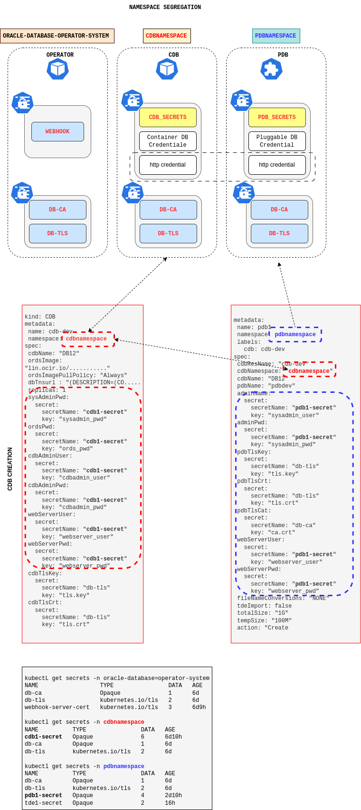

# Namespace segregation

With the namespace segregation pdb controller and cdb controller run in different namespaces. The new functionality introduces a new parameter (the cdb namespace) in pdb crd definition. In case you don't need the namespace segregation you have to sepcify the namespace name that you are using for yours crd and pods anyway. Refer to usercase01 and usecase02 to see single namespace configuration. Refer to usecase03 to see examples of namespace segregation. 

# Secrets 

In order to use multiple namespace we need to create approriate secrets in each namespace. Tls certificate secrets must be created in all namespaces (db-ca db-tls). 

