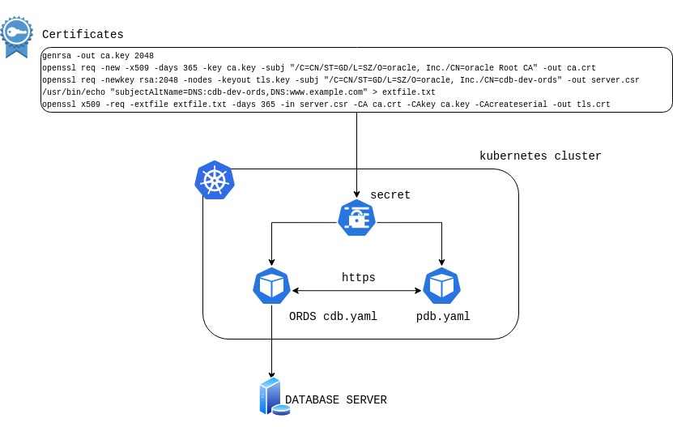

<span style="font-family:Liberation mono; font-size:0.8em; line-height: 1.2em">

# Oracle Multitenant Database Controllers 

The Oracle Database Operator for Kubernetes uses two controllers to manage the [Pluggable Database lifecycle][oradocpdb]

- CDB controller
- PDB controller

By using CDB/PDB controllers, you can perform the following actions **CREATE**, **MODIFY(OPEN/COSE)**, **DELETE**, **CLONE**, **PLUG** and **UNPLUG** against pluggable database

Examples are located under the following directories:

- the directories [`Usecase`](./usecase/) and [`usecase01`](./usecase01/) contain a [configuration file](./usecase/parameters.txt)  where you can specify all the details of your environment. A [`makefile`](./usecase/makefile) takes this file as input to generate all of the `yaml` files. There is no need to edit `yaml` files one by one.
- [Singlenamespace provisioning](./provisioning/singlenamespace/) This file contains base example files that you can use to manage the PDB and CDB within a single namespace. 
- [Multinamespace provisioning](./provisioning/multinamespace/) This file contains base example files that you can use to manage the PDB and CDB in different namespaces.
- [Usecase01](./usecase01/README.md) [Usecase02](./usecase02/README.md) This file contains other step-by-step examples; 

Automatic `yaml` generation is not available for the directory `usecase02` and provisioning directories. 

**NOTE** the CDB controller is not intended to manage the container database. The CDB controller is meant to provide a pod with a REST server connected to the container database that you can use to manage PDBs. 


## Macro steps for setup

- Deploy the Oracle Database Operator (operator, or `OraOperator`)
- [Create Ords based image for CDB pod](./provisioning/ords_image.md)
- [Container RDBMB user creation](#prepare-the-container-database-for-pdb-lifecycle-management-pdb-lm)
- Create certificates for https connection 
- Create secrets for credentials and certificates 
- Create CDB pod using the Ords based image

## Oracle DB Operator Multitenant Database Controller Deployment

To deploy `OraOperator`, use this [Oracle Database Operator for Kubernetes](https://github.com/oracle/oracle-database-operator/blob/main/README.md) step-by-step procedure.

After the **Oracle Database Operator** is deployed, you can see the Oracle Database (DB) Operator Pods running in the Kubernetes Cluster. The multitenant controllers are deployed as part of the `OraOperator` deployment. You can see the CRDs (Custom Resource Definition) for the CDB and PDBs in the list of CRDs. The following output is an example of such a deployment:

```bash
[root@test-server oracle-database-operator]# kubectl get ns
NAME                              STATUS   AGE
cert-manager                      Active   32h
default                           Active   245d
kube-node-lease                   Active   245d
kube-public                       Active   245d
kube-system                       Active   245d
oracle-database-operator-system   Active   24h    <---- namespace to deploy the Oracle Database Operator

[root@test-server oracle-database-operator]# kubectl get all -n  oracle-database-operator-system
NAME                                                               READY   STATUS    RESTARTS   AGE
pod/oracle-database-operator-controller-manager-665874bd57-dlhls   1/1     Running   0          28s
pod/oracle-database-operator-controller-manager-665874bd57-g2cgw   1/1     Running   0          28s
pod/oracle-database-operator-controller-manager-665874bd57-q42f8   1/1     Running   0          28s

NAME                                                                  TYPE        CLUSTER-IP      EXTERNAL-IP   PORT(S)    AGE
service/oracle-database-operator-controller-manager-metrics-service   ClusterIP   10.96.130.124   <none>        8443/TCP   29s
service/oracle-database-operator-webhook-service                      ClusterIP   10.96.4.104     <none>        443/TCP    29s

NAME                                                          READY   UP-TO-DATE   AVAILABLE   AGE
deployment.apps/oracle-database-operator-controller-manager   3/3     3            3           29s

NAME                                                                     DESIRED   CURRENT   READY   AGE
replicaset.apps/oracle-database-operator-controller-manager-665874bd57   3         3         3       29s
[root@docker-test-server oracle-database-operator]# 

[root@test-server oracle-database-operator]# kubectl get crd
NAME                                               CREATED AT
autonomouscontainerdatabases.database.oracle.com   2022-06-22T01:21:36Z
autonomousdatabasebackups.database.oracle.com      2022-06-22T01:21:36Z
autonomousdatabaserestores.database.oracle.com     2022-06-22T01:21:37Z
autonomousdatabases.database.oracle.com            2022-06-22T01:21:37Z
cdbs.database.oracle.com                           2022-06-22T01:21:37Z <----
certificaterequests.cert-manager.io                2022-06-21T17:03:46Z
certificates.cert-manager.io                       2022-06-21T17:03:47Z
challenges.acme.cert-manager.io                    2022-06-21T17:03:47Z
clusterissuers.cert-manager.io                     2022-06-21T17:03:48Z
dbcssystems.database.oracle.com                    2022-06-22T01:21:38Z
issuers.cert-manager.io                            2022-06-21T17:03:49Z
oraclerestdataservices.database.oracle.com         2022-06-22T01:21:38Z
orders.acme.cert-manager.io                        2022-06-21T17:03:49Z 
pdbs.database.oracle.com                           2022-06-22T01:21:39Z <---
shardingdatabases.database.oracle.com              2022-06-22T01:21:39Z
singleinstancedatabases.database.oracle.com        2022-06-22T01:21:40Z
```


## Prerequisites to manage PDB Life Cycle using Oracle DB Operator Multitenant Database Controller

* [Prepare the container database (CDB) for PDB Lifecycle Management or PDB-LM](#prepare-cdb-for-pdb-lifecycle-management-pdb-lm)
* [Oracle REST Data Service or ORDS Image](#oracle-rest-data-service-ords-image)
* [Kubernetes Secrets](#kubernetes-secrets)
* [Kubernetes CRD for CDB](#cdb-crd)
* [Kubernetes CRD for PDB](#pdb-crd)

## Prepare the container database for PDB Lifecycle Management (PDB-LM)

Pluggable Database (PDB) management operations are performed in the Container Database (CDB). These operations include **create**, **clone**, **plug**, **unplug**, **delete**, **modify** and **map pdb**.

To perform PDB lifecycle management operations, you must first use the following steps to define the default CDB administrator credentials on target CDBs:

Create the CDB administrator user and grant the required privileges. In this example, the user is `C##DBAPI_CDB_ADMIN`. However, any suitable common username can be used.

```SQL
SQL> conn /as sysdba
 
-- Create following users at the database level:

ALTER SESSION SET "_oracle_script"=true;
DROP USER  C##DBAPI_CDB_ADMIN cascade;
CREATE USER C##DBAPI_CDB_ADMIN IDENTIFIED BY <Password> CONTAINER=ALL ACCOUNT UNLOCK;
GRANT SYSOPER TO C##DBAPI_CDB_ADMIN CONTAINER = ALL;
GRANT SYSDBA TO C##DBAPI_CDB_ADMIN CONTAINER = ALL;
GRANT CREATE SESSION TO C##DBAPI_CDB_ADMIN CONTAINER = ALL;


-- Verify the account status of the following usernames. They should not be in locked status:

col username        for a30
col account_status  for a30
select username, account_status from dba_users where username in ('ORDS_PUBLIC_USER','C##DBAPI_CDB_ADMIN','APEX_PUBLIC_USER','APEX_REST_PUBLIC_USER');
```

## OCI OKE (Kubernetes Cluster) 

You can use an [OKE in Oracle Cloud Infrastructure][okelink] to configure the controllers for PDB lifecycle management. **Note that there is no restriction about container database location; it can be anywhere (on Cloud or on-premises).** 
To quickly create an OKE cluster in your OCI cloud environment you can use the following [link](./provisioning/quickOKEcreation.md).
In this setup example [provisioning example setup](./provisioning/example_setup_using_oci_oke_cluster.md), the Container Database is running on an OCI Exadata Database Cluster.

 
## Oracle REST Data Service (ORDS) Image

The PDB Database controllers require a pod running a dedicated REST server image based on [ORDS][ordsdoc]. Read the following [document on ORDS images](./provisioning/ords_image.md) to build the ORDS images.
  

## Kubernetes Secrets

  Multitenant Controllers use Kubernetes Secrets to store the required credential and HTTPS certificates.

  **Note** <span style="color:red"> In multi-namespace environments you must create specific Secrets for each namespaces. </span>

### Secrets for CERTIFICATES

Create the certificates and key on your local host, and then use them to create the Kubernetes Secret.

```bash 
openssl genrsa -out ca.key 2048
openssl req -new -x509 -days 365 -key ca.key -subj "/C=US/ST=California/L=SanFrancisco/O=oracle /CN=cdb-dev-ords /CN=localhost  Root CA " -out ca.crt
openssl req -newkey rsa:2048 -nodes -keyout tls.key -subj "/C=US/ST=California/L=SanFrancisco/O=oracle /CN=cdb-dev-ords /CN=localhost" -out server.csr
echo "subjectAltName=DNS:cdb-dev-ords,DNS:www.example.com" > extfile.txt
openssl x509 -req -extfile extfile.txt -days 365 -in server.csr -CA ca.crt -CAkey ca.key -CAcreateserial -out tls.crt
```

```bash
kubectl create secret tls db-tls --key="tls.key" --cert="tls.crt"  -n oracle-database-operator-system
kubectl create secret generic db-ca --from-file=ca.crt -n oracle-database-operator-system
```



**Note:** <span style="color:red">  Remove temporary files after successfful Secret creation. </span> 

### Secrets for CDB CRD

  **Note:** <span style="color:red">  base64 encoded secrets are no longer supported; use OpenSSL secrets as documented in the following section.  After successful creation of the CDB Resource, the CDB and PDB Secrets can be deleted from the Kubernetes system. Don't leave plaintext files containing sensitive data on disk. After loading the Secret, remove the plaintext file or move it to secure storage. </span>

  ```bash

export PRVKEY=ca.key
export PUBKEY=public.pem
WBUSERFILE=wbuser.txt
WBPASSFILE=wbpass.txt
CDBUSRFILE=cdbusr.txt
CDBPWDFILE=cdbpwd.txt
SYSPWDFILE=syspwd.txt
ORDPWDFILE=ordpwd.txt
PDBUSRFILE=pdbusr.txt
PDBPWDFILE=pdbpwd.txt

# Webuser credential 
echo [WBUSER] > ${WBUSERFILE}
echo [WBPASS] > ${WBPASSFILE}

# CDB admin user credentioan 
echo [CDBPWD] > ${CDBPWDFILE}
echo [CDBUSR] > ${CDBUSRFILE}

# SYS Password
echo [SYSPWD] > ${SYSPWDFILE}

# Ords Password
echo [ORDPWD] > ${ORDPWDFILE}

## PDB admin credential 
echo [PDBUSR] > ${PDBUSRFILE}
echo [PDBPWD] > ${PDBPWDFILE}

#Secrets creation for pub and priv keys
openssl rsa -in ${PRVKEY} -outform PEM  -pubout -out ${PUBKEY}
kubectl create secret generic pubkey --from-file=publicKey=${PUBKEY} -n ${CDBNAMESPACE}
kubectl create secret generic prvkey --from-file=privateKey=${PRVKEY}  -n ${CDBNAMESPACE}
kubectl create secret generic prvkey --from-file=privateKey="${PRVKEY}" -n ${PDBNAMESPACE}

#Password encryption 
openssl rsautl -encrypt -pubin -inkey ${PUBKEY} -in ${WBUSERFILE} |base64 > e_${WBUSERFILE}
openssl rsautl -encrypt -pubin -inkey ${PUBKEY} -in ${WBPASSFILE} |base64 > e_${WBPASSFILE}
openssl rsautl -encrypt -pubin -inkey ${PUBKEY} -in ${CDBPWDFILE} |base64 > e_${CDBPWDFILE}
openssl rsautl -encrypt -pubin -inkey ${PUBKEY} -in ${CDBUSRFILE} |base64 > e_${CDBUSRFILE}
openssl rsautl -encrypt -pubin -inkey ${PUBKEY} -in ${SYSPWDFILE} |base64 > e_${SYSPWDFILE}
openssl rsautl -encrypt -pubin -inkey ${PUBKEY} -in ${ORDPWDFILE} |base64 > e_${ORDPWDFILE}
openssl rsautl -encrypt -pubin -inkey ${PUBKEY} -in ${PDBUSRFILE} |base64 > e_${PDBUSRFILE}
openssl rsautl -encrypt -pubin -inkey ${PUBKEY} -in ${PDBPWDFILE} |base64 > e_${PDBPWDFILE}

#Ecrypted secrets creation 
kubectl create secret generic wbuser --from-file=e_${WBUSERFILE} -n  ${CDBNAMESPACE}
kubectl create secret generic wbpass --from-file=e_${WBPASSFILE} -n  ${CDBNAMESPACE}
kubectl create secret generic wbuser --from-file=e_${WBUSERFILE} -n  ${PDBNAMESPACE}
kubectl create secret generic wbpass --from-file=e_${WBPASSFILE} -n  ${PDBNAMESPACE}
kubectl create secret generic cdbpwd --from-file=e_${CDBPWDFILE} -n  ${CDBNAMESPACE}
kubectl create secret generic cdbusr --from-file=e_${CDBUSRFILE} -n  ${CDBNAMESPACE}
kubectl create secret generic syspwd --from-file=e_${SYSPWDFILE} -n  ${CDBNAMESPACE}
kubectl create secret generic ordpwd --from-file=e_${ORDPWDFILE} -n  ${CDBNAMESPACE}
kubectl create secret generic pdbusr --from-file=e_${PDBUSRFILE} -n  ${PDBNAMESPACE}
kubectl create secret generic pdbpwd --from-file=e_${PDBPWDFILE} -n  ${PDBNAMESPACE}

#Get rid of the swap files
rm  ${WBUSERFILE}  ${WBPASSFILE} ${CDBPWDFILE} ${CDBUSRFILE}  \
     ${SYSPWDFILE}  ${ORDPWDFILE}  ${PDBUSRFILE} ${PDBPWDFILE}  \
     e_${WBUSERFILE}  e_${WBPASSFILE} e_${CDBPWDFILE} e_${CDBUSRFILE} \
     e_${SYSPWDFILE}  e_${ORDPWDFILE}  e_${PDBUSRFILE} e_${PDBPWDFILE}
```

Check Secrets details 

```bash 
kubectl describe secrets syspwd -n cdbnamespace
Name:         syspwd
Namespace:    cdbnamespace
Labels:       <none>
Annotations:  <none>

Type:  Opaque

Data
====
e_syspwd.txt:  349 bytes
```
Example of `yaml` file Secret section:

```yaml 
[...]
 sysAdminPwd:
    secret:
      secretName: "syspwd"
      key: "e_syspwd.txt"
  ordsPwd:
    secret:
      secretName: "ordpwd"
      key: "e_ordpwd.txt"
[...]
```

## CDB CRD

The Oracle Database Operator Multitenant Controller creates the CDB as a custom resource object kind that models a target CDB as a native Kubernetes object. This object kind is used only to create Pods to connect to the target CDB to perform PDB-LM operations.  Each CDB resource follows the CDB CRD as defined here: [`config/crd/bases/database.oracle.com_cdbs.yaml`](../../../config/crd/bases/database.oracle.com_cdbs.yaml)

To create a CDB CRD, use this example`.yaml` file: [`cdb_create.yaml`](../multitenant/provisioning/singlenamespace/cdb_create.yaml)

**Note:** The password and username fields in this *cdb.yaml* Yaml are the Kubernetes Secrets created earlier in this procedure. For more information, see the section [Kubernetes Secrets](https://kubernetes.io/docs/concepts/configuration/secret/). To understand more about creating secrets for pulling images from a Docker private registry, see [Kubernetes Private Registry Documenation]( https://kubernetes.io/docs/tasks/configure-pod-container/pull-image-private-registry/).

Create a CDB CRD Resource example

```bash 
kubectl apply -f cdb_create.yaml 
```

see [usecase01][uc01] and usecase02[uc02] for more information about file configuration

## PDB CRD

The Oracle Database Operator Multitenant Controller creates the PDB object kind as a custom resource that models a PDB as a native Kubernetes object. There is a one-to-one mapping between the actual PDB and the Kubernetes PDB Custom Resource. You cannot have more than one Kubernetes resource for a target PDB. This PDB resource can be used to perform PDB-LM operations by specifying the action attribute in the PDB Specs. Each PDB resource follows the PDB CRD as defined here: [config/crd/bases/database.oracle.com_pdbs.yaml](../../../config/crd/bases/database.oracle.com_pdbs.yaml)

Yaml file [pdb_create.yaml](../multitenant/provisioning/singlenamespace/pdb_create.yaml) to create a pdb

```bash 
kubectl apply -f pdb_create.yaml 
```

## CRD TABLE PARAMETERS 

| yaml file parameters  | value                         | description /ords parameter                                                   |   CRD     |
|------------------     |---------------------------    |-------------------------------------------------------------------------------|-----------|
| dbserver              | <db_host\> or <scan_name>     | [--db-hostname][1]                                                            | CDB       |
| dbTnsurl              | <tns connect descriptor\>     | [--db-custom-url/db.customURL][dbtnsurl]                                      | CDB       |
| port                  | <oracle_port\>                | [--db-port][2]                                                                | CDB       |
| cdbName               | <dbname\>                     | Container Name                                                                | CDB       |
| name                  | <cdb-dev\>                    | ORDS podname prefix in `cdb.yaml`                                               | CDB       |
| name                  | <pdb\>                        | Pdb resource in `pdb.yaml`                                                      | PDB       |
| ordsImage             | ords-dboper:latest            | ORDS pod public container registry                                            | CDB       |
| pdbName               | <pdbname\>                    | Pluggable database (PDB) name                                                       | Container database (CDB)       |
| servicename           | <service_name\>               | [--db-servicename][3]                                                         | CDB       |
| sysadmin_user         | <SYS_SYSDBA\>                 | [--admin-user][adminuser]                                                     | CDB       |
| sysadmin_pwd          | <sys_password\>               | [--password-stdin][pwdstdin]                                                  | CDB       |
| cdbadmin_user         | <CDB_ADMIN_USER\>             | [db.cdb.adminUser][1]                                                         | CDB       |
| cdbadmin_pwd          | <CDB_ADMIN_PASS\>             | [db.cdb.adminUser.password][cdbadminpwd]                                      | CDB       |
| webserver_user        | <web_user\>                   | [https user][http] <span style="color:red"> NOT A DB USER </span>             | CDB PDB   |
| webserver_pwd         | <web_user_passwoed\>          | [http user password][http]                                                    | CDB PDB   |
| ords_pwd              | <ords_password\>              | [ORDS_PUBLIC_USER password][public_user]                                      | CDB       |
| pdbTlsKey             | <keyfile\>                    | [standalone.https.cert.key][key]                                              | PDB       |
| pdbTlsCrt             | <certfile\>                   | [standalone.https.cert][cr]                                                   | PDB       |
| pdbTlsCat             | <certauth\>                   | certificate authority                                                         | PDB       |
| cdbTlsKey             | <keyfile\>                    | [standalone.https.cert.key][key]                                              | CDB       |
| cdbTlsCrt             | <certfile\>                   | [standalone.https.cert][cr]                                                   | CDB       |
| cdbTlsCat             | <certauth\>                   | Certificate authority                                                         | CDB       |
| cdbOrdsPrvKey         | <pvriv key secrets>           | Private key                                                                   | CDB       |
| pdbOrdsPrvKey         | <pvriv key secrets>           | Private key                                                                   | PDB       |
| xmlFileName           | <xml file path\>              | Path for the unplug and plug operation                                        | PDB       |
| srcPdbName            | <source db\>                  | Name of the database that you want to be cloned                                             | PDB       |
| action                | <action>                      | Create open close delete clone plug  unplug and map                           | PDB       |
| deletePdbCascade      | boolean                       | Delete PDBs cascade during CDB deletion                                       | CDB       |
| assertivePdbDeletion  | boolean                       | Deleting the PDB crd means deleting the PDB as well                                  | PDB       |
| fileNameConversions   | <file name conversion\>       | Used for database cloning                                                     | PDB       |
| totalSize             | <value>                       | `dbsize`                                                                    | PDB       |
| pdbState              | <OPEN|CLOSE>                  | Change PDB state                                                              | PDB       |
| modifyOption          | <READ WRITE|IMMEDIATE>        | To be used along with `pdbState`                                                | PDB       |
| dropAction            | <INCLUDING>                   | Delete datafiles during PDB deletion                                          | PDB       |
| sourceFileNameConversions | <string>                  | [sourceFileNameConversions(optional): string][4]                              | PDB       |
| tdeKeystorePath       | <TDE keystore path is required if the tdeExport flag is set to true\>   |  [tdeKeystorePath][tdeKeystorePath] | N/A       |
| tdeExport             | <BOOLEAN\>              | [tdeExport] | N/A ]
| tdeSecret             | <TDE secret is required if the tdeExport flag is set to true\>  | [tdeSecret][tdeSecret] | N/A  |
| tdePassword           | <TDE password for unplug operations only\>  | [tdeSecret][tdeSecret] | N/A |


## Usecases files list 

### Single Namespace

1. [Create CDB](./provisioning/singlenamespace/cdb_create.yaml)
2. [Create PDB](./provisioning/singlenamespace/pdb_create.yaml)
3. [Clone PDB](./provisioning/singlenamespace/pdb_clone.yaml)
4. [Open PDB](./provisioning/singlenamespace/pdb_open.yaml)
4. [Close PDB](./provisioning/singlenamespace/pdb_close.yaml)
5. [Delete PDB](./provisioning/singlenamespace/pdb_delete.yaml)
6. [Unplug PDB](./provisioning/singlenamespace/pdb_unplug.yaml)
7. [Plug PDB](./provisioning/singlenamespace/pdb_plug.yaml)

### Multiple namespace (cdbnamespace,dbnamespace)

1. [Create CDB](./provisioning/multinamespace/cdb_create.yaml)
2. [Create PDB](./provisioning/multinamespace/pdb_create.yaml)
3. [Clone PDB](./provisioning/multinamespace/pdb_clone.yaml)
4. [Open PDB](./provisioning/multinamespace/pdb_open.yaml)
4. [Close PDB](./provisioning/multinamespace/pdb_close.yaml)
5. [Delete PDB](./provisioning/multinamespace/pdb_delete.yaml)
6. [Unplug PDB](./provisioning/multinamespace/pdb_unplug.yaml)

## Known issues

 - ORDS installation failure if pluaggable databases in the container db are not openedS

 - Version 1.1.0: encoded password for https authentication may include carriage return as consequence the https request fails with http 404 error. W/A generate encoded password using **printf** instead of **echo**.  

 - pdb controller authentication suddenly fails without any system change. Check the certificate expiration date **openssl .... -days 365**

 - Nothing happens after applying cdb yaml files: Make sure to have properly configured the WHATCH_NAMESPACE list in the operator yaml file 

 [okelink]:https://docs.oracle.com/en-us/iaas/Content/ContEng/Concepts/contengoverview.htm

 [ordsdoc]:https://docs.oracle.com/en/database/oracle/oracle-rest-data-services/23.1/index.html

 [uc01]:../multitenant/usecase01/README.md

 [uc02]:../multitenant/usecase02/README.md

 [oradocpdb]:https://docs.oracle.com/en/database/oracle/oracle-database/21/multi/introduction-to-the-multitenant-architecture.html#GUID-AB84D6C9-4BBE-4D36-992F-2BB85739329F

 [1]:https://docs.oracle.com/en/database/oracle/oracle-rest-data-services/22.2/ordig/installing-and-configuring-oracle-rest-data-services.html#GUID-E9625FAB-9BC8-468B-9FF9-443C88D76FA1:~:text=Table%202%2D2%20Command%20Options%20for%20Command%2DLine%20Interface%20Installation

 [2]:https://docs.oracle.com/en/database/oracle/oracle-rest-data-services/22.2/ordig/installing-and-configuring-oracle-rest-data-services.html#GUID-E9625FAB-9BC8-468B-9FF9-443C88D76FA1:~:text=Table%202%2D2%20Command%20Options%20for%20Command%2DLine%20Interface%20Installation

 [3]:https://docs.oracle.com/en/database/oracle/oracle-rest-data-services/22.2/ordig/installing-and-configuring-oracle-rest-data-services.html#GUID-DAA027FA-A4A6-43E1-B8DD-C92B330C2341:~:text=%2D%2Ddb%2Dservicename%20%3Cstring%3E

 [4]:https://docs.oracle.com/en/database/oracle/oracle-rest-data-services/22.3/orrst/op-database-pdbs-post.html

[adminuser]:https://docs.oracle.com/en/database/oracle/oracle-rest-data-services/22.2/ordig/installing-and-configuring-oracle-rest-data-services.html#GUID-A9AED253-4EEC-4E13-A0C4-B7CE82EC1C22:~:text=Table%202%2D6%20Command%20Options%20for%20Uninstall%20CLI

[public_user]:https://docs.oracle.com/en/database/oracle/oracle-rest-data-services/22.2/ordig/using-multitenant-architecture-oracle-rest-data-services.html#GUID-E64A141A-A71F-4979-8D33-C5F8496D3C19:~:text=Preinstallation%20Tasks%20for%20Oracle%20REST%20Data%20Services%20CDB%20Installation

[key]:https://docs.oracle.com/en/database/oracle/oracle-rest-data-services/22.2/ordig/about-REST-configuration-files.html#GUID-006F916B-8594-4A78-B500-BB85F35C12A0:~:text=standalone.https.cert.key

[cr]:https://docs.oracle.com/en/database/oracle/oracle-rest-data-services/22.2/ordig/about-REST-configuration-files.html#GUID-006F916B-8594-4A78-B500-BB85F35C12A0

[cdbadminpwd]:https://docs.oracle.com/en/database/oracle/oracle-rest-data-services/22.2/ordig/about-REST-configuration-files.html#GUID-006F916B-8594-4A78-B500-BB85F35C12A0:~:text=Table%20C%2D1%20Oracle%20REST%20Data%20Services%20Configuration%20Settings


[pwdstdin]:https://docs.oracle.com/en/database/oracle/oracle-rest-data-services/22.2/ordig/installing-and-configuring-oracle-rest-data-services.html#GUID-88479C84-CAC1-4133-A33E-7995A645EC05:~:text=default%20database%20pool.-,2.1.4.1%20Understanding%20Command%20Options%20for%20Command%2DLine%20Interface%20Installation,-Table%202%2D2

[http]:https://docs.oracle.com/en/database/oracle/oracle-rest-data-services/22.2/ordig/installing-and-configuring-oracle-rest-data-services.html#GUID-BEECC057-A8F5-4EAB-B88E-9828C2809CD8:~:text=Example%3A%20delete%20%5B%2D%2Dglobal%5D-,user%20add,-Add%20a%20user

[dbtnsurl]:https://docs.oracle.com/en/database/oracle/oracle-rest-data-services/22.2/ordig/installing-and-configuring-oracle-rest-data-services.html#GUID-A9AED253-4EEC-4E13-A0C4-B7CE82EC1C22

[tdeKeystorePath]:https://docs.oracle.com/en/database/oracle/oracle-rest-data-services/21.4/orrst/op-database-pdbs-pdb_name-post.html

[tdeSecret]:https://docs.oracle.com/en/database/oracle/oracle-database/19/sqlrf/ADMINISTER-KEY-MANAGEMENT.html#GUID-E5B2746F-19DC-4E94-83EC-A6A5C84A3EA9
~


 </span>
