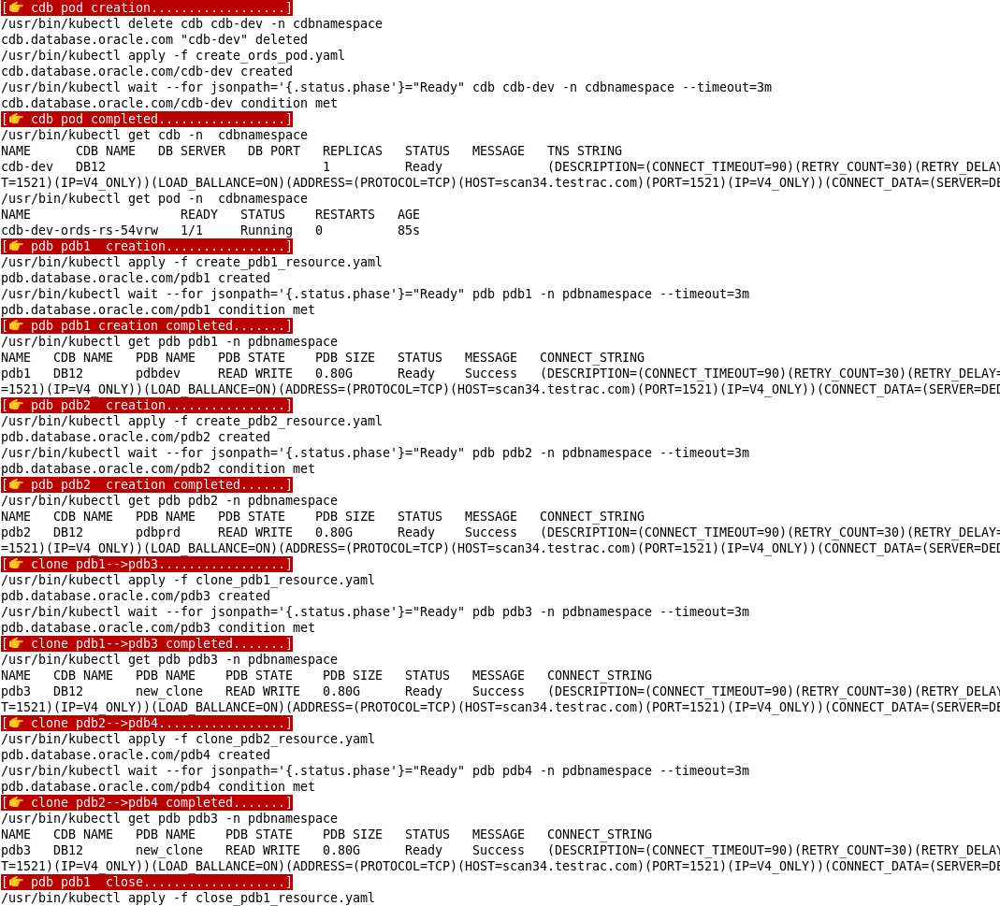

<span style="font-family:Liberation mono; font-size:0.9em; line-height: 1.1em">


# Use case directory 

The use case directory contains the yaml files to test the multitenant controller functionalities: create ords pod and pdb operation  *create / open / close / unplug / plug / delete / clone /map / parameter session*  
In this exampl the cdb and pdbs resources are depolyed in different namespaces

## Makefile helper

Customizing yaml files (tns alias / credential / namespaces name etc...) is a long procedure prone to human error. A simple [makefile](../usecase/makefile) is available to quickly and safely configure yaml files with your system environment information. Just edit the [parameter file](../usecase/parameters.txt)  before proceding. 

```text 
[👉 CHECK PARAMETERS..................]
TNSALIAS...............:(DESCRIPTION=(CONNECT_TIMEOUT=90)(RETRY_COUNT=30)(RETRY_DELA....
ORDPWD.................:[Password for ORDS_PUBLIC_USER ]
SYSPWD.................:[SYS password]
WBUSER.................:[username for https authentication]
WBPASS.................:[password for https authentication]
PDBUSR.................:[pdb admin user]
PDBPWD.................:[pdb admin password]
CDBUSR.................:[cdb admin user e.g. C##DBAPI_CDB_ADMIN]
CDBPWD.................:[cdb admin password]
PDBNAMESPACE...........:[namespace for pdb]
CDBNAMESPACE...........:[namespace for cdb]
COMPANY................:oracle
APIVERSION.............:v4 ---> do not edit
```

⚠ **WARNING: The makefile is intended to speed up the usecase directory configuartion only, it is not supported, the editing and configuration of yaml files for production system is left up to the end user** 

### Pre requisistes:  

- Make sure that **kubectl** is properly configured.
- Make sure that all requirements listed in the [operator installation page](../../../../docs/installation/OPERATOR_INSTALLATION_README.md) are implemented. (role binding,webcert,etc)
- Make sure that administrative user on the container database is configured as documented.

### Commands 

Review your configuraton running ```make check```; if all the parameters are correct then you can proceed with yaml files and certificates generation

By excuting command ```make operator``` You will have in your directory an operator yaml file with the  WATCH LIST required to operate with multiple namespaces.
Note that the yaml file is not applyed; you need to manually execute ```kubectl apply -f oracle-database-operator.yaml```.

```bash
make operator
```
You can generate all the other yaml files for pdb life cycle management using ```make genyaml```

```bash
make genyaml
```

list of generated yaml files 

```text 
-rw-r--r-- 1 mmalvezz g900 137142 Nov 13 09:35 oracle-database-operator.yaml
-rw-r--r-- 1 mmalvezz g900    321 Nov 13 10:27 create_cdb_secrets.yaml
-rw-r--r-- 1 mmalvezz g900    234 Nov 13 10:27 create_pdb_secrets.yaml
-rw-r--r-- 1 mmalvezz g900    381 Nov 13 10:27 pdbnamespace_binding.yaml
-rw-r--r-- 1 mmalvezz g900    381 Nov 13 10:27 cdbnamespace_binding.yaml
-rw-r--r-- 1 mmalvezz g900   1267 Nov 13 10:27 create_ords_pod.yaml
-rw-r--r-- 1 mmalvezz g900    935 Nov 13 10:27 create_pdb1_resource.yaml
-rw-r--r-- 1 mmalvezz g900    935 Nov 13 10:27 create_pdb2_resource.yaml
-rw-r--r-- 1 mmalvezz g900    842 Nov 13 10:27 open_pdb1_resource.yaml
-rw-r--r-- 1 mmalvezz g900    842 Nov 13 10:27 open_pdb2_resource.yaml
-rw-r--r-- 1 mmalvezz g900    845 Nov 13 10:27 open_pdb3_resource.yaml
-rw-r--r-- 1 mmalvezz g900    842 Nov 13 10:27 close_pdb1_resource.yaml
-rw-r--r-- 1 mmalvezz g900    842 Nov 13 10:27 close_pdb2_resource.yaml
-rw-r--r-- 1 mmalvezz g900    846 Nov 13 10:27 close_pdb3_resource.yaml
-rw-r--r-- 1 mmalvezz g900    927 Nov 13 10:27 clone_pdb1_resource.yaml
-rw-r--r-- 1 mmalvezz g900    928 Nov 13 10:27 clone_pdb2_resource.yaml
-rw-r--r-- 1 mmalvezz g900    802 Nov 13 10:27 delete_pdb1_resource.yaml
-rw-r--r-- 1 mmalvezz g900    802 Nov 13 10:27 delete_pdb2_resource.yaml
-rw-r--r-- 1 mmalvezz g900    824 Nov 13 10:27 unplug_pdb1_resource.yaml
-rw-r--r-- 1 mmalvezz g900    992 Nov 13 10:27 plug_pdb1_resource.yaml
-rw-r--r-- 1 mmalvezz g900    887 Nov 13 10:27 map_pdb1_resource.yaml
-rw-r--r-- 1 mmalvezz g900    887 Nov 13 10:27 map_pdb2_resource.yaml
-rw-r--r-- 1 mmalvezz g900    890 Nov 13 10:27 map_pdb3_resource.yaml
```

The command ```make secretes ``` will configure database secrets credential and certificates secretes 

```bash
make secrets
```


The makefile includes other different targets that can be used to test the various pdb operations available. E.g.

```makefile
run03.2:
        @$(call msg,"clone pdb2-->pdb4")
        $(KUBECTL) apply -f $(PDBCLONE2)
        $(KUBECTL) wait --for jsonpath='{.status.phase'}="Ready" pdb pdb4 -n $(PDBNAMESPACE) --timeout=$(TEST_EXEC_TIMEOUT)
        @$(call msg,"clone pdb2-->pdb4 completed")
        $(KUBECTL) get pdb pdb3 -n $(PDBNAMESPACE) 
```
The target ```run03.2``` clones pdb2 into pdb4 and wait for ```$TEST_EXEC_TIMEOUT``` for the operation to complete. 

### Output executions:.

```make secrets```


 

```make runall``` executes different pdb operations including the cdb controller creation 

