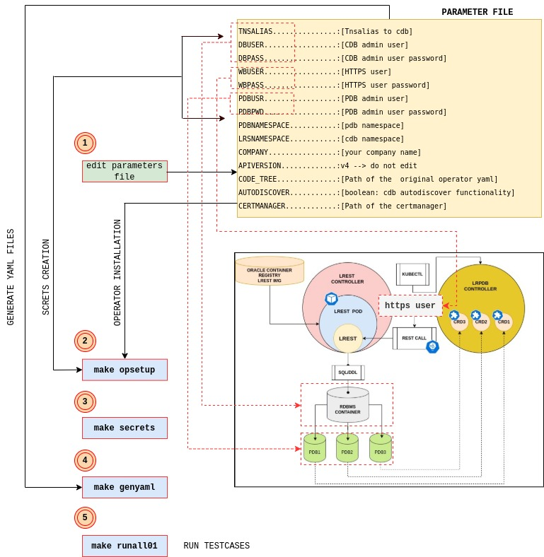

<!-- vscode-markdown-toc -->
* 1. [Prerequisites](#Prerequisites)
* 2. [Operator setup](#Operatorsetup)
* 3. [Secrets creation](#Secretscreation)
* 4. [Yaml file creation](#Yamlfilecreation)
* 5. [Run testcase](#Runtestcase)
* 6. [Makefile targets table](#Makefiletargetstable)
* 7. [Diag commands and troubleshooting](#Diagcommandsandtroubleshooting)
	* 7.1. [Connect to rest server pod](#Connecttorestserverpod)
	* 7.2. [Lrest pod log](#Lrestpodlog)
	* 7.3. [Monitor control plane](#Monitorcontrolplane)
	* 7.4. [Error decrypting credential](#Errordecryptingcredential)
	* 7.5. [Crd details](#Crddetails)

<!-- vscode-markdown-toc-config
	numbering=true
	autoSave=true
	/vscode-markdown-toc-config -->
<!-- /vscode-markdown-toc -->


<span style="font-family:Liberation mono; font-size:0.9em; line-height: 1.1em">


# Use case directory 

The use case directory contains a makefile to automatically install the Oracle Database Operator (namespace scope configuration) and generate the yaml files to test pdb life cycle management in two different namespaces (one for lrest pod the other one for pdb crd). To simplify and speed up the execution you just need to edit a [parameter file](../usecase/parameters.txt) with all the information about your environment. The makefile script uses parameter file to generate all the yaml file required to test the controllers. 
After parameters setup there is the operator installation (**make opsetup**) , the secrets installation (**make secrets**), the yaml file generation (**make genyaml**).



**parameter file table of contents**
```text 
                                Check the latest version available<--------------+
                                                                                 |           
                                                                              +-----+
LRESTIMG...............:container-registry.oracle.com/database/operator:lrest-241210-amd64
TNSALIAS...............:[Tnsalias do not use quotes and avoid space in the string --> (DESCRIPTION=(CONNECT_TIMEOUT=90)(RETRY_COUNT=30)(RETRY_DELA....]
DBUSER.................:[CDB admin user]
DBPASS.................:[CDB admin user password]
WBUSER.................:[HTTPS user]
WBPASS.................:[HTTPS user password]
PDBUSR.................:[PDB admin user]
PDBPWD.................:[PDB admin user password]
PDBNAMESPACE...........:[pdb namespace]
LRSNAMESPACE...........:[cdb namespace]
COMPANY................:[your company name]
APIVERSION.............:[v4 --> do not edit]
SERVICENAMEACCOUNT.....:[service account - for openshift ]
AUTODISCOVER...........:[boolean: check for pdb with no crd ]
CODE_TREE..............:[Is the path of the directory with the original operator yaml file]
CERT_MANAGER...........:https://github.com/cert-manager/cert-manager/releases/download/v1.16.2/cert-manager.yaml
OPENSHIFT..............:[boolean]
```

Verify parameters using ``make check`` command.

##  1. <a name='Prerequisites'></a>Prerequisites

- Ensure that **kubectl** is properly installed on your client.
- Even if the makefile automation, read carefully the [operator installation page](../../../../docs/installation/OPERATOR_INSTALLATION_README.md). (role binding,webcert,etc)
- Ensure that the administrative user (admin) on the container database is configured as documented.

eg

```sql
-- Connect to the  container and creates the administrative user 
alter session set "_oracle_script"=true;
create user [DBUSER] identified by [DBPASS];
grant create session to restdba container=all;
grant sysdba to restdba container=all;
```

##  2. <a name='Operatorsetup'></a>Operator setup

```bash
make opsetup
```
The make target **make opsetup** does the following actions:
- Creates a copy the original **oracle-database-operator.yaml** and updates the WATCH_NAMESPACE list with the pdbnamespace and cdbnamespace values.
- [Applies the certmaneger](../../../README.md#install-cert-manager)
- Creates two namespaces: one for the lrest pod and the other one for the pdb controller.
- [Namespace Scoped Deployment](../../../README.md#2-namespace-scoped-deployment)
- Applies the oracle-database-operator.yaml
- [ClusterRole and ClusterRoleBinding for NodePort services](../../../README.md#clusterrole-and-clusterrolebinding-for-nodeport-services)

👉 **If your are running on Openshift you need to manually apply the [service context file](./security_context.yaml)** 

##  3. <a name='Secretscreation'></a>Secrets creation 

```bash
make secrets
```
**make secrets** creates secrets encrypting the credential specified in the parameters

##  4. <a name='Yamlfilecreation'></a>Yaml file creation 

```bash
make genyaml
```
**make genyaml** generates the required `yaml` files to work with multitenant controllers.

##  5. <a name='Runtestcase'></a>Run testcase 

```bash
make runall00
```

You can run **make runall00** to test all the functionality the multitenant controller 

##  6. <a name='Makefiletargetstable'></a>Makefile targets table

 | target          | action              | additional info |
 |-----------------|---------------------|-----------------|
 |tkapplyinit      | config map creation |                 |
 |run00            | lrest pod creation  |                 |
 |run01.1          | pdb1 creation       |                 |
 |run01.2          | pdb2 creation       |                 |
 |run02.1          | pdb1 open           | declarative     |
 |run02.2          | pdb2 open           | declarative     |
 |run03.1          | pdb1 clone          | declarative     |
 |run04.1          | pdb1 close          | declarative     |
 |run04.2          | pdb2 close          | declatative     |
 |run05.1          | pdb1 unplug         | declarative     |
 |run06.1          | pdb1 plug           | declarative     |
 |openpdb1         | pdb1 open           | imperative      |
 |openpdb2         | pdb2 open           | imperative      |
 |closepdb1        | pdb1 close          | imperative      |
 |closepdb2        | pdb2 close          | imperative      |
 |openpdb1rs       | pdb1 open restrict  | imperative      |
 |openpdb2rs       | pdb2 open restrict  | imperative      |
 |tkaudosicov      | test autodiscovery  |                 |
 |tkplsqlexec      | test sql/plsql      |                 |
 |tkapplyinit      | apply init map      |                 |
 |altercpu         | alter cpu_count     | make  altercpu LRPDBNAME=_lrpdb resource_ CPU_COUNT=_cpu count value_   |
 |open             | open pdb  [imperative]| make open LRPDBNAME=_lrpdb resource_ |
 |close            | close pdb [imperative]| make close LRPDBNAME=_lrpdb resource_ |
 |listimage        | images available on the cluster|      |
 |dumpoperator     | dump operator log   |                 |
 |dumplrest        | dump lrest log      |                 |
 |login            | connect to lrest pod|                 |
 |reloadod         | reload operator img |                 | 
 |mgrrestart       | manager restart     |                 |
 |**opsetup**      | install the  operator|                |
 |**secrets**      | create secrets      |                 |
 |**genyaml**      | generate the yaml files|              |
 |opclean          | deintall the operator|                |   
 |cleanlrest       | drop lrest resource | **lrest name hard coded** | 
 |rest             | rest status bitmask | make rest LRPDBNAME=_resname_ RESETVALUE=_new bitmask value_ |
 |tkautd           | Turn on/off autodiscover |  make tkautd AUTOD=true/false |
 |tkdelcs          | Turn on/off pdb delete cascade | make tkdelcs DELETECS=true/false |
 |tkdelcrd         |Turn ON/OFF lrest pdb imperativeLrpdb deletion |  make tkdelcrd DELETECRD=true/false  LRPDBNAME=_lrpdb resource name_ |
 | checkimpdel     | report of imperative delete setting ||


##  7. <a name='Diagcommandsandtroubleshooting'></a>Diag commands and troubleshooting

###  7.1. <a name='Connecttorestserverpod'></a>Connect to rest server pod

```bash 
/usr/bin/kubectl exec   <podname> -n <namespace> -it -- /bin/bash
```

###  7.2. <a name='Lrestpodlog'></a>Lrest pod log

```bash
kubectl logs  `kubectl get pods -o custom-columns=:metadata.name -n cdbnamespace --no-headers ` -n cdbnamespace
```

```bash 
## example ##

kubectl get pods -n cdbnamespace
NAME                     READY   STATUS    RESTARTS      AGE
cdb-dev-lrest-rs-fnw99   1/1     Running   1 (17h ago)   18h

kubectl exec  cdb-dev-lrest-rs-fnw99 -n cdbnamespace -it -- /bin/bash
[oracle@cdb-dev-lrest-rs-fnw99 ~]$
```

###  7.3. <a name='Monitorcontrolplane'></a>Monitor control plane

```bash
kubectl logs -f -l control-plane=controller-manager -n oracle-database-operator-system
```
```bash 
## output example: ##
2024-10-28T23:54:25Z    INFO    lrpdb-webhook   ValidateUpdate-Validating LRPDB spec for : lrpdb2
2024-10-28T23:54:25Z    INFO    lrpdb-webhook   validateCommon  {"name": "lrpdb2"}
2024-10-28T23:54:25Z    INFO    lrpdb-webhook   Valdiating LRPDB Resource Action : MODIFY
2024-10-29T10:07:34Z    INFO    lrpdb-webhook   ValidateUpdate-Validating LRPDB spec for : lrpdb2
2024-10-29T10:07:34Z    INFO    lrpdb-webhook   ValidateUpdate-Validating LRPDB spec for : lrpdb1
2024-10-29T16:49:15Z    INFO    lrpdb-webhook   ValidateUpdate-Validating LRPDB spec for : lrpdb1
2024-10-29T16:49:15Z    INFO    lrpdb-webhook   validateCommon  {"name": "lrpdb1"}
2024-10-29T16:49:15Z    INFO    lrpdb-webhook   Valdiating LRPDB Resource Action : CREATE
2024-10-29T10:07:20Z    INFO    controller-runtime.certwatcher  Updated current TLS certificate
2024-10-29T10:07:20Z    INFO    controller-runtime.webhook      Serving webhook server  {"host": "", "port": 9443}
2024-10-29T10:07:20Z    INFO    controller-runtime.certwatcher  Starting certificate watcher
I1029 10:07:20.189724       1 leaderelection.go:250] attempting to acquire leader lease oracle-database-operator-system/a9d608ea.oracle.com...
2024-10-29T16:49:15Z    INFO    lrpdb-webhook   Setting default values in LRPDB spec for : lrpdb1

```

###  7.4. <a name='Errordecryptingcredential'></a>Error decrypting credential 

In the following example you can see a resource creation failure due to a decryption issue

```text 
2024-10-30T10:09:08Z    INFO    controllers.LRPDB       getEncriptedSecret :pdbusr      {"getEncriptedSecret": {"name":"lrpdb1","namespace":"pdbnamespace"}}
2024-10-30T10:09:08Z    ERROR   controllers.LRPDB       Failed to parse private key - x509: failed to parse private key (use ParsePKCS1PrivateKey instead for this key format)     {"DecryptWithPrivKey": {"name":"lrpdb1","namespace":"pdbnamespace"}, "error": "x509: failed to parse private key (use ParsePKCS1PrivateKey instead for this key format)"}
```

**Solution**: Ensure you use **PCKS8** format during private key generation. If you are not using `openssl3`, then run this command:

```bash
openssl genpkey -algorithm RSA  -pkeyopt rsa_keygen_bits:2048 -pkeyopt rsa_keygen_pubexp:65537 > mykey
```
###  7.5. <a name='Crddetails'></a>Crd details 
Use the **describe** option to obtain `crd` information

```bash
kubectl describe lrpdb lrpdb1 -n pdbnamespace
[...]
    Secret:
      Key:          e_wbuser.txt
      Secret Name:  wbuser
Status:
  Action:       CREATE
  Bitstat:      25
  Bitstatstr:   |MPAPPL|MPWARN|MPINIT|
  Conn String:  (DESCRIPTION=(CONNECT_TIMEOUT=90)(RETRY_COUNT=30)(RETRY_DELAY=10)(TRANSPORT_CONNECT_TIMEOUT=70)(LOAD_BALLANCE=ON)(ADDRESS=(PROTOCOL=TCP)(HOST=scan12.testrac.com)(PORT=1521)(IP=V4_ONLY))(LOAD_BALLANCE=ON)(ADDRESS=(PROTOCOL=TCP)(HOST=scan34.testrac.com)(PORT=1521)(IP=V4_ONLY))(CONNECT_DATA=(SERVER=DEDICATED)(SERVICE_NAME=pdbdev)))
  Msg:          Success
  Open Mode:    MOUNTED
  Phase:        Ready
  Status:       true
  Total Size:   2G
Events:
  Type     Reason     Age                   From   Message
  ----     ------     ----                  ----   -------
  Normal   Created    108s                  LRPDB  LRPDB 'pdbdev' created successfully
  Normal   Created    108s                  LRPDB  PDB 'pdbdev' assertive pdb deletion turned on
  Warning  LRESTINFO  95s                   LRPDB  pdb=pdbdev:test_invalid_parameter:16:spfile:2065
  Warning  Done       15s (x12 over 2m25s)  LRPDB  cdb-dev

```

</span>