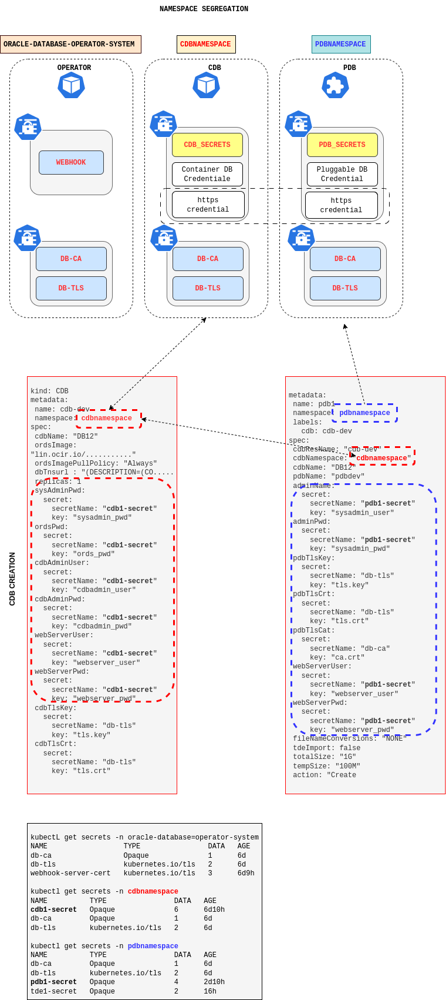

<span style="font-family:Liberation mono; font-size:0.9em; line-height: 1.1em">


# STEP BY STEP (NAMESPACE SEGREGATION)

- [STEP BY STEP (NAMESPACE SEGREGATION)](#step-by-step-namespace-segregation)
    - [INTRODUCTION](#introduction)
    - [GIT CLONE ORACLE DATABASE OPERATOR PROJECT](#git-clone-oracle-database-operator-project)
    - [NAMESPACE CREATION](#namespace-creation)
    - [WEBHOOK CERTIFICATES](#webhook-certificates)
    - [ORACLE DATABASE OPERATOR](#oracle-database-operator)
    - [CREATE PDB AND CDB SECRETS](#create-pdb-and-cdb-secrets)
    - [CREATE TLS CERTIFICATE](#create-tls-certificate)
    - [REST SERVER IMAGE CREATION](#rest-server-image-creation)
    - [CDB POD CREATION](#cdb-pod-creation)
    - [PDB CREATION](#pdb-creation)
    - [MAKEFILE](#makefile)


### INTRODUCTION

> &#9758; This folder contains the yaml files required to configure and manage cdb and pdb in different namespaces. The main change here is the possibility to specify the namespace where CDB will be created, this implies the introduction of new parameter at PDB level in order to specify the CDB namespace.

Tasks performed in the usecase03 are the same ones of the other usecase01 with the exception that controller pods cdb pods and pdb crd are running in different namespaces. You must be aware of the fact that secrets must be created in the proper namespaces; cdb secrets  go into cdb namespace , pdb secrets go into pdbnamespace while certificate secrets need to be created in every namespace.  


| yaml file parameters            	| value  	| description /ords parameter                     |
|--------------	|---------------------------	|-------------------------------------------------|
|	&#9758; cdbNamespace  | <cdb namespace>	            | Cdb namespace                                   |
| dbserver     	| <db_host\> or <scan_name>   | [--db-hostname][1]                              |
| dbTnsurl      | <tns connect descriptor\>   | [--db-custom-url/db.customURL][dbtnsurl]        |
| port         	| <oracle_port\>        	    | [--db-port][2]                                	|
| cdbName       | <dbname\>                   | Container Name                                  |
| name          | <cdb-dev\>                  | Ords podname prefix in cdb.yaml                 |
| name          | <pdb\>                      | pdb resource in pdb.yaml                        | 
| ordsImage     | <public_container_registry\>/ords-dboper:latest|My public container registry  |
| pdbName       | <pdbname\>                  | Pluggable database name                         |
| servicename  	| <service_name\>           	| [--db-servicename][3]                           |
| sysadmin_user | <SYS_SYSDBA\>               | [--admin-user][adminuser]                       |
| sysadmin_pwd  | <sys_password\>             | [--password-stdin][pwdstdin]                    |
| cdbadmin_user | <CDB_ADMIN_USER\>           | [db.cdb.adminUser][1]                           |
| cdbadmin_pwd  | <CDB_ADMIN_PASS\>           | [db.cdb.adminUser.password][cdbadminpwd]        |
| webserver_user| <web_user\>                 | [https user][http] <span style="color:red"> NOT A DB USER </span> |
| webserver_pwd | <web_user_passwoed\>        | [http user password][http]                      |
| ords_pwd      | <ords_password\>            | [ORDS_PUBLIC_USER password][public_user]        |
| pdbTlsKey     | <keyfile\>                  | [standalone.https.cert.key][key]                |
| pdbTlsCrt     | <certfile\>                 | [standalone.https.cert][cr]                     |
| pdbTlsCat     | <certauth\>                 | certificate authority                           |
| xmlFileName   | <xml file path\>            | path for the unplug and plug operation          |
| srcPdbName    | <source db\>                | name of the database to be cloned               |
| fileNameConversions | <file name conversion\> | used for database cloning                     |
| tdeKeystorePath     | <TDE keystore path is required if the tdeExport flag is set to true\>   |  [tdeKeystorePath][tdeKeystorePath] |
| tdeExport           | <BOOLEAN\>              | [tdeExport] |
| tdeSecret           | <TDE secret is required if the tdeExport flag is set to true\>  | [tdeSecret][tdeSecret] |
| tdePassword         | <TDE password for unplug operations only\>  | [tdeSecret][tdeSecret] | 
|  assertivePdbDeletion | boolean             | [turn on imperative approach on crd deleteion][imperative]     |



### GIT CLONE ORACLE DATABASE OPERATOR PROJECT 

```bash
git clone https://github.com/oracle/oracle-database-operator.git
cd oracle-database-operator/docs/multitenant/usecase03
```
### NAMESPACE CREATION

We need first to create two different namespaces (**cdbnamespace**,**pdbnamespace**)  using ns_pdb_namespace.yaml and ns_cdb_namespace.yaml 

```bash 
kubectl apply -f ns_pdb_namespace.yaml
kubectl apply -f ns_cdb_namespace.yaml
```

### WEBHOOK CERTIFICATES 
Create cert manager and verify the status 

```bash
kubectl apply -f https://github.com/jetstack/cert-manager/releases/latest/download/cert-manager.yaml
```

```bash
kubectl get pods --namespace cert-manager
NAME                                       READY   STATUS    RESTARTS   AGE
cert-manager-75997f4b44-4nf5c              1/1     Running   1          9d
cert-manager-cainjector-769785cd7b-mzfq5   1/1     Running   1          9d
cert-manager-webhook-6bc9944d78-tslrp      1/1     Running   1          9d
```

### ORACLE DATABASE OPERATOR

Create the oracle database operator using  oracle-database-operator.yaml
```bash 
cd oracle-database-operator
kubectl apply -f oracle-database-operator.yaml
cd -
```

[operator creation log](operator_creation_log.txt)
### CREATE PDB AND CDB SECRETS 

Update secrets files with your base64 encodede password.

```bash
echo ImAdemoPassword | base64
SW1BZGVtb1Bhc3N3b3JkCg==
```
Apply the cdb_secret and pdb_secret yaml file to generate credential information in each namespace. 

```
kubectl apply -f cdb_secret.yaml 
kubectl apply -f pdb_secret.yaml 
```
> &#9758; Note that https credential needs to be replicated in any secret file. It is possible to improve configuration by creating a dedicated namespace for https credential in order to specify this information only once. 

Namespace segregation enables  the capability of deploying and manages pluggable database without the cdb administrative passwords. 

### CREATE TLS CERTIFICATE 

Here follow an example of script shell that can be used to create secret certificates in each namespace involved in the kubernets multi tenant architecture

```bash
#!/bin/bash 
export CDB_NAMESPACE=cdbnamespace 
export PDB_NAMESPACE=pdbnamespace 
export OPR_NAMESPACE=oracle-database-operator-system 
export SKEY=tls.key 
export SCRT=tls.crt 
export CART=ca.crt 
export COMPANY=oracle 
export REST_SERVER=ords

openssl genrsa -out ca.key 2048 
openssl req -new -x509 -days 365 -key ca.key -subj "/C=CN/ST=GD/L=SZ/O=${COMPANY}, Inc./CN=${COMPANY} Root CA" -out ca.crt 
openssl req -newkey rsa:2048 -nodes -keyout ${SKEY} -subj "/C=CN/ST=GD/L=SZ/O=${COMPANY}, Inc./CN=cdb-dev-${REST_SERVER}.${CDB_NAMESPACE}" -out server.csr 
echo "subjectAltName=DNS:cdb-dev-${REST_SERVER}.${CDB_NAMESPACE},DNS:www.example.com" > extfile.txt 
openssl x509 -req -extfile extfile.txt -days 365 -in server.csr -CA ca.crt -CAkey ca.key -CAcreateserial -out ${SCRT} 

kubectl create secret tls db-tls --key="${SKEY}" --cert="${SCRT}"  -n ${CDB_NAMESPACE} 
kubectl create secret generic db-ca --from-file="${CART}" -n ${CDB_NAMESPACE} 
kubectl create secret tls db-tls --key="${SKEY}" --cert="${SCRT}"  -n ${PDB_NAMESPACE} 
kubectl create secret generic db-ca --from-file="${CART}"  -n ${PDB_NAMESPACE} 
kubectl create secret tls db-tls --key="${SKEY}" --cert="${SCRT}"  -n ${OPR_NAMESPACE} 
kubectl create secret generic db-ca --from-file="${CART}"  -n ${OPR_NAMESPACE}
```
after all secrets creation you shoud have the following pattern 

```bash
kubectl get secrets -n oracle-database-operator-system 
NAME                  TYPE                DATA   AGE 
db-ca                 Opaque              1      6d5h 
db-tls                kubernetes.io/tls   2      6d5h 
webhook-server-cert   kubernetes.io/tls   3      6d15h


kubectl get secrets -n cdbnamespace 
NAME          TYPE                DATA   AGE 
cdb1-secret   Opaque              6      6d15h 
db-ca         Opaque              1      6d6h 
db-tls        kubernetes.io/tls   2      6d6h


kubectl get secrets -n pdbnamespace 
NAME          TYPE                DATA   AGE 
db-ca         Opaque              1      6d6h 
db-tls        kubernetes.io/tls   2      6d6h 
pdb1-secret   Opaque              4      2d16h 
tde1-secret   Opaque              2      22h
```
### REST SERVER IMAGE CREATION

```bash
cd oracle-database-operator/ords
docker build -t oracle/ords-dboper:latest .
docker tag oracle/ords-dboper:latest [path_of_your_registry]/ords-dboper:latest
docker push [path_of_your_registry]/ords-dboper.latest
cd -
```

### CDB POD CREATION

**note:** <span style="color:red">
 Before creating the CDB pod make sure that all the pluggable databases in the container DB are open.
</span>


Update the cdb_create.yaml with the path of the image generated before to create CDB pod 

```bash
kubectl apply -f cdb_create.yaml 
```

Verify the status of the operation and cdb pod existence using the following commands 

```bash
## check the pod creation 
kubectl get pods -n cdbnamespace 

## check the rest server log after pod creation 
kubectl logs -f `/usr/bin/kubectl get pods -n cdbnamespace|grep ords|cut -d ' ' -f 1` -n cdbnamespace

##login to the pod for further debug and information gathering 
kubectl exec -it `kubectl get pods -n cdbnamespace |grep ords|cut -d ' ' -f 1` -n cdbnamespace bash
```

[log cdb creation](./cdb_creation_log.txt)

### PDB CREATION

Apply the the pdb_create.yaml file to create a new pdb , after pdb creation you should be able to get pdb details using **kubectl get** command 

```bash
kubectl apply -f pdb_create.yaml
```

```bash
#!/bin/bash
#checkpdbs.sh
kubectl get pdbs -n pdbnamespace -o=jsonpath='{range .items[*]}
{"\n==================================================================\n"}
{"CDB="}{.metadata.labels.cdb}
{"K8SNAME="}{.metadata.name}
{"PDBNAME="}{.spec.pdbName}
{"OPENMODE="}{.status.openMode}
{"ACTION="}{.status.action}
{"MSG="}{.status.msg}
{"\n"}{end}'
```

```bash
./checkpdbs.sh
==================================================================
CDB=cdb-dev
K8SNAME=pdb1
PDBNAME=pdbdev
OPENMODE=READ WRITE
ACTION=CREATE
MSG=Success

```
[pdb creation log](./pdb_creation_log.txt)

### MAKEFILE

In order to facilitate the command execution use the [makefile](./makefile) available target details are exposed in the following tables.

|target                       |Action                                     |
|-----------------------------|-------------------------------------|
|step1                        | Build rest server images            | 
|step2                        | Tag the immages                     |
|step3                        | Push the image into the repository  | 
|step4                        | Load webhook certmanager            | 
|step5                        | Create the db operator              |  
|step6                        | Create tls certificates             |  
|step7                        | Create tls secret                   | 
|step8                        | Create database secrets             |
|step9                        | Create restserver pod               | 
|checkstep9                   | Monitor the executions              |
|step10                       | Create pluggable database           |
|checkpdb                     | Monitor PDB status                  |
|dump                         | Dump  pods info into a file         |
|reloadop                     | Reload the db operator              |
|login                        | Login into cdb pod                  |

[imperative]:https://kubernetes.io/docs/concepts/overview/working-with-objects/object-management/

</span>

