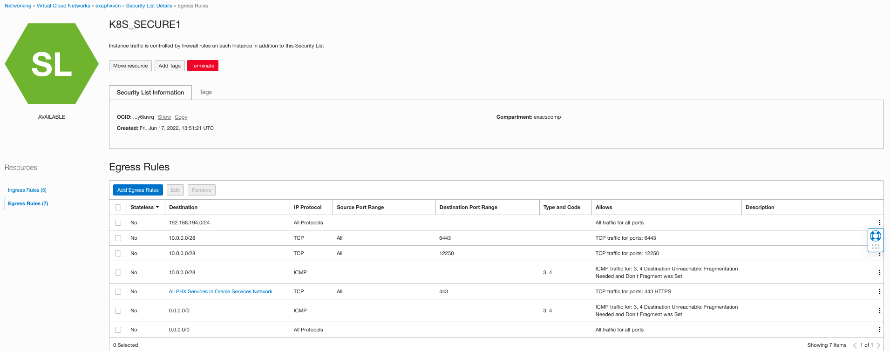
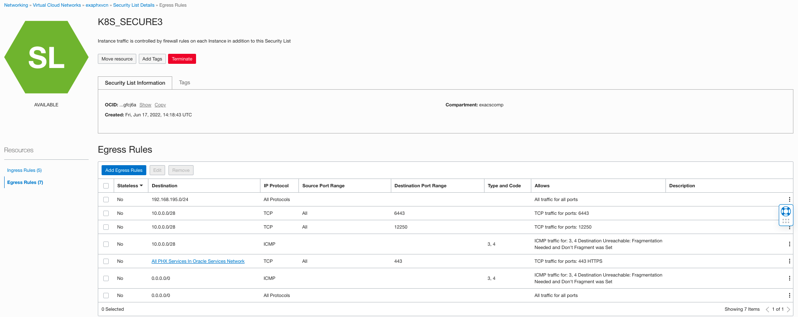

# Example of a working setup using OCI OKE(Kubernetes Cluster) and a CDB in Cloud (OCI Exadata Database Cluster)

In this example, the target CDB (for which the PDB life cycle management is needed) is running in a Cloud environment (OCI's [Oracle Exadata Database Service](https://docs.oracle.com/en-us/iaas/exadatacloud/index.html)) and to manage its PDBs, the Oracle DB Operator is running on a Kubernetes Cluster running in cloud (OCI's [Container Engine for Kubernetes or OKE](https://docs.oracle.com/en-us/iaas/Content/ContEng/Concepts/contengoverview.htm#Overview_of_Container_Engine_for_Kubernetes)).


## Environment details

| Component     | Region Name   |VCN (Virtual Cloud Network) Name|
| ------------- | ------------- |--------------------------------|
| OKE Cluster   | Phoenix Region|exaphxvcn|
| ExaCS Cluster | Phoenix Region|exaphxvcn|


## High Level plans for this setup

Below are the main steps that will be involved in this setup:

- Setup VCN, Add security lists
- Setup OKE cluster with custom settings
- Install Oracle Database Operator on OKE Cluster
- Install ords controller definition
- Manager pdb life cycle management.


## Reference security lists for Ingress/Egress rules for VPN "exaphxvcn"

Refer to the below screen shots to create security lists for Ingress/Egress rules as follows for client & backup network in VPN exaphxvcn to allow k8s Worker node to talk to ExaCS db hosts.

|Network Type|Reference Screenshots|
|------------|---------------------|
|client network| ,|
|backup network| ,|


## OKE Cluster

Check the [Oracle Documentation](https://docs.oracle.com/en-us/iaas/Content/ContEng/Concepts/contengnetworkconfigexample.htm#example-privatek8sapi-privateworkers-publiclb) for the OKE rules settings.

Create OKE cluster with CUSTOM option to use same VCN where ExaCS is provisioned. 

**NOTE:** Make sure you choose same VCN exaphxvcn where ExaCS is provisioned.

After this, setup kubeconfig & validate cluster access as well as worker node access via ssh.

For example, you should be able to check the available OKE nodes using "kubectl" as below:

```
% kubectl get nodes -o wide
NAME              STATUS   ROLES   AGE     VERSION   INTERNAL-IP       EXTERNAL-IP       OS-IMAGE                  KERNEL-VERSION                      CONTAINER-RUNTIME
192.168.194.163   Ready    node    3d19h   v1.23.4   192.168.194.163   XX.XX.XX.XX    Oracle Linux Server 7.9   5.4.17-2136.306.1.3.el7uek.x86_64   cri-o://1.23.2
192.168.194.169   Ready    node    3d19h   v1.23.4   192.168.194.169   XX.XX.XX.XX    Oracle Linux Server 7.9   5.4.17-2136.306.1.3.el7uek.x86_64   cri-o://1.23.2
192.168.194.241   Ready    node    3d19h   v1.23.4   192.168.194.241   XX.XX.XX.XX    Oracle Linux Server 7.9   5.4.17-2136.306.1.3.el7uek.x86_64   cri-o://1.23.2
```

Once this setup is ready, you can proceed with the installation of [Oracle Database Operator for Kubernetes](https://github.com/oracle/oracle-database-operator/blob/main/README.md) to use the Oracle On-prem controller to manage PDBs in this CDB.
