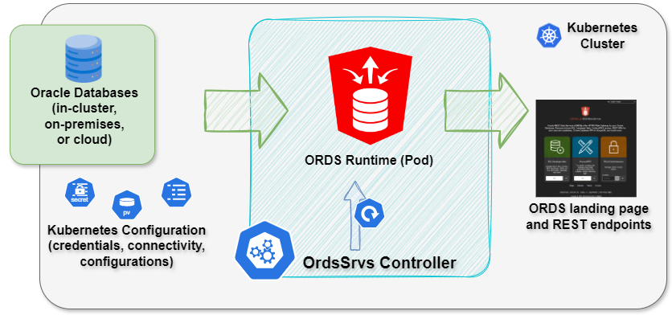
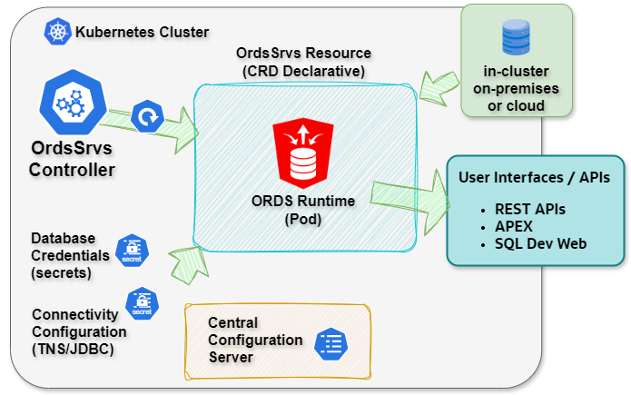

# Oracle Rest Data Services (OrdsSrvs) Controller for Kubernetes -  ORDS Life cycle management

## Description

The OrdsSrvs controller extends the Kubernetes API with a Custom Resource (CR) and controller for automating Oracle REST Data Services (ORDS) lifecycle management.

Using the OrdsSrvs controller, you can deploy and manage ORDS in Kubernetes for any reachable Oracle Database, whether the database runs inside Kubernetes or outside the cluster, on-premises or in the cloud.

This controller allows you to run the ORDS middle tier inside Kubernetes, including deployments that would otherwise run as on-premises ORDS application servers, while also supporting automatic ORDS/APEX install and upgrade operations in the target database.

<p align="center">
  
</p>

## Features Summary

The custom OrdsSrvs resource supports the following configurations as a Deployment, StatefulSet, or DaemonSet:

* Single OrdsSrvs resource with one database pool
* Single OrdsSrvs resource with multiple database pools<sup>*</sup>
* Multiple OrdsSrvs resources, each with one database pool
* Multiple OrdsSrvs resources, each with multiple database pools<sup>*</sup>
* ORDS and APEX database schemas [automatic installation/upgrade](./autoupgrade.md)
* Deploying ORDS with Central Configuration Server

<sup>*See [Limitations](#limitations)</sup>

ORDS Version supported : 25.1.0+  
OrdsSrvs controller supports the majority of ORDS configuration settings as per the [API Documentation](./api.md).


## Prerequisites

 This chapter outlines the necessary requirements that must be satisfied to successfully deploy and operate the OrdsSrvs controller within your Kubernetes cluster.

### Oracle Database Operator  

Before installing the OrdsSrvs controller, ensure that the Oracle Database Operator (OraOperator) is installed in your Kubernetes environment. Please follow the detailed installation steps provided in the [README](https://github.com/oracle/oracle-database-operator/blob/main/README.md) to complete this process. The OraOperator must be properly configured and running, as OrdsSrvs depends on its services for functionality.

There are different ways to provide database credentials and connect string for OrdsSrvs.
For step-by-step instructions and field descriptions, refer to the [API](./api.md) reference and the Examples section for details on each configuration.

<p align="center">
  
</p>


# Database Credentials Management

Credentials for Oracle REST Data Services (ORDS) can be supplied by delegating management to native Kubernetes Secrets, providing encrypted values, or using an Oracle Wallet.

> **⚠️WARNING⚠️**   
>**Security Requirement:** When using the **K8s Secret** mode, please note that by default, Kubernetes Secrets are stored unencrypted in the API server's underlying data store (etcd). They are only Base64 encoded, which does not provide actual security. You must ensure secrets are protected at the Kubernetes level by following the [Good practices for Kubernetes Secrets](https://kubernetes.io/docs/concepts/security/secrets-good-practices/) in the official Kubernetes documentation.

### Credential Modes

| Mode | Attributes | Encryption | Note |
| :--- | :--- | :--- | :--- |
| **Kubernetes Secret** | `spec.poolSettings."db.username"`<br>`spec.poolSettings."db.secret"` | Delegated to K8s Admin  | [Existing DB Example](./examples/existing_db.md) |
| **Encrypted Secret** | `spec.EncPrivKey.secretName`<br>`spec.poolSettings."db.username"`<br>`spec.poolSettings."db.secret"` | RSA_OAEP | [Multi-pool Example](./examples/multi_pool.md) |
|**Pool Zip Wallet**|`spec.poolSettings.dbWalletSecret`<br>`spec.poolSettings."db.wallet.zip.service"`| mTLS Wallet (Zip)|[ADB Example](./examples/adb.md)|
|**Shared Zip Wallets**|`spec.globalSettings.zipWalletsSecretName`<br>`spec.poolSettings.zipWalletName`<br>`spec.poolSettings."db.wallet.zip.service"`|mTLS Wallet (Zip)|[Wallets Example](examples/cc_zip_wallets.md)|


* **Encryption at Rest:** Ensure that Encryption at Rest is enabled for your Kubernetes cluster's etcd to protect the underlying data of K8s Secrets.
* **Rotate Credentials:** Rotate database passwords and Oracle Wallets regularly; always apply the principle of **least-privilege RBAC** to restrict access to sensitive secrets.
 

### Database Connectivity Configuration
The OrdsSrvs controller supports several connection methods to accommodate diverse deployment scenarios, including Oracle Databases running inside Kubernetes, external databases reachable from the cluster, on-premises environments, and cloud services such as Autonomous Database (ADB).
Depending on your security and networking requirements, connectivity can be established using direct JDBC strings, tnsnames.ora aliases, or mTLS-secured Oracle Wallets.

|Mode| Attributes| Format| Note|
|-|-|-|-|
|TNS String|`spec.poolSettings."db.connectionType"`: **customurl**<br>`spec.poolSettings."db.customURL"`| Connection String|[Existing DB Example](./examples/existing_db.md)|
|tnsnames.ora|`spec.poolSettings."db.connectionType"`: **tns**<br>`spec.poolSettings.tnsAdminSecret`<br>`spec.poolSettings."db.tnsAliasName"`| Standard `tnsnames.ora`|[Resources Example](./examples/tnsnames.md)|
|Pool Zip Wallet|`spec.poolSettings.dbWalletSecret`<br>`spec.poolSettings."db.wallet.zip.service"`| mTLS Wallet (Zip)|[ADB Example](./examples/adb.md)|
|Shared Zip Wallets|`spec.globalSettings.zipWalletsSecretName`<br>`spec.poolSettings.zipWalletName`<br>`spec.poolSettings."db.wallet.zip.service"`|mTLS Wallet (Zip)|[Wallets Example](examples/cc_zip_wallets.md)|


## Common configuration examples

A few common configuration examples can be used to quickly familiarise yourself with the OrdsSrvs Custom Resource Definition.
The "Conclusion" section of each example highlights specific settings to enable functionality that maybe of interest.

* [Pre-existing Database](./examples/existing_db.md)
* [Containerized Single Instance Database (SIDB)](./examples/sidb_container.md)
* [Multidatabase using a TNS Names file](./examples/multi_pool.md)
* [Autonomous Database using the OraOperator](./examples/adb_oraoper.md) <sup>*See [Limitations](#limitations)</sup>
* [Autonomous Database without the OraOperator](./examples/adb.md)
* [Oracle API for MongoDB Support](./examples/mongo_api.md)
* [ORDS and APEX database schemas automatic installation/upgrade](./autoupgrade.md)
* [Custom tnsnames.ora](./examples/tnsnames.md)
* [Deploying ORDS with Central Configuration Server](./examples/central_configuration.md)
* [Central Configuration Server with shared zip Wallets](./examples/cc_zip_wallets.md)
* [Instance API](./examples/instance_api.md)
* [Metadata and Resources Example](./examples/metadata_resources.md)

Running through all examples in the same Kubernetes cluster illustrates the ability to run multiple ORDS instances with a variety of different configurations.

### Namespace Scoped Deployment

For a dedicated namespace deployment of the OrdsSrvs controller, refer to the "Namespace Scoped Deployment" section in the OraOperator [README](https://github.com/oracle/oracle-database-operator/blob/main/README.md#2-namespace-scoped-deployment).
The following examples demonstrate deploying the controller to the ordsnamespace namespace. 

Create the namespace:

```bash
kubectl create namespace ordsnamespace
```

Apply namespace role binding [ordsnamespace-role-binding.yaml](./ordsnamespace-role-binding.yaml):

```bash
kubectl apply -f ordsnamespace-role-binding.yaml
```

Edit OraOperator to add the namespace under WATCH_NAMESPACE:
```yaml
  - name: WATCH_NAMESPACE
    value: "default,<your namespaces>,ordsnamespace"
```

## OpenShift Security Context Constraints

If you are deploying the OrdsSrvs controller on OpenShift, ensure that the appropriate Security Context Constraints (SCCs) are configured. This involves assigning privileged SCCs to the service accounts used by OrdsSrvs to permit required operations.

### Create a Service Account

This account will be used to assign the necessary Security Context Constraints (SCCs) for the controller’s operation.
Below is an example [YAML](./examples/ordssrvs-sa.yaml) manifest to create a service account named "ordssrvs-sa" in the "ordsnamespace" namespace:

```yaml
apiVersion: v1
kind: ServiceAccount
metadata:
  name: ordssrvs-sa
  namespace: ordsnamespace
```

### Create a Custom Security Context Constraint (SCC)

To configure the required security permissions, use the attached [YAML](./examples/ordssrvs-sa-scc.yaml) file to create a custom Security Context Constraint (SCC) and bind it to the "ordssrvs-sa" service account. 
This will ensure the service account has the necessary permissions for the OrdsSrvs controller to operate on OpenShift.

### Set serviceAccountName in OrdsSrvs 

Ensure that the OrdsSrvs controller uses the dedicated service account you created. In the deployment manifest for OrdsSrvs, specify the serviceAccountName field with the name of your service account (e.g., ordssrvs-sa) as in this [example](./examples/ordssrvs.yaml).

```yaml
apiVersion: database.oracle.com/v4
kind: OrdsSrvs
metadata:
  name: ordssrvs
  namespace: ordsnamespace
spec:
  ...
  globalSettings:
    ...
  poolSettings:
    ...
  serviceAccountName: ordssrvs-sa
```


## Change Log

### Development

### Version 2.2

* **Instance API and Admin Password**  
Added support for enabling the ORDS Instance API and bootstrapping the administrator user/password from a Kubernetes Secret through `spec.globalSettings.instanceAPIAdminUser`. [Instance API Example](./examples/instance_api.md)

* **Additional Labels and Annotations**  
Added support for custom labels and annotations on generated resources through `spec.commonMetadata`. [Metadata and Resources Example](./examples/metadata_resources.md)

* **Resource Specification**  
Added support for configuring CPU and memory resource requests and limits for ORDS containers through `spec.resources`. [Metadata and Resources Example](./examples/metadata_resources.md)

* **JDK_JAVA_OPTIONS**  
Added support for passing JVM options to ORDS through the `JDK_JAVA_OPTIONS` environment variable with `spec.jdkJavaOptions`.
[Metadata and Resources Example](./examples/metadata_resources.md)

* **GraphQL Parameter Syntax Fix**  
Fixed the GraphQL configuration parameter syntax by supporting the correct property name `spec.globalSettings."feature.graphql.max.nesting.depth"`.


### Version 2.1

* **Native Kubernetes Secret**
The `encPrivKey` attribute is now optional; database passwords can be managed via native Kubernetes Secrets.  
**⚠️WARNING⚠️** When using Kubernetes Secrets ensure secrets are protected at the Kubernetes level by following the [Good practices for Kubernetes Secrets](https://kubernetes.io/docs/concepts/security/secrets-good-practices/) in the official Kubernetes documentation.

* **TNSAdminSecret**
Added a dedicated documentation page for managing `tnsnames.ora` via Secrets. See [Custom tnsnames.ora Example](./examples/tnsnames.md).
* **Central Configuration Server**
New attribute `spec.globalSettings."central.config.url"` supports deploying ORDS with a Central Configuration Server for externalized settings.
* **Shared Zip Wallets**
New attributes `spec.globalSettings.zipWalletsSecretName` and `spec.poolSettings.zipWalletName` allow multiple mTLS Wallets (.zip) to be defined at the global level and referenced by individual database pools.

### Version 2.0

  - ORDS image 25.1+ 
  - OpenShift installation 
  - APEX installation files from download url or PersistenceVolume
  - BUGFIX [#181 enhancement, init script refactoring and improved logging](https://github.com/oracle/oracle-database-operator/issues/181)
  - BUGFIX [#186 autoUpgradeORDS: true and autoUpgradeAPEX: false not working](https://github.com/oracle/oracle-database-operator/issues/186)
  - BUGFIX [#188 int64 for configuration settings of type Duration](https://github.com/oracle/oracle-database-operator/issues/188)

### Upgrading from 1.2 to 2.0
Password secrets must be recreated when upgrading the operator from version 1.2 to 2.0.  
Secrets can be recreated either before or after the operator upgrade. Restarting the OrdsSrvs deployment is not required for this procedure; however, if the deployment does need to be restarted for any reason, ensure secrets are recreated first.

## Limitations

When connecting to a mTLS enabled ADB and using the controller to retrieve the Wallet, it is currently not supported to have multiple, different databases supported by the single OrdsSrvs resource.  This is due to a requirement to set the `TNS_ADMIN` parameter at the Pod level ([#97](https://github.com/oracle/oracle-database-controller/issues/97)).

## Troubleshooting 
See [Troubleshooting](./TROUBLESHOOTING.md)

## Contributing
See [Contributing to this Repository](./CONTRIBUTING.md)

## Reporting a Security Issue

See [Reporting security vulnerabilities](./SECURITY.md)

## License

Copyright (c) 2025 Oracle and/or its affiliates.
Released under the Universal Permissive License v1.0 as shown at [https://oss.oracle.com/licenses/upl/](https://oss.oracle.com/licenses/upl/)
