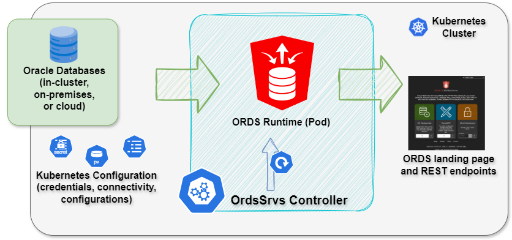
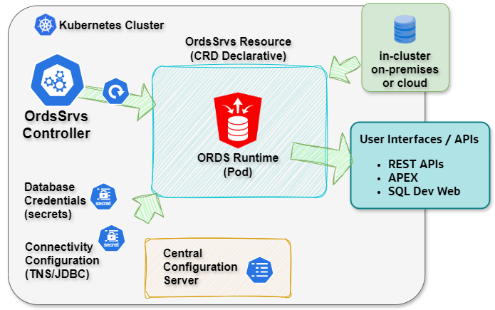

# Oracle REST Data Services (OrdsSrvs) Controller for Kubernetes -  ORDS Lifecycle management

The OrdsSrvs controller extends the Kubernetes API with a Custom Resource (CR) and controller for automating Oracle REST Data Services (ORDS) lifecycle management.

Using the OrdsSrvs controller, you can deploy and manage ORDS in Kubernetes for any reachable Oracle Database, whether the database runs inside Kubernetes or outside the cluster, on-premises or in the cloud.

This controller allows you to run the ORDS middle tier inside Kubernetes, including deployments that would otherwise run as on-premises ORDS application servers, while also supporting automatic ORDS/APEX install and upgrade operations in the target database.

See also the [Quick Start](./quickstart.md) for the shortest end-to-end setup using a reachable Oracle Database.

<p align="center">
  
</p>

## Contents

* [Features Summary](#features-summary)
* [Prerequisites](#prerequisites)
* [Database Credentials Management](#database-credentials-management)
* [Core documentation](#core-documentation)
* [Configuration examples](#configuration-examples)
* [Change Log](#change-log)
* [Troubleshooting](./TROUBLESHOOTING.md)

## Features Summary

The custom OrdsSrvs resource supports the following configurations as a Deployment, StatefulSet, or DaemonSet:

* OrdsSrvs resource with one or multiple database pools
* ORDS and APEX database schemas automatic installation/upgrade
* Deploying ORDS with Central Configuration Server
* HTTP access logs with stdout forwarding and configurable persistence
* Kubernetes liveness, readiness, and startup probes
* Pool probing

ORDS Version supported : 25.1.0+
OrdsSrvs controller supports the majority of ORDS configuration settings as per the [API Documentation](./api.md).


## Prerequisites

 This chapter outlines the necessary requirements that must be satisfied to successfully deploy and operate the OrdsSrvs controller within your Kubernetes cluster.

### Oracle Database Operator

Before installing the OrdsSrvs controller, ensure that the Oracle Database Operator (OraOperator) is installed in your Kubernetes environment. Please follow the detailed installation steps provided in the [README](https://github.com/oracle/oracle-database-operator/blob/main/README.md) to complete this process. The OraOperator must be properly configured and running, as OrdsSrvs depends on its services for functionality.

### Namespace Scoped Deployment

For a dedicated namespace deployment of the OrdsSrvs controller, refer to the "Namespace Scoped Deployment" section in the OraOperator [README](https://github.com/oracle/oracle-database-operator/blob/main/README.md#2-namespace-scoped-deployment).
The following steps configure the controller to watch the `ordsnamespace` namespace.

Create the namespace:

```bash
kubectl create namespace ordsnamespace
```

Apply namespace role binding [ordsnamespace-role-binding.yaml](./examples/ordsnamespace-role-binding.yaml):

```bash
kubectl apply -f examples/ordsnamespace-role-binding.yaml
```

Edit OraOperator to add the namespace under WATCH_NAMESPACE:
```yaml
  - name: WATCH_NAMESPACE
    value: "default,<your namespaces>,ordsnamespace"
```

There are different ways to provide database credentials and connect string for OrdsSrvs.
For step-by-step instructions and field descriptions, refer to the [API](./api.md) reference and the Configuration examples section.

<p align="center">
  
</p>


## Database Credentials Management

Credentials for Oracle REST Data Services (ORDS) can be supplied by delegating management to native Kubernetes Secrets, providing encrypted values, or using an Oracle Wallet.

> **⚠️WARNING⚠️**
>**Security Requirement:** When using the **K8s Secret** mode, please note that by default, Kubernetes Secrets are stored unencrypted in the API server's underlying data store (etcd). They are only Base64 encoded, which does not provide actual security. You must ensure secrets are protected at the Kubernetes level by following the [Good practices for Kubernetes Secrets](https://kubernetes.io/docs/concepts/security/secrets-good-practices/) in the official Kubernetes documentation.

### Credential Modes

| Mode | Attributes | Encryption | Note |
| :--- | :--- | :--- | :--- |
| **Kubernetes Secret** | `spec.poolSettings."db.username"`<br>`spec.poolSettings."db.secret"` | Delegated to K8s Admin  | [Existing DB Example](./examples/existing_db.md) |
| **Encrypted Secret** | `spec.encPrivKey.secretName`<br>`spec.poolSettings."db.username"`<br>`spec.poolSettings."db.secret"` | RSA_OAEP | [Password Encryption Example](./examples/password_encryption.md) |
|**Pool Zip Wallet**|`spec.poolSettings.dbWalletSecret`<br>`spec.poolSettings."db.wallet.zip.service"`| mTLS Wallet (Zip)|[ADB Example](./examples/adb.md)|
|**Shared Zip Wallets**|`spec.globalSettings.zipWalletsSecretName`<br>`spec.poolSettings.zipWalletName`<br>`spec.poolSettings."db.wallet.zip.service"`|mTLS Wallet (Zip)|[Wallets Example](examples/cc_zip_wallets.md)|


* **Encryption at Rest:** Ensure that Encryption at Rest is enabled for your Kubernetes cluster's etcd to protect the underlying data of K8s Secrets.
* **Rotate Credentials:** Rotate database passwords and Oracle Wallets regularly; always apply the principle of **least-privilege RBAC** to restrict access to sensitive secrets.


### Database Connectivity Configuration
The OrdsSrvs controller supports several connection methods to accommodate diverse deployment scenarios, including Oracle Databases running inside Kubernetes, external databases reachable from the cluster, on-premises environments, and cloud services such as Autonomous Database (ADB).
Depending on your security and networking requirements, connectivity can be established using direct JDBC strings, tnsnames.ora aliases, or mTLS-secured Oracle Wallets.

|Mode| Attributes| Format| Note|
|-|-|-|-|
|TNS String|`spec.poolSettings."db.connectionType"`: **customurl**<br>`spec.poolSettings."db.customURL"`| Connection String|[Existing DB Example](./examples/existing_db.md)|
|tnsnames.ora|`spec.poolSettings."db.connectionType"`: **tns**<br>`spec.poolSettings.tnsAdminSecret`<br>`spec.poolSettings."db.tnsAliasName"`| Standard `tnsnames.ora`|[Resources Example](./examples/tnsnames.md)|
|Pool Zip Wallet|`spec.poolSettings.dbWalletSecret`<br>`spec.poolSettings."db.wallet.zip.service"`| mTLS Wallet (Zip)|[ADB Example](./examples/adb.md)|
|Shared Zip Wallets|`spec.globalSettings.zipWalletsSecretName`<br>`spec.poolSettings.zipWalletName`<br>`spec.poolSettings."db.wallet.zip.service"`|mTLS Wallet (Zip)|[Wallets Example](examples/cc_zip_wallets.md)|


## Core documentation

These pages describe the main OrdsSrvs behavior and operational procedures.

* [Quick Start](./quickstart.md)
* [API Reference](./api.md)
* [OpenShift Deployment](./openshift.md)
* [ORDS and APEX schema automatic installation/upgrade](./autoupgrade.md)
* [HTTP Access Logs](./access_log.md)
* [Kubernetes Liveness, Readiness, and Startup Probes](./lifecycle_probes.md)
* [Pool Probing](./pool_probing.md)
* [Troubleshooting](./TROUBLESHOOTING.md)

## Configuration examples

These pages provide scenario-specific OrdsSrvs manifests and configuration.

* [Pre-existing Database](./examples/existing_db.md)
* [Containerized Single Instance Database (SIDB)](./examples/sidb_container.md)
* [Multidatabase using a TNS Names file](./examples/multi_pool.md)
* [Autonomous Database using the OraOperator](./examples/adb_oraoper.md)
* [Autonomous Database without the OraOperator](./examples/adb.md)
* [Oracle API for MongoDB Support](./examples/mongo_api.md)
* [Custom tnsnames.ora](./examples/tnsnames.md)
* [Deploying ORDS with Central Configuration Server](./examples/central_configuration.md)
* [Central Configuration Server with shared zip Wallets](./examples/cc_zip_wallets.md)
* [Instance API](./examples/instance_api.md)
* [Metadata and Resources Example](./examples/metadata_resources.md)

## Change Log

### Version 2.3

* **Kubernetes Liveness, Readiness, and Startup Probes**  
Added configurable startup, readiness, and liveness probes for the ORDS container. See [Kubernetes Liveness, Readiness, and Startup Probes](./lifecycle_probes.md).

* **Pool Probing**  
Added opt-in probing of directly configured ORDS pools. Pool health is reported separately from Kubernetes workload availability. See [Pool Probing](./pool_probing.md).

### Version 2.2

* **HTTP Edge Route**  
Added support for HTTP-only OrdsSrvs deployments for edge TLS termination. Setting `spec.globalSettings."standalone.https.port": 0` disables generated HTTPS listener configuration so the workload and Service expose only HTTP.

* **HTTP Access Log Forwarder**  
Added support for forwarding HTTP access logs to a sidecar container stdout with `spec.accessLogForwarder`. [HTTP Access Logs](./access_log.md)

* **HTTP Access Log Persistence**  
Added support for persisting HTTP access logs with `spec.accessLogPersistence`, configuring retention with `spec.globalSettings."standalone.access.log.retainDays"`, and isolating log files per pod on shared PVCs. [HTTP Access Logs](./access_log.md)

* **Instance API and Admin Password**  
Added support for enabling the ORDS Instance API and bootstrapping the administrator user/password from a Kubernetes Secret through `spec.globalSettings.instanceAPIAdminUser`. [Instance API Example](./examples/instance_api.md)

* **Additional Labels and Annotations**
Added support for custom labels and annotations on generated resources through `spec.commonMetadata`. [Metadata and Resources Example](./examples/metadata_resources.md)

* **Resource Specification**  
Added support for configuring CPU and memory resource requests and limits for ORDS containers through `spec.resources`. [Metadata and Resources Example](./examples/metadata_resources.md)

* **JDK_JAVA_OPTIONS**  
Added support for passing JVM options to ORDS through the `JDK_JAVA_OPTIONS` environment variable with `spec.jdkJavaOptions`.
[Metadata and Resources Example](./examples/metadata_resources.md)

* **BUG FIX: GraphQL Parameter Syntax**  
Fixed the GraphQL configuration parameter syntax by supporting the correct property name `spec.globalSettings."feature.graphql.max.nesting.depth"`.

* **BUG FIX: Image Pull Policy**  
Fixed OrdsSrvs workloads to respect `spec.imagePullPolicy` instead of always using `IfNotPresent`.

* **BUG FIX: OrdsSrvs API and Configuration Cleanup**<br>
Fixed configuration generation for `spec.globalSettings."cache.metadata.graphql.expireAfterWrite"` and `spec.poolSettings."security.validationFunctionType"` so these settings are now written to the ORDS configuration.

* **Operational Change: Stable Container Names**  
OrdsSrvs pods now use stable container names for operational commands: `ordssrvs-init`, `ordssrvs-main`, and `ordssrvs-access-log-forwarder`. [Troubleshooting](./TROUBLESHOOTING.md)

* **Deprecations**  
  The following fields are deprecated in 2.2 and planned for removal in 2.3:
  * Deprecated `spec.imagePullSecrets`  
  the field is not used by the OrdsSrvs controller.
  * Deprecated `spec.globalSettings."apex.download"` and `spec.globalSettings."apex.download.url"`.  
  Use `spec.globalSettings."apex.installation.persistence"` with pre-staged APEX installation files instead.
  * Deprecated `spec.globalSettings."feature.grahpql.max.nesting.depth"`.  
  Use the corrected `spec.globalSettings."feature.graphql.max.nesting.depth"` spelling instead.


### Version 2.1

* **Native Kubernetes Secret**
The `encPrivKey` attribute is now optional; database passwords can be managed via native Kubernetes Secrets.
**⚠️WARNING⚠️** When using Kubernetes Secrets ensure secrets are protected at the Kubernetes level by following the [Good practices for Kubernetes Secrets](https://kubernetes.io/docs/concepts/security/secrets-good-practices/) in the official Kubernetes documentation.

* **TNSAdminSecret**
Added a dedicated documentation page for managing `tnsnames.ora` via Secrets. See [Custom tnsnames.ora Example](./examples/tnsnames.md).
* **Central Configuration Server**
New attribute `spec.globalSettings."central.config.url"` supports deploying ORDS with a Central Configuration Server for externalized settings.
* **Shared Zip Wallets**
New attributes `spec.globalSettings.zipWalletsSecretName` and `spec.poolSettings.zipWalletName` allow multiple mTLS Wallets (.zip) to be defined at the global level and referenced by individual database pools.

### Version 2.0

  - ORDS image 25.1+
  - OpenShift installation
  - APEX installation files from download URL or PersistentVolume
  - BUGFIX [#181 enhancement, init script refactoring and improved logging](https://github.com/oracle/oracle-database-operator/issues/181)
  - BUGFIX [#186 autoUpgradeORDS: true and autoUpgradeAPEX: false not working](https://github.com/oracle/oracle-database-operator/issues/186)
  - BUGFIX [#188 int64 for configuration settings of type Duration](https://github.com/oracle/oracle-database-operator/issues/188)

### Upgrading from 1.2 to 2.0
Password secrets must be recreated when upgrading the operator from version 1.2 to 2.0.
Secrets can be recreated either before or after the operator upgrade. Restarting the OrdsSrvs deployment is not required for this procedure; however, if the deployment does need to be restarted for any reason, ensure secrets are recreated first.
