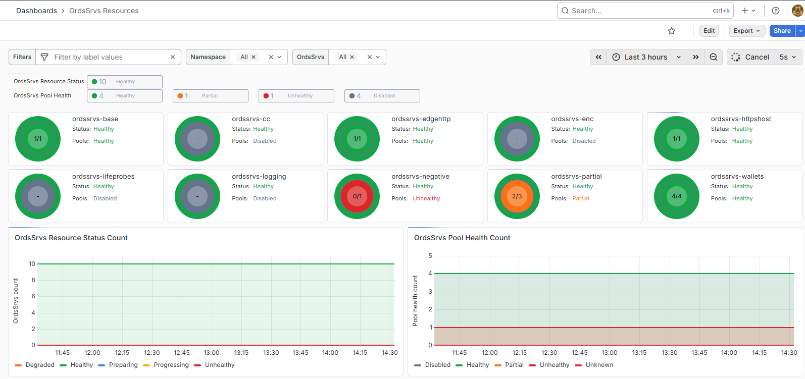

# OrdsSrvs Observability using Prometheus and Grafana

This example monitors OrdsSrvs resource status, workload health, and pool
reachability.

- **OrdsSrvs controller** records the OrdsSrvs resource status.
- **kube-state-metrics** exports that status as metrics.
- **Prometheus** scrapes and stores the metrics.
- **Grafana** displays them in the dashboard.

No additional endpoint or credentials are needed in the ORDS container.



The outer circle shows workload status; the inner circle shows pool health and
successful/total pools. Gray means pool probing is disabled. A healthy workload
can have unhealthy pools.

> The OrdsSrvs controller does not configure ORDS runtime telemetry.
> This example covers OrdsSrvs resource status and pool reachability, not ORDS runtime metrics.

## Quick start

Before you begin:

- Oracle Database Operator 2.3 or later.
- Helm access to your monitoring release.
- Prometheus and Grafana, with kube-state-metrics enabled.

To set up monitoring:

- Download [ordssrvs-kube-state-metrics-values.yaml](./observability/ordssrvs-kube-state-metrics-values.yaml)
  and [ordssrvs-grafana-dashboard.json](./observability/ordssrvs-grafana-dashboard.json).
- Apply the values using the [Helm command](#configure-metric-collection) below.
- [Import the dashboard](#import-the-dashboard) and select your datasource and resources.
- Optionally enable [pool probing](../pool_probing.md) to include pool reachability results.

## Configure metric collection

The supplied file contains Helm values for `kube-prometheus-stack`, including
read-only OrdsSrvs `list` and `watch` permissions for kube-state-metrics.
Do not apply it with `kubectl apply`.

For an existing stack:

```bash
helm upgrade prometheus kube-prometheus-stack \
  --repo https://prometheus-community.github.io/helm-charts \
  --version <installed-chart-version> \
  --namespace prometheus \
  --reuse-values \
  --values ordssrvs-kube-state-metrics-values.yaml
```

Use your release name, namespace, and installed chart version. If you already
have custom configuration, merge the OrdsSrvs entries into your values file to
preserve it.

For a new development/test stack only:

```bash
helm repo add prometheus-community https://prometheus-community.github.io/helm-charts
helm repo update
helm upgrade --install monitoring prometheus-community/kube-prometheus-stack \
  --namespace monitoring --create-namespace \
  --values ordssrvs-kube-state-metrics-values.yaml
```

For installation options, refer to the official kube-prometheus-stack documentation.

This example used chart `83.4.0`, kube-state-metrics `2.18.0`, and Grafana
`12.4.2`. Other versions may require compatibility adjustments.

## Verify metrics in Prometheus

Run this query in the Prometheus table view or Grafana Explore:

```promql
ordssrvs_status == 1
```

Example result (additional scrape labels omitted):

```text
ordssrvs_status{namespace="testcase",ordssrvs="ordssrvs-base",state="Healthy"} 1
```

If no results appear, check kube-state-metrics logs, OrdsSrvs read permissions,
and the Prometheus scrape target.

## Import the dashboard

1. In Grafana, open **Dashboards → New → Import** and upload `ordssrvs-grafana-dashboard.json`.
2. Select your Prometheus datasource, import, and choose the namespace and resources.

Customize this example dashboard for your environment. You can add Grafana or
Prometheus alert rules; none are included.

## Exported metrics

All metrics carry `namespace` and `ordssrvs` labels. Per-pool metrics also carry
the `pool` label.

| Metric | Source | Meaning |
|---|---|---|
| `ordssrvs_status` | `status.status` | Current workload health. |
| `ordssrvs_pools_health` | `status.poolsHealth` | Overall health of the evaluated pools. |
| `ordssrvs_pool_outcome` | `status.poolProbes[].outcome` | Latest reachability result for each pool. |
| `ordssrvs_pool_http_status_code` | `status.poolProbes[].httpStatusCode` | HTTP response code, when available. |
| `ordssrvs_pool_last_checked_timestamp_seconds` | `status.poolProbes[].lastChecked` | Time of the latest pool probe, in Unix seconds. |
| `ordssrvs_pool_total_count` | `status.poolsTotal` | Total pools evaluated. |
| `ordssrvs_pool_ok_count` | `status.poolsOK` | Reachable pools. |
| `ordssrvs_pool_failed_count` | `status.poolsFailed` | Unreachable pools. |

State metrics use a StateSet: the current state has value `1`, and the other
configured states have value `0`. Counts, HTTP codes, and timestamps are Gauges.
Disabled probing leaves pool counts and per-pool results absent; this does not
mean zero pools or failed probes.

Pool metrics reflect the last completed probe. Check
`ordssrvs_pool_last_checked_timestamp_seconds` for freshness.

Pool probes check reachability through the Service; they do not report health
for each replica.
