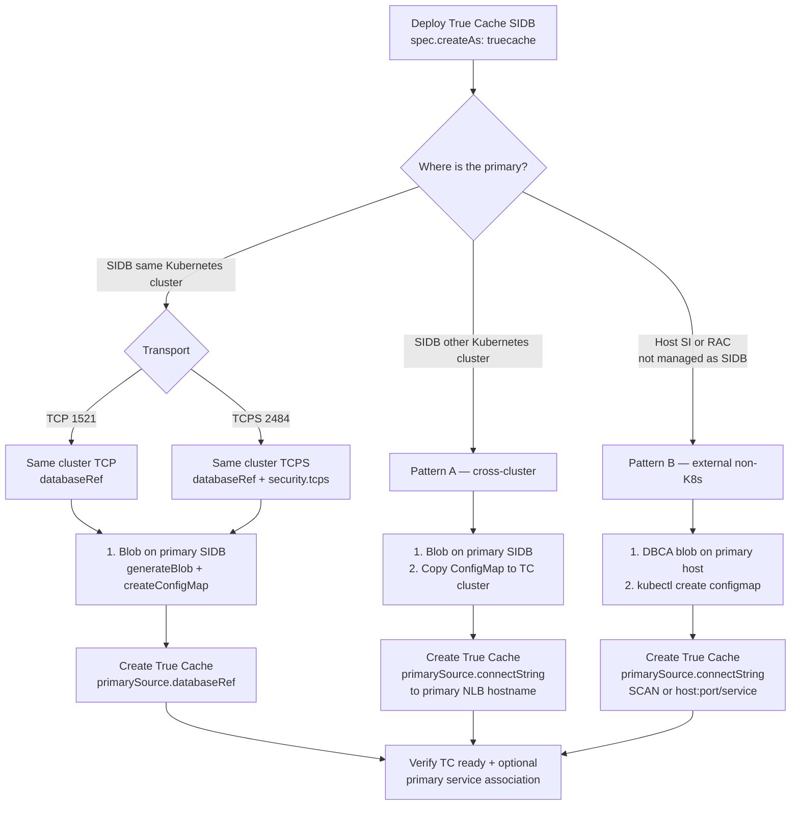
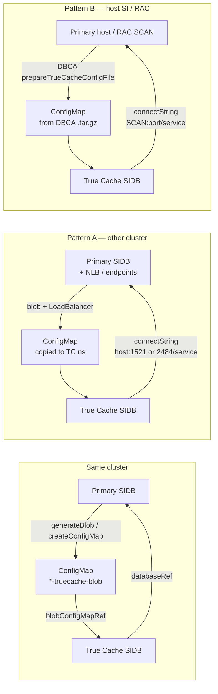

# Oracle Database Operator for Kubernetes: Managing Single Instance Databases (SIDB)

Oracle Database Operator for Kubernetes (`OraOperator`) provides the SingleInstanceDatabase (SIDB) controller for deploying, managing, patching, cloning, and operating Oracle Database on Kubernetes. This guide covers Oracle Single Instance Database deployments, Data Guard, True Cache, ORDS, TCPS, and day-to-day lifecycle management using the `database.oracle.com/v4` API.

Use this document when you want to:

- Create a new single-instance database
- Provision clone, standby, or True Cache databases
- Configure Data Guard Broker, TCPS, service endpoints, or custom scripts
- Patch, resize, or delete a database
- Enable Oracle REST Data Services (ORDS) and Oracle APEX

For related documents:

- Prerequisites: [`PREREQUISITES.md`](./PREREQUISITES.md)
- SIDB API migration notes: [`SIDB_V4_MIGRATION_FAQ.md`](./SIDB_V4_MIGRATION_FAQ.md)
- SIDB TCPS cert-manager single-script flow: [`tcps-cert-manager/README.md`](./tcps-cert-manager/README.md)

## Contents

- [Before You Begin](#before-you-begin)
- [Quick Start: Deploy Oracle Database on Kubernetes](#quick-start-deploy-oracle-database-on-kubernetes)
- [SIDB v4 Resource Model](#sidb-v4-resource-model)
- [Choose an SIDB Deployment Scenario](#choose-an-sidb-deployment-scenario)
- [Verify Oracle SIDB Deployment](#verify-oracle-sidb-deployment)
- [Workflows](#workflows)
  - [SIDB Deployment and Lifecycle](#sidb-deployment-and-lifecycle)
  - [Data Guard](#data-guard)
  - [True Cache](#true-cache)
  - [ORDS and APEX](#ords-and-apex)
- [Networking](#networking)
  - [External Service Exposure](#external-service-exposure)
  - [Specifying Custom Ports](#specifying-custom-ports)
  - [Enabling TCPS Connections](#enabling-tcps-connections)
  - [Host Aliases](#host-aliases)
- [Storage](#storage)
  - [Dynamic Persistence](#dynamic-persistence)
  - [Static Persistence](#static-persistence)
  - [Storage Expansion](#storage-expansion)
  - [Write Permissions and Scripts Volume](#write-permissions-and-scripts-volume)
- [Lifecycle](#lifecycle)
  - [Database Pod Resources and Init Parameters](#database-pod-resources-and-init-parameters)
  - [Execute Custom Scripts](#execute-custom-scripts)
  - [Immutable or Sensitive Areas](#immutable-or-sensitive-areas)
  - [Maintenance Operations](#maintenance-operations)
- [Sample Catalog](#sample-catalog)
- [Troubleshooting and Known Issues](#troubleshooting-and-known-issues)
  - [Collect Diagnostics](#collect-diagnostics)
  - [Common SIDB Errors](#common-sidb-errors)
  - [Known Issues](#known-issues)
- [Frequently Asked Questions](#frequently-asked-questions)
- [Additional Information](#additional-information)

## Before You Begin

Complete the deployment prerequisites in [`PREREQUISITES.md`](./PREREQUISITES.md) before applying SIDB manifests.

That document covers:

- Oracle Container Registry access
- Image pull secrets
- Various secrets, including the database admin password secret and scenario-specific secrets for TDE, TCPS, and ORDS
- Storage and persistent volume preparation
- Optional TCPS, TDE, and advanced prerequisites

Oracle strongly recommends using the prerequisite document together with the current SIDB template:

- Template manifest: [`config/samples/sidb/singleinstancedatabase.yaml`](../../config/samples/sidb/singleinstancedatabase.yaml)

### Mandatory Resource Privileges

The SIDB controller requires the following Kubernetes resource privileges:

| Resource | Privileges |
| --- | --- |
| Pods | `create delete get list patch update watch` |
| Containers | `create delete get list patch update watch` |
| PersistentVolumeClaims | `create delete get list patch update watch` |
| Services | `create delete get list patch update watch` |
| Secrets | `create delete get list patch update watch` |
| Events | `create patch` |

For access management, see [`../../README.md`](../../README.md).

### Optional Resource Privileges

Some Oracle Database Operator features require additional Kubernetes RBAC permissions. Apply the corresponding RBAC manifest only if you plan to use the associated feature.

| Feature | When Required | Resource | Privileges |
| --- | --- | --- | --- |
| NodePort service connect strings | When using NodePort services to generate database connect strings | Nodes | `list`, `watch` |
| Storage expansion for block volumes | When using block volume expansion for database storage | StorageClasses | `get`, `list`, `watch` |
| Custom script execution | When executing custom scripts that require PersistentVolume information | PersistentVolumes | `get`, `list`, `watch` |

The optional RBAC manifests are located in the repository `rbac` directory:

- [`rbac/node-rbac.yaml`](../../rbac/node-rbac.yaml)
- [`rbac/storage-class-rbac.yaml`](../../rbac/storage-class-rbac.yaml)
- [`rbac/persistent-volume-rbac.yaml`](../../rbac/persistent-volume-rbac.yaml)

If you are running commands from the repository root, apply them as follows:

```sh
kubectl apply -f rbac/node-rbac.yaml
kubectl apply -f rbac/storage-class-rbac.yaml
kubectl apply -f rbac/persistent-volume-rbac.yaml
```

If you are running commands from another directory, provide the correct relative or absolute path to the same files.

### OpenShift Security Context Constraints

If you deploy SIDB on OpenShift, create the required SCC and service account before creating the database. Use:

- [`config/samples/sidb/openshift_rbac.yaml`](../../config/samples/sidb/openshift_rbac.yaml)

Then set `spec.serviceAccountName` to the service account created for SIDB, for example `sidb-sa`.

## Quick Start: Deploy Oracle Database on Kubernetes

This is the fastest path for a new enterprise database using the v4 parameter layout:

1. Complete the prerequisites in [`PREREQUISITES.md`](./PREREQUISITES.md).
2. Create the admin password secret and the image pull secret in the required namespace.
3. Apply a SIDB manifest.
4. Verify status and connect.

Example: Copy the following manifest into a file named `sidb.yaml`, update the namespace, storage class, and secret names for your environment.

**Important:** The current document uses the `default` namespace for SIDB deployments. Please replace the namespace with the actual namespace you want to use for your deployment.

```yaml
apiVersion: database.oracle.com/v4
kind: SingleInstanceDatabase
metadata:
  name: sidb-sample
  namespace: default
spec:
  sid: ORCL1
  edition: enterprise
  createAs: primary
  security:
    secrets:
      admin:
        secretName: db-admin-secret
        secretKey: oracle_pwd
        keepSecret: true
  charset: AL32UTF8
  pdbName: orclpdb1
  archiveLog: true
  image:
    pullFrom: container-registry.oracle.com/database/enterprise_ru:latest-19
    pullSecrets: oracle-container-registry-secret
  persistence:
    oradata:
      size: 100Gi
      storageClass: oci-bv
      accessMode: ReadWriteOnce
  replicas: 1
```

Apply and verify:

```sh
kubectl apply -f sidb.yaml
kubectl get singleinstancedatabase sidb-sample
kubectl describe singleinstancedatabase sidb-sample
```

Check SIDB status and connect strings:

```sh
kubectl get singleinstancedatabase sidb-sample -n default \
  -o jsonpath='{.status.status}{"\n"}{.status.role}{"\n"}{.status.connectString}{"\n"}{.status.tcpsConnectString}{"\n"}'
```

Use the sample manifest as a starting point:

- [`config/samples/sidb/singleinstancedatabase_create.yaml`](../../config/samples/sidb/singleinstancedatabase_create.yaml)

## SIDB v4 Resource Model

The most important documentation change in v4 is the grouped parameter model. When authoring new manifests, prefer the v4 grouped layout described below.

### Key v4 Groups

| Area | v4 fields | Notes |
| --- | --- | --- |
| Admin credentials | `spec.security.secrets.admin` | Replaces the flat password-secret style for new manifests |
| Source database | `spec.primarySource` | Used for `clone`, `standby`, and `truecache` |
| True Cache | `spec.trueCache` | Covers blob generation and truecache-only options |
| TCPS | `spec.security.tcps` | Enables TCPS and TLS secret handling |
| Services Endpoints | `spec.services.endpoints` | Defines external TCP and TCPS service endpoints |
| Storage | `spec.persistence.oradata` | Main datafiles volume definition |
| Resources | `spec.resources` | Standard Kubernetes resource requests and limits |

### Core SIDB Modes

The controller supports these primary `spec.createAs` values:

- `primary`
- `clone`
- `standby`
- `truecache`

### Source Database Reference

For `clone`, `standby`, and `truecache`, use `spec.primarySource` and set exactly one of:

- `primarySource.databaseRef`
- `primarySource.connectString`
- `primarySource.details`

Optional companion fields under `spec.primarySource`:

- `primarySource.dbName`
  **Definition (use this meaning everywhere):** the primary CDB **`DB_NAME`** — the short name from `SELECT name FROM v$database` (for example `DB15` or `ORCLPRD`).

  It is **not**:

  - the primary `DB_UNIQUE_NAME` (for example `DB15_FRA`)
  - a domain-qualified service or SCAN service string (for example `DB15_FRA.dbsubnet.vcn….oraclevcn.com`)
  - the True Cache SID or True Cache unique name

  Supported for `standby` and `truecache`.

  **True Cache behavior:**

  - **Optional.** Omitting `dbName` works. During True Cache provisioning, scripts resolve `PRIMARY_DB_NAME` from the primary (they may start from a provisional value derived from the connect string or SIDB reference, then correct to the primary’s real `db_name` if that differs).
  - **When set**, that value is used as the caller-provided `PRIMARY_DB_NAME` (no dynamic correction needed if it is already the short CDB name).
  - **Always use the short CDB `DB_NAME`.** Putting a full SCAN service name or `DB_UNIQUE_NAME` in `dbName` can break `CREATE TRUE CACHE`.
  - **`db_domain` side effect (current image/operator behavior):** if you omit `dbName`, the True Cache database often inherits the primary’s `db_domain`. If you set `dbName` to the short primary `DB_NAME`, True Cache typically gets a cluster-local `db_domain` (for example `*.svc.cluster.local`) instead of the primary’s domain. Choose intentionally: omit when you want domain inheritance; set the short `DB_NAME` when you want to avoid inheriting the primary domain (preferred in many operator/lab setups).

  `databaseRef` / `connectString` still identify **how** to reach the primary. `dbName` only supplies the primary **CDB name** used for True Cache / standby bootstrap.
- `primarySource.pdbName`
  Supplies the primary PDB name when the source is expressed through `primarySource.connectString`.

### Authoring Note

Use the grouped v4 fields from the main template when authoring new manifests:

- [`config/samples/sidb/singleinstancedatabase.yaml`](../../config/samples/sidb/singleinstancedatabase.yaml)

## Choose an SIDB Deployment Scenario

Use this section as a quick entry point for the most common SIDB scenarios.

| Scenario | Where to start |
| --- | --- |
| New enterprise database | [Quick Start: Deploy Oracle Database on Kubernetes](#quick-start-deploy-oracle-database-on-kubernetes) and [Create a New Database](#create-a-new-database) |
| Prebuilt database | [Create a Prebuilt Database](#create-a-prebuilt-database) |
| Express edition | [Create Express, Free, or Free Lite Databases](#create-express-free-or-free-lite-databases) |
| Free edition | [Create Express, Free, or Free Lite Databases](#create-express-free-or-free-lite-databases) |
| Free Lite edition | [Create Express, Free, or Free Lite Databases](#create-express-free-or-free-lite-databases) |
| Clone database | [Clone a Database](#clone-a-database) |
| Standby database | [Create a Standby Database](#create-a-standby-database) |
| Data Guard Broker | [Data Guard](#data-guard) |
| TCPS-enabled database | [Enabling TCPS Connections](#enabling-tcps-connections) |
| Create True Cache in the Same Cluster as Primary | [Create True Cache in the Same Cluster as Primary](#create-true-cache-in-the-same-cluster-as-primary) |
| Create True Cache for an External Primary | [Create True Cache for an External Primary](#create-true-cache-for-an-external-primary) |
| ORDS and APEX | [ORDS and APEX](#ords-and-apex) |

## Verify Oracle SIDB Deployment

### List Databases

```sh
kubectl get singleinstancedatabase -n default -o name
```

Example output:

```text
singleinstancedatabase.database.oracle.com/sidb-sample
```

### Quick Status

```sh
kubectl get singleinstancedatabase sidb-sample
```

Typical columns include edition, status, version, connect strings, and OEM Express URL. For example:

```sh
NAME          EDITION      STATUS    ROLE      VERSION       CONNECT STR                            TCPS CONNECT STR   OEM EXPRESS URL
sidb-sample   Enterprise   Healthy   PRIMARY   19.30.0.0.0   sidb-sample-quick.default:1521/ORCL1   Not enabled        https://sidb-sample-quick.default:5500/em
```

Similar output when using a 23.26ai SIDB Container Image:

```sh
NAME          EDITION      STATUS    ROLE      VERSION       CONNECT STR                      TCPS CONNECT STR   OEM EXPRESS URL
sidb-sample   Enterprise   Healthy   PRIMARY   23.26.3.0.0   sidb-sample.default:1521/ORCL1   Not enabled        Unavailable
```

**Important:**  [Oracle Enterprise Manager Database Express (EM Express)](https://docs.oracle.com/en/database/oracle/oracle-database/26/upgrd/oracle-database-changes-deprecations-desupports.html#GUID-29F1114E-0269-4863-A6B4-769E44625463) is desupported in Oracle AI Database 26ai.

### Detailed Status

```sh
kubectl describe singleinstancedatabase sidb-sample -n default
```

Useful fields include:

- role
- SID
- PDB name
- release update
- replicas
- connect strings
- condition history

### Pod, Service, PVC, and Secret Verification

```sh
kubectl get pods -n default
kubectl get svc -n default
kubectl get pvc -n default
kubectl get secret -n default
```

### JSONPath Examples

```sh
kubectl get singleinstancedatabase sidb-sample -n default \
  -o jsonpath='{.status.status}{"\n"}{.status.role}{"\n"}{.status.connectString}{"\n"}'
```

Example output:

```text
Healthy
PRIMARY
sidb-sample.default:1521/ORCL1
```

Similarly, you can get the TCPS connect string, if enabled, using the following command:

```sh
kubectl get singleinstancedatabase sidb-sample -o jsonpath='{.status.tcpsConnectString}{"\n"}'
```

## Workflows

Use these task-oriented sections to create and operate SIDB databases, including day-to-day lifecycle, Data Guard, True Cache, and ORDS/APEX.

- [SIDB Deployment and Lifecycle](#sidb-deployment-and-lifecycle)
- [Data Guard](#data-guard)
- [True Cache](#true-cache)
- [ORDS and APEX](#ords-and-apex)

### SIDB Deployment and Lifecycle

This section is task-oriented. Each workflow points to the recommended sample and highlights the main parameters to review.

Before using any workflow in this section, complete [Before You Begin](#before-you-begin). Verify that the namespace, secrets, image pull secret, and storage class used by the selected YAML exist.

- [Create a New Database](#create-a-new-database)
- [Create a Prebuilt Database](#create-a-prebuilt-database)
- [Create Express, Free, or Free Lite Databases](#create-express-free-or-free-lite-databases)
- [Connect to a Database](#connect-to-a-database)
- [Clone a Database](#clone-a-database)
- [Create a Standby Database](#create-a-standby-database)
- [Patch a Database](#patch-a-database)
- [Delete a Database](#delete-a-database)

#### Create a New Database

Use when you want a fresh database instance initialized by the operator.

Primary sample:

- [`config/samples/sidb/singleinstancedatabase_create.yaml`](../../config/samples/sidb/singleinstancedatabase_create.yaml)
If you are running from the repository root, the path is:

```sh
config/samples/sidb/singleinstancedatabase_create.yaml
```

Key fields:

- `spec.sid`
- `spec.edition`
- `spec.createAs: primary`
- `spec.security.secrets.admin`
- `spec.charset`
- `spec.pdbName`
- `spec.archiveLog`
- `spec.image`
- `spec.persistence.oradata`
- `spec.replicas`

#### Create a Prebuilt Database

Use when the image already contains a prebuilt database.

Sample:

- [`config/samples/sidb/singleinstancedatabase_prebuiltdb.yaml`](../../config/samples/sidb/singleinstancedatabase_prebuiltdb.yaml)

Key fields:

- `spec.image.prebuiltDB: true`
- prebuilt database image selection

#### Create Express, Free, or Free Lite Databases

Use these edition-specific or image-specific samples when you want lighter-weight database distributions. Check the sample manifest for the exact `spec.edition` value supported by the installed CRD.

Samples:

- [`config/samples/sidb/singleinstancedatabase_express.yaml`](../../config/samples/sidb/singleinstancedatabase_express.yaml)
- [`config/samples/sidb/singleinstancedatabase_free.yaml`](../../config/samples/sidb/singleinstancedatabase_free.yaml)
- [`config/samples/sidb/singleinstancedatabase_free-lite.yaml`](../../config/samples/sidb/singleinstancedatabase_free-lite.yaml)

Review:

- `spec.edition`
- image selection
- resource sizing
- storage sizing

#### Connect to a Database

For application and operator-facing connections, use SIDB status. The following commands demonstrate how to retrieve the connection strings for an SIDB deployment created using the manifest in the [Quick Start: Deploy Oracle Database on Kubernetes](#quick-start-deploy-oracle-database-on-kubernetes) section.

```sh
# Retrieve the primary connect string
kubectl get singleinstancedatabase sidb-sample -n default \
  -o jsonpath='{.status.connectString}{"\n"}'
```

Example output:

```text
sidb-sample.default:1521/ORCL1
```

```sh
# Retrieve the cluster connect string
kubectl get singleinstancedatabase sidb-sample -n default \
  -o jsonpath='{.status.clusterConnectString}{"\n"}'
```

Example output:

```text
sidb-sample.default:1521/ORCL1
```

```sh
# Retrieve the TCPS connect string
kubectl get singleinstancedatabase sidb-sample -n default \
  -o jsonpath='{.status.tcpsConnectString}{"\n"}'
```

Example output:

```text
Not enabled
```

Use:

- `status.clusterConnectString` for in-cluster usage
- `status.connectString` for external TCP access
- `status.tcpsConnectString` for external TCPS access

#### Clone a Database

Use when you want a new SIDB created from an existing primary database.

**Important:** To clone a database, the source database must have archiveLog mode set to true:

```sh
  ## Enable/Disable ArchiveLog. Should be true to allow DB cloning
```

Example output:

```text
spec:
  archiveLog: true
```

Sample:

- [`config/samples/sidb/singleinstancedatabase_clone.yaml`](../../config/samples/sidb/singleinstancedatabase_clone.yaml)

Key fields:

- `spec.createAs: clone`
- `spec.primarySource`
- `spec.security.secrets.admin`
- image compatible with the source database major version

#### Create a Standby Database

Use when you want a physical standby SIDB.

Please refer to [Create the Primary and Standby SIDB](#create-the-primary-and-standby-sidb) for details.

#### Patch a Database

Use when moving to a newer RU-compatible image.

Sample:

- [`config/samples/sidb/singleinstancedatabase_patch.yaml`](../../config/samples/sidb/singleinstancedatabase_patch.yaml)

What to change:

- `spec.image.pullFrom`

Verify:

```sh
kubectl describe singleinstancedatabase sidb-sample -n default
```

Review status fields such as patched release update and related events.

#### Delete a Database

Delete the SIDB deployment:

```sh
NS=default
DB=sidb-sample

kubectl delete singleinstancedatabase $DB -n $NS
```

Before deleting:

- delete ORDS first if the SIDB is referenced by an ORDS resource
- delete Data Guard Broker first if the SIDB is part of a Data Guard configuration
- review PVCs before deleting database storage

Check PVCs:

```sh
kubectl get pvc -n $NS
```

> Do not delete PVCs unless you intend to delete the database files.

### Data Guard

Complete the deployment prerequisites in [`PREREQUISITES.md`](./PREREQUISITES.md) before following this section. Also verify that the primary and standby manifests use valid namespaces, matching secrets, compatible images, and reachable network endpoints.

The SIDB controller and `DataguardBroker` controller work together for Data Guard workflows. For this project, the recommended flow is:

1. Create the primary SIDB.
2. Create the standby SIDB with Data Guard prerequisites enabled.
3. Wait until both SIDB resources are `Healthy`.
4. Render the `DataguardBroker` YAML from `sidb-standby.status.dataguard.renderedBrokerSpec`.
5. Apply the generated `DataguardBroker` YAML.
6. Watch the broker, SIDB, and pod status.

If the primary uses TDE, complete [Create a Standby Database with TDE Encryption](#create-a-standby-database-with-tde-encryption) before applying the standby manifest. The standby manifest must reference the secret that contains both the TDE wallet password and the exported primary wallet zip.

Use the generated broker YAML for the normal SIDB Data Guard flow. The generated YAML is derived from the standby SIDB status and avoids hand-maintaining primary and standby topology details.

- [Data Guard Sample and Helper Files](#data-guard-sample-and-helper-files)
- [Create the Primary and Standby SIDB](#create-the-primary-and-standby-sidb)
- [Create a Standby Database with TDE Encryption](#create-a-standby-database-with-tde-encryption)
- [Confirm Primary and Standby are Ready](#confirm-primary-and-standby-are-ready)
- [Create the Data Guard Broker Configuration](#create-the-data-guard-broker-configuration)
- [Perform Data Guard Operations](#perform-data-guard-operations)
- [Enable Fast-Start Failover](#enable-fast-start-failover)
- [Static Data Guard Connect String](#static-data-guard-connect-string)
- [Delete the Data Guard Configuration](#delete-the-data-guard-configuration)

#### Data Guard Sample and Helper Files

Standby SIDB samples:

- [`config/samples/sidb/singleinstancedatabase_standby.yaml`](../../config/samples/sidb/singleinstancedatabase_standby.yaml)
- [`config/samples/sidb/singleinstancedatabase_standby_connectstring.yaml`](../../config/samples/sidb/singleinstancedatabase_standby_connectstring.yaml)
- [`config/samples/sidb/singleinstancedatabase_standby_tcps.yaml`](../../config/samples/sidb/singleinstancedatabase_standby_tcps.yaml)
- [`config/samples/sidb/singleinstancedatabase_standby_tcps_connectstring.yaml`](../../config/samples/sidb/singleinstancedatabase_standby_tcps_connectstring.yaml)

Data Guard Broker helper files:

- [`config/samples/sidb/render-dg-broker-from-status.sh`](../../config/samples/sidb/render-dg-broker-from-status.sh)
- [`config/samples/sidb/gen_dg.sh`](../../config/samples/sidb/gen_dg.sh)

For the generated flow, apply the YAML produced from `status.dataguard.renderedBrokerSpec`.

If you are running commands from the repository root, the helper paths are:

```sh
config/samples/sidb/render-dg-broker-from-status.sh
```

Example output:

```text
config/samples/sidb/gen_dg.sh
```

Key fields:

- `spec.createAs: standby`
- `spec.primarySource`
- `spec.security.secrets.admin`
- `spec.image`
- `spec.persistence.oradata`
- for TDE-enabled primaries, `spec.security.secrets.tde` with both the TDE wallet password key and the standby wallet zip key
- optional `spec.security.tcps`
- optional `spec.dataguard.prereqs`

For standby creation, choose one primary source method.

Use `primarySource.databaseRef` when the primary SIDB exists in the same namespace. For example:

```yaml
primarySource:
  databaseRef: sidb-sample
```

Use `primarySource.connectString` when the standby must connect to the primary through a service name, DNS name, IP address, or another network path. For example:

```yaml
primarySource:
  connectString: "<primary-host-or-service>:1521/<primary-service-or-sid>"
```

Set exactly one of:

- `primarySource.databaseRef`
- `primarySource.connectString`
- `primarySource.details`

If the standby is being prepared for a Data Guard workflow, add:

```yaml
dataguard:
  prereqs:
    enabled: true
```

If the standby uses TCPS, create the TLS secret first and add:

```yaml
security:
  tcps:
    enabled: true
    tlsSecret: standby-db-tcps-secret
```

For cert-manager based TCPS certificate generation, see [`tcps-cert-manager/README.md`](./tcps-cert-manager/README.md).

#### Create the Primary and Standby SIDB

Create the primary SIDB first, then create the standby SIDB.

Primary SIDB starting point:

- [`config/samples/sidb/singleinstancedatabase_create.yaml`](../../config/samples/sidb/singleinstancedatabase_create.yaml)

Standby SIDB starting point:

- [`config/samples/sidb/singleinstancedatabase_standby.yaml`](../../config/samples/sidb/singleinstancedatabase_standby.yaml)

**Important:** If the primary uses TDE, complete [Create a Standby Database with TDE Encryption](#create-a-standby-database-with-tde-encryption) before applying the standby manifest. The standby manifest must reference the secret that contains both the TDE wallet password and the exported primary wallet zip.

In the examples below, the namespace and resource names are:

```sh
NS=default
PRIMARY_DB=sidb-sample
STANDBY_DB=standbydatabase-sample
DGB=standbydatabase-sample-dg
```

If your environment uses different names, update the variables and manifest values before applying resources.

For the standby SIDB, enable Data Guard prerequisites:

```yaml
dataguard:
  prereqs:
    enabled: true
```

Verify that the primary and standby manifests use:

- the same namespace watched by the operator
- compatible database images
- reachable TCP or TCPS endpoints
- valid admin secret references
- valid image pull secrets, if the image registry is private
- valid TCPS TLS secrets, if TCPS is enabled

#### Create a Standby Database with TDE Encryption

Use this flow when the primary SIDB has TDE enabled and the standby must be created from that primary. The operator automates the standby-side wallet mount and the database image imports the wallet during standby bootstrap, but the current flow expects you to export the primary wallet into a Kubernetes Secret before creating the standby.

At a high level, in order to setup Primary and Standby databases with TDE encryption, you need to follow these steps:

1. Create the primary TDE password secret.
2. Create the primary SIDB with `spec.security.secrets.tde`.
3. Wait until the primary database is healthy.
4. Export the primary wallet files into a zip archive.
5. Create a standby TDE secret that contains both the TDE wallet password and the wallet zip archive.
6. Create the standby SIDB and reference that secret through `spec.security.secrets.tde`.

**Important:** If the primary database already exists with TDE encryption enabled, you can skip the step 1 to 3.

Create the primary TDE password secret:

```sh
NS=default

kubectl -n $NS create secret generic sidb-primary-tde-wallet \
  --from-literal=tde_wallet_pwd='<tde-wallet-password>'
```

Reference the secrets from the primary SIDB:

```yaml
security:
  secrets:
    admin:
      secretName: sidb-primary-admin
      secretKey: oracle_pwd
      keepSecret: true
    tde:
      secretName: sidb-primary-tde-wallet
      secretKey: tde_wallet_pwd
```

After the primary is healthy, find the primary pod and the effective `wallet_root`:

```sh
NS=default
PRIMARY=sidb-primary
POD=$(kubectl -n $NS get pod -l app=$PRIMARY -o jsonpath='{.items[0].metadata.name}')

kubectl -n $NS exec "$POD" -- bash -c 'sqlplus -s / as sysdba <<EOF
set heading off feedback off pages 0 verify off echo off
select value from v\$parameter where name = '\''wallet_root'\'';
exit
EOF'
```

Set `WALLET_ROOT` to the returned value. If your database image has `zip`, create the wallet archive in the primary pod and copy it locally. For example:

```sh
WALLET_ROOT=/opt/oracle/oradata/ORCL1/tdewallet
```

Create the wallet archive in the primary pod and copy it locally:

```sh
kubectl -n $NS exec "$POD" -- bash -c \
  "cd '$WALLET_ROOT' && rm -f /tmp/standby-wallet.zip && zip -qr /tmp/standby-wallet.zip tde"

kubectl -n $NS cp \
  "$POD:/tmp/standby-wallet.zip" \
  ./standby-wallet.zip
```

If the image does not have `zip`, copy the wallet root locally and zip it from your client machine:

```sh
WALLET_ROOT=/opt/oracle/oradata/ORCL1/tdewallet

rm -rf primary-wallet standby-wallet.zip

kubectl -n $NS cp "$POD:$WALLET_ROOT" ./primary-wallet
(cd primary-wallet && zip -qr ../standby-wallet.zip tde)

unzip -t standby-wallet.zip
```

Create the standby TDE secret. This secret must contain the TDE password and the wallet zip archive:

```sh
kubectl -n $NS create secret generic sidb-standby-tde-wallet \
  --from-literal=tde_wallet_pwd='<tde-wallet-password>' \
  --from-file=wallet.zip=./standby-wallet.zip
```

To update an existing standby wallet secret:

```sh
kubectl -n $NS create secret generic sidb-standby-tde-wallet \
  --from-literal=tde_wallet_pwd='<tde-wallet-password>' \
  --from-file=wallet.zip=./standby-wallet.zip \
  --dry-run=client -o yaml |
kubectl apply -f -
```

Reference the primary from the standby SIDB and configure the TDE wallet secret:

```yaml
security:
  secrets:
    admin:
      secretName: sidb-primary-admin
      secretKey: oracle_pwd
      keepSecret: true
    tde:
      secretName: sidb-standby-tde-wallet
      secretKey: tde_wallet_pwd # Not required for 19c - Required 23ai and later
      walletZipFileKey: wallet.zip
      walletRoot: /opt/oracle/oradata/ORCLS/tdewallet
```

Replace `ORCLS` with the standby SID.

The important standby TDE fields are:

* `secretName`: Kubernetes Secret containing the wallet password and wallet zip.
- `secretKey`: - Not required for 19c - Required for 23ai and later (e.g., 23ai, 26ai) as `tde_wallet_pwd`
* `walletZipFileKey`: Secret key containing the exported primary wallet zip.
* `walletRoot`: destination wallet root for the standby database. Set this explicitly for predictable bootstrap behavior.

During standby pod creation, the operator mounts `walletZipFileKey` as `standby-wallet.zip` and passes the path to the container. The image verifies that the zip is valid, extracts the primary wallet into a temporary source directory, keeps `walletRoot` as the standby wallet destination, and configures DBCA with the source wallet, source wallet password, and destination wallet root.

Verify the standby wallet mount and environment after the pod is created:

```sh
STANDBY=sidb-standby
STANDBY_POD=$(kubectl -n $NS get pod -l app=$STANDBY -o jsonpath='{.items[0].metadata.name}')

kubectl -n $NS get pod "$STANDBY_POD" -o jsonpath='{.spec.volumes[*].name}{"\n"}{range .spec.containers[0].env[*]}{.name}={.value}{"\n"}{end}' | \
  egrep 'standby-wallet|STANDBY_TDE|TDE_WALLET_ROOT'
```

If standby bootstrap fails, check the standby pod logs for messages such as missing `standby-wallet.zip`, invalid zip archive, or missing `cwallet.sso` / `ewallet.p12` after extraction:

```sh
kubectl -n $NS logs "$STANDBY_POD" --previous
kubectl -n $NS logs "$STANDBY_POD"
```

#### Confirm Primary and Standby are Ready

After the primary and standby SIDB resources are created, wait until both are `Healthy`.

```sh
NS=default

kubectl get singleinstancedatabase -n $NS -o wide
```

Expected status and role:

```text
sidb-sample              Healthy   PRIMARY
standbydatabase-sample   Healthy   PHYSICAL_STANDBY
```

The actual `kubectl get ... -o wide` output may include additional columns. The important values are:

- `sidb-sample` is `Healthy` with role `PRIMARY`
- `standbydatabase-sample` is `Healthy` with role `PHYSICAL_STANDBY`

You can also check each resource directly:

```sh
NS=default
PRIMARY_DB=sidb-sample
STANDBY_DB=standbydatabase-sample

kubectl get singleinstancedatabase $PRIMARY_DB -n $NS \
  -o jsonpath='{.status.status}{"\n"}{.status.role}{"\n"}'

kubectl get singleinstancedatabase $STANDBY_DB -n $NS \
  -o jsonpath='{.status.status}{"\n"}{.status.role}{"\n"}'
```

Do not create the `DataguardBroker` resource until the primary and standby SIDB resources are healthy.

#### Create the Data Guard Broker Configuration

For an existing Primary and Standby SIDBs, configure the Data Guard broker as described in this section.

##### Generate the Data Guard Broker YAML from Standby Status

For SIDB resources that publish a ready-to-use Data Guard Broker specification, you can render the `DataguardBroker` manifest from the SIDB status. Copy the helper scripts from the sample directory into your working directory, or run them directly from the sample path.

```sh
cp config/samples/sidb/render-dg-broker-from-status.sh .
cp config/samples/sidb/gen_dg.sh .
chmod +x render-dg-broker-from-status.sh gen_dg.sh
```

The renderer reads the standby SIDB status and writes a complete `DataguardBroker` manifest.

The script requires `kubectl`, `jq`, and `ruby`. It verifies that `status.dataguard.readyForBroker` is true and that the SIDB has published a rendered broker specification before producing the manifest.

Default values used by the renderer:

| Variable | Default | Purpose |
| --- | --- | --- |
| `PRIMARY_ADMIN_SECRET_NAME` | `sidb-primary-admin` | Admin secret name to set on the primary broker member when the rendered status contains a placeholder |
| `PRIMARY_ADMIN_SECRET_KEY` | `oracle_pwd` | Admin secret key for the primary admin secret |
| `PRIMARY_CLIENT_WALLET_SECRET` | empty | Optional TCPS client wallet secret for primary TCPS broker member replacement |

For the standard SIDB example, generate the YAML:

```sh
./gen_dg.sh
```

This creates:

```text
dataguardbroker.yaml
```

The wrapper uses:

```sh
./render-dg-broker-from-status.sh sidb "$STANDBY_DB" "$NS" > dataguardbroker.yaml
```

To pass values explicitly:

```sh
NS=default
PRIMARY=sidb-primary
POD=$(kubectl -n $NS get pod -l app=$PRIMARY -o jsonpath='{.items[0].metadata.name}')

kubectl -n $NS exec "$POD" -- bash -c 'sqlplus -s / as sysdba <<EOF
set heading off feedback off pages 0 verify off echo off
select value from v\$parameter where name = '\''wallet_root'\'';
exit
EOF'
```

If the Data Guard configuration uses TCPS and the rendered status contains a placeholder client wallet secret for the primary member, also set `PRIMARY_CLIENT_WALLET_SECRET`:

```sh
PRIMARY_ADMIN_SECRET_NAME=sidb-primary-admin \
PRIMARY_ADMIN_SECRET_KEY=oracle_pwd \
PRIMARY_CLIENT_WALLET_SECRET=<primary-client-wallet-secret> \
./render-dg-broker-from-status.sh sidb $STANDBY_DB $NS $DGB > dataguardbroker.yaml
```

Do not commit real secret values to source control.

##### Review the Generated Data Guard Broker YAML

Review the generated file before applying it:

```sh
cat dataguardbroker.yaml
```

The generated YAML should contain a `DataguardBroker` resource and topology members for both the primary and standby databases.

Example shape:

```yaml
---
apiVersion: database.oracle.com/v4
kind: DataguardBroker
metadata:
  name: <dataguard-broker-name>
  namespace: <namespace>
spec:
  execution:
    authWallet:
      enabled: true
    image: <database-image>
    imagePullSecrets:
    - <image-pull-secret>
  topology:
    defaults:
      adminSecretRef:
        secretKey: <admin-secret-key>
        secretName: <primary-admin-secret-name>
    members:
    - dbUniqueName: <primary-db-unique-name>
      endpoints:
      - host: <primary-service-host>
        name: tcp
        port: 1521
        protocol: TCP
        serviceName: <primary-service-name>
      localRef:
        apiVersion: database.oracle.com/v4
        kind: SingleInstanceDatabase
        name: <primary-sidb-name>
        namespace: <namespace>
      name: <primary-member-name>
      role: PRIMARY
      adminSecretRef:
        secretName: <primary-admin-secret-name>
        secretKey: <admin-secret-key>
    - dbUniqueName: <standby-db-unique-name>
      endpoints:
      - host: <standby-service-host>
        name: tcp
        port: 1521
        protocol: TCP
        serviceName: <standby-service-name>
      localRef:
        apiVersion: database.oracle.com/v4
        kind: SingleInstanceDatabase
        name: <standby-sidb-name>
        namespace: <namespace>
      name: <standby-member-name>
      role: PHYSICAL_STANDBY
    pairs:
    - primary: <primary-member-name>
      standby: <standby-member-name>
      type: PHYSICAL
    sourceKind: SingleInstanceDatabase
    sourceRef:
      apiVersion: database.oracle.com/v4
      kind: SingleInstanceDatabase
      name: <standby-sidb-name>
      namespace: <namespace>
```

Before applying, confirm that:

- `metadata.namespace` is the correct operator-watched namespace
- primary and standby member names match the SIDB resource names
- primary and standby `localRef` values are correct
- the primary member has a valid `adminSecretRef`
- `imagePullSecrets` exists in the namespace, if present
- TCPS wallet secret names are valid, if TCPS is used

**Important:** By default, dataguardbroker.yaml is generated with the default port (1521). When the Primary or Standby SIDB resource uses a NodePort service, modify the generated `dataguardbroker.yaml` as follows:

- Change `name` from "tcp" to "nodeport".
- Change `port` from "1521" to the actual NodePort value.

##### Apply the Generated Broker YAML

Apply the generated broker manifest:

```sh
kubectl apply -f dataguardbroker.yaml
```

Verify the broker resource:

```sh
NS=default
DGB=standbydatabase-sample-dg

kubectl get dataguardbroker -n $NS -o wide
kubectl describe dataguardbroker $DGB -n $NS
```

##### Watch Data Guard Status

Watch the broker, SIDB, and pod status:

```sh
NS=default

kubectl get dataguardbroker -n $NS -o wide
kubectl get singleinstancedatabase -n $NS -o wide
kubectl get pods -n $NS -o wide
```

Useful detailed checks:

```sh
DGB=standbydatabase-sample-dg
PRIMARY_DB=sidb-sample
STANDBY_DB=standbydatabase-sample

kubectl get dataguardbroker $DGB -n $NS \
  -o jsonpath='{.status.primaryDatabase}{"\n"}{.status.standbyDatabases}{"\n"}'

kubectl describe dataguardbroker $DGB -n $NS

kubectl get singleinstancedatabase $PRIMARY_DB -n $NS \
  -o jsonpath='{.status.status}{"\n"}{.status.role}{"\n"}'

kubectl get singleinstancedatabase $STANDBY_DB -n $NS \
  -o jsonpath='{.status.status}{"\n"}{.status.role}{"\n"}'
```

##### Troubleshoot Broker YAML Generation

Common causes:

- the standby SIDB is not `Healthy` yet
- the standby role is not `PHYSICAL_STANDBY` yet
- `dataguard.prereqs.enabled: true` is missing from the standby SIDB manifest
- the primary admin secret name or key does not match the actual Kubernetes secret
- the TCPS client wallet secret was not provided when the rendered status contains a TCPS placeholder

If the broker resource is created but does not become ready, inspect the resource and namespace events:

```sh
NS=default
DGB=standbydatabase-sample-dg

kubectl describe dataguardbroker $DGB -n $NS
kubectl get events -n $NS --sort-by=.lastTimestamp
kubectl get pods -n $NS -o wide
```

#### Perform Data Guard Operations

The `DataguardBroker` custom resource does not currently support switchover, failover, protection-mode changes, Fast-Start Failover, or physical/snapshot standby conversion through `spec.operations`.

Use Oracle Data Guard Broker (`DGMGRL`) to perform the operations described in this section.

Before running an operation, verify the broker and database roles:

```sh
NS=default
DG=standbydatabase-sample-dg

kubectl get dataguardbroker $DG -n $NS
kubectl get dataguardbroker $DG -n $NS \
  -o jsonpath='{.status.primaryDatabase}{"\n"}{.status.standbyDatabases}{"\n"}{.status.protectionMode}{"\n"}{.status.status}{"\n"}'
kubectl get singleinstancedatabase -n $NS
```

Expected output before a normal switchover:

```text
ORCL1
ORCLS
MaxPerformance
Ready
```

##### Switchover

Use switchover for planned role reversal when both primary and standby are healthy. Use the following command to get the name, status, role and connect string for primary and standby databases:

```sh
NS=default
kubectl get singleinstancedatabase -n $NS -o custom-columns=NAME:.metadata.name,STATUS:.status.status,ROLE:.status.role,CONNECT:.status.connectString
```

Get the details of the Data Guard broker pod:

```sh
kubectl get dataguardbroker -n $NS -o wide
```

Switch to the Data Guard broker pod and from `DGMGRL` prompt, connect to the primary and standby databases as `SYS` user using the connect strings. For example:

```sh
DGMGRL> connect sys/<password>@<primary-connect-string>
DGMGRL> connect sys/<password>@<standby-connect-string>
```

Verify the current configuration:

```sh
DGMGRL> show configuration
```

Example output:

```text
Configuration - dg_config

  Protection Mode: MaxPerformance
  Members:
  orcl1 - Primary database
    orcls - Physical standby database

Fast-Start Failover:  Disabled

Configuration Status:
SUCCESS   (status updated 26 seconds ago)
```

Perform a switchover using `switchover to <standby database>`. For example:

```sh
DGMGRL> switchover to orcls;
```

##### Failover

Use failover only when the primary database is unavailable or cannot be recovered through a normal switchover.

Perform a failover using `failover to <standby database>`. For example:

```sh
DGMGRL> failover to orcls;
```

After failover, inspect the old primary before reusing it. It may need reinstate, rebuild, or manual cleanup depending on the failure scenario.

##### Change Protection Mode

Use the `EDIT CONFIGURATION SET PROTECTION MODE` command from the `DGMGRL` prompt to change the Data Guard Broker protection mode. For example:

```sh
DGMGRL> EDIT CONFIGURATION SET PROTECTION MODE AS MaxAvailability;
```

Similarly, you can change the protection mode to `MaxPerformance` or `MaxProtection`.

Verify the updated configuration:

```sh
DGMGRL> show configuration;
```

##### Convert Between Physical and Snapshot Standby

Use the `CONVERT DATABASE` command from the `DGMGRL` prompt to convert a physical standby database to a snapshot standby database, or to convert a snapshot standby database back to a physical standby database.

To convert a physical standby database to a snapshot standby database:

```sh
DGMGRL> CONVERT DATABASE 'orcls' TO SNAPSHOT STANDBY;
```

To convert a snapshot standby database to a physical standby database:

```sh
DGMGRL> CONVERT DATABASE 'orcls' TO PHYSICAL STANDBY;
```

Verify the updated configuration:

```sh
DGMGRL> show configuration;
```

**Important:** Flashback Database must be enabled on the standby database before you can convert it to a snapshot standby database.

#### Enable Fast-Start Failover

Enable Fast-Start Failover using `enable fast_start failover`. For example:

```sh
DGMGRL> edit database orcls set property FastStartFailoverTarget='orcl1';
DGMGRL> edit database orcl1 set property FastStartFailoverTarget='orcls';
DGMGRL> enable fast_start failover;
```

Important:

- snapshot standby is not supported for FSFO
- all referenced databases must remain healthy and correctly configured

#### Static Data Guard Connect String

The broker and SIDB status fields provide the current connect strings for automation and verification. Use:

```sh
NS=default
DGB=standbydatabase-sample-dg

kubectl get dataguardbroker $DGB -n $NS \
  -o jsonpath='{.status.externalConnectString}{"\n"}{.status.clusterConnectString}{"\n"}'
```

#### Create sample custom service

This sections provides steps to create a sample custom service with below features:

- Service is created at PDB Level
- This service allows to connect to the PDB in the primary Database
- Post switchover or post fast start failover, the service allows to connect to the PDB in the new primary
- Post switchover, the service is automatically stopped at the new standby database

Please refer to [Create sample custom service](./CUSTOM_SERVICE.md) for the steps to create a sample custom service.

**Important:** The above document for custom service is for reference only.

#### Delete the Data Guard Configuration

Delete the `DataguardBroker` resource before deleting the standby database:

```sh
NS=default
DGB=standbydatabase-sample-dg
STANDBY_DB=standbydatabase-sample

kubectl delete dataguardbroker $DGB -n $NS
kubectl delete singleinstancedatabase $STANDBY_DB -n $NS
```

### True Cache

True Cache support is a major v4 workflow. The operator provisions a **True Cache SIDB** (`spec.createAs: truecache`) that depends on a **primary** database. That primary may be:

- a primary **SIDB in the same cluster** (`primarySource.databaseRef`)
- a primary **SIDB in another cluster** (`primarySource.connectString` to its LoadBalancer / NLB)
- an **external primary outside Kubernetes** — host single-instance or **RAC** (`primarySource.connectString` to SCAN or host listener)

#### Choose your path

Use the diagrams and table as the entry point. Full manifests live under `config/samples/sidb/`; the subsections below describe steps and fields only (no full YAML dumps).

##### Path decision



##### Topology overview (all cases)



**Shared idea in every topology:** the True Cache pod mounts a primary-side **blob ConfigMap** (`blobConfigMapRef`). Only how you **produce** that ConfigMap and how True Cache **finds** the primary (`databaseRef` vs `connectString`) change.

##### Path table

| Your primary | How True Cache finds it | Blob / ConfigMap | Sample(s) | Workflow |
| --- | --- | --- | --- | --- |
| SIDB, **same cluster**, TCP `1521` | `databaseRef` | Operator on primary (`generateBlob` + `createConfigMap`) | [`singleinstancedatabase_truecache.yaml`](../../config/samples/sidb/singleinstancedatabase_truecache.yaml) | [Create True Cache in the Same Cluster as Primary](#create-true-cache-in-the-same-cluster-as-primary) |
| SIDB, **same cluster**, **TCPS** `2484` | `databaseRef` + `security.tcps` on both | Same as above | [`singleinstancedatabase_truecache_same_cluster_tcps.yaml`](../../config/samples/sidb/singleinstancedatabase_truecache_same_cluster_tcps.yaml) | [Create True Cache in the Same Cluster as Primary](#create-true-cache-in-the-same-cluster-as-primary) (TCPS notes) |
| SIDB, **other cluster**, TCP or TCPS | `connectString` to primary NLB hostname | Generate on primary SIDB; **recreate ConfigMap** in TC cluster | Primary: [`singleinstancedatabase_truecache_primary_tcps_peered.yaml`](../../config/samples/sidb/singleinstancedatabase_truecache_primary_tcps_peered.yaml); TC: [`singleinstancedatabase_truecache_external.yaml`](../../config/samples/sidb/singleinstancedatabase_truecache_external.yaml) | [Create True Cache for an External Primary](#create-true-cache-for-an-external-primary) Pattern A |
| **Host SI or RAC** (not K8s) | `connectString` (RAC → SCAN:service) | **Manual DBCA** + `kubectl create configmap` | [`singleinstancedatabase_truecache_external_rac.yaml`](../../config/samples/sidb/singleinstancedatabase_truecache_external_rac.yaml) | [Create True Cache for an External Primary](#create-true-cache-for-an-external-primary) Pattern B + [manual blob](#primary-not-in-kubernetes-manual-dbca-blob) |

**Always true for every path:**

1. **Blob ConfigMap** must exist in the True Cache namespace before apply (`blobConfigMapRef` / `blobConfigMapKey` / `blobMountPath`).
2. **Enterprise** edition and a **True Cache capable** image on the True Cache SIDB (and on a primary SIDB when the operator generates the blob).
3. **TDE wallet password** secret on the True Cache SIDB (and on a primary SIDB when generating the blob).
4. **TCP `1521` vs TCPS `2484`:** unset `security.tcps` for TCP; for TCPS set `security.tcps.enabled` + `tlsSecret`, use port `2484` in connect strings and expose TCPS on `services.endpoints` when clients need it. Shared TCPS fields: [Enabling TCPS Connections](#enabling-tcps-connections).
5. **Client exposure:** prefer `spec.services.endpoints` (`name: loadbalancer`); legacy `services.external` still works.
6. **Primary service ↔ True Cache service association** is separate from True Cache database creation. Seeing `DATABASE IS READY TO USE` in the True Cache pod logs means the cache database was created; it does **not** by itself mean a primary service was associated with a True Cache service. By default (`autoTCServiceRegistration=false` or omitted), that association is a **manual** step on the primary. To have the operator attempt it automatically during True Cache provisioning, set `spec.trueCache.autoTCServiceRegistration: true` and complete the prerequisites in [PREREQUISITES.md](./PREREQUISITES.md).

**Sample placeholders (replace before apply):** image pulls use `dbocir/oracle/database:...` (or your registry) for True Cache samples; NLB annotations use `ocid1.subnet...` / `<region>` placeholders; hostnames use `*.internal.example.com` or `*.examplevcn.oraclevcn.com` examples—not real lab endpoints.

Workflows in this section:

- [Generate the True Cache Blob on the Primary Database](#generate-the-true-cache-blob-on-the-primary-database)
  - [Primary SIDB in Kubernetes (operator-managed blob)](#primary-sidb-in-kubernetes-operator-managed-blob)
  - [Primary not in Kubernetes (manual DBCA blob)](#primary-not-in-kubernetes-manual-dbca-blob)
- [Create True Cache in the Same Cluster as Primary](#create-true-cache-in-the-same-cluster-as-primary)
- [Create True Cache for an External Primary](#create-true-cache-for-an-external-primary)

#### Generate the True Cache Blob on the Primary Database

Every True Cache SIDB needs a primary-side configuration blob, mounted from a Kubernetes ConfigMap through `spec.trueCache.blobConfigMapRef`. How you produce that blob depends on where the primary runs:

| Primary location | How the blob is produced | How the ConfigMap is created |
| --- | --- | --- |
| Primary is a SIDB in Kubernetes | Operator can generate it (`generateBlob` / `createConfigMap`) | Operator can create `<primary-name>-truecache-blob`, or you create the ConfigMap yourself |
| Primary is **not** in Kubernetes (host SI, RAC, or any non-K8s primary) | You run **DBCA** on the primary host | You create the ConfigMap in the True Cache cluster with `kubectl create configmap ... --from-file=...` |

The same-cluster and external-primary True Cache workflows below both **consume** that ConfigMap. Only the operator-managed primary path can publish it automatically; non-K8s primaries always use the manual path in this section.

##### Primary SIDB in Kubernetes (operator-managed blob)

Use this when the operator should prepare the True Cache configuration blob from a primary **SIDB** in the cluster.

You can do this either when **creating** a new primary SIDB or by **updating** a primary that already exists and is Healthy. In both cases the operator runs the same reconcile path: after the primary is ready (Enterprise Edition, archive log on for generation, TDE password secret present for generation), it generates the blob in the primary pod when needed and publishes the ConfigMap when requested.

**If the primary SIDB already exists**, update it by adding (or setting) these fields — you do not need to recreate the database:

- `spec.trueCache.generateBlob: true`
- `spec.trueCache.createConfigMap: true`
- `spec.trueCache.generatePath` (optional; default is `/tmp/tc_config_blob.tar.gz`)

For example:

```sh
kubectl patch singleinstancedatabase <primary-name> --type merge -p '{
  "spec": {
    "trueCache": {
      "generateBlob": true,
      "createConfigMap": true,
      "generatePath": "/tmp/tc_config_blob.tar.gz"
    }
  }
}'
```

Also ensure `spec.archiveLog: true` and that `spec.security.secrets.tde` is set if generation is enabled; those are required for blob creation on the primary.

**If you are creating a new primary**, start from a sample that already includes the True Cache blob fields (or add the fields above to a normal primary create sample):

- Generic primary create: [`config/samples/sidb/singleinstancedatabase_create.yaml`](../../config/samples/sidb/singleinstancedatabase_create.yaml)
- Cross-cluster / peered primary with blob generation, NLB, and TCPS: [`config/samples/sidb/singleinstancedatabase_truecache_primary_tcps_peered.yaml`](../../config/samples/sidb/singleinstancedatabase_truecache_primary_tcps_peered.yaml)

For TCP-only primary exposure, use the same primary sample shape, leave `security.tcps` unset, and use port `1521` on the LoadBalancer / connect string.

Review these fields on the primary (full create, or the fields to add on update):

- `metadata.name` — later referenced from True Cache via `spec.primarySource.databaseRef` (same-cluster) or used in the remote `connectString` hostname
- `spec.sid`, `spec.pdbName`, `spec.edition: enterprise`, `spec.createAs: primary`
- `spec.archiveLog: true` — required for blob generation
- `spec.security.secrets.admin` and `spec.security.secrets.tde`
- `spec.trueCache.generateBlob: true` and `spec.trueCache.createConfigMap: true` (prefer these over legacy `generateEnabled: true`, which still enables both)
- `spec.trueCache.generatePath` — path inside the pod where the blob is generated or read
- optional `spec.services.endpoints` — LoadBalancer/NLB for cross-cluster `connectString` (TCP `1521` and/or TCPS `2484`)
- `spec.replicas: 1`

After you apply or patch the primary, wait for the generated blob ConfigMap before creating the True Cache database:

```sh
# New primary from sample, for example:
# kubectl apply -f config/samples/sidb/singleinstancedatabase_truecache_primary_tcps_peered.yaml
# Existing primary (fields only), for example:
# kubectl patch singleinstancedatabase sidb-sample --type merge -p '{"spec":{"trueCache":{"generateBlob":true,"createConfigMap":true}}}'

kubectl get singleinstancedatabase sidb-sample
kubectl get configmap sidb-sample-truecache-blob
```

Example status and ConfigMap output:

```text
NAME          EDITION      STATUS    ROLE      VERSION       CONNECT STR             TCPS CONNECT STR   OEM EXPRESS URL
sidb-sample   Enterprise   Healthy   PRIMARY   23.26.1.0.0   10.0.2.7:1521/ORCLPRD   Not enabled        Unavailable

NAME                         DATA   AGE
sidb-sample-truecache-blob   1      33s
```

Transport mode on the primary:

- **Without TCPS:** leave `spec.security.tcps` unset and use the standard listener port.
- **With TCPS:** create the TLS secret first, then set `spec.security.tcps.enabled: true` and `spec.security.tcps.tlsSecret`. Certificate SANs must match the hostname clients or the remote True Cache cluster use. Cert-manager helper: [`tcps-cert-manager/README.md`](./tcps-cert-manager/README.md). See also [Enabling TCPS Connections](#enabling-tcps-connections).

##### Primary not in Kubernetes (manual DBCA blob)

If the primary database is **external** (not managed as a SIDB in Kubernetes), the operator cannot run blob generation on the primary host. Create the blob with DBCA on the primary, then load it into a ConfigMap in the cluster where you will create the True Cache SIDB.

On the primary host (as the Oracle software owner, with `ORACLE_HOME` set), run a command of this form:

```sh
$ORACLE_HOME/bin/dbca -configureDatabase \
  -prepareTrueCacheConfigFile \
  -sourceDB <primary_db_sid_or_db_unique_name> \
  -trueCacheBlobLocation <primary_db_config_blob_path> \
  -silent
```

- `<primary_db_sid_or_db_unique_name>` is the primary database identifier DBCA expects for `-sourceDB`.
- `<primary_db_config_blob_path>` is a directory (or path) where DBCA writes the True Cache blob archive (`.tar.gz`).

If the primary uses TDE, include the TDE wallet password option as required by your database version and Oracle True Cache documentation (the operator-managed SIDB path passes `-tdeWalletPassword` when generating the blob).

Reference (Oracle Database documentation, Step 1 — prepare the True Cache configuration file with DBCA):

- https://docs.oracle.com/en/database/oracle/oracle-database/26/odbtc/configuring-true-cache-dbca.html#GUID-A534C50F-3A84-4C04-9765-F85F99F0E52F

Copy the generated `.tar.gz` to a machine with `kubectl` access to the True Cache cluster, then create a ConfigMap that holds the blob. Use a ConfigMap data key that matches `spec.trueCache.blobConfigMapKey` on the True Cache SIDB (default `tc_config_blob.tar.gz`):

```sh
kubectl create configmap orcl-primary-truecache-blob \
  --from-file=tc_config_blob.tar.gz=./tc_config_blob.tar.gz \
  -n <truecache-namespace>
```

If your local file name differs, map it to the expected key:

```sh
kubectl create configmap orcl-primary-truecache-blob \
  --from-file=tc_config_blob.tar.gz=./blob_filename.tar.gz \
  -n <truecache-namespace>
```

Then set on the True Cache SIDB:

- `spec.trueCache.blobConfigMapRef: orcl-primary-truecache-blob` (or the name you chose)
- `spec.trueCache.blobConfigMapKey: tc_config_blob.tar.gz` (unless you chose a different key)

This manual blob + ConfigMap step is the common prerequisite for True Cache when the primary is not operator-managed, including the usual [Create True Cache for an External Primary](#create-true-cache-for-an-external-primary) host SI/RAC cases.

#### Create True Cache in the Same Cluster as Primary

Use when the primary SIDB is reachable inside the same cluster as the True Cache.

This workflow assumes the primary is also a SIDB and that the blob ConfigMap already exists (operator-generated via [Generate the True Cache Blob on the Primary Database](#generate-the-true-cache-blob-on-the-primary-database), or created manually). If the primary is not in Kubernetes, create the blob and ConfigMap with the [manual DBCA path](#primary-not-in-kubernetes-manual-dbca-blob) first, and use [Create True Cache for an External Primary](#create-true-cache-for-an-external-primary) with `connectString` instead of `databaseRef`.

**Samples (source of truth):**

- TCP (default listener port `1521`): [`config/samples/sidb/singleinstancedatabase_truecache.yaml`](../../config/samples/sidb/singleinstancedatabase_truecache.yaml)
- TCPS (port `2484` on both SIDBs + LoadBalancer endpoints): [`config/samples/sidb/singleinstancedatabase_truecache_same_cluster_tcps.yaml`](../../config/samples/sidb/singleinstancedatabase_truecache_same_cluster_tcps.yaml)

Copy a sample, then replace image, secrets, service names, storage, and hostnames for your environment before apply.

Key fields on the True Cache SIDB:

- `metadata.name` — True Cache SIDB resource name
- `spec.createAs: truecache`, `spec.edition: enterprise`, `spec.sid` (cache SID; may differ from primary)
- `spec.primarySource.databaseRef` — primary SIDB name in the same namespace (for example `sidb-sample`)
- optional `spec.primarySource.dbName` — primary CDB short `DB_NAME` only. Same meaning and rules as [Source Database Reference](#source-database-reference): optional (dynamic resolve works); when set, use the short name (not SIDB metadata name alone if it differs from CDB `DB_NAME`). Setting it can change True Cache `db_domain` (see that section).
- `spec.trueCache.blobConfigMapRef` — typically `<primary-name>-truecache-blob`
- `spec.trueCache.blobConfigMapKey` / `blobMountPath` — default key `tc_config_blob.tar.gz`
- `spec.trueCache.trueCacheServices` — `PRIMARY_PDB_NAME:PRIMARY_SERVICE_NAME:TRUECACHE_SERVICE_NAME`
- optional `spec.trueCache.autoTCServiceRegistration` — default `false`: associate primary and True Cache services manually on the primary. When `true`, the operator attempts association during True Cache provisioning; complete [PREREQUISITES.md](./PREREQUISITES.md) first
- `spec.trueCache.truedbUniqueName`
- `spec.security.secrets.admin` and `spec.security.secrets.tde`
- `spec.image` — True Cache capable image
- `spec.persistence.oradata`, `spec.replicas: 1`
- optional `spec.services.endpoints` — client-facing LoadBalancer; use TCPS on the endpoint when needed
- optional `spec.services.endpoints[].isKeep` — keep the managed endpoint Service across SIDB delete/recreate (useful with a fixed NLB IP)
- optional `spec.hostAliases` — when the primary name is not resolvable through cluster DNS

##### Before applying

- Create the admin and TDE secrets and reference them from the True Cache (and primary) manifests.
- Ensure the primary is Healthy and the blob ConfigMap exists (`kubectl get configmap <primary-name>-truecache-blob`).
- Confirm `databaseRef` and `blobConfigMapRef` match the primary name and ConfigMap exactly.
- Align `trueCacheServices` with the real primary PDB and service names.
- **TCP:** leave `spec.security.tcps` unset on the True Cache SIDB (use the TCP sample).
- **TCPS:** use the TCPS sample; TLS secrets must exist first and SANs must match client hostnames. Shared reference: [Enabling TCPS Connections](#enabling-tcps-connections) and [`tcps-cert-manager/README.md`](./tcps-cert-manager/README.md).
- When `spec.trueCache.autoTCServiceRegistration` is `true`, ensure `configure-primary-truecache-service.sh` is present and executable on the primary host (extension image preinstalls `/home/oracle/configure-primary-truecache-service.sh`). For a custom path, set top-level `spec.envVars` with `PRIMARY_TC_SERVICE_SCRIPT_PATH` on the **True Cache** SIDB. Configure `externaljob.ora` and complete the checklist in [PREREQUISITES.md](./PREREQUISITES.md). On RAC, install the helper at the same path on every node.

##### Apply and verify

```sh
kubectl apply -f config/samples/sidb/singleinstancedatabase_truecache.yaml
# or, for TCPS:
# kubectl apply -f config/samples/sidb/singleinstancedatabase_truecache_same_cluster_tcps.yaml

kubectl get singleinstancedatabase truecache
kubectl describe singleinstancedatabase truecache
kubectl logs -l app=truecache --tail=200
```

After applying, check the True Cache pod create logs. Database creation and primary service association are **separate** checks:

- **`DATABASE IS READY TO USE`** confirms only that the True Cache database was created successfully.
- Associating a primary service with a True Cache service is **manual by default** (`autoTCServiceRegistration=false` or omitted). Complete that association on the primary host after provisioning if you use the default.
- To have association attempted automatically during True Cache provisioning, set `spec.trueCache.autoTCServiceRegistration: true` and complete [PREREQUISITES.md](./PREREQUISITES.md). Even then, pod logs alone do not prove success—verify on the **primary**:

```sql
SELECT service_id, name, true_cache_service
FROM   v$active_services
ORDER  BY service_id;
```

For the mapped primary service, `TRUE_CACHE_SERVICE` should show the expected True Cache service name. If it does not, review [PREREQUISITES.md](./PREREQUISITES.md).

#### Create True Cache for an External Primary

Use when the primary database is outside the True Cache cluster or reachable only through external/private network paths (`spec.primarySource.connectString` instead of `databaseRef`). This covers:

- **cross-cluster** setups (primary SIDB in another Kubernetes cluster)
- setups where the primary is **outside Kubernetes** (host-installed single-instance or RAC)

Blob preparation is described once under [Generate the True Cache Blob on the Primary Database](#generate-the-true-cache-blob-on-the-primary-database). Auto-registration prerequisites are under [PREREQUISITES.md](./PREREQUISITES.md). This section focuses on the True Cache SIDB and connectivity.

##### True Cache SIDB fields

- `metadata.name` — True Cache SIDB resource name
- `spec.edition: enterprise`, `spec.createAs: truecache`, `spec.sid`
- `spec.primarySource.connectString` — reachable listener for the external primary; the service name or SID segment must identify the **primary** database, not the True Cache SID
- optional `spec.primarySource.dbName` — primary CDB short `DB_NAME` only; full definition and `db_domain` notes in [Source Database Reference](#source-database-reference). Safe to omit (scripts resolve from the primary). Recommended to set the short name when the connect-string service segment is not the CDB name (typical **RAC** SCAN services) or when you want to avoid inheriting the primary `db_domain`. Never put the full SCAN service or `DB_UNIQUE_NAME` here.
- `spec.security.secrets.admin` and `spec.security.secrets.tde`
- `spec.trueCache.blobConfigMapRef` / `blobConfigMapKey` / `blobMountPath` — ConfigMap must already exist in the **True Cache** namespace
- `spec.trueCache.truedbUniqueName`, `spec.trueCache.trueCacheServices`
- optional `spec.trueCache.autoTCServiceRegistration` — default `false` (manual association on the primary); set `true` only after completing [PREREQUISITES.md](./PREREQUISITES.md)
- `spec.image`, `spec.persistence.oradata`
- optional `spec.hostAliases` — when the primary hostname is not resolvable through cluster DNS
- optional `spec.services.endpoints` — preferred client exposure; legacy `spec.services.external` is deprecated

##### Pattern A — Primary SIDB in another Kubernetes cluster

This flow usually has two resources:

- a primary SIDB in the primary cluster that generates the True Cache blob and exposes a reachable external service
- a True Cache SIDB in the remote cluster that uses `spec.primarySource.connectString` to reach that primary

In this pattern:

- the primary SIDB generates a ConfigMap such as `sidb-sample-truecache-blob` (export or recreate it in the True Cache namespace if clusters differ)
- primary `spec.services.endpoints` (preferred; or legacy `services.external`) publishes the endpoint used in `spec.primarySource.connectString`
- that hostname or IP must match the connect string
- TCP: connect string port typically `1521`; TCPS: typically `2484` with matching SANs and TLS secrets

**Samples (source of truth):**

- Primary with blob generation, LoadBalancer endpoint, and TCPS: [`config/samples/sidb/singleinstancedatabase_truecache_primary_tcps_peered.yaml`](../../config/samples/sidb/singleinstancedatabase_truecache_primary_tcps_peered.yaml)  
  (for TCP-only primary, keep the same shape, leave `security.tcps` unset, and use port `1521` in the remote connect string)
- True Cache with external / cross-cluster primary connect string: [`config/samples/sidb/singleinstancedatabase_truecache_external.yaml`](../../config/samples/sidb/singleinstancedatabase_truecache_external.yaml)

##### Pattern B — Primary outside Kubernetes

This flow has:

- a primary database that is **not** a SIDB (host SI or RAC); its listener must be reachable from the True Cache pod
- a True Cache SIDB that uses `spec.primarySource.connectString` to that primary

In this pattern:

- create the True Cache blob on the primary with DBCA and load it into a ConfigMap in the True Cache cluster ([manual DBCA blob](#primary-not-in-kubernetes-manual-dbca-blob)); there is no primary SIDB sample to apply
- `spec.primarySource.connectString` uses the reachable listener and primary service (for RAC, typically the SCAN listener and a registered service)
- `spec.primarySource.dbName` is optional but, for domain-qualified RAC SCAN services, **set it to the short CDB `DB_NAME`** so bootstrap does not treat the full service string as `PRIMARY_DB_NAME`. Same single definition as [Source Database Reference](#source-database-reference).
- `spec.trueCache.trueCacheServices` still uses `PRIMARY_PDB_NAME:PRIMARY_SERVICE_NAME:TRUECACHE_SERVICE_NAME`

**Sample (source of truth):**

- True Cache with external RAC primary: [`config/samples/sidb/singleinstancedatabase_truecache_external_rac.yaml`](../../config/samples/sidb/singleinstancedatabase_truecache_external_rac.yaml)

Create the blob ConfigMap with the [manual DBCA path](#primary-not-in-kubernetes-manual-dbca-blob) before apply. Hostnames, subnet OCIDs, and image tags in the sample are placeholders.

##### Transport mode (TCP or TCPS)

- **TCP:** Keep `spec.primarySource.connectString` on the standard listener port (typically `1521`) and leave `spec.security.tcps` unset. Primary and True Cache external services expose TCP as needed.
- **TCPS:** Use a reachable TCPS connect string (typically port `2484`), provide the TLS secret, enable `spec.security.tcps` on the True Cache SIDB, and expose TCPS on the True Cache external service when remote clients need it. See [Enabling TCPS Connections](#enabling-tcps-connections) and [`tcps-cert-manager/README.md`](./tcps-cert-manager/README.md).

##### Before applying

- The True Cache pod must reach the primary on the required listener port (typically TCP `1521`, or `2484` for TCPS).
  - **SIDB primary (other cluster):** primary is Healthy and its external service exists if that is the connect target.
  - **Non-K8s primary:** primary listener is reachable from the True Cache cluster on that port.
- Name resolution:
  - The hostname in `spec.primarySource.connectString` resolves inside the True Cache pod, or use `spec.hostAliases`.
  - If you expose True Cache with `spec.services.endpoints`, the published hostname resolves to the service address for clients.
- Prefer a stable hostname in `spec.primarySource.connectString`. Use a direct IP only when that is the real stable endpoint or you are temporarily working around DNS.
- The blob ConfigMap in `spec.trueCache.blobConfigMapRef` already exists in the True Cache namespace.
- If `spec.trueCache.autoTCServiceRegistration=true`, complete the helper / `externaljob.ora` / scheduler checklist in [PREREQUISITES.md](./PREREQUISITES.md).
- If using TCPS: primary accepts TCPS; TLS secrets exist; certificate SANs match hostnames used for the primary and any exposed True Cache service.

##### Apply and verify

```sh
kubectl get configmap <blob-configmap-name>
# Pattern A True Cache:
# kubectl apply -f config/samples/sidb/singleinstancedatabase_truecache_external.yaml
# Pattern B (RAC / non-K8s primary):
# kubectl apply -f config/samples/sidb/singleinstancedatabase_truecache_external_rac.yaml

kubectl get singleinstancedatabase truecache
kubectl describe singleinstancedatabase truecache
kubectl logs -l app=truecache --tail=200
```

After applying, check the True Cache pod create logs. Database creation and primary service association are **separate** checks:

- **`DATABASE IS READY TO USE`** confirms only that the True Cache database was created successfully.
- Associating a primary service with a True Cache service is **manual by default** (`autoTCServiceRegistration=false` or omitted). Complete that association on the primary host after provisioning if you use the default.
- To have association attempted automatically during True Cache provisioning, set `spec.trueCache.autoTCServiceRegistration: true` and complete [PREREQUISITES.md](./PREREQUISITES.md). Even then, pod logs alone do not prove success—verify on the **primary**:

```sql
SELECT service_id, name, true_cache_service
FROM   v$active_services
ORDER  BY service_id;
```

For the mapped primary service, `TRUE_CACHE_SERVICE` should show the expected True Cache service name. If it does not, review [PREREQUISITES.md](./PREREQUISITES.md) and the auto-registration checklist.

### ORDS and APEX

Create and verify the referenced SIDB before creating ORDS resources. ORDS-specific secret setup is covered in [`PREREQUISITES.md`](./PREREQUISITES.md).
Oracle REST Data Services (ORDS) is commonly deployed after a SIDB is ready. It provides HTTP access to database services such as Database API, REST-enabled schemas, Database Actions, and the MongoDB API. The ORDS controller also verifies APEX availability and publishes the APEX URL in status when APEX is available through the ORDS deployment.

- [Provision ORDS](#provision-ords)
- [ORDS Secret Fields](#ords-secret-fields)
- [Structured Secret Form](#structured-secret-form)
- [ORDS Resource Fields](#ords-resource-fields)
- [Verify ORDS](#verify-ords)
- [Database API, MongoDB API, and Advanced ORDS Usage](#database-api-mongodb-api-and-advanced-ords-usage)
- [APEX Installation](#apex-installation)
- [Delete ORDS](#delete-ords)

#### Provision ORDS

Samples:

- [`config/samples/sidb/oraclerestdataservice.yaml`](../../config/samples/sidb/oraclerestdataservice.yaml)
- [`config/samples/sidb/oraclerestdataservice_create.yaml`](../../config/samples/sidb/oraclerestdataservice_create.yaml)
- [`config/samples/sidb/oraclerestdataservice_secrets.yaml`](../../config/samples/sidb/oraclerestdataservice_secrets.yaml)

Recommended flow:

1. Create the SIDB.
2. Wait until the SIDB reports `Ready`.
3. Create the database admin password secret and the ORDS public user password secret.
4. Apply the `OracleRestDataService` custom resource.
5. Verify ORDS, Database Actions, MongoDB API, and APEX URLs from ORDS status.

The current samples use explicit password mappings so the controller always knows which secret key to read and whether the secret should be retained:

```yaml
apiVersion: database.oracle.com/v4
kind: OracleRestDataService
metadata:
  name: ords-sample
  namespace: default
spec:
  databaseRef: sidb-sample

  security:
    secrets:
      databaseAdmin:
        secretName: db-admin-secret
        secretKey: oracle_pwd
        keepSecret: true
      ordsPublicUser:
        secretName: ords-secret
        secretKey: oracle_pwd
        keepSecret: true

  image:
    pullFrom: container-registry.oracle.com/database/ords-developer:latest

  mongoDbApi: true
  replicas: 1

  restEnableSchemas:
  - schemaName: schema1
    enable: true
    urlMapping:
  - schemaName: schema2
    enable: true
    urlMapping: myschema
```

Create the ORDS public user password secret:

```yaml
apiVersion: v1
kind: Secret
metadata:
  name: ords-secret
  namespace: default
type: Opaque
stringData:
  oracle_pwd: <ords-public-user-password>
```

The `adminPassword.secretName` should point to the SIDB database admin password secret, for example `db-admin-secret`. That secret must contain the key named by `adminPassword.secretKey`, normally `oracle_pwd`.

#### ORDS Secret Fields

`adminPassword` identifies the database admin password used by the ORDS controller when it connects to the referenced SIDB. The controller uses this password to validate database access, create common ORDS setup users, create the ORDS connection string during pod initialization, verify APEX, and clean up ORDS during deletion.

`ordsPassword` identifies the password used for ORDS-enabled schemas and `ORDS_PUBLIC_USER`-related work. The controller reads this secret when it creates or updates REST-enabled schemas from `spec.restEnableSchemas`.

Each password reference has the same fields:

- `secretName`
  Name of the Kubernetes Secret in the same namespace as the `OracleRestDataService` resource.
- `secretKey`
  Key inside the secret data. Use `oracle_pwd` unless the secret intentionally uses another key.
- `keepSecret`
  When `true`, the operator leaves the secret in place after successful ORDS setup. This is the safest sample value because the same secret may be needed again for reconcile, APEX verification, schema changes, or uninstall. When `false`, the operator may delete the secret after it is no longer needed.

The controller validates that the secret reference exists, that the requested key is present, and that the password is not empty before using it. Missing names, missing keys, and empty values are reported through warning events on the ORDS resource.

#### Structured Secret Form

For newer v4 manifests, the same password references can be grouped under `spec.security.secrets`. This is the preferred long-term structure because security-related values are kept together:

```yaml
spec:
  databaseRef: sidb-sample
  security:
    secrets:
      databaseAdmin:
        secretName: db-admin-secret
        secretKey: oracle_pwd
        keepSecret: true
      ordsPublicUser:
        secretName: ords-secret
        secretKey: oracle_pwd
        keepSecret: true
  replicas: 1
```

If both forms are present, the grouped `spec.security.secrets` values take precedence. The legacy-compatible `spec.adminPassword` and `spec.ordsPassword` fields continue to work, but admission warnings guide users toward the grouped form.

#### ORDS Resource Fields

Common fields:

- `databaseRef`
  Name of the `SingleInstanceDatabase` that ORDS connects to. The ORDS controller waits for this SIDB to be ready before completing database setup.
- `image.pullFrom`
  ORDS container image. The sample uses `container-registry.oracle.com/database/ords-developer:latest`.
- `image.pullSecrets`
  Optional image pull secret for private registries.
- `replicas`
  Number of ORDS pods. The sample sets `1` explicitly.
- `loadBalancer`
  When `true`, creates a LoadBalancer service. When `false`, creates a NodePort service.
- `serviceAnnotations`
  Optional cloud-provider annotations for the ORDS Service, for example internal load balancer annotations.
- `mongoDbApi`
  Enables the ORDS MongoDB API listener and publishes `status.mongoDbApiAccessUrl` when available.
- `oracleService`
  Optional database service name override. If omitted, the controller uses the referenced SIDB service details.
- `serviceAccountName`
  Kubernetes ServiceAccount for ORDS pods. Use the OpenShift service account if deploying on OpenShift.
- `persistence`
  Optional dedicated persistent storage for ORDS configuration. If omitted, ORDS uses persistent storage from the referenced SIDB.
- `nodeSelector`
  Optional node placement labels for ORDS pods and related PVC selection.

#### Verify ORDS

```sh
kubectl get oraclerestdataservice
kubectl describe oraclerestdataservice ords-sample
```

Useful status fields include:

- `status.databaseApiUrl`
  Base URL for ORDS Database API requests.
- `status.databaseActionsUrl`
  URL for Database Actions.
- `status.mongoDbApiAccessUrl`
  MongoDB API connection URL when `spec.mongoDbApi` is enabled.
- `status.apexUrl`
  APEX URL after APEX verification completes.

#### Database API, MongoDB API, and Advanced ORDS Usage

Use ORDS when you need:

- Database API access
- MongoDB API access
- REST-enabled SQL
- Oracle Data Pump APIs
- Database Actions

#### APEX Installation

APEX is handled as part of the ORDS workflow. After the ORDS pod is ready, the controller connects to the referenced SIDB using `adminPassword`, checks the APEX installation state, sets `status.apexConfigured`, updates the SIDB `status.apexInstalled` flag, and publishes `status.apexUrl` when the ORDS Service endpoint is known.

If `status.apexUrl` is still empty, check:

- the ORDS pod is ready
- the referenced SIDB is `Ready`
- `adminPassword.secretName` and `adminPassword.secretKey` point to a valid admin password secret
- the ORDS Service has an address or NodePort
- warning events on the ORDS resource for secret or APEX verification failures

#### Delete ORDS

Delete ORDS before deleting the referenced SIDB:

```sh
kubectl delete oraclerestdataservice ords-sample
```

## Networking

Cross-cutting options for exposing SIDB listeners and resolving hostnames. Scenario-specific TCPS notes for standby, True Cache, and Data Guard remain in those [Workflows](#workflows); this section is the shared reference for service endpoints and TLS fields.

- [External Service Exposure](#external-service-exposure)
- [Specifying Custom Ports](#specifying-custom-ports)
- [Enabling TCPS Connections](#enabling-tcps-connections)
- [Host Aliases](#host-aliases)

### External Service Exposure

Use `spec.services.endpoints` to expose TCP or TCPS access.

Supported `spec.services.endpoints.type` values are `ClusterIP`, `NodePort`, `LoadBalancer`, and `Disabled`. Use `ClusterIP` when you want an explicit in-cluster Service without exposing the database outside the cluster.

Prefer `spec.services.endpoints` over the deprecated `spec.services.external` form. The controller still maps `external` for compatibility, but new manifests and samples should use `endpoints`.

Key fields:

- `spec.services.endpoints[].type`
- `spec.services.endpoints[].tcp.enabled`
- `spec.services.endpoints[].tcps.enabled`
- `spec.services.endpoints[].annotations`
- `spec.services.endpoints[].externalTrafficPolicy`

Reference template:

- [`config/samples/sidb/singleinstancedatabase.yaml`](../../config/samples/sidb/singleinstancedatabase.yaml)

### Specifying Custom Ports

Set listener ports when your environment requires non-default values:

- `spec.services.endpoints[].tcp.port` (default TCP is typically `1521`)
- `spec.services.endpoints[].tcps.port` (common TCPS port is `2484`)

For `NodePort` services, use `tcp.nodePort` or `tcps.nodePort` when you need a pinned node port. The built-in `cluster` endpoint TCP port remains `1521`.

### Enabling TCPS Connections

Before enabling TCPS, complete TLS secret prerequisites in [Before You Begin](#before-you-begin) / [`PREREQUISITES.md`](./PREREQUISITES.md). Create the secret referenced by `spec.security.tcps.tlsSecret` with SANs that match the hostname clients (or remote True Cache / standby) will use.

For the cert-manager helper flow, see [`tcps-cert-manager/README.md`](./tcps-cert-manager/README.md).

Enable both:

- `spec.security.tcps` (`enabled`, `tlsSecret`)
- `spec.services.endpoints[].tcps` when clients should reach the database over TCPS

Primary sample:

- [`config/samples/sidb/singleinstancedatabase_tcps.yaml`](../../config/samples/sidb/singleinstancedatabase_tcps.yaml)

Example:

```yaml
security:
  secrets:
    admin:
      secretName: db-admin-secret
      secretKey: oracle_pwd
      keepSecret: true
  tcps:
    enabled: true
    tlsSecret: sidb-tcps-tls
services:
  endpoints:
    - name: loadbalancer
      type: LoadBalancer
      tcp:
        enabled: true
        port: 1521
      tcps:
        enabled: true
        port: 2484
```

### Host Aliases

Use `spec.hostAliases` when specific names must resolve to fixed IPs without relying on cluster DNS (for example external primary hostnames, or True Cache setups with private DNS gaps). Workflow samples under [True Cache](#true-cache) show commented `hostAliases` examples.

## Storage

Persistent volume options for SIDB datafiles and optional script mounts. Initial create flows under [SIDB Deployment and Lifecycle](#sidb-deployment-and-lifecycle) already set `spec.persistence.oradata`; use this section when choosing dynamic vs static volumes or expanding storage.

- [Dynamic Persistence](#dynamic-persistence)
- [Static Persistence](#static-persistence)
- [Storage Expansion](#storage-expansion)
- [Write Permissions and Scripts Volume](#write-permissions-and-scripts-volume)

### Dynamic Persistence

Use `spec.persistence.oradata` with a storage class for dynamic provisioning.

Key fields:

- `spec.persistence.oradata.size`
- `spec.persistence.oradata.storageClass`
- `spec.persistence.oradata.accessMode`

### Static Persistence

When binding to a pre-existing volume, use fields such as:

- `spec.persistence.datafilesVolumeName`
- storage-class or volume choices appropriate for your environment

### Storage Expansion

If the storage class supports expansion, increase `spec.persistence.oradata.size` and apply or patch the SIDB. Shrinking existing volumes is not supported.

### Write Permissions and Scripts Volume

- `spec.persistence.setWritePermissions` — recommended so the `oracle` user can write under oradata on the PVC
- `spec.persistence.scriptsVolumeName` — optional volume that supplies controller-supported `setup` and `startup` scripts

Script execution steps are under [Execute Custom Scripts](#execute-custom-scripts).

## Lifecycle

Day-2 sizing, scripts, field-change caution, and pod-level maintenance. Create, clone, patch, and delete procedures stay in [SIDB Deployment and Lifecycle](#sidb-deployment-and-lifecycle); standby / True Cache / ORDS stay in their workflow sections. Role changes use `spec.createAs` in those workflows (there is no separate “mode switch” procedure here).

- [Database Pod Resources and Init Parameters](#database-pod-resources-and-init-parameters)
- [Execute Custom Scripts](#execute-custom-scripts)
- [Immutable or Sensitive Areas](#immutable-or-sensitive-areas)
- [Maintenance Operations](#maintenance-operations)

### Database Pod Resources and Init Parameters

Use `spec.resources` for Kubernetes CPU/memory requests and limits, and `spec.initParams` for supported database initialization settings such as:

- `cpuCount`
- `processes`
- `sgaTarget`
- `pgaAggregateTarget`

Size the pod memory limit large enough for SGA, PGA, database processes, and OS overhead.

Example:

```yaml
spec:
  initParams:
    sgaTarget: 6144
    pgaAggregateTarget: 2048
  resources:
    limits:
      memory: 16Gi
```

### Execute Custom Scripts

Mount a scripts volume (`spec.persistence.scriptsVolumeName`; see [Write Permissions and Scripts Volume](#write-permissions-and-scripts-volume)) and place scripts under the controller-supported `setup` and `startup` directories.

If you use custom scripts, apply the optional persistent-volume RBAC described in [Before You Begin](#before-you-begin).

### Immutable or Sensitive Areas

Treat these as carefully managed after the database is running:

- storage layout and bound volumes
- source database references for clone, standby, and True Cache (`spec.primarySource`)
- image family and edition combinations
- TCPS and TDE configuration that affects bootstrap paths

Prefer the create/clone/standby/True Cache workflows when changing role or source identity rather than ad hoc edits to those fields.

### Maintenance Operations

If manual inspection inside the database pod is required:

1. Enter the pod:

   ```sh
   kubectl exec -it <pod-name> -- /bin/bash
   ```

2. Inspect environment and Oracle paths:

   ```sh
   env
   ```

3. Connect as SYSDBA if needed:

   ```sh
   sqlplus "/ as sysdba"
   ```

For operator-managed changes (image patch, delete, storage size), use the matching workflow or [Storage Expansion](#storage-expansion) instead of manual pod edits alone.

## Sample Catalog

Use this table as a quick map from user goal to sample file.

The sample manifests are located under:

```text
config/samples/sidb/
```

If you are running commands from the repository root, apply a sample like this:

```sh
kubectl apply -f config/samples/sidb/singleinstancedatabase_create.yaml
```

If you are running commands from another directory, provide the correct path to the YAML file.

> Before applying any sample manifest, complete [Before You Begin](#before-you-begin). Each sample may use different values for `metadata.namespace`, `security.secrets.admin.secretName`, `security.secrets.tde.secretName`, `image.pullSecrets`, and `security.tcps.tlsSecret`. Update those values before applying the YAML.

| Use case | Sample |
| --- | --- |
| Full template | [`config/samples/sidb/singleinstancedatabase.yaml`](../../config/samples/sidb/singleinstancedatabase.yaml) |
| New primary database | [`config/samples/sidb/singleinstancedatabase_create.yaml`](../../config/samples/sidb/singleinstancedatabase_create.yaml) |
| Prebuilt database | [`config/samples/sidb/singleinstancedatabase_prebuiltdb.yaml`](../../config/samples/sidb/singleinstancedatabase_prebuiltdb.yaml) |
| Express edition | [`config/samples/sidb/singleinstancedatabase_express.yaml`](../../config/samples/sidb/singleinstancedatabase_express.yaml) |
| Free edition | [`config/samples/sidb/singleinstancedatabase_free.yaml`](../../config/samples/sidb/singleinstancedatabase_free.yaml) |
| Free Lite edition | [`config/samples/sidb/singleinstancedatabase_free-lite.yaml`](../../config/samples/sidb/singleinstancedatabase_free-lite.yaml) |
| Clone database | [`config/samples/sidb/singleinstancedatabase_clone.yaml`](../../config/samples/sidb/singleinstancedatabase_clone.yaml) |
| Standby database using databaseRef | [`config/samples/sidb/singleinstancedatabase_standby.yaml`](../../config/samples/sidb/singleinstancedatabase_standby.yaml) |
| Standby database using connectString | [`config/samples/sidb/singleinstancedatabase_standby_connectstring.yaml`](../../config/samples/sidb/singleinstancedatabase_standby_connectstring.yaml) |
| Standby database with TCPS | [`config/samples/sidb/singleinstancedatabase_standby_tcps.yaml`](../../config/samples/sidb/singleinstancedatabase_standby_tcps.yaml) |
| Standby database using connectString with TCPS | [`config/samples/sidb/singleinstancedatabase_standby_tcps_connectstring.yaml`](../../config/samples/sidb/singleinstancedatabase_standby_tcps_connectstring.yaml) |
| Patch database | [`config/samples/sidb/singleinstancedatabase_patch.yaml`](../../config/samples/sidb/singleinstancedatabase_patch.yaml) |
| TCPS-enabled SIDB | [`config/samples/sidb/singleinstancedatabase_tcps.yaml`](../../config/samples/sidb/singleinstancedatabase_tcps.yaml) |
| Data Guard Broker render helper | [`config/samples/sidb/render-dg-broker-from-status.sh`](../../config/samples/sidb/render-dg-broker-from-status.sh) |
| Data Guard Broker generation wrapper | [`config/samples/sidb/gen_dg.sh`](../../config/samples/sidb/gen_dg.sh) |
| True Cache in-cluster | [`config/samples/sidb/singleinstancedatabase_truecache.yaml`](../../config/samples/sidb/singleinstancedatabase_truecache.yaml) |
| True Cache external primary | [`config/samples/sidb/singleinstancedatabase_truecache_external.yaml`](../../config/samples/sidb/singleinstancedatabase_truecache_external.yaml) |
| True Cache external RAC (non-K8s primary) | [`config/samples/sidb/singleinstancedatabase_truecache_external_rac.yaml`](../../config/samples/sidb/singleinstancedatabase_truecache_external_rac.yaml) |
| True Cache cross-cluster TCPS primary | [`config/samples/sidb/singleinstancedatabase_truecache_primary_tcps_peered.yaml`](../../config/samples/sidb/singleinstancedatabase_truecache_primary_tcps_peered.yaml) |
| True Cache same-cluster TCPS | [`config/samples/sidb/singleinstancedatabase_truecache_same_cluster_tcps.yaml`](../../config/samples/sidb/singleinstancedatabase_truecache_same_cluster_tcps.yaml) |
| ORDS base sample | [`config/samples/sidb/oraclerestdataservice.yaml`](../../config/samples/sidb/oraclerestdataservice.yaml) |
| ORDS create example | [`config/samples/sidb/oraclerestdataservice_create.yaml`](../../config/samples/sidb/oraclerestdataservice_create.yaml) |
| ORDS secrets | [`config/samples/sidb/oraclerestdataservice_secrets.yaml`](../../config/samples/sidb/oraclerestdataservice_secrets.yaml) |
| SIDB secrets | [`config/samples/sidb/singleinstancedatabase_secrets.yaml`](../../config/samples/sidb/singleinstancedatabase_secrets.yaml) |
| OpenShift RBAC | [`config/samples/sidb/openshift_rbac.yaml`](../../config/samples/sidb/openshift_rbac.yaml) |

For True Cache walkthroughs (including same-cluster TCPS YAML and verification steps), use [Create True Cache in the Same Cluster as Primary](#create-true-cache-in-the-same-cluster-as-primary) under [True Cache](#true-cache). This catalog only maps goals to checked-in sample files.

## Troubleshooting and Known Issues

Use this section for SIDB diagnostics, common operator errors, and current product limitations (including Data Guard Broker gaps that also affect True Cache and standby workflows where applicable).

### Collect Diagnostics

```sh
kubectl get events -n $NS --sort-by=.lastTimestamp
```

```sh
kubectl describe singleinstancedatabase $DB -n $NS
```

```sh
kubectl get pods -n $NS
```

```sh
kubectl describe pod <pod-name> -n $NS
```

```sh
kubectl logs -f <pod-name> -n $NS
```

```sh
kubectl logs -n <operator-namespace> deployment/oracle-database-operator-controller-manager -c manager
```

### Common SIDB Errors

#### Operator does not watch this namespace

If applying the SIDB manifest fails with an error similar to:

```text
metadata.namespace: Invalid value: "default": operator does not watch this namespace
```

Then the SIDB resource was created in a namespace not watched by the operator.

Do not use `default` unless the operator is configured to watch `default`.

Update `metadata.namespace` in the SIDB YAML to the operator-watched namespace.

Example:

```yaml
metadata:
  name: sidb-sample
  namespace: default
```

Then apply again:

```sh
kubectl apply -f sidb.yaml
```

#### Referenced secret not found

If the SIDB enters `Error` state and reports a missing secret, for example:

```text
Secret "oracle-container-registry-secret" not found
```

Then the SIDB YAML references a secret that does not exist in the target namespace.

Check existing secrets:

```sh
kubectl get secret -n $NS
```

Then either create the missing secret or update the SIDB YAML to use an existing secret.

Example:

```yaml
security:
  secrets:
    admin:
      secretName: db-admin-secret
      secretKey: oracle_pwd

image:
  pullSecrets: oracle-container-registry-secret
```

Verify:

```sh
kubectl get secret db-admin-secret -n $NS
kubectl get secret oracle-container-registry-secret -n $NS
```

#### Pod is Running but Not Ready

A database pod can be in `Running` state while the database is still starting.

Check the pod:

```sh
kubectl describe pod <pod-name> -n $NS
```

Check the database logs:

```sh
kubectl logs -f <pod-name> -n $NS
```

A successful startup may show log output similar to:

```text
DATABASE IS READY TO USE!
```

If the pod remains `Running` but `Ready: False`, check the readiness probe message in `kubectl describe pod`.

### Known Issues

1. The following Data Guard Broker operations are currently **not supported** through the `DataguardBroker` custom resource. Use the corresponding `DGMGRL` commands instead.

- Switchover

  The following `kubectl patch` operation is `not` supported:

  ```sh
  kubectl patch dataguardbroker $DG -n $NS --type merge \
    -p '{"spec":{"operations":{"switchover":{"target":"ORCLS","requestId":"switchover-001"}}}}'
  ```

  For details, see [Switchover](#switchover).

- Failover

  The following `kubectl patch` operation is `not` supported:

  ```sh
  kubectl patch dataguardbroker $DG -n $NS --type merge \
    -p '{"spec":{"operations":{"failover":{"target":"ORCLS","requestId":"failover-001","force":true}}}}'
  ```

  For details, see [Failover](#failover).

- Enable Fast-Start Failover

  The following `kubectl patch` operation is `not` supported:

  ```sh
  kubectl patch dataguardbroker $DG -n $NS --type=merge \
    -p '{"spec":{"fastStartFailover": true}}'
  ```

  For details, see [Enable Fast-Start Failover](#enable-fast-start-failover).

- Change Protection Mode

  The following `kubectl patch` operation is `not` supported:

  ```sh
  kubectl patch dataguardbroker $DG -n $NS --type=merge \
    -p '{"spec":{"operations":{"protectionMode":{"mode":"MaxAvailability","requestId":"protection-mode-001"}}}}'
  ```

  For details, see [Change Protection Mode](#change-protection-mode).

- Convert Between Physical and Snapshot Standby

  The following `kubectl patch` operations are `not` supported.

  Convert to a physical standby:

  ```sh
  kubectl patch dataguardbroker $DG -n $NS --type merge \
    -p '{"spec":{"operations":{"roleConversion":{"target":"ORCLS","role":"PHYSICAL_STANDBY","requestId":"role-conversion-physical-001"}}}}'
  ```

  Convert to a snapshot standby:

  ```sh
  kubectl patch dataguardbroker $DG -n $NS --type merge \
    -p '{"spec":{"operations":{"roleConversion":{"target":"ORCLS","role":"SNAPSHOT_STANDBY","requestId":"role-conversion-snapshot-001"}}}}'
  ```

  For details, see [Convert Between Physical and Snapshot Standby](#convert-between-physical-and-snapshot-standby).

- Recreating the Data Guard Broker Resource

  Deleting and recreating the `DataguardBroker` custom resource for an existing Data Guard configuration is not supported.

  For example:

  ```sh
  kubectl delete dataguardbroker <dg-broker-name>

  kubectl apply -f dataguardbroker.yaml
  ```

  After recreating the `DataguardBroker` resource, its status may remain in the `Error` state and the Data Guard Broker does not recover automatically.

## Frequently Asked Questions

- **What is Oracle Database Operator for Kubernetes?**
  - Oracle Database Operator (`OraOperator`) automates the provisioning, lifecycle management, patching, and operation of Oracle databases on Kubernetes. This guide focuses on the `SingleInstanceDatabase` (SIDB) custom resource available in the `database.oracle.com/v4` API.

- **What is a SingleInstanceDatabase (SIDB)?**
  - A `SingleInstanceDatabase` (SIDB) is a Kubernetes custom resource that represents an Oracle single-instance database deployment. SIDB supports creating primary, clone, standby, and True Cache databases.

- **Which Oracle Database edition samples are included?**
  - The repository includes sample manifests for Oracle Enterprise Edition, Oracle Express Edition, Oracle Database Free, and Oracle Database Free Lite. Check the installed CRD, container-image requirements, and applicable support documentation before choosing an edition.

- **Can I clone an existing Oracle database?**
  - Yes. Configure `spec.createAs: clone` and specify the source database using one of the supported `spec.primarySource` options.

- **Does SIDB support Oracle Data Guard?**
  - Yes. SIDB supports physical standby databases and integrates with the `DataguardBroker` custom resource for Data Guard Broker configuration and management.

- **Can I perform Data Guard switchover and failover?**
  - Yes. Switchover, failover, protection mode changes, and standby conversions are currently performed using Oracle Data Guard Broker (`DGMGRL`). Refer to **Data Guard Workflows** for the supported procedures.

- **Does SIDB support Oracle True Cache?**
  - Yes. SIDB supports True Cache deployments within the same Kubernetes cluster, across multiple clusters, and with external primary databases.

- **Can I expose the database outside Kubernetes?**
  - Yes. Configure `spec.services.endpoints` to expose the database using `ClusterIP`, `NodePort`, or `LoadBalancer` services with TCP and/or TCPS.

- **Can I enable TCPS connections?**
  - Yes. Configure `spec.security.tcps` and `spec.services.endpoints.tcps`, then reference a Kubernetes TLS Secret containing the server certificate.

- **Can I resize database storage?**
  - Yes. If the underlying Kubernetes StorageClass supports expansion, increase the storage defined in `spec.persistence.oradata`. Shrinking existing storage volumes is not supported.

- **Can I patch an existing database?**
  - Yes. Update the database image specified in `spec.image.pullFrom` and apply the updated SIDB manifest.

- **Can I deploy Oracle REST Data Services (ORDS)?**
  - Yes. After the SIDB reaches the `Ready` state, create an `OracleRestDataService` resource to provision ORDS, Database Actions, MongoDB API support, REST-enabled schemas, and Oracle APEX integration.

- **How do I verify that a SIDB deployment is healthy?**
  - Use commands such as `kubectl get singleinstancedatabase`, `kubectl describe singleinstancedatabase`, `kubectl get pods`, and `kubectl get pvc`. The SIDB status also reports health, role, version, and connection strings.

- **Where can I find sample manifests?**
  - Sample manifests are located under `config/samples/sidb/`. The **Sample Catalog** section provides a quick reference for each deployment scenario.

- **Where should I start if I'm deploying SIDB for the first time?**
  - Start with `PREREQUISITES.md`, then complete **Quick Start: Deploy Oracle Database on Kubernetes**, followed by the **Scenario Guide** for your deployment scenario.

## Additional Information

Detailed hands-on setup instructions are also available in LiveLab format:

- <https://oracle.github.io/cloudtestdrive/AppDev/database-operator/workshops/freetier/?lab=introduction>
