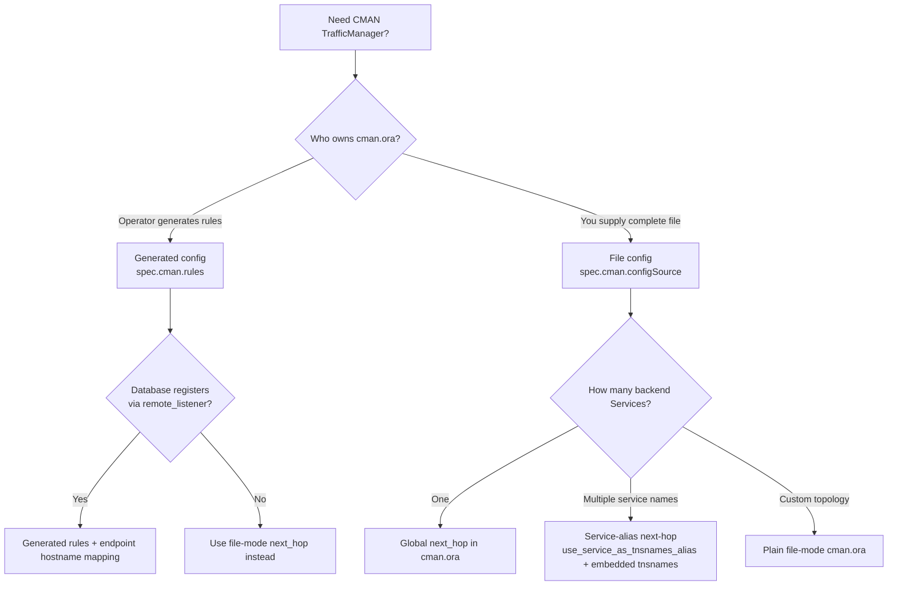

# Oracle Traffic Manager (CMAN) for Kubernetes — Oracle Database Operator

Deploy **Oracle Connection Manager (CMAN)** on Kubernetes with the Oracle Database Operator **TrafficManager** custom resource (`network.oracle.com/v4`). This guide explains how to route SQL\*Net / Easy Connect client traffic through CMAN to **SIDB**, **RAC**, Oracle Restart, or external Oracle Database listeners using generated CMAN rules or file-mode `cman.ora` (including global `next_hop` and service-alias routing).

**Release note:** TrafficManager CMAN mode is **preview** in Oracle Database Operator **2.2.0**.

Use this document when you want to:

- Deploy Oracle Connection Manager through the Oracle Database Operator
- Route client connections to SIDB, RAC, or external Oracle Database listeners through CMAN
- Choose between generated CMAN rules and file-mode `cman.ora` configuration
- Configure global `next_hop` or service-alias next-hop routing
- Find focused YAML samples and canonical templates (not one mega “uncomment all cases” file)
- Verify CMAN status and test database connectivity

| Mode | `spec.type` | Purpose |
| --- | --- | --- |
| CMAN | `cman` | Oracle Connection Manager for database listener traffic. |

Use **CMAN** when clients connect to Oracle Database listener traffic through Oracle Connection Manager.

**Short names:** `trm`, `cman`, `connectionmanager`  
**API:** `TrafficManager` · `network.oracle.com/v4`  
**Sample index:** [docs/trafficmanager/samples/README.md](samples/README.md)

```bash
kubectl get trafficmanager -n <namespace>
kubectl get trm -n <namespace>          # same resource
```

## Table of Contents

- [Before You Begin](#before-you-begin)
- [Prerequisites](#prerequisites)
- [Quick Start: Deploy CMAN TrafficManager](#quick-start-deploy-cman-trafficmanager)
- [What the Operator Creates](#what-the-operator-creates)
- [Choosing a CMAN Configuration Pattern](#choosing-a-cman-configuration-pattern)
  - [Single SIDB — generated rules](#choosing-a-cman-configuration-pattern)
  - [Two or more SIDBs — generated rules (`dst=*`)](#choosing-a-cman-configuration-pattern)
  - [Two or more SIDBs — generated rules (explicit `dst`)](#choosing-a-cman-configuration-pattern)
  - [Single SIDB — global `next_hop`](#choosing-a-cman-configuration-pattern)
  - [Single SIDB — user-managed `cman.ora`](#choosing-a-cman-configuration-pattern)
  - [Two or more SIDBs — service-alias `next_hop`](#choosing-a-cman-configuration-pattern)
  - [Two or more SIDBs — user-managed `cman.ora` (template)](#choosing-a-cman-configuration-pattern)
  - [Single RAC — generated rules](#choosing-a-cman-configuration-pattern)
  - [Single RAC — global `next_hop` to SCAN](#choosing-a-cman-configuration-pattern)
- [Sample Manifests](#sample-manifests)
  - [CMAN sample index](samples/README.md)
- [CMAN Mode](#cman-mode)
- [Field Reference](#field-reference)
- [Status and Verification](#status-and-verification)
- [Troubleshooting](#troubleshooting)
- [Related Documentation](#related-documentation)

## Before You Begin

`TrafficManager` CMAN mode routes traffic to reachable Oracle Database listeners, including Oracle databases managed by the SIDB, RAC, Oracle Restart, or other Oracle Database controllers in this repository, as well as externally managed Oracle databases.

Before applying a CMAN resource:

- complete the [operator installation prerequisites](../../README.md#prerequisites)
- complete the prerequisites for the database type that CMAN will serve
- **deploy every backend database and confirm its listener Service is reachable before applying CMAN** (see [Multiple database backends](#multiple-database-backends))
- ensure the CMAN pod can resolve and reach every backend listener
- prepare registry access and image pull secrets for the selected CMAN image
- configure a Kubernetes or cloud load-balancer controller when exposing CMAN externally

Use the **sample index** and canonical templates (separate files per pattern; no master uncomment YAML):

- **Sample index (use case → file):** [`docs/trafficmanager/samples/README.md`](samples/README.md)
- Single-backend file-mode template: [`config/samples/trafficmanager/cman-sidb-filemode.yaml`](../../config/samples/trafficmanager/cman-sidb-filemode.yaml)
- Multi-backend file-mode template (richest comments): [`config/samples/trafficmanager/cman-sidb-peer-filemode.yaml`](../../config/samples/trafficmanager/cman-sidb-peer-filemode.yaml)
- Focused CMAN examples: [`docs/trafficmanager/samples/`](samples/)

## Prerequisites

- Oracle Database Operator installed with the `TrafficManager` CRD (`network.oracle.com/v4`).
- A container image for the chosen mode:
  - **CMAN:** a CMAN container image compatible with your chosen configuration pattern. File-mode patterns that use `next_hop`, embedded `tnsnames.ora` aliases, or `use_service_as_tnsnames_alias` require image support for those features.
- For external `LoadBalancer` Services on OCI, a cloud load-balancer controller (for example the OCI Cloud Controller Manager) must be installed. TrafficManager writes Service annotations; the cloud controller provisions the load balancer.

### Multiple database backends

CMAN does **not** create database backends. For samples that route to more than one database, **deploy and verify every backend database first**, then apply the CMAN manifest that references those Services.

| Sample | Backends referenced | Deploy before CMAN |
| --- | --- | --- |
| [`cman-sidb.yaml`](samples/cman-sidb.yaml) | 1 × `sidb-sample` | One SIDB with PDB service `apppdb1` |
| [`cman-sidb-filemode.yaml`](samples/cman-sidb-filemode.yaml) | 1 × `sidb-sample` | One SIDB; plain user-managed `cman.ora` (no `next_hop`). Canonical copy: [`config/samples/trafficmanager/cman-sidb-filemode.yaml`](../../config/samples/trafficmanager/cman-sidb-filemode.yaml) |
| [`cman-sidb-nexthop.yaml`](samples/cman-sidb-nexthop.yaml) | 1 × `sidb-sample` | One SIDB with service `apppdb1` |
| [`cman-sidb-peer.yaml`](samples/cman-sidb-peer.yaml) | `sidb-sample`, `sidb-cman-peer` | **Two SIDBs** with services `apppdb1` and `apppdb2` |
| [`cman-sidb-default.yaml`](samples/cman-sidb-default.yaml) | `sidb-sample`, `sidb-cman-peer` | **Two SIDBs** with services `apppdb1` and `apppdb2` |
| [`cman-sidb-peer-nexthop.yaml`](samples/cman-sidb-peer-nexthop.yaml) | `sidb-sample`, `sidb-cman-peer` | **Two SIDBs** with services `apppdb1` and `apppdb2` |
| [`config/samples/trafficmanager/cman-sidb-peer-filemode.yaml`](../../config/samples/trafficmanager/cman-sidb-peer-filemode.yaml) | `database-one`, `database-two` (template names) | **Two or more backends**; canonical multi-backend file-mode template |
| [`cman-rac.yaml`](samples/cman-rac.yaml) | 1 × RAC SCAN | RAC database in namespace `rac` |
| [`cman-rac-nexthop.yaml`](samples/cman-rac-nexthop.yaml) | 1 × RAC SCAN | RAC database in namespace `rac` |

Recommended order for multi-backend samples:

1. Deploy each backend database (for SIDB examples, see [SIDB prerequisites](../sidb/PREREQUISITES.md) and [SIDB Quick Start](../sidb/README.md#quick-start-deploy-oracle-database-on-kubernetes)).
2. Wait until each database is **Healthy** and its Kubernetes Service exists (for example `sidb-sample`, `sidb-cman-peer`).
3. Confirm each PDB or database service name matches the CMAN rule or `cman.ora` alias (`apppdb1`, `apppdb2`, and so on).
4. Apply the CMAN TrafficManager manifest.
5. For **generated-rules** samples only: set `remote_listener` and run `ALTER SYSTEM REGISTER` on **each** backend database after CMAN is Healthy.
6. Verify each service on CMAN (`cmctl show services`) before client testing.

Example check before applying [`cman-sidb-peer.yaml`](samples/cman-sidb-peer.yaml):

```bash
kubectl get singleinstancedatabase -n default
kubectl get svc -n default sidb-sample sidb-cman-peer
```

Both databases must exist and be reachable. If `sidb-cman-peer` is missing, CMAN will start but routing to that backend fails.

## Quick Start: Deploy CMAN TrafficManager

This is the fastest path for a new CMAN endpoint using global `next_hop` file mode. It does not require setting database `remote_listener`.

1. Complete the [operator installation prerequisites](../../README.md#prerequisites) and deploy at least one reachable Oracle Database listener.
2. Copy [`samples/cman-sidb-nexthop.yaml`](samples/cman-sidb-nexthop.yaml) and replace `<cman-container-image-with-next-hop-support>`, `<subnet-ocid>`, and backend Service or service names for your environment.
3. Apply the manifest and wait for the TrafficManager to become ready.
4. Retrieve the external endpoint and test a database connection through CMAN.

If you are running commands from the repository root:

```bash
kubectl apply -f docs/trafficmanager/samples/cman-sidb-nexthop.yaml
kubectl wait --for=jsonpath='{.status.status}'=Healthy trafficmanager/cman-sidb -n default --timeout=300s
kubectl get trafficmanager cman-sidb -n default \
  -o jsonpath='{.status.status}{"\n"}{.status.externalEndpoint}{"\n"}'
```

Retrieve the external Service address when `status.externalEndpoint` is not yet populated:

```bash
kubectl get svc -n default -l app.kubernetes.io/component=traffic-manager \
  -o jsonpath='{range .items[*]}{.metadata.name}{"\t"}{.status.loadBalancer.ingress[0].ip}{"\n"}{end}'
```

Test connectivity after the external endpoint is available:

```bash
sqlplus 'sys/<password>@//<cman-external-ip>:1521/apppdb1 as sysdba'
```

### Quick Start: generated rules (`cman-sidb.yaml`)

Use generated rules only when the database will register its services with CMAN. **Deploy CMAN first, then configure the database.** `remote_listener` cannot be set until the CMAN internal Service exists and resolves from the database pod. **Do not test Easy Connect through CMAN until registration is complete.** Without that step, CMAN starts successfully but clients fail with `ORA-12514` because the requested service name is not on the CMAN listener.

Sample file: [`samples/cman-sidb.yaml`](samples/cman-sidb.yaml)

1. Apply the TrafficManager manifest and wait until CMAN is **Healthy**.
2. Retrieve the CMAN external endpoint.
3. Set `remote_listener` on each backend database to the CMAN **internal** Service DNS name (only after step 1).
4. Run `ALTER SYSTEM REGISTER` on each database instance.
5. Verify the PDB service appears on the CMAN listener.
6. Test Easy Connect through the CMAN external endpoint.

**Step 1 — deploy CMAN and wait:**

```bash
kubectl apply -f docs/trafficmanager/samples/cman-sidb.yaml
kubectl wait --for=jsonpath='{.status.status}'=Healthy trafficmanager/cman-sidb -n default --timeout=300s
kubectl get trafficmanager cman-sidb -n default \
  -o jsonpath='{.status.status}{"\n"}{.status.externalEndpoint}{"\n"}'
```

**Step 2 — confirm CMAN resolves from the database pod** (required before setting `remote_listener`):

```bash
kubectl exec -n default <sidb-pod-name> -- getent hosts cman-sidb.default.svc.cluster.local
```

**Step 3 and 4 — register the database with CMAN:**

```bash
kubectl exec -it -n default <sidb-pod-name> -- sqlplus / as sysdba
```

```sql
ALTER SYSTEM SET remote_listener='(ADDRESS=(PROTOCOL=TCP)(HOST=cman-sidb.default.svc.cluster.local)(PORT=1521))' SCOPE=BOTH;
ALTER SYSTEM REGISTER;
```

If your database accepts the short form, this equivalent setting may also work:

```sql
ALTER SYSTEM SET remote_listener='cman-sidb.default.svc.cluster.local:1521' SCOPE=BOTH;
ALTER SYSTEM REGISTER;
```

If `ALTER SYSTEM` fails with `ORA-00132` or `ORA-00141`, CMAN is not deployed yet or the hostname does not resolve from the database pod. Deploy CMAN first, confirm step 2, then use the `ADDRESS` form above.

**Step 5 — verify the service is on CMAN** (look for your PDB service name, for example `apppdb1`):

```bash
kubectl exec -n default deploy/cman-sidb -- cmctl show services
```

**Step 6 — connect through CMAN:**

```bash
sqlplus 'sys/<password>@//<cman-external-ip>:1521/apppdb1 as sysdba'
```

| Pattern | Backends | `remote_listener` before client connect? | Sample |
| --- | ---: | --- | --- |
| Single SIDB — global `next_hop` (Quick Start above) | 1 | No | [`cman-sidb-nexthop.yaml`](samples/cman-sidb-nexthop.yaml) |
| Single SIDB — generated rules | 1 | **Yes** | [`cman-sidb.yaml`](samples/cman-sidb.yaml) |
| Two or more SIDBs — generated rules | 2+ | **Yes, on each database** | [`cman-sidb-peer.yaml`](samples/cman-sidb-peer.yaml) |
| Two or more SIDBs — service-alias next-hop | 2+ | No | [`cman-sidb-peer-nexthop.yaml`](samples/cman-sidb-peer-nexthop.yaml) |

For multiple backends or CMAN replicas, see [Choosing a CMAN Configuration Pattern](#choosing-a-cman-configuration-pattern).

**Important:** Most SIDB-focused samples use `metadata.name: cman-sidb`. Apply only one sample per namespace, or rename `metadata.name` and the CMAN listener hostname in `cman.ora` before applying another sample.

## What the Operator Creates

For every `TrafficManager`, the controller manages:

| Resource | CMAN |
| --- | --- |
| Deployment | CMAN pod(s) |
| ConfigMap | Only when `spec.cman.configSource` references an operator-managed source; file-mode ConfigMaps are typically user-created |
| Internal Service | Listener on port 1521 (default) |
| External Service | Optional `LoadBalancer` or other type |

## Choosing a CMAN Configuration Pattern



<table>
  <thead>
    <tr>
      <th>Pattern</th>
      <th>TrafficManager mode</th>
      <th>Database backends</th>
      <th>Database <code>remote_listener</code></th>
      <th>Client connect string</th>
      <th>Use when</th>
      <th>Sample</th>
    </tr>
  </thead>
  <tbody>
    <tr>
      <td><strong>Single SIDB — generated rules</strong></td>
      <td>Generated <code>spec.cman.rules[]</code></td>
      <td>1</td>
      <td><strong>Required</strong> on the database <strong>after</strong> CMAN is Healthy</td>
      <td><code>@//&lt;cman-ip&gt;:1521/&lt;service-name&gt;</code></td>
      <td>One SIDB registers with CMAN; operator owns filtering rules</td>
      <td><a href="samples/cman-sidb.yaml"><code>cman-sidb.yaml</code></a></td>
    </tr>
    <tr>
      <td><strong>Two or more SIDBs — generated rules (<code>dst=*</code>)</strong></td>
      <td>Generated <code>spec.cman.rules[]</code></td>
      <td>2+</td>
      <td><strong>Required on each database</strong> after CMAN is Healthy</td>
      <td><code>@//&lt;cman-ip&gt;:1521/&lt;service-name&gt;</code> per backend</td>
      <td>Multiple SIDBs each register a different service name with CMAN</td>
      <td><a href="samples/cman-sidb-peer.yaml"><code>cman-sidb-peer.yaml</code></a></td>
    </tr>
    <tr>
      <td><strong>Two or more SIDBs — generated rules (explicit <code>dst</code>)</strong></td>
      <td>Generated <code>spec.cman.rules[]</code></td>
      <td>2+</td>
      <td><strong>Required on each database</strong> after CMAN is Healthy</td>
      <td><code>@//&lt;cman-ip&gt;:1521/&lt;service-name&gt;</code></td>
      <td>Same as peer sample, but each rule uses an explicit backend Service hostname in <code>dst</code></td>
      <td><a href="samples/cman-sidb-default.yaml"><code>cman-sidb-default.yaml</code></a></td>
    </tr>
    <tr>
      <td><strong>Single SIDB — global <code>next_hop</code></strong></td>
      <td>File <code>spec.cman.configSource</code></td>
      <td>1</td>
      <td><strong>Not required</strong></td>
      <td><code>@//&lt;cman-ip&gt;:1521/&lt;service-name&gt;</code></td>
      <td>One backend; CMAN forwards all accepted traffic to one SIDB listener</td>
      <td><a href="samples/cman-sidb-nexthop.yaml"><code>cman-sidb-nexthop.yaml</code></a></td>
    </tr>
    <tr>
      <td><strong>Single SIDB — user-managed <code>cman.ora</code></strong></td>
      <td>File <code>spec.cman.configSource</code></td>
      <td>1</td>
      <td><strong>Not required</strong> (unless your <code>cman.ora</code> expects registration)</td>
      <td>Depends on <code>rule_list</code> in your file</td>
      <td>You supply a complete <code>cman.ora</code>; no generated rules, no <code>next_hop</code></td>
      <td><a href="samples/cman-sidb-filemode.yaml"><code>cman-sidb-filemode.yaml</code></a>, <a href="../../config/samples/trafficmanager/cman-sidb-filemode.yaml"><code>config/samples/trafficmanager/cman-sidb-filemode.yaml</code></a></td>
    </tr>
    <tr>
      <td><strong>Two or more SIDBs — service-alias <code>next_hop</code></strong></td>
      <td>File <code>spec.cman.configSource</code></td>
      <td>2+</td>
      <td><strong>Not required</strong></td>
      <td><code>@//&lt;cman-ip&gt;:1521/apppdb1</code>, <code>@//&lt;cman-ip&gt;:1521/apppdb2</code>, …</td>
      <td>Multiple backends; each requested service name selects a different SIDB through embedded <code>tnsnames.ora</code> aliases</td>
      <td><a href="samples/cman-sidb-peer-nexthop.yaml"><code>cman-sidb-peer-nexthop.yaml</code></a></td>
    </tr>
    <tr>
      <td><strong>Two or more SIDBs — user-managed <code>cman.ora</code> (template)</strong></td>
      <td>File <code>spec.cman.configSource</code></td>
      <td>2+</td>
      <td><strong>Not required</strong> for alias/next-hop patterns</td>
      <td><code>@//&lt;cman-ip&gt;:1521/&lt;alias&gt;</code> per backend</td>
      <td>Full multi-backend file-mode template with embedded aliases, rules, and optional <code>next_hop</code> comments</td>
      <td><a href="../../config/samples/trafficmanager/cman-sidb-peer-filemode.yaml"><code>config/samples/trafficmanager/cman-sidb-peer-filemode.yaml</code></a></td>
    </tr>
    <tr>
      <td><strong>Single RAC — generated rules</strong></td>
      <td>Generated <code>spec.cman.rules[]</code></td>
      <td>1 RAC</td>
      <td><strong>Required</strong> (add CMAN listener to RAC <code>remote_listener</code>)</td>
      <td><code>@//&lt;cman-ip&gt;:1521/&lt;rac-service&gt;</code></td>
      <td>RAC services register dynamically with CMAN</td>
      <td><a href="samples/cman-rac.yaml"><code>cman-rac.yaml</code></a></td>
    </tr>
    <tr>
      <td><strong>Single RAC — global <code>next_hop</code> to SCAN</strong></td>
      <td>File <code>spec.cman.configSource</code></td>
      <td>1 RAC SCAN</td>
      <td><strong>Not required</strong></td>
      <td><code>@//&lt;cman-ip&gt;:1521/&lt;service-name&gt;</code></td>
      <td>RAC does not register with CMAN; CMAN forwards to RAC SCAN</td>
      <td><a href="samples/cman-rac-nexthop.yaml"><code>cman-rac-nexthop.yaml</code></a></td>
    </tr>
  </tbody>
</table>

**Deploy order summary**

| If you choose | Deploy databases first | Deploy CMAN | Then before client connect |
| --- | --- | --- | --- |
| Generated rules (single or multiple SIDBs) | Yes — all backends **Healthy** | Yes — wait **Healthy** | Set `remote_listener` + `ALTER SYSTEM REGISTER` on **each** database |
| Global `next_hop` or service-alias `next_hop` | Yes — all backends **Healthy** | Yes — wait **Healthy** | Connect directly — **no** `remote_listener` |
| User-managed `cman.ora` (single or multi-backend file mode) | Yes — all backends **Healthy** | Yes — wait **Healthy** | Connect per your `cman.ora`; use `remote_listener` only if your file expects database registration |
| RAC generated rules | Yes — RAC in namespace `rac` | Yes | Update RAC `remote_listener` + `ALTER SYSTEM REGISTER` on each instance |

## Sample Manifests

**Start here:** [CMAN sample index — use case to YAML map](samples/README.md).

Industry-style layout: **one focused sample per use case**, plus two **canonical commented templates**. Prefer the index over a single “uncomment this section” master file (mutually exclusive modes break easily).

Start with the canonical, fully commented templates:

- Single-backend file mode: [`config/samples/trafficmanager/cman-sidb-filemode.yaml`](../../config/samples/trafficmanager/cman-sidb-filemode.yaml)
- Multi-backend file mode: [`config/samples/trafficmanager/cman-sidb-peer-filemode.yaml`](../../config/samples/trafficmanager/cman-sidb-peer-filemode.yaml)

The multi-backend template demonstrates two CMAN replicas and two Oracle Database backends as a scalable example. The backend count is not limited to two: for N Oracle Database services, add one `tnsnames.ora` alias and one accept rule per database/service pair. Scale `spec.runtime.replicas` independently of the backend count.

The two aliases are service-aware backend destinations, not two global `next_hop` blocks. Use a global `next_hop` only when every accepted service must be forwarded to the same Oracle Database listener. The template's inline comments also explain when to use generated rules instead of file mode.

The focused examples under [`samples/`](samples/) use SIDB Services for concrete backend names, but the same CMAN patterns apply to any reachable Oracle Database listener. Replace the backend hosts and service names for the database type being used.

**Prerequisite:** Samples with two or more database backends assume those databases are already deployed. See [Multiple database backends](#multiple-database-backends) for the required Services and service names before applying CMAN.

| File | CMAN replicas | Database backends | Routing pattern |
| --- | ---: | ---: | --- |
| [`cman-sidb.yaml`](samples/cman-sidb.yaml) | 1 | 1 | Generated rule with permissive `dst=*` |
| [`cman-sidb-peer.yaml`](samples/cman-sidb-peer.yaml) | 1 | 2 | One generated rule per SIDB/service pair with permissive `dst=*` |
| [`cman-sidb-default.yaml`](samples/cman-sidb-default.yaml) | 1 | 2 | Generated rules with explicit SIDB `dst` hostnames |
| [`cman-sidb-filemode.yaml`](samples/cman-sidb-filemode.yaml) | 1 | 1 | Plain user-managed `cman.ora` from a ConfigMap (no `next_hop`) |
| [`cman-sidb-nexthop.yaml`](samples/cman-sidb-nexthop.yaml) | 1 | 1 | One global `next_hop`; all accepted traffic goes to the same SIDB |
| [`cman-sidb-peer-nexthop.yaml`](samples/cman-sidb-peer-nexthop.yaml) | 2 | 2 | Service-aware next-hop aliases; each requested service selects its SIDB backend |
| [`cman-sidb-peer-filemode.yaml`](../../config/samples/trafficmanager/cman-sidb-peer-filemode.yaml) | 2 | 2+ | Canonical multi-backend file-mode template with embedded aliases and rules |
| [`cman-rac.yaml`](samples/cman-rac.yaml) | 1 | 1 RAC database | Generated mode with manual RAC service registration through `remote_listener` |
| [`cman-rac-nexthop.yaml`](samples/cman-rac-nexthop.yaml) | 1 | 1 RAC SCAN | Global `next_hop` to a RAC SCAN Service for the accepted PDB service |
| [`cman-sidb-filemode.cman.ora`](samples/cman-sidb-filemode.cman.ora) | N/A | User-defined | Standalone `cman.ora` reference |

Use [`cman-sidb-peer-nexthop.yaml`](samples/cman-sidb-peer-nexthop.yaml) as the focused SIDB reference for multiple CMAN replicas, multiple database backends, and per-service next-hop routing. A global `next_hop` is not service-aware; the sample uses `use_service_as_tnsnames_alias=on` and one `tnsnames.ora` alias per database/service pair instead of declaring multiple global `next_hop` blocks.

Replace `<cman-container-image>`, `<subnet-ocid>`, and other placeholders before applying. RAC samples use namespace `rac`; create that namespace and deploy RAC resources there before applying them.

Apply any focused sample from the repository root:

```bash
kubectl apply -f docs/trafficmanager/samples/<sample-file>.yaml
kubectl get trafficmanager -n <namespace>
kubectl describe trafficmanager <name> -n <namespace>
```

## CMAN Mode

CMAN mode creates a CMAN Deployment and Services for Oracle Database listener traffic through Oracle Connection Manager.

CMAN can be configured in **generated** mode or **file** mode. See [Choosing a CMAN Configuration Pattern](#choosing-a-cman-configuration-pattern) above for a decision guide.

### CMAN Generated Config

Generated config mode uses `spec.cman.rules[]`. The controller passes those rules to the CMAN container, and the CMAN container generates `cman.ora` at startup.

Sample file: [`samples/cman-sidb.yaml`](samples/cman-sidb.yaml)

```yaml
apiVersion: network.oracle.com/v4
kind: TrafficManager
metadata:
  name: cman-sidb
  namespace: default
spec:
  type: cman
  runtime:
    image: "<cman-container-image>"
    imagePullPolicy: Always
    replicas: 1
  service:
    internal:
      enabled: true
      ports:
        - name: cman
          port: 1521
          targetPort: 1521
    external:
      enabled: true
      serviceType: LoadBalancer
      externalTrafficPolicy: Local
      annotations:
        oci.oraclecloud.com/load-balancer-type: "nlb"
        oci-network-load-balancer.oraclecloud.com/internal: "true"
        oci-network-load-balancer.oraclecloud.com/is-preserve-source: "false"
        oci-network-load-balancer.oraclecloud.com/subnet: "<subnet-ocid>"
      ports:
        - name: cman
          port: 1521
          targetPort: 1521
  cman:
    logLevel: user
    traceLevel: user
    registrationInvitedNodes: "*"
    rules:
      - host: sidb-sample.default.svc.cluster.local
        src: "*"
        dst: "*"
        srv: apppdb1
        action: accept
```

#### Generated rules: two SIDBs with permissive `dst`

Sample file: [`samples/cman-sidb-peer.yaml`](samples/cman-sidb-peer.yaml)

**Prerequisite:** Deploy both `sidb-sample` and `sidb-cman-peer` before applying this manifest. Register `remote_listener` on **each** database **after** CMAN is Healthy (not before CMAN is deployed).

After CMAN is Healthy, register **both** backends (example pod names):

```bash
# sidb-sample → service apppdb1
kubectl exec -it -n default <sidb-sample-pod> -- sqlplus / as sysdba

# sidb-cman-peer → service apppdb2
kubectl exec -it -n default <sidb-cman-peer-pod> -- sqlplus / as sysdba
```

On **each** database:

```sql
ALTER SYSTEM SET remote_listener='(ADDRESS=(PROTOCOL=TCP)(HOST=cman-sidb.default.svc.cluster.local)(PORT=1521))' SCOPE=BOTH;
ALTER SYSTEM REGISTER;
```

Verify both services appear on CMAN:

```bash
kubectl exec -n default deploy/cman-sidb -- cmctl show services | grep -E 'apppdb1|apppdb2'
```

Test:

```bash
sqlplus 'sys/<password>@//<cman-external-ip>:1521/apppdb1 as sysdba'
sqlplus 'sys/<password>@//<cman-external-ip>:1521/apppdb2 as sysdba'
```

```yaml
apiVersion: network.oracle.com/v4
kind: TrafficManager
metadata:
  name: cman-sidb
  namespace: default
spec:
  type: cman
  runtime:
    image: "<cman-container-image>"
    imagePullPolicy: Always
    replicas: 1
  service:
    internal:
      enabled: true
      ports:
        - name: cman
          port: 1521
          targetPort: 1521
    external:
      enabled: true
      serviceType: LoadBalancer
      externalTrafficPolicy: Local
      annotations:
        oci.oraclecloud.com/load-balancer-type: "nlb"
        oci-network-load-balancer.oraclecloud.com/internal: "true"
        oci-network-load-balancer.oraclecloud.com/is-preserve-source: "false"
        oci-network-load-balancer.oraclecloud.com/subnet: "<subnet-ocid>"
      ports:
        - name: cman
          port: 1521
          targetPort: 1521
  cman:
    logLevel: user
    traceLevel: user
    registrationInvitedNodes: "*"
    rules:
      - host: sidb-sample.default.svc.cluster.local
        src: "*"
        dst: "*"
        srv: apppdb1
        action: accept
      - host: sidb-cman-peer.default.svc.cluster.local
        src: "*"
        dst: "*"
        srv: apppdb2
        action: accept
```

#### Generated rules: two SIDBs with explicit `dst`

Sample file: [`samples/cman-sidb-default.yaml`](samples/cman-sidb-default.yaml)

**Prerequisite:** Deploy both `sidb-sample` and `sidb-cman-peer` before applying this manifest. Register `remote_listener` on **each** database after CMAN is Healthy.

```yaml
apiVersion: network.oracle.com/v4
kind: TrafficManager
metadata:
  name: cman-sidb
  namespace: default
spec:
  type: cman
  runtime:
    image: "<cman-container-image>"
    imagePullPolicy: Always
    replicas: 1
  service:
    internal:
      enabled: true
      ports:
        - name: cman
          port: 1521
          targetPort: 1521
    external:
      enabled: true
      serviceType: LoadBalancer
      externalTrafficPolicy: Local
      annotations:
        oci.oraclecloud.com/load-balancer-type: "nlb"
        oci-network-load-balancer.oraclecloud.com/internal: "true"
        oci-network-load-balancer.oraclecloud.com/is-preserve-source: "false"
        oci-network-load-balancer.oraclecloud.com/subnet: "<subnet-ocid>"
      ports:
        - name: cman
          port: 1521
          targetPort: 1521
  cman:
    logLevel: user
    traceLevel: user
    registrationInvitedNodes: "*"
    rules:
      - host: sidb-sample.default.svc.cluster.local
        src: "*"
        dst: sidb-sample.default.svc.cluster.local
        srv: apppdb1
        action: accept
      - host: sidb-cman-peer.default.svc.cluster.local
        src: "*"
        dst: sidb-cman-peer.default.svc.cluster.local
        srv: apppdb2
        action: accept
```

Valid rule actions are `accept`, `reject`, and `drop`.

**Prerequisite:** In generated mode, deploy CMAN first, then register each backend database with CMAN before clients test Easy Connect. Set `remote_listener` and run `ALTER SYSTEM REGISTER` only after the CMAN internal Service exists. Skipping registration produces `ORA-12514` even when the CMAN pod is healthy. Setting `remote_listener` before CMAN is deployed can fail with `ORA-00132` because the CMAN hostname does not resolve yet.

Use generated mode when CMAN should act as a remote listener registration endpoint or when clients use an explicit source-route descriptor. For database registration through CMAN, set each database `remote_listener` to the CMAN **internal** Service DNS name for in-cluster registration.

Recommended order:

1. Apply the TrafficManager manifest and wait until `status.status` is `Healthy`.
2. Confirm `cman-sidb.<namespace>.svc.cluster.local` resolves from the database pod.
3. Set `remote_listener` and run `ALTER SYSTEM REGISTER`.
4. Run `cmctl show services` on the CMAN pod and confirm the PDB service is listed.
5. Connect with Easy Connect through the CMAN external endpoint.

Example SQL when setting `remote_listener` manually:

```sql
ALTER SYSTEM SET remote_listener='(ADDRESS=(PROTOCOL=TCP)(HOST=cman-sidb.default.svc.cluster.local)(PORT=1521))' SCOPE=BOTH;
ALTER SYSTEM REGISTER;
```

Short form (use only if accepted by your database image):

```sql
ALTER SYSTEM SET remote_listener='cman-sidb.default.svc.cluster.local:1521' SCOPE=BOTH;
ALTER SYSTEM REGISTER;
```

After `remote_listener` is set and the database has registered with CMAN, clients can use the short Easy Connect form:

```bash
sqlplus 'sys/<password>@//<cman-external-ip>:1521/<pdb-service-name> as sysdba'
```

Use a source-route descriptor only when the client must name both CMAN and the backend listener address explicitly:

```bash
sqlplus 'sys/<password>@(DESCRIPTION=(SOURCE_ROUTE=YES)(ADDRESS=(PROTOCOL=TCP)(HOST=<cman-external-ip>)(PORT=1521))(ADDRESS=(PROTOCOL=TCP)(HOST=<database-service-dns>)(PORT=1521))(CONNECT_DATA=(SERVICE_NAME=<pdb-service-name>)))' as sysdba
```

### CMAN Endpoint Hostname Mapping

In generated config mode, CMAN may need to connect to the database listener address that the database registers with the remote listener. For SingleInstanceDatabase pods, that registered address can be the pod hostname, for example `sidb-sample-n7afl`, even when the CMAN rule points at the stable database Service `sidb-sample.default.svc.cluster.local`. The CMAN container maps Kubernetes Endpoint pod hostnames into `/etc/hosts` before starting CMAN so that registered backend hostnames are resolvable from the CMAN pod.

The CMAN container derives the Endpoint lookup target from each `spec.cman.rules[].host` value:

| Host form | Service name | Namespace |
| --- | --- | --- |
| `sidb-sample.default.svc.cluster.local` | `sidb-sample` | `default` |
| `sidb-sample.default` | `sidb-sample` | `default` |
| `sidb-sample` | `sidb-sample` | CMAN pod namespace |

For each named Endpoint address, CMAN adds a host entry like:

```text
10.0.2.33 sidb-sample-n7afl
```

The CMAN pod ServiceAccount must be allowed to read Endpoints in the namespace that contains the database Service. If `spec.runtime.serviceAccountName` is omitted, the pod uses the namespace `default` ServiceAccount. Grant only namespace-scoped Endpoint read access to that ServiceAccount.

```yaml
apiVersion: rbac.authorization.k8s.io/v1
kind: Role
metadata:
  name: cman-endpoints-reader
  namespace: <database-service-namespace>
rules:
- apiGroups: [""]
  resources: ["endpoints"]
  verbs: ["get", "list", "watch"]
---
apiVersion: rbac.authorization.k8s.io/v1
kind: RoleBinding
metadata:
  name: cman-endpoints-reader
  namespace: <database-service-namespace>
roleRef:
  apiGroup: rbac.authorization.k8s.io
  kind: Role
  name: cman-endpoints-reader
subjects:
- kind: ServiceAccount
  name: <cman-service-account>
  namespace: <cman-namespace>
```

Save the Role and RoleBinding to a file such as `cman-endpoints-rbac.yaml`, then apply it in the database Service namespace:

```bash
kubectl apply -f cman-endpoints-rbac.yaml
```

For SYSDBA connections that use Easy Connect through CMAN, use a broad service match unless you have verified the exact CMAN service selector required by your client descriptor:

```yaml
rules:
- host: sidb-sample.default.svc.cluster.local
  src: "*"
  dst: "*"
  srv: "*"
  action: accept
```

### CMAN File Config

File mode mounts one ConfigMap key as the CMAN `cman.ora` source. In this mode, `cman.ora` is the source of truth.

#### Single SIDB — plain user-managed `cman.ora`

Use this when one SIDB is the backend and you want full control of `cman.ora` without generated rules or `next_hop`.

Sample file: [`samples/cman-sidb-filemode.yaml`](samples/cman-sidb-filemode.yaml)

**Prerequisite:** Deploy `sidb-sample` before CMAN. `remote_listener` is not required unless your `cman.ora` is written for database registration through CMAN.

```yaml
apiVersion: v1
kind: ConfigMap
metadata:
  name: cman-sidb-filemode-config
  namespace: default
data:
  cman.ora: |
    CMAN_cman-sidb.default.svc.cluster.local =
    (configuration=
      (address=(protocol=tcp)(host=cman-sidb.default.svc.cluster.local)(port=1521))
      (parameter_list =
        (connection_statistics=yes)
        (log_directory=/u01/app/oracle/product/23ai/client_1/network/log)
        (log_level=user)
        (trace_directory=/u01/app/oracle/product/23ai/client_1/network/trace)
        (trace_level=user)
        (valid_node_checking_registration=on)
        (registration_invited_nodes=*)
      )
      (rule_list=
        (rule=
           (src=*)(dst=*)(srv=*)(act=accept)
           (action_list=(aut=off)(moct=0)(mct=0)(mit=0)(conn_stats=on))
        )
      )
    )
---
apiVersion: network.oracle.com/v4
kind: TrafficManager
metadata:
  name: cman-sidb
  namespace: default
spec:
  type: cman
  runtime:
    image: "<cman-container-image>"
    imagePullPolicy: Always
    replicas: 1
  service:
    internal:
      enabled: true
      ports:
        - name: cman
          port: 1521
          targetPort: 1521
    external:
      enabled: true
      serviceType: LoadBalancer
      externalTrafficPolicy: Local
      annotations:
        oci.oraclecloud.com/load-balancer-type: "nlb"
        oci-network-load-balancer.oraclecloud.com/internal: "true"
        oci-network-load-balancer.oraclecloud.com/is-preserve-source: "false"
        oci-network-load-balancer.oraclecloud.com/subnet: "<subnet-ocid>"
      ports:
        - name: cman
          port: 1521
          targetPort: 1521
  cman:
    configSource:
      configMapRef:
        name: cman-sidb-filemode-config
        key: cman.ora
```

Standalone `cman.ora` reference: [`samples/cman-sidb-filemode.cman.ora`](samples/cman-sidb-filemode.cman.ora)

```text
CMAN_cman-sidb.default.svc.cluster.local =
(configuration=
  (address=(protocol=tcp)(host=cman-sidb.default.svc.cluster.local)(port=1521))
  (parameter_list =
    (connection_statistics=yes)
    (log_directory=/u01/app/oracle/product/23ai/client_1/network/log)
    (log_level=user)
    (trace_directory=/u01/app/oracle/product/23ai/client_1/network/trace)
    (trace_level=user)
    (valid_node_checking_registration=on)
    (registration_invited_nodes=*)
  )
  (rule_list=
    (rule=
       (src=*)(dst=*)(srv=*)(act=accept)
       (action_list=(aut=off)(moct=0)(mct=0)(mit=0)(conn_stats=on))
    )
  )
)
```

When `configSource` is set, do not set `spec.cman.rules`, `logLevel`, `traceLevel`, or `registrationInvitedNodes`. The admission webhook rejects those combinations because the mounted file is the source of truth.

#### Two or more SIDBs — user-managed `cman.ora`

For multiple backends in file mode, use the canonical template or the focused peer next-hop sample:

| Sample | Backends | Routing in `cman.ora` |
| --- | ---: | --- |
| [`cman-sidb-peer-nexthop.yaml`](samples/cman-sidb-peer-nexthop.yaml) | 2 | Embedded `tnsnames.ora` aliases + `use_service_as_tnsnames_alias=on` |
| [`config/samples/trafficmanager/cman-sidb-peer-filemode.yaml`](../../config/samples/trafficmanager/cman-sidb-peer-filemode.yaml) | 2+ | Full template with alias block, accept rules, and commented `next_hop` alternatives |

**Prerequisite:** Deploy every backend SIDB (for example `sidb-sample` and `sidb-cman-peer`) before CMAN. `remote_listener` is not required for alias/next-hop file-mode patterns.

### Global Next-Hop File Mode

Use global `next_hop` when all accepted traffic can be forwarded to one backend listener. This avoids setting database `remote_listener`.

Sample file: [`samples/cman-sidb-nexthop.yaml`](samples/cman-sidb-nexthop.yaml)

```yaml
apiVersion: v1
kind: ConfigMap
metadata:
  name: cman-sidb-nexthop-config
  namespace: default
data:
  cman.ora: |
    CMAN_cman-sidb.default.svc.cluster.local =
    (configuration=
      (address=(protocol=tcp)(host=cman-sidb.default.svc.cluster.local)(port=1521))
      (next_hop=
        (description=(address=(protocol=tcp)(host=sidb-sample.default.svc.cluster.local)(port=1521)))
      )
      (parameter_list =
        (connection_statistics=yes)
        (log_directory=/u01/app/oracle/product/23ai/client_1/network/log)
        (log_level=user)
        (trace_directory=/u01/app/oracle/product/23ai/client_1/network/trace)
        (trace_level=user)
        (valid_node_checking_registration=on)
        (registration_invited_nodes=*)
      )
      (rule_list=
        (rule=
           (src=*)(dst=*)(srv=apppdb1)(act=accept)
           (action_list=(aut=off)(moct=0)(mct=0)(mit=0)(conn_stats=on))
        )
      )
    )
---
apiVersion: network.oracle.com/v4
kind: TrafficManager
metadata:
  name: cman-sidb
  namespace: default
spec:
  type: cman
  runtime:
    image: "<cman-container-image-with-next-hop-support>"
    imagePullPolicy: Always
    replicas: 1
  service:
    internal:
      enabled: true
      ports:
        - name: cman
          port: 1521
          targetPort: 1521
    external:
      enabled: true
      serviceType: LoadBalancer
      externalTrafficPolicy: Local
      annotations:
        oci.oraclecloud.com/load-balancer-type: "nlb"
        oci-network-load-balancer.oraclecloud.com/internal: "true"
        oci-network-load-balancer.oraclecloud.com/is-preserve-source: "false"
        oci-network-load-balancer.oraclecloud.com/subnet: "<subnet-ocid>"
      ports:
        - name: cman
          port: 1521
          targetPort: 1521
  cman:
    configSource:
      configMapRef:
        name: cman-sidb-nexthop-config
        key: cman.ora
```

With this pattern, clients can connect to CMAN directly:

```bash
sqlplus 'sys/<password>@//<cman-external-ip>:1521/apppdb1 as sysdba'
```

A global next-hop list is not service-aware. If `apppdb1` and `apppdb2` live behind different Kubernetes Services, use the service-alias next-hop pattern instead.

### Service-Alias Next-Hop File Mode

Use service-alias next-hop when one CMAN endpoint must route multiple requested service names to different backend Services, without setting database `remote_listener`.

The CMAN image must support extracting embedded `tnsnames.ora` aliases from the mounted `cman.ora`. The alias block is stored as comments so `cman.ora` remains valid CMAN syntax, and the container writes it to `$ORACLE_HOME/network/admin/tnsnames.ora` before starting CMAN.

Sample file: [`samples/cman-sidb-peer-nexthop.yaml`](samples/cman-sidb-peer-nexthop.yaml)

**Prerequisite:** Deploy both `sidb-sample` and `sidb-cman-peer` before applying this manifest. `remote_listener` is not required for this next-hop pattern.

```yaml
apiVersion: v1
kind: ConfigMap
metadata:
  name: cman-sidb-peer-nexthop-config
  namespace: default
data:
  cman.ora: |
    # CMAN_TNSNAMES_BEGIN
    # apppdb1 =
    #   (description=
    #     (address=(protocol=tcp)(host=sidb-sample.default.svc.cluster.local)(port=1521))
    #     (connect_data=(service_name=apppdb1))
    #   )
    #
    # apppdb2 =
    #   (description=
    #     (address=(protocol=tcp)(host=sidb-cman-peer.default.svc.cluster.local)(port=1521))
    #     (connect_data=(service_name=apppdb2))
    #   )
    # CMAN_TNSNAMES_END

    CMAN_cman-sidb.default.svc.cluster.local =
    (configuration=
      (address=(protocol=tcp)(host=cman-sidb.default.svc.cluster.local)(port=1521))
      (parameter_list =
        (connection_statistics=yes)
        (log_directory=/u01/app/oracle/product/23ai/client_1/network/log)
        (log_level=user)
        (trace_directory=/u01/app/oracle/product/23ai/client_1/network/trace)
        (trace_level=user)
        (valid_node_checking_registration=on)
        (registration_invited_nodes=*)
        (use_service_as_tnsnames_alias=on)
      )
      (rule_list=
        (rule=
           (src=*)(dst=*)(srv=apppdb1)(act=accept)
           (action_list=(aut=off)(moct=0)(mct=0)(mit=0)(conn_stats=on))
        )
        (rule=
           (src=*)(dst=*)(srv=apppdb2)(act=accept)
           (action_list=(aut=off)(moct=0)(mct=0)(mit=0)(conn_stats=on))
        )
      )
    )
---
apiVersion: network.oracle.com/v4
kind: TrafficManager
metadata:
  name: cman-sidb
  namespace: default
spec:
  type: cman
  runtime:
    image: "<cman-container-image-with-embedded-tnsnames-support>"
    imagePullPolicy: Always
    replicas: 2
  service:
    internal:
      enabled: true
      ports:
        - name: cman
          port: 1521
          targetPort: 1521
    external:
      enabled: true
      serviceType: LoadBalancer
      externalTrafficPolicy: Local
      annotations:
        oci.oraclecloud.com/load-balancer-type: "nlb"
        oci-network-load-balancer.oraclecloud.com/internal: "true"
        oci-network-load-balancer.oraclecloud.com/is-preserve-source: "false"
        oci-network-load-balancer.oraclecloud.com/subnet: "<subnet-ocid>"
      ports:
        - name: cman
          port: 1521
          targetPort: 1521
  cman:
    configSource:
      configMapRef:
        name: cman-sidb-peer-nexthop-config
        key: cman.ora
```

Clients connect with Easy Connect and the requested service name selects the CMAN-side `tnsnames.ora` alias:

```bash
sqlplus 'sys/<password>@//<cman-external-ip>:1521/apppdb1 as sysdba'
sqlplus 'sys/<password>@//<cman-external-ip>:1521/apppdb2 as sysdba'
```

This is the recommended pattern for multiple CMAN replicas when one CMAN endpoint serves more than one backend service. It is stateless per CMAN pod: each replica gets the same mounted `cman.ora` and writes the same local `tnsnames.ora`, so traffic can land on any CMAN replica and still resolve `apppdb1` and `apppdb2` the same way. With `externalTrafficPolicy: Local`, ensure the load balancer has healthy backends on the nodes where CMAN pods run.

### CMAN File-Mode Parameter Notes

These parameters live inside the mounted `cman.ora`; they are not top-level TrafficManager CRD fields.

| Parameter or marker | Location | Purpose | Notes |
| --- | --- | --- | --- |
| `next_hop` | `cman.ora` `configuration` block | Defines a backend listener that CMAN forwards accepted traffic to. | Best for one backend listener or one backend service set. A global `next_hop` list is not service-aware by itself. |
| `use_service_as_tnsnames_alias=on` | `cman.ora` `parameter_list` | Makes CMAN resolve the requested service name as a local `tnsnames.ora` alias. | Use this for service-aware routing such as `apppdb1` to one backend Service and `apppdb2` to another. |
| `CMAN_TNSNAMES_BEGIN` / `CMAN_TNSNAMES_END` | Commented block in mounted `cman.ora` | Carries `tnsnames.ora` aliases through the single ConfigMap key that TrafficManager mounts. | Requires a CMAN image that extracts the block into `$ORACLE_HOME/network/admin/tnsnames.ora` before CMAN starts. |
| `valid_node_checking_registration` | `cman.ora` `parameter_list` | Controls registration filtering. | Commonly used with `registration_invited_nodes=*` in Kubernetes examples. |
| `registration_invited_nodes` | `cman.ora` `parameter_list` or `spec.cman.registrationInvitedNodes` in generated mode | Lists nodes allowed to register. | In file mode, put this in `cman.ora`; in generated mode, set the CRD field. |
| `rule_list` / `rule` | `cman.ora` or `spec.cman.rules[]` in generated mode | CMAN filtering rules for source, destination, service, and action. | In file mode, put rules in `cman.ora`; in generated mode, use `spec.cman.rules[]`. |

### CMAN RAC Example

The following samples use a RAC database as the CMAN backend:

- [`samples/cman-rac.yaml`](samples/cman-rac.yaml) demonstrates generated mode without next-hop. The example manually adds the CMAN internal listener to the RAC `remote_listener` parameter so RAC services register dynamically with CMAN.
- [`samples/cman-rac-nexthop.yaml`](samples/cman-rac-nexthop.yaml) demonstrates file mode with a global `next_hop` to a RAC SCAN listener. The CMAN image must support `next_hop` in the mounted configuration.

These are examples, not an exhaustive list of supported RAC or CMAN configurations. Create namespace `rac`, complete [RAC prerequisites](../rac/provisioning/prerequisites_oracle_rac_db.md), then apply the sample.

#### RAC generated mode with `remote_listener`

Sample file: [`samples/cman-rac.yaml`](samples/cman-rac.yaml)

```yaml
apiVersion: network.oracle.com/v4
kind: TrafficManager
metadata:
  name: cman-rac
  namespace: rac
spec:
  type: cman
  runtime:
    image: "<cman-container-image>"
    imagePullPolicy: Always
    replicas: 1
  service:
    internal:
      enabled: true
      ports:
        - name: cman
          port: 1521
          targetPort: 1521
    external:
      enabled: true
      serviceType: LoadBalancer
      externalTrafficPolicy: Local
      annotations:
        oci.oraclecloud.com/load-balancer-type: "nlb"
        oci-network-load-balancer.oraclecloud.com/internal: "true"
        oci-network-load-balancer.oraclecloud.com/is-preserve-source: "false"
        oci-network-load-balancer.oraclecloud.com/subnet: "<subnet-ocid>"
      ports:
        - name: cman
          port: 1521
          targetPort: 1521
  cman:
    logLevel: user
    traceLevel: user
    registrationInvitedNodes: "*"
    rules:
      - host: racnode-scan.rac.svc.cluster.local
        src: "*"
        dst: racnode-scan.rac.svc.cluster.local
        srv: soepdb
        action: accept
```

Example `remote_listener` value for RAC:

```sql
alter system set remote_listener='racnode-scan:1521,cman-rac.rac.svc.cluster.local:1521' scope=both;
```

#### RAC global `next_hop` to SCAN

Sample file: [`samples/cman-rac-nexthop.yaml`](samples/cman-rac-nexthop.yaml)

```yaml
apiVersion: v1
kind: ConfigMap
metadata:
  name: cman-rac-config
  namespace: rac
data:
  cman.ora: |
    CMAN_cman-rac.rac.svc.cluster.local =
    (configuration=
      (address=(protocol=tcp)(host=cman-rac.rac.svc.cluster.local)(port=1521))
      (next_hop=
        (description=
          (address=(protocol=tcp)(host=racnode-scan.rac.svc.cluster.local)(port=1521))
        )
      )
      (parameter_list =
        (connection_statistics=yes)
        (log_directory=/u01/app/oracle/product/23ai/client_1/network/log)
        (log_level=user)
        (trace_directory=/u01/app/oracle/product/23ai/client_1/network/trace)
        (trace_level=user)
        (valid_node_checking_registration=on)
        (registration_invited_nodes=*)
      )
      (rule_list=
        (rule=
          (src=*)(dst=*)(srv=soepdb)(act=accept)
          (action_list=(aut=off)(moct=0)(mct=0)(mit=0)(conn_stats=on))
        )
      )
    )
---
apiVersion: network.oracle.com/v4
kind: TrafficManager
metadata:
  name: cman-rac
  namespace: rac
spec:
  type: cman
  runtime:
    image: "<cman-container-image-with-next-hop-support>"
    imagePullPolicy: Always
    replicas: 1
  service:
    internal:
      enabled: true
      ports:
        - name: cman
          port: 1521
          targetPort: 1521
    external:
      enabled: true
      serviceType: LoadBalancer
      externalTrafficPolicy: Local
      annotations:
        oci.oraclecloud.com/load-balancer-type: "nlb"
        oci-network-load-balancer.oraclecloud.com/internal: "true"
        oci-network-load-balancer.oraclecloud.com/is-preserve-source: "false"
        oci-network-load-balancer.oraclecloud.com/subnet: "<subnet-ocid>"
      ports:
        - name: cman
          port: 1521
          targetPort: 1521
  cman:
    configSource:
      configMapRef:
        name: cman-rac-config
        key: cman.ora
```

```bash
kubectl create namespace rac --dry-run=client -o yaml | kubectl apply -f -
kubectl apply -f docs/trafficmanager/samples/cman-rac-nexthop.yaml
```

### Test CMAN Database Connectivity

After the external Service receives an address, use the short Easy Connect form whenever `remote_listener` registration or next-hop routing is handling the backend selection:

```bash
sqlplus 'sys/<password>@//<cman-external-ip>:1521/<pdb-service-name> as sysdba'
```

For example:

```bash
sqlplus 'sys/<password>@//10.0.2.130:1521/apppdb2 as sysdba'
```

Use the connect form that matches the chosen pattern:

| Pattern | Test command |
| --- | --- |
| Generated rules with remote listener | `sqlplus 'sys/<password>@//<cman-external-ip>:1521/<pdb-service-name> as sysdba'` |
| Global next-hop | `sqlplus 'sys/<password>@//<cman-external-ip>:1521/<pdb-service-name> as sysdba'` |
| Service-alias next-hop | `sqlplus 'sys/<password>@//<cman-external-ip>:1521/<alias-name> as sysdba'` |
| Generated rules with explicit source route | `sqlplus 'sys/<password>@(DESCRIPTION=(SOURCE_ROUTE=YES)(ADDRESS=(PROTOCOL=TCP)(HOST=<cman-external-ip>)(PORT=1521))(ADDRESS=(PROTOCOL=TCP)(HOST=<database-service-dns>)(PORT=1521))(CONNECT_DATA=(SERVICE_NAME=<pdb-service-name>)))' as sysdba` |

Verify the connected container and service from SQL*Plus:

```sql
show con_name
show user

select sys_context('USERENV','SERVICE_NAME') service_name,
       sys_context('USERENV','SERVER_HOST') server_host,
       sys_context('USERENV','DB_NAME') db_name,
       sys_context('USERENV','CON_NAME') con_name
from dual;
```

Expected output should show the PDB container and service, for example `CON_NAME=APPPDB1` and `SERVICE_NAME=apppdb1`.

If CMAN returns `ORA-12529`, check the filtering rule `src`, `dst`, and `srv` values. For Easy Connect through next-hop or SYSDBA tests, `dst=*` is often safer than a pod hostname because the client descriptor may not present the destination that the rule expects.

When using OCI LoadBalancer annotations, the Kubernetes cluster must have a cloud load-balancer controller installed and configured, such as the OCI cloud controller manager. The annotations are consumed by that controller, not by TrafficManager itself. If no load-balancer controller is running, Kubernetes still creates the external Service but `EXTERNAL-IP` remains `<pending>` and no OCI Network Load Balancer is created. In that case, use `NodePort` or create an OCI Network Load Balancer manually.

## Field Reference

| Field | Mode | Required | Default | Description |
| --- | --- | --- | --- | --- |
| `apiVersion` | CMAN | Yes | None | Use `network.oracle.com/v4`. |
| `kind` | CMAN | Yes | None | Use `TrafficManager`. |
| `metadata.name` | CMAN | Yes | None | Traffic Manager name. Generated Deployment and internal Service use this name. |
| `metadata.namespace` | CMAN | No | Current namespace | Namespace where Traffic Manager resources are created. |
| `spec.type` | CMAN | No | `cman` | Traffic Manager mode. |
| `spec.runtime.image` | CMAN | Yes | None | Container image for the Traffic Manager pod. |
| `spec.runtime.imagePullPolicy` | CMAN | No | `IfNotPresent` | Image pull policy. |
| `spec.runtime.imagePullSecrets[]` | CMAN | No | None | Image pull Secret names. |
| `spec.runtime.serviceAccountName` | CMAN | No | None | ServiceAccount used by the pod. Required for CMAN endpoint hostname mapping when the default ServiceAccount lacks Endpoint read access. |
| `spec.runtime.replicas` | CMAN | No | `1` | Number of Traffic Manager pod replicas. For multi-replica CMAN with multiple backend services, prefer service-alias next-hop so every CMAN pod has identical local alias routing. |
| `spec.runtime.resources` | CMAN | No | None | CPU and memory requests or limits. |
| `spec.runtime.podSecurityContext` | CMAN | No | None | Pod security context. |
| `spec.runtime.containerSecurityContext` | CMAN | No | None | Container security context. |
| `spec.runtime.envVars[]` | CMAN | No | None | Extra environment variables for the Traffic Manager container. |
| `spec.service.internal.enabled` | CMAN | No | `true` | Creates the in-cluster Service. |
| `spec.service.internal.port` | CMAN | No | `1521` | Internal CMAN Service port. |
| `spec.service.internal.targetPort` | CMAN | No | `1521` | Target CMAN container port. |
| `spec.service.internal.ports[]` | CMAN | No | None | Explicit multi-port Service mapping. |
| `spec.service.internal.annotations` | CMAN | No | None | Annotations for the internal Service. |
| `spec.service.external.enabled` | CMAN | No | `false` | Creates the external Service. |
| `spec.service.external.serviceType` | CMAN | No | `LoadBalancer` | External Service type. |
| `spec.service.external.port` | CMAN | No | `1521` | External CMAN Service port. |
| `spec.service.external.targetPort` | CMAN | No | `1521` | Target CMAN container port. |
| `spec.service.external.ports[]` | CMAN | No | None | Explicit external multi-port Service mapping. |
| `spec.service.external.annotations` | CMAN | No | None | Cloud-provider annotations. |
| `spec.service.external.externalTrafficPolicy` | CMAN | No | None | Kubernetes external traffic policy. |
| `spec.service.external.loadBalancerIP` | CMAN | No | None | Requested load balancer IP. |
| `spec.service.external.loadBalancerClass` | CMAN | No | None | Kubernetes load balancer class. |
| `spec.cman.logLevel` | CMAN generated | No | `user` | CMAN log level. Not valid with file config. |
| `spec.cman.traceLevel` | CMAN generated | No | `user` | CMAN trace level. Not valid with file config. |
| `spec.cman.registrationInvitedNodes` | CMAN generated | No | `*` | CMAN invited nodes. Not valid with file config. |
| `spec.cman.rules[]` | CMAN generated | No | None | CMAN generated routing rules. Not valid with file config. |
| `spec.cman.rules[].host` | CMAN generated | Yes, per rule | None | Database host for the rule. |
| `spec.cman.rules[].ip` | CMAN generated | No | None | Optional IP value for the rule. |
| `spec.cman.rules[].src` | CMAN generated | No | None | Optional source match. |
| `spec.cman.rules[].dst` | CMAN generated | No | None | Optional destination match. |
| `spec.cman.rules[].srv` | CMAN generated | No | None | Optional service match. |
| `spec.cman.rules[].action` | CMAN generated | No | None | `accept`, `reject`, or `drop`. |
| `spec.cman.configSource.configMapRef.name` | CMAN file | Required for file config | None | ConfigMap containing the `cman.ora` key. TrafficManager mounts only the selected key, not every key in the ConfigMap. |
| `spec.cman.configSource.configMapRef.key` | CMAN file | Required for file config | None | ConfigMap key mounted as the user CMAN file. Use embedded alias markers if the CMAN image must also create `tnsnames.ora`. |

## Status and Verification

```bash
kubectl get trafficmanager -n <namespace>
kubectl describe trafficmanager <name> -n <namespace>
kubectl get deploy,svc,pod -n <namespace> -l app.kubernetes.io/component=traffic-manager
kubectl get trafficmanager <name> -n <namespace> \
  -o jsonpath='{.status.status}{"\n"}{.status.readyReplicas}{"\n"}{.status.externalEndpoint}{"\n"}{.status.cman.configMode}{"\n"}'
```

Useful status fields:

| Status field | Mode | Meaning |
| --- | --- | --- |
| `status.status` | CMAN | High-level reconcile state (`Ready`, `Error`, and so on). |
| `status.type` | CMAN | Active mode (`cman`). |
| `status.readyReplicas` | CMAN | Ready Deployment replicas. |
| `status.internalService` | CMAN | Internal Service name. |
| `status.externalService` | CMAN | External Service name when enabled. |
| `status.externalEndpoint` | CMAN | Load balancer endpoint when reported by Kubernetes. |
| `status.cman.configMode` | CMAN | `generated` or `file`. |

## Troubleshooting

| Symptom | Likely cause | What to check |
| --- | --- | --- |
| `ORA-12514` through CMAN with generated rules | Database service not registered on the CMAN listener | Deploy CMAN first, set `remote_listener`, run `ALTER SYSTEM REGISTER`, verify with `cmctl show services`, then connect. Or use [`cman-sidb-nexthop.yaml`](samples/cman-sidb-nexthop.yaml) if you do not want `remote_listener` |
| `ORA-00132` / `ORA-00141` when setting `remote_listener` | CMAN not deployed yet, or CMAN hostname does not resolve from the database pod | Apply CMAN and wait until Healthy, confirm DNS with `getent hosts cman-sidb.<namespace>.svc.cluster.local` from the database pod, then use the `ADDRESS` form for `remote_listener` |
| `ORA-12529` from CMAN | Rule `src`, `dst`, or `srv` does not match the client descriptor | For Easy Connect or SYSDBA tests, try `dst=*` and `srv=*` unless you have verified the exact match required |
| External Service `EXTERNAL-IP` stays `<pending>` | No cloud load-balancer controller, or invalid cloud annotations | Confirm a load-balancer controller is installed. On OCI, verify subnet OCID and NLB annotations. Use `NodePort` or an in-cluster client if no external endpoint is required |
| `status.status` is not `Ready` | Image pull failure, invalid manifest, or CMAN startup error | Run `kubectl describe trafficmanager <name>` and `kubectl logs deploy/<name>` |
| Generated mode cannot resolve backend pod hostname | CMAN ServiceAccount lacks Endpoint read access | Apply the [endpoint hostname mapping RBAC](#cman-endpoint-hostname-mapping) Role and RoleBinding in the database Service namespace |
| Next-hop or alias routing fails | CMAN image does not support the selected file-mode feature | Use an image that supports `next_hop`, `use_service_as_tnsnames_alias`, or `CMAN_TNSNAMES_BEGIN` / `CMAN_TNSNAMES_END` as required by the sample |
| Multiple samples conflict in one namespace | Several SIDB samples reuse `metadata.name: cman-sidb` | Rename `metadata.name` and update the CMAN listener hostname in `cman.ora` before applying another sample |

## Related Documentation

- [CMAN sample index (use case → YAML)](samples/README.md)
- [Operator installation and prerequisites](../../README.md#prerequisites)
- [SIDB documentation](../sidb/README.md) and [SIDB prerequisites](../sidb/PREREQUISITES.md) — required when CMAN routes to SIDB resources
- [RAC documentation](../rac/README.md) and [RAC prerequisites](../rac/provisioning/prerequisites_oracle_rac_db.md) — required for RAC-focused samples
- [Canonical single-backend file-mode sample](../../config/samples/trafficmanager/cman-sidb-filemode.yaml)
- [Canonical multi-backend file-mode sample](../../config/samples/trafficmanager/cman-sidb-peer-filemode.yaml)

## Search terms

Oracle Traffic Manager, Oracle Connection Manager, CMAN Kubernetes, TrafficManager CRD, `network.oracle.com/v4`, Oracle Database Operator CMAN, SIDB CMAN, RAC CMAN SCAN, `cman.ora` next_hop, service-alias tnsnames, remote_listener CMAN, SQL\*Net proxy Kubernetes.
